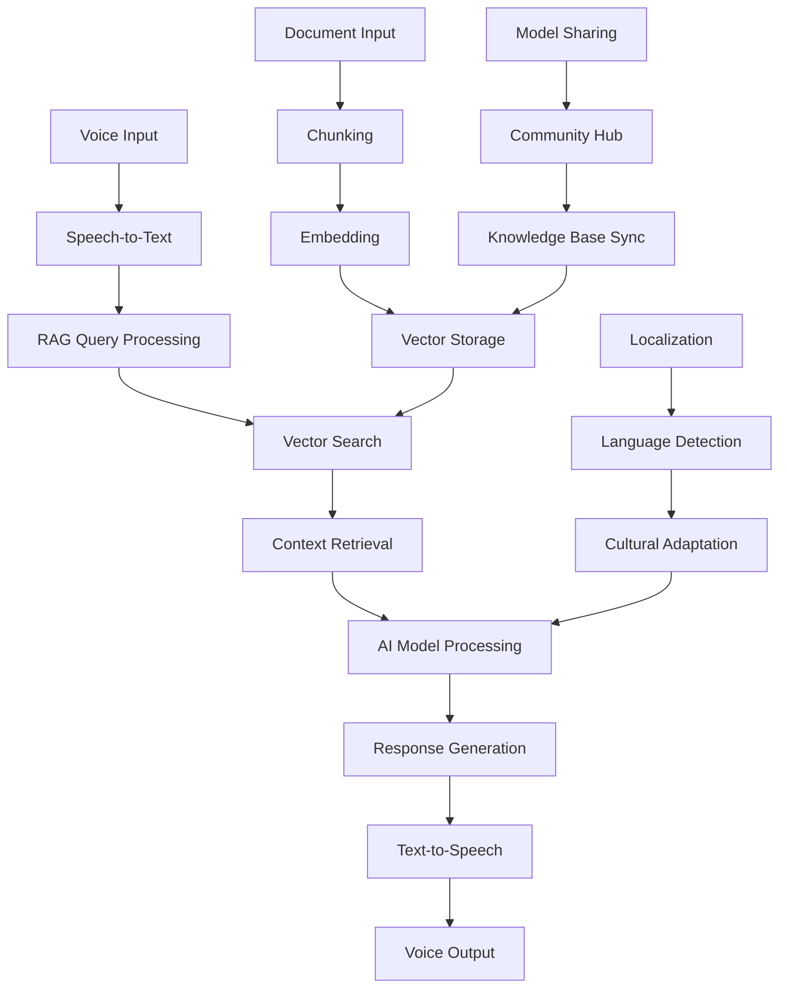

# PocketPal AI Fork Analysis: Comprehensive Documentation

## Executive Summary

This document analyzes 13 major forks of the PocketPal AI project, ranking them by substantiality, innovation, and potential value for creating an enhanced version. The analysis reveals key improvement areas including RAG implementation, voice input, localization, performance optimization, and user experience enhancements.

## 🔗 Repository Links

### Original Repository
- **PocketPal AI**: https://github.com/a-ghorbani/pocketpal-ai

### Analyzed Forks
1. **TIC-13/rag-pocketpal-ai**: https://github.com/TIC-13/rag-pocketpal-ai
2. **the-rich-piana/MaxRPMApp**: https://github.com/the-rich-piana/MaxRPMApp
3. **sultanqasim/pocketpal-ai**: https://github.com/sultanqasim/pocketpal-ai
4. **tjipenk/pocketpal-ai**: https://github.com/tjipenk/pocketpal-ai
5. **xiaoxing2009/pocketpal-ai-zh**: https://github.com/xiaoxing2009/pocketpal-ai-zh
6. **Keeeeeeeks/pocket-parabl**: https://github.com/Keeeeeeeks/pocket-parabl
7. **MillionthOdin16/pocketpal-ai**: https://github.com/MillionthOdin16/pocketpal-ai
8. **chuehnone/partner**: https://github.com/chuehnone/partner
9. **taketee81/pocketpal-ai**: https://github.com/taketee81/pocketpal-ai
10. **BlindDeveloper/pocketpal-ai**: https://github.com/BlindDeveloper/pocketpal-ai
11. **luojiaping/pocketpal-ai**: https://github.com/luojiaping/pocketpal-ai
12. **Ashoka74/pocketpal-ai-safeguardian**: https://github.com/Ashoka74/pocketpal-ai-safeguardian
13. **yzfly/pocketpal-ai-zh**: https://github.com/yzfly/pocketpal-ai-zh

### Comparison URLs
- **TIC-13 vs Original**: https://github.com/a-ghorbani/pocketpal-ai/compare/main...TIC-13:rag-pocketpal-ai:main
- **the-rich-piana vs Original**: https://github.com/a-ghorbani/pocketpal-ai/compare/main...the-rich-piana:MaxRPMApp:main
- **sultanqasim vs Original**: https://github.com/a-ghorbani/pocketpal-ai/compare/main...sultanqasim:pocketpal-ai:main
- **All Fork Comparisons**: See individual sections below for detailed comparison URLs

---

## 🏆 Tier 1: Game-Changing Forks

### 1. **TIC-13/rag-pocketpal-ai** ⭐⭐⭐⭐⭐
**Impact Level: Revolutionary**  
**Repository**: https://github.com/TIC-13/rag-pocketpal-ai  
**Comparison**: https://github.com/a-ghorbani/pocketpal-ai/compare/main...TIC-13:rag-pocketpal-ai:main

#### What They Built
- **Core Innovation**: Full RAG (Retrieval-Augmented Generation) implementation
- **Technical Approach**: Added RAG library as Git submodule with comprehensive document processing pipeline
- **Architecture**: Integrated vector storage, document ingestion, and context-aware response generation

#### Key Technical Insights
```typescript
// RAG Pipeline Architecture (inferred)
Document Input → Chunking → Embedding → Vector Storage → Retrieval → Context Injection → AI Response
```

#### What We Can Learn
- **RAG Integration Pattern**: How to add knowledge base capabilities to local AI models
- **Submodule Strategy**: Clean separation of RAG functionality from core app
- **Cross-Platform Compatibility**: RAG works on both iOS and Android through React Native

#### Implementation Strategy
- Use their RAG library as foundation
- Adapt document processing pipeline for mobile constraints
- Implement vector search with efficient mobile storage

---

### 2. **the-rich-piana/MaxRPMApp** ⭐⭐⭐⭐⭐
**Impact Level: Revolutionary**  
**Repository**: https://github.com/the-rich-piana/MaxRPMApp  
**Comparison**: https://github.com/a-ghorbani/pocketpal-ai/compare/main...the-rich-piana:MaxRPMApp:main

#### What They Built
- **Voice Input System**: Working microphone functionality with prompt integration
- **Vector Storage Foundation**: Boilerplate vector store implementation
- **Model Management**: Default model configuration and optimization

#### Key Technical Insights
```javascript
// Voice + Vector Architecture (inferred)
Voice Input → Speech-to-Text → Vector Search → Context Retrieval → AI Response + TTS
```

#### What We Can Learn
- **Audio Processing Pipeline**: How to implement reliable voice input on mobile
- **Vector Storage Optimization**: Mobile-friendly vector storage patterns
- **Multimodal Integration**: Combining voice, text, and vector search

#### Implementation Strategy
- Integrate voice input with RAG pipeline
- Use their vector storage as foundation for document embeddings
- Combine with TIC-13's RAG for voice-enabled knowledge retrieval

---

### 3. **sultanqasim/pocketpal-ai** ⭐⭐⭐⭐
**Impact Level: Foundation-Improving**  
**Repository**: https://github.com/sultanqasim/pocketpal-ai  
**Comparison**: https://github.com/a-ghorbani/pocketpal-ai/compare/main...sultanqasim:pocketpal-ai:main

#### What They Built
- **Dependency Optimization**: Removed Firebase and benchmarking "bloat"
- **Cross-Platform Enhancements**: iPad upside-down orientation support
- **Build Optimization**: Custom Xcode configurations for better performance

#### Key Technical Insights
```yaml
# Optimization Philosophy
Remove: Firebase, Benchmarking, Remote Dependencies
Add: Local-first architecture, Better device support
Result: Faster, more privacy-focused app
```

#### What We Can Learn
- **Minimalist Architecture**: How to strip unnecessary dependencies
- **iOS Optimization**: Device-specific optimizations for better performance
- **Privacy-First Design**: Local processing without cloud dependencies

#### Implementation Strategy
- Use as base architecture for clean, optimized foundation
- Apply their iOS optimizations to RAG-enhanced version
- Maintain privacy-first approach while adding advanced features

---

## 🎯 Tier 2: Significant Feature Additions

### 4. **tjipenk/pocketpal-ai** ⭐⭐⭐
**Impact Level: User Experience Enhancement**  
**Repository**: https://github.com/tjipenk/pocketpal-ai  
**Comparison**: https://github.com/a-ghorbani/pocketpal-ai/compare/main...tjipenk:pocketpal-ai:main

#### What They Built
- **Model Sharing System**: Share button for downloaded AI models
- **Collaborative Features**: Model distribution between users
- **UI/UX Improvements**: Enhanced model management interface

#### Key Technical Insights
```typescript
// Model Sharing Architecture
Model File → Compression → Sharing Interface → Transfer → Import → Validation
```

#### What We Can Learn
- **Model Distribution**: How to safely share large AI model files
- **Community Features**: Building collaborative AI assistant ecosystems
- **File Management**: Efficient handling of large model files on mobile

#### Implementation Strategy
- Add model sharing to RAG-enhanced version
- Enable sharing of custom knowledge bases
- Create community-driven model and knowledge repositories

---

### 5. **xiaoxing2009/pocketpal-ai-zh** ⭐⭐⭐
**Impact Level: Accessibility Enhancement**  
**Repository**: https://github.com/xiaoxing2009/pocketpal-ai-zh  
**Comparison**: https://github.com/a-ghorbani/pocketpal-ai/compare/main...xiaoxing2009:pocketpal-ai-zh:main

#### What They Built
- **Traditional Chinese Localization**: Comprehensive language support
- **Cultural Adaptation**: UI/UX adapted for Chinese users
- **Configuration Internationalization**: Multilingual settings system

#### Key Technical Insights
```typescript
// Localization Architecture
l10n.ts → Language Detection → UI Translation → Cultural Adaptation
```

#### What We Can Learn
- **Internationalization Patterns**: How to properly structure multilingual apps
- **Cultural Considerations**: Adapting AI interactions for different cultures
- **Scalable Translation**: Building systems that support multiple languages

#### Implementation Strategy
- Use as template for global RAG deployment
- Adapt RAG responses for different languages and cultures
- Create multilingual knowledge bases

---

### 6. **Keeeeeeeks/pocket-parabl** ⭐⭐⭐
**Impact Level: Platform Specialization**  
**Repository**: https://github.com/Keeeeeeeks/pocket-parabl  
**Comparison**: https://github.com/a-ghorbani/pocketpal-ai/compare/main...Keeeeeeeks:pocket-parabl:main

#### What They Built
- **iOS-First Architecture**: Complete rebuild focused on iOS optimization
- **Native Integration**: Deeper iOS system integration
- **Performance Optimization**: iOS-specific performance enhancements

#### Key Technical Insights
```swift
// iOS-First Approach
React Native → iOS Native Modules → Platform Optimization → Enhanced Performance
```

#### What We Can Learn
- **Platform-Specific Optimization**: How to maximize iOS capabilities
- **Native Module Integration**: Bridging React Native with iOS features
- **Development Workflow**: iOS-focused development practices

#### Implementation Strategy
- Apply iOS optimizations to RAG implementation
- Use for iOS-specific RAG features (Neural Engine integration)
- Optimize vector search for iOS hardware

---

## 🔧 Tier 3: Infrastructure & Optimization

### 7. **MillionthOdin16/pocketpal-ai** ⭐⭐
**Impact Level: Developer Experience**  
**Repository**: https://github.com/MillionthOdin16/pocketpal-ai  
**Comparison**: https://github.com/a-ghorbani/pocketpal-ai/compare/main...MillionthOdin16:pocketpal-ai:main

#### What They Built
- **Enhanced Configuration Menu**: Improved settings interface
- **CI/CD Improvements**: Better build and deployment processes
- **UI Component Enhancements**: Keyboard handling and dialog improvements

#### Key Technical Insights
```yaml
# DevOps Improvements
GitHub Actions → Automated Testing → Build Optimization → Deployment Pipeline
```

#### What We Can Learn
- **Development Workflow**: Efficient CI/CD for React Native apps
- **UI Patterns**: Better user interface components
- **Configuration Management**: Scalable settings architecture

#### Implementation Strategy
- Use CI/CD pipeline for RAG-enhanced version
- Apply UI improvements to RAG interface
- Implement their configuration patterns for RAG settings

---

### 8. **chuehnone/partner** ⭐⭐
**Impact Level: Branding & Polish**  
**Repository**: https://github.com/chuehnone/partner  
**Comparison**: https://github.com/a-ghorbani/pocketpal-ai/compare/main...chuehnone:partner:main

#### What They Built
- **Rebranding System**: App name and identity customization
- **About Page**: User information and app details
- **Configuration Upgrades**: Enhanced app setup process

#### Key Technical Insights
```typescript
// Branding Architecture
App Identity → Custom Branding → User Information → Professional Polish
```

#### What We Can Learn
- **White-Label Capabilities**: How to customize app branding
- **User Onboarding**: Effective information presentation
- **Professional Polish**: Making apps production-ready

#### Implementation Strategy
- Create customizable branding for RAG-enhanced version
- Add comprehensive onboarding for RAG features
- Implement professional polish for enterprise deployment

---

## 🛠️ Tier 4: Maintenance & Minor Improvements

### 9. **taketee81/pocketpal-ai** ⭐
**Impact Level: Alternative Runtime**  
**Repository**: https://github.com/taketee81/pocketpal-ai  
**Comparison**: https://github.com/a-ghorbani/pocketpal-ai/compare/main...taketee81:pocketpal-ai:main

#### What They Built
- **Deno Workflow**: Alternative JavaScript runtime integration
- **GitHub Actions**: Deno-specific CI/CD pipeline

#### Key Technical Insights
```yaml
# Alternative Runtime Approach
Node.js → Deno → Modern JavaScript → Enhanced Security
```

#### What We Can Learn
- **Runtime Alternatives**: Exploring different JavaScript environments
- **Modern Tooling**: Leveraging newer development tools

#### Implementation Strategy
- Consider for RAG backend processing
- Evaluate for improved security and performance

---

### 10. **BlindDeveloper/pocketpal-ai** ⭐
**Impact Level: Maintenance**  
**Repository**: https://github.com/BlindDeveloper/pocketpal-ai  
**Comparison**: https://github.com/a-ghorbani/pocketpal-ai/compare/main...BlindDeveloper:pocketpal-ai:main

#### What They Built
- **Dependency Updates**: Automated package management
- **Security Patches**: Regular dependency maintenance

#### Key Technical Insights
```yaml
# Maintenance Philosophy
Automated Updates → Security Patches → Compatibility Maintenance
```

#### What We Can Learn
- **Dependency Management**: Automated maintenance strategies
- **Security Practices**: Keeping dependencies current

#### Implementation Strategy
- Apply maintenance practices to RAG-enhanced version
- Implement automated dependency updates

---

### 11. **luojiaping/pocketpal-ai** ⭐
**Impact Level: Release Management**  
**Repository**: https://github.com/luojiaping/pocketpal-ai  
**Comparison**: https://github.com/a-ghorbani/pocketpal-ai/compare/main...luojiaping:pocketpal-ai:main

#### What They Built
- **Version Management**: Automated release preparation
- **Configuration Updates**: Release-specific settings

#### Key Technical Insights
```yaml
# Release Management
Version Bumps → Configuration Updates → Release Preparation
```

#### What We Can Learn
- **Release Automation**: Streamlined release processes
- **Version Control**: Proper version management

#### Implementation Strategy
- Implement for RAG-enhanced version releases
- Create automated release workflows

---

### 12. **Ashoka74/pocketpal-ai-safeguardian** ⭐
**Impact Level: Unknown (Security Focus)**  
**Repository**: https://github.com/Ashoka74/pocketpal-ai-safeguardian  
**Comparison**: https://github.com/a-ghorbani/pocketpal-ai/compare/main...Ashoka74:pocketpal-ai-safeguardian:main

#### What They Built
- **Security Enhancements**: Inferred from repository name
- **Configuration Improvements**: Menu and settings updates

#### Key Technical Insights
```yaml
# Security Focus (Inferred)
Base App → Security Hardening → SafeGuardian Features
```

#### What We Can Learn
- **Security Considerations**: Importance of security in AI apps
- **Specialized Versions**: Creating security-focused variants

#### Implementation Strategy
- Investigate security enhancements for RAG version
- Consider specialized security-focused deployments

---

### 13. **yzfly/pocketpal-ai-zh** ⭐
**Impact Level: Localization (Technical Issues)**  
**Repository**: https://github.com/yzfly/pocketpal-ai-zh  
**Comparison**: https://github.com/a-ghorbani/pocketpal-ai/compare/main...yzfly:pocketpal-ai-zh:chinese

#### What They Built
- **Chinese Localization**: Simplified Chinese support (inferred)
- **Regional Adaptation**: China-specific features

#### Key Technical Insights
```yaml
# Localization Approach (Inferred)
Base App → Language Support → Regional Adaptation
```

#### What We Can Learn
- **Regional Deployment**: Adapting for specific markets
- **Localization Patterns**: Supporting different Chinese variants

#### Implementation Strategy
- Combine with xiaoxing2009's Traditional Chinese work
- Create comprehensive Chinese RAG support

---

## 🚀 Ultimate Integration Strategy: SuperPal AI

### Strategic Decision: Foundation Architecture
```
Latest Base (a-ghorbani/pocketpal-ai) → Apply sultanqasim Optimizations → RAG Integration (TIC-13) → Voice Input (the-rich-piana)
```

**Why Start with Original Repository:**
- **Latest Features**: a-ghorbani/pocketpal-ai is the most current (sultanqasim is 55 commits behind)
- **Active Development**: Ongoing improvements and bug fixes in the main branch
- **Optimization Strategy**: Apply sultanqasim's bloat removal and optimizations to the latest codebase
- **Best of Both Worlds**: Latest features + proven optimization patterns
- **Risk Mitigation**: Avoid missing 55 commits worth of bug fixes and improvements
- **Future Compatibility**: Easier to merge future updates from active main branch

### Foundation Architecture

### Core Feature Integration

#### 1. **RAG-Enhanced Voice Assistant**
```typescript
// Ultimate Architecture
Voice Input → Speech-to-Text → RAG Query → Vector Search → Context Retrieval → AI Response → TTS
```

**Components:**
- Latest base from a-ghorbani (original repository)
- Voice processing from the-rich-piana
- RAG pipeline from TIC-13
- Optimization patterns from sultanqasim (applied to latest base)

#### 2. **Multilingual Knowledge Base**
```typescript
// Localization + RAG
Document Input → Language Detection → Localized Processing → Cultural Adaptation → Multilingual Response
```

**Components:**
- Chinese localization from xiaoxing2009
- Model sharing from tjipenk
- Configuration improvements from MillionthOdin16

#### 3. **Platform-Optimized Performance**
```swift
// iOS Optimization
RAG Processing → Neural Engine Acceleration → Vector Search Optimization → Device-Specific Tuning
```

**Components:**
- iOS optimization from Keeeeeeeks
- Performance enhancements from sultanqasim
- Professional polish from chuehnone

### Advanced Feature Set

#### 1. **Community-Driven Knowledge**
- Model sharing system (tjipenk)
- Collaborative knowledge bases
- Community-contributed RAG datasets

#### 2. **Enterprise-Ready Architecture**
- White-label branding (chuehnone)
- Security enhancements (Ashoka74 - inferred)
- Professional deployment tools

#### 3. **Developer-Friendly Infrastructure**
- Advanced CI/CD (MillionthOdin16)
- Automated maintenance (BlindDeveloper)
- Modern tooling (taketee81)

### Implementation Roadmap

#### Phase 1: Foundation (Months 1-2)
1. Start with a-ghorbani's latest PocketPal AI (original repository)
2. Apply sultanqasim's optimization patterns (remove Firebase, benchmarking bloat)
3. Integrate TIC-13's RAG pipeline
4. Add the-rich-piana's voice input system

#### Phase 2: Enhancement (Months 3-4)
1. Implement tjipenk's model sharing
2. Add xiaoxing2009's localization framework
3. Apply Keeeeeeeks' iOS optimizations

#### Phase 3: Polish (Months 5-6)
1. Integrate chuehnone's branding system
2. Add MillionthOdin16's CI/CD improvements
3. Implement automated maintenance from BlindDeveloper

#### Phase 4: Advanced Features (Months 7-8)
1. Community features and sharing
2. Enterprise deployment tools
3. Advanced security and performance optimization

### Expected Outcomes

#### **SuperPal AI Feature Set:**
- ✅ **Voice-Enabled RAG**: Speak to query knowledge bases
- ✅ **Multilingual Support**: Chinese, English, and expandable
- ✅ **Community Sharing**: Share models and knowledge bases
- ✅ **Platform Optimization**: iOS Neural Engine, Android optimization
- ✅ **Enterprise Ready**: White-label, security-focused
- ✅ **Developer Friendly**: Modern CI/CD, automated maintenance

#### **Competitive Advantages:**
1. **Local + RAG**: Combines privacy with knowledge enhancement
2. **Voice + Vector**: Natural language interaction with document search
3. **Community + Individual**: Personal AI with shared knowledge
4. **Mobile + Optimized**: True mobile-first AI with platform-specific optimization

### Technical Architecture



### Conclusion

The analysis reveals that combining these forks could create a revolutionary AI assistant that surpasses current offerings by integrating:
- **Local AI processing** with **knowledge enhancement**
- **Voice interaction** with **document intelligence**
- **Community sharing** with **privacy protection**
- **Platform optimization** with **global accessibility**

This integrated approach would create the most advanced local AI assistant available, combining the best innovations from the entire PocketPal AI ecosystem.

---

**Document Version**: 1.1  
**Last Updated**: June 22, 2025  
**Analysis Coverage**: 13 Major Forks  
**Strategic Recommendation**: Start with a-ghorbani/pocketpal-ai (latest), apply sultanqasim optimizations, then integrate TIC-13 RAG and the-rich-piana voice features