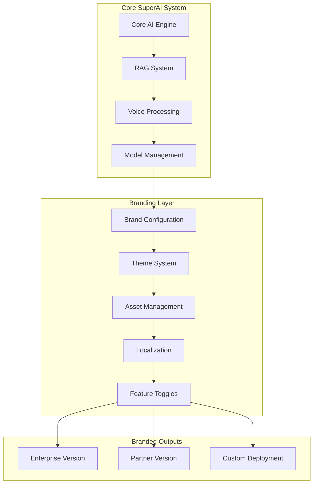

# Branding System Integration Plan - chuehnone White-Label Solution

## 📋 Executive Summary

**Reference Source**: chuehnone/partner - White-label branding implementation  
**Priority**: MEDIUM - Enterprise and partner deployment enablement  
**Complexity**: 🟡 MEDIUM - Systematic branding abstraction required  
**Timeline**: 2-3 weeks for complete white-label system  
**Impact**: Enables enterprise partnerships and custom branding solutions

This plan integrates chuehnone's white-label branding approach to create a configurable SuperAI system that can be rebranded for enterprise customers, partners, and custom deployments while maintaining core functionality.

## 🏗️ White-Label Architecture Design

### Branding System Overview


### Current vs White-Label Architecture
**Based on chuehnone/partner analysis:**
```typescript
// Current SuperAI (Full-featured)
interface SuperAIApplication {
  features: {
    ragSystem: RAGImplementation;
    voiceProcessing: VoiceSystem;
    modelSharing: CommunityFeatures;
    advancedUI: ComplexComponents;
    palsSystem: AIPersonalities;
    benchmarking: PerformanceTools;
    huggingFace: ExternalIntegration;
  };
  
  branding: {
    name: "PocketPal SuperAI";
    colors: AdvancedMD3ColorSystem;
    fonts: InterFontFamily;
    icons: BrandedIconSet;
  };
}

// White-Label Version (Configurable)
interface WhiteLabelApplication {
  coreFeatures: {
    ragSystem: ConfigurableRAG;
    voiceProcessing: OptionalVoice;
    basicChat: EssentialChat;
    modelManagement: SimplifiedModels;
  };
  
  configurableBranding: {
    name: ConfigurableString;
    colors: ConfigurableColorSystem;
    fonts: ConfigurableFonts;
    icons: ConfigurableAssets;
    features: FeatureToggleSystem;
  };
}
```

## 🎨 Branding Configuration System

### Dynamic Brand Configuration
```typescript
// src/config/brand-config.ts
export interface BrandConfiguration {
  // Application Identity
  identity: {
    appName: string;
    packageId: string;
    version: string;
    description: string;
  };
  
  // Visual Branding
  visual: {
    colors: BrandColorSystem;
    typography: BrandTypography;
    iconSet: BrandAssets;
    logo: BrandLogo;
  };
  
  // Feature Configuration
  features: {
    ragSystem: boolean;
    voiceInput: boolean;
    modelSharing: boolean;
    communityFeatures: boolean;
    advancedSettings: boolean;
    huggingFaceIntegration: boolean;
  };
  
  // Localization
  localization: {
    defaultLanguage: string;
    supportedLanguages: string[];
    customTranslations: Record<string, string>;
  };
}

// Brand configuration factory
export class BrandConfigurationFactory {
  static createConfiguration(brandType: BrandType): BrandConfiguration {
    switch (brandType) {
      case 'enterprise':
        return this.createEnterpriseBrand();
      case 'partner':
        return this.createPartnerBrand();
      case 'custom':
        return this.createCustomBrand();
      default:
        return this.createDefaultBrand();
    }
  }
  
  private static createPartnerBrand(): BrandConfiguration {
    return {
      identity: {
        appName: "Partner AI Assistant",
        packageId: "com.partner.ai",
        version: "1.0.0",
        description: "AI-powered assistant for partners"
      },
      
      visual: {
        colors: {
          primary: '#6200ee',
          accent: '#03dac4',
          background: '#ffffff',
          surface: '#f5f5f5'
        },
        
        typography: {
          fontFamily: 'System',
          sizes: {
            small: 12,
            medium: 16,
            large: 20,
            xlarge: 24
          }
        },
        
        iconSet: 'partner-icons',
        logo: {
          light: 'assets/partner-logo-light.png',
          dark: 'assets/partner-logo-dark.png'
        }
      },
      
      features: {
        ragSystem: true,
        voiceInput: false,
        modelSharing: false,
        communityFeatures: false,
        advancedSettings: false,
        huggingFaceIntegration: false
      }
    };
  }
}
```

### Theme System Integration
```typescript
// src/themes/white-label-theme.ts
export class WhiteLabelThemeManager {
  private brandConfig: BrandConfiguration;
  
  constructor(brandConfig: BrandConfiguration) {
    this.brandConfig = brandConfig;
  }
  
  generateTheme(): ApplicationTheme {
    return {
      colors: this.generateColorScheme(),
      typography: this.generateTypography(),
      spacing: this.generateSpacing(),
      components: this.generateComponentStyles()
    };
  }
  
  private generateColorScheme(): ColorScheme {
    const { colors } = this.brandConfig.visual;
    
    return {
      // Material Design 3 compatible color generation
      primary: colors.primary,
      onPrimary: this.getContrastColor(colors.primary),
      primaryContainer: this.lighten(colors.primary, 0.8),
      onPrimaryContainer: this.darken(colors.primary, 0.2),
      
      secondary: colors.accent,
      onSecondary: this.getContrastColor(colors.accent),
      
      background: colors.background,
      onBackground: this.getTextColor(colors.background),
      
      surface: colors.surface,
      onSurface: this.getTextColor(colors.surface)
    };
  }
  
  private generateComponentStyles(): ComponentStyles {
    return {
      button: {
        borderRadius: 8,
        padding: { horizontal: 16, vertical: 12 },
        elevation: 2
      },
      
      card: {
        borderRadius: 12,
        padding: 16,
        elevation: 1
      },
      
      input: {
        borderRadius: 8,
        borderWidth: 1,
        padding: { horizontal: 12, vertical: 8 }
      }
    };
  }
}
```

## 🔧 Implementation Strategy

### Phase 1: Core Branding Infrastructure (Week 1)

#### Brand Configuration System
```typescript
// src/services/brand-service.ts
export class BrandService {
  private static instance: BrandService;
  private brandConfig: BrandConfiguration;
  
  static getInstance(): BrandService {
    if (!BrandService.instance) {
      BrandService.instance = new BrandService();
    }
    return BrandService.instance;
  }
  
  async initializeBrand(configPath?: string): Promise<void> {
    try {
      // Load configuration from file or use default
      this.brandConfig = configPath 
        ? await this.loadConfigFromFile(configPath)
        : await this.loadDefaultConfig();
      
      // Apply branding to application
      await this.applyBranding();
      
    } catch (error) {
      console.warn('Failed to load brand configuration, using defaults');
      this.brandConfig = BrandConfigurationFactory.createConfiguration('default');
      await this.applyBranding();
    }
  }
  
  private async applyBranding(): Promise<void> {
    // Update app name and metadata
    await this.updateAppMetadata();
    
    // Apply theme configuration
    await this.applyThemeConfiguration();
    
    // Configure feature toggles
    await this.configureFeatures();
    
    // Set up localization
    await this.setupLocalization();
  }
  
  getBrandConfig(): BrandConfiguration {
    return this.brandConfig;
  }
  
  isFeatureEnabled(feature: keyof BrandConfiguration['features']): boolean {
    return this.brandConfig.features[feature];
  }
}
```

#### Feature Toggle System
```typescript
// src/components/FeatureWrapper.tsx
export const FeatureWrapper: React.FC<FeatureWrapperProps> = ({
  feature,
  children,
  fallback = null
}) => {
  const brandService = BrandService.getInstance();
  const isEnabled = brandService.isFeatureEnabled(feature);
  
  if (!isEnabled) {
    return fallback;
  }
  
  return <>{children}</>;
};

// Usage example
export const ChatScreen: React.FC = () => {
  return (
    <View>
      <BasicChatInterface />
      
      <FeatureWrapper feature="voiceInput">
        <VoiceInputButton />
      </FeatureWrapper>
      
      <FeatureWrapper feature="ragSystem">
        <DocumentUploadButton />
      </FeatureWrapper>
      
      <FeatureWrapper feature="advancedSettings">
        <AdvancedSettingsPanel />
      </FeatureWrapper>
    </View>
  );
};
```

### Phase 2: Asset Management System (Week 1-2)

#### Dynamic Asset Loading
```typescript
// src/assets/brand-asset-manager.ts
export class BrandAssetManager {
  private brandConfig: BrandConfiguration;
  private assetCache: Map<string, any> = new Map();
  
  constructor(brandConfig: BrandConfiguration) {
    this.brandConfig = brandConfig;
  }
  
  async loadBrandAssets(): Promise<void> {
    const { iconSet, logo } = this.brandConfig.visual;
    
    // Load icon set
    await this.loadIconSet(iconSet);
    
    // Load logo variations
    await this.loadLogo(logo);
    
    // Load any custom assets
    await this.loadCustomAssets();
  }
  
  private async loadIconSet(iconSetName: string): Promise<void> {
    try {
      const iconSetPath = `assets/icons/${iconSetName}`;
      const iconManifest = await import(`${iconSetPath}/manifest.json`);
      
      for (const [iconName, iconPath] of Object.entries(iconManifest)) {
        const iconAsset = await import(`${iconSetPath}/${iconPath}`);
        this.assetCache.set(`icon-${iconName}`, iconAsset.default);
      }
    } catch (error) {
      console.warn(`Failed to load icon set: ${iconSetName}, using defaults`);
      await this.loadDefaultIconSet();
    }
  }
  
  getIcon(iconName: string): any {
    return this.assetCache.get(`icon-${iconName}`) || this.getDefaultIcon(iconName);
  }
  
  getLogo(variant: 'light' | 'dark' = 'light'): any {
    return this.assetCache.get(`logo-${variant}`) || this.getDefaultLogo(variant);
  }
}
```

#### Component Asset Integration
```typescript
// src/components/BrandedComponents/BrandedButton.tsx
export const BrandedButton: React.FC<BrandedButtonProps> = ({
  title,
  onPress,
  variant = 'primary',
  icon,
  ...props
}) => {
  const theme = useTheme();
  const assetManager = useBrandAssets();
  
  const buttonIcon = icon ? assetManager.getIcon(icon) : null;
  
  return (
    <TouchableOpacity
      style={[
        styles.button,
        styles[variant],
        { backgroundColor: theme.colors.primary }
      ]}
      onPress={onPress}
      {...props}
    >
      {buttonIcon && <Image source={buttonIcon} style={styles.icon} />}
      <Text style={[styles.text, { color: theme.colors.onPrimary }]}>
        {title}
      </Text>
    </TouchableOpacity>
  );
};
```

### Phase 3: Configuration Management (Week 2-3)

#### Build-Time Configuration
```typescript
// scripts/brand-build.ts
export class BrandBuildManager {
  async buildForBrand(brandType: BrandType): Promise<BuildResult> {
    const brandConfig = BrandConfigurationFactory.createConfiguration(brandType);
    
    // Update package.json with brand-specific info
    await this.updatePackageConfig(brandConfig);
    
    // Generate brand-specific assets
    await this.generateBrandAssets(brandConfig);
    
    // Update app manifests (Android/iOS)
    await this.updateAppManifests(brandConfig);
    
    // Build with brand configuration
    return await this.executeBuild(brandConfig);
  }
  
  private async updatePackageConfig(brandConfig: BrandConfiguration): Promise<void> {
    const packagePath = './package.json';
    const packageJson = JSON.parse(await fs.readFile(packagePath, 'utf8'));
    
    packageJson.name = brandConfig.identity.appName.toLowerCase().replace(/\s+/g, '-');
    packageJson.version = brandConfig.identity.version;
    packageJson.description = brandConfig.identity.description;
    
    await fs.writeFile(packagePath, JSON.stringify(packageJson, null, 2));
  }
  
  private async updateAppManifests(brandConfig: BrandConfiguration): Promise<void> {
    // Update Android manifest
    await this.updateAndroidManifest(brandConfig);
    
    // Update iOS Info.plist
    await this.updateiOSManifest(brandConfig);
  }
}
```

#### Runtime Configuration
```typescript
// src/config/runtime-brand-config.ts
export class RuntimeBrandConfig {
  static async loadConfiguration(): Promise<BrandConfiguration> {
    // Check for environment-specific configuration
    const envConfig = await this.loadEnvironmentConfig();
    if (envConfig) return envConfig;
    
    // Check for bundled configuration
    const bundledConfig = await this.loadBundledConfig();
    if (bundledConfig) return bundledConfig;
    
    // Fall back to default configuration
    return BrandConfigurationFactory.createConfiguration('default');
  }
  
  private static async loadEnvironmentConfig(): Promise<BrandConfiguration | null> {
    try {
      const configUrl = process.env.BRAND_CONFIG_URL;
      if (!configUrl) return null;
      
      const response = await fetch(configUrl);
      return await response.json();
    } catch (error) {
      console.warn('Failed to load environment brand configuration');
      return null;
    }
  }
  
  private static async loadBundledConfig(): Promise<BrandConfiguration | null> {
    try {
      // Look for bundled brand configuration
      const config = await import('./brand-config.json');
      return config.default;
    } catch (error) {
      return null;
    }
  }
}
```

## 🧪 Implementation Examples

### Enterprise Brand Configuration
```json
{
  "identity": {
    "appName": "Enterprise AI Assistant",
    "packageId": "com.enterprise.ai",
    "version": "2.0.0",
    "description": "AI assistant for enterprise environments"
  },
  "visual": {
    "colors": {
      "primary": "#1976d2",
      "accent": "#ffc107",
      "background": "#fafafa",
      "surface": "#ffffff"
    },
    "typography": {
      "fontFamily": "Roboto",
      "sizes": {
        "small": 12,
        "medium": 16,
        "large": 20,
        "xlarge": 24
      }
    },
    "iconSet": "enterprise-icons",
    "logo": {
      "light": "assets/enterprise-logo-light.png",
      "dark": "assets/enterprise-logo-dark.png"
    }
  },
  "features": {
    "ragSystem": true,
    "voiceInput": true,
    "modelSharing": false,
    "communityFeatures": false,
    "advancedSettings": true,
    "huggingFaceIntegration": false
  },
  "localization": {
    "defaultLanguage": "en",
    "supportedLanguages": ["en", "es", "fr", "de"],
    "customTranslations": {
      "app.title": "Enterprise AI",
      "chat.placeholder": "Ask your enterprise AI..."
    }
  }
}
```

### Partner Brand Configuration
```json
{
  "identity": {
    "appName": "Partner Assistant",
    "packageId": "com.partner.assistant",
    "version": "1.5.0",
    "description": "Customized AI assistant for partners"
  },
  "visual": {
    "colors": {
      "primary": "#6200ee",
      "accent": "#03dac4",
      "background": "#ffffff",
      "surface": "#f5f5f5"
    },
    "typography": {
      "fontFamily": "System",
      "sizes": {
        "small": 12,
        "medium": 16,
        "large": 20,
        "xlarge": 24
      }
    },
    "iconSet": "partner-icons",
    "logo": {
      "light": "assets/partner-logo-light.png",
      "dark": "assets/partner-logo-dark.png"
    }
  },
  "features": {
    "ragSystem": true,
    "voiceInput": false,
    "modelSharing": false,
    "communityFeatures": false,
    "advancedSettings": false,
    "huggingFaceIntegration": false
  }
}
```

## 📊 Testing & Validation

### Brand Configuration Testing
```typescript
// tests/brand-configuration.test.ts
describe('Brand Configuration System', () => {
  test('should load partner brand configuration', async () => {
    const config = BrandConfigurationFactory.createConfiguration('partner');
    
    expect(config.identity.appName).toBe('Partner Assistant');
    expect(config.features.ragSystem).toBe(true);
    expect(config.features.voiceInput).toBe(false);
    expect(config.features.modelSharing).toBe(false);
  });
  
  test('should apply brand theme correctly', async () => {
    const config = BrandConfigurationFactory.createConfiguration('enterprise');
    const themeManager = new WhiteLabelThemeManager(config);
    const theme = themeManager.generateTheme();
    
    expect(theme.colors.primary).toBe('#1976d2');
    expect(theme.typography.fontFamily).toBe('Roboto');
  });
  
  test('should toggle features based on configuration', async () => {
    const brandService = BrandService.getInstance();
    await brandService.initializeBrand('partner');
    
    expect(brandService.isFeatureEnabled('ragSystem')).toBe(true);
    expect(brandService.isFeatureEnabled('voiceInput')).toBe(false);
    expect(brandService.isFeatureEnabled('communityFeatures')).toBe(false);
  });
});
```

### Visual Regression Testing
```typescript
// tests/visual-branding.test.ts
describe('Visual Branding Tests', () => {
  test('should render partner-branded button correctly', async () => {
    const brandConfig = BrandConfigurationFactory.createConfiguration('partner');
    const assetManager = new BrandAssetManager(brandConfig);
    await assetManager.loadBrandAssets();
    
    const component = render(
      <BrandProvider config={brandConfig}>
        <BrandedButton title="Test Button" onPress={() => {}} />
      </BrandProvider>
    );
    
    expect(component).toMatchSnapshot();
  });
  
  test('should display correct logo for enterprise brand', async () => {
    const brandConfig = BrandConfigurationFactory.createConfiguration('enterprise');
    const assetManager = new BrandAssetManager(brandConfig);
    
    const logo = assetManager.getLogo('light');
    expect(logo).toBeDefined();
    expect(logo.source).toContain('enterprise-logo-light.png');
  });
});
```

## ✅ Success Criteria

### Technical Implementation
- [ ] Complete brand configuration system with runtime switching
- [ ] Feature toggle system working across all components
- [ ] Dynamic asset loading and management
- [ ] Theme generation from brand configuration
- [ ] Build-time brand customization

### Business Value
- [ ] Partner deployment capability established
- [ ] Enterprise customization options available
- [ ] Simplified feature management for different audiences
- [ ] Reduced maintenance overhead for multiple brand variants
- [ ] Clear documentation for brand customization process

### Quality Assurance
- [ ] Comprehensive testing suite for brand configurations
- [ ] Visual regression testing for branded components
- [ ] Performance validation with multiple brand variants
- [ ] Security review for configuration loading mechanisms

---

**Document Version**: 1.0  
**Last Updated**: June 23, 2025  
**Next Review**: July 2025  
**Owner**: PocketPal SuperAI Branding Team  
**Reference Implementation**: chuehnone/partner white-label system