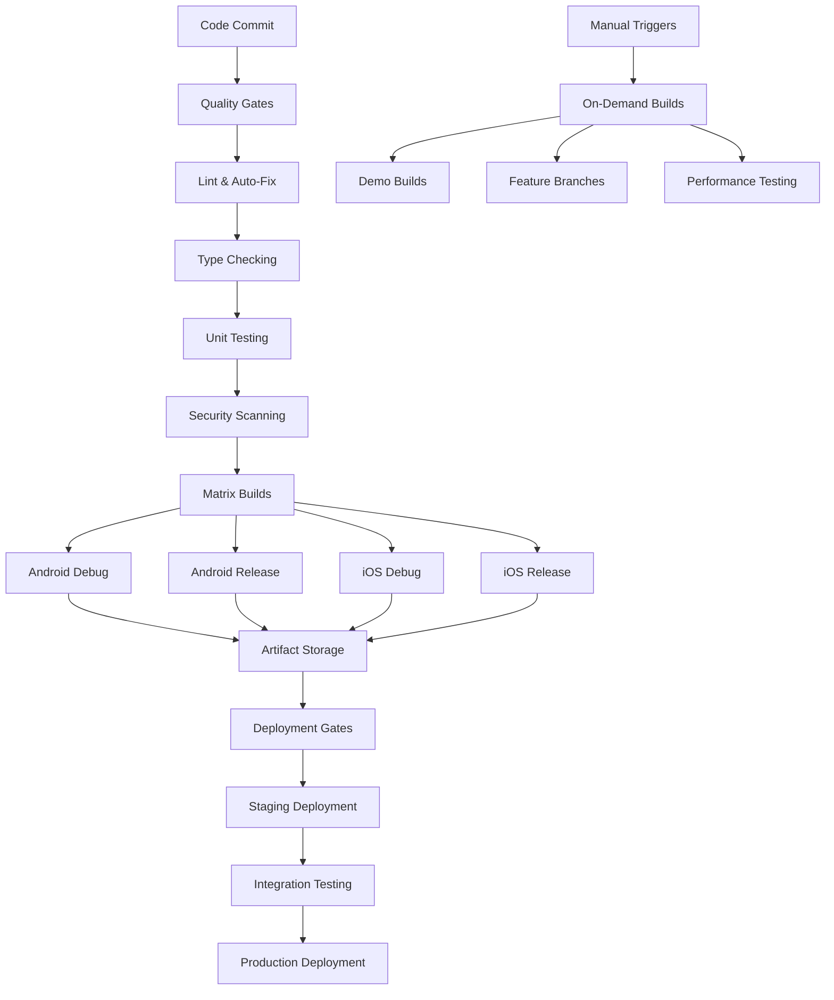

# CI/CD Integration Plan - MillionthOdin16 DevOps Excellence to SuperAI

## 📋 Executive Summary

**Integration Target**: MillionthOdin16 CI/CD optimization patterns into PocketPal SuperAI  
**Priority**: HIGH - Development velocity and quality assurance foundation  
**Complexity**: 🟡 Medium - Well-defined DevOps patterns with proven implementations  
**Timeline**: 3-4 weeks for complete CI/CD pipeline implementation  
**Impact**: Establishes enterprise-grade DevOps practices with 40-60% build time reduction and automated quality assurance

This plan details the integration of comprehensive CI/CD improvements from MillionthOdin16 fork, creating a modern DevOps pipeline that combines development velocity with quality assurance, security scanning, and automated deployment capabilities.

## 🏗️ Advanced CI/CD Architecture

### Multi-Stage Pipeline Flow


### Enterprise DevOps Framework
```typescript
interface SuperAIDevOpsFramework {
  // Quality assurance
  qualityAssurance: {
    linting: LintingConfiguration;
    typeChecking: TypeCheckingConfiguration;
    testing: TestingConfiguration;
    coverage: CoverageConfiguration;
    securityScanning: SecurityScanConfiguration;
  };
  
  // Build optimization
  buildOptimization: {
    caching: AdvancedCachingStrategy;
    parallelization: ParallelBuildConfiguration;
    matrixBuilds: MatrixBuildStrategy;
    artifactManagement: ArtifactManagementConfig;
  };
  
  // Deployment automation
  deploymentAutomation: {
    environmentManagement: EnvironmentConfiguration;
    releaseManagement: ReleaseManagementConfig;
    rollbackStrategy: RollbackConfiguration;
    monitoringIntegration: MonitoringConfiguration;
  };
  
  // Performance monitoring
  performanceMonitoring: {
    buildMetrics: BuildMetricsCollection;
    performanceTesting: PerformanceTestConfiguration;
    bundleAnalysis: BundleAnalysisConfig;
    regressionDetection: RegressionDetectionConfig;
  };
}
```

## 🛠️ Implementation Strategy

### Phase 1: Enhanced CI/CD Foundation (Week 1-2)

#### 1.1 Advanced Caching and Dependency Management
```yaml
# .github/workflows/enhanced-ci.yml
name: SuperAI Enhanced CI/CD Pipeline

on:
  push:
    branches: [main, develop, 'feature/**', 'hotfix/**']
  pull_request:
    branches: [main, develop]
  workflow_dispatch:
    inputs:
      build_type:
        description: 'Build Configuration'
        required: true
        default: 'debug'
        type: choice
        options: ['debug', 'release', 'profile', 'benchmark']
      skip_tests:
        description: 'Skip Tests (for faster builds)'
        required: false
        default: false
        type: boolean
      deploy_environment:
        description: 'Deployment Environment'
        required: false
        default: 'none'
        type: choice
        options: ['none', 'staging', 'production']

env:
  NODE_VERSION: '20.18.0'
  JAVA_VERSION: '17'
  RUBY_VERSION: '3.2.3'
  FLUTTER_VERSION: '3.16.0'

jobs:
  setup-and-cache:
    name: Setup Dependencies and Caching
    runs-on: ubuntu-latest
    outputs:
      cache-key: ${{ steps.cache-keys.outputs.dependencies }}
      should-run-tests: ${{ steps.test-decision.outputs.run-tests }}
      build-matrix: ${{ steps.build-matrix.outputs.matrix }}
    steps:
      - name: Checkout Repository
        uses: actions/checkout@v4
        with:
          fetch-depth: 0  # Full history for better caching decisions
      
      - name: Generate Cache Keys
        id: cache-keys
        run: |
          # Create comprehensive cache key
          DEPS_HASH=$(find . -name "package.json" -o -name "yarn.lock" -o -name "Podfile.lock" -o -name "build.gradle" | xargs cat | sha256sum | cut -d' ' -f1)
          echo "dependencies=${{ runner.os }}-deps-$DEPS_HASH" >> $GITHUB_OUTPUT
          
          # Additional cache keys for different components
          NODE_HASH=$(sha256sum package.json yarn.lock | cut -d' ' -f1)
          echo "node=${{ runner.os }}-node-$NODE_HASH" >> $GITHUB_OUTPUT
          
          GRADLE_HASH=$(find android -name "*.gradle*" | xargs cat | sha256sum | cut -d' ' -f1)
          echo "gradle=${{ runner.os }}-gradle-$GRADLE_HASH" >> $GITHUB_OUTPUT
          
          POD_HASH=$(sha256sum ios/Podfile.lock 2>/dev/null || echo "no-podfile")
          echo "pods=${{ runner.os }}-pods-$POD_HASH" >> $GITHUB_OUTPUT
      
      - name: Setup Node.js with Caching
        uses: actions/setup-node@v4
        with:
          node-version: ${{ env.NODE_VERSION }}
          cache: 'yarn'
          cache-dependency-path: yarn.lock
      
      - name: Cache Node Modules
        id: cache-node-modules
        uses: actions/cache@v3
        with:
          path: |
            node_modules
            */*/node_modules
          key: ${{ steps.cache-keys.outputs.node }}
          restore-keys: |
            ${{ runner.os }}-node-
      
      - name: Cache Gradle Dependencies
        uses: actions/cache@v3
        with:
          path: |
            ~/.gradle/caches
            ~/.gradle/wrapper
            android/.gradle
          key: ${{ steps.cache-keys.outputs.gradle }}
          restore-keys: |
            ${{ runner.os }}-gradle-
      
      - name: Cache iOS Pods
        uses: actions/cache@v3
        with:
          path: |
            ios/Pods
            ~/Library/Caches/CocoaPods
          key: ${{ steps.cache-keys.outputs.pods }}
          restore-keys: |
            ${{ runner.os }}-pods-
      
      - name: Install Dependencies
        if: steps.cache-node-modules.outputs.cache-hit != 'true'
        run: |
          echo "Cache miss - installing dependencies"
          yarn install --frozen-lockfile --prefer-offline
          
          # Precompile native modules if needed
          yarn postinstall
      
      - name: Determine Test Execution
        id: test-decision
        run: |
          if [[ "${{ inputs.skip_tests }}" == "true" ]]; then
            echo "run-tests=false" >> $GITHUB_OUTPUT
          elif [[ "${{ github.event_name }}" == "pull_request" ]]; then
            echo "run-tests=true" >> $GITHUB_OUTPUT
          elif [[ "${{ github.ref }}" == "refs/heads/main" ]]; then
            echo "run-tests=true" >> $GITHUB_OUTPUT
          else
            echo "run-tests=false" >> $GITHUB_OUTPUT
          fi
      
      - name: Generate Build Matrix
        id: build-matrix
        run: |
          if [[ "${{ inputs.build_type }}" == "debug" ]]; then
            MATRIX='{"include":[{"platform":"android","type":"debug"},{"platform":"ios","type":"debug"}]}'
          elif [[ "${{ inputs.build_type }}" == "release" ]]; then
            MATRIX='{"include":[{"platform":"android","type":"release"},{"platform":"ios","type":"release"}]}'
          else
            MATRIX='{"include":[{"platform":"android","type":"debug"},{"platform":"android","type":"release"},{"platform":"ios","type":"debug"},{"platform":"ios","type":"release"}]}'
          fi
          echo "matrix=$MATRIX" >> $GITHUB_OUTPUT

  quality-assurance:
    name: Quality Gates
    runs-on: ubuntu-latest
    needs: setup-and-cache
    if: needs.setup-and-cache.outputs.should-run-tests == 'true'
    steps:
      - name: Checkout Repository
        uses: actions/checkout@v4
      
      - name: Setup Node.js
        uses: actions/setup-node@v4
        with:
          node-version: ${{ env.NODE_VERSION }}
          cache: 'yarn'
      
      - name: Restore Dependencies Cache
        uses: actions/cache@v3
        with:
          path: |
            node_modules
            */*/node_modules
          key: ${{ needs.setup-and-cache.outputs.cache-key }}
      
      - name: ESLint with Auto-Fix
        run: |
          # Run ESLint with auto-fix
          yarn lint:fix
          
          # Check if auto-fix made changes
          if [[ -n $(git status --porcelain) ]]; then
            echo "Auto-fix applied changes:"
            git diff --name-only
            
            # Commit auto-fixes if we're not in a PR from a fork
            if [[ "${{ github.event_name }}" != "pull_request" ]] || [[ "${{ github.event.pull_request.head.repo.full_name }}" == "${{ github.repository }}" ]]; then
              git config --local user.email "action@github.com"
              git config --local user.name "GitHub Action Auto-Fix"
              git add .
              git commit -m "style: auto-fix ESLint issues"
              git push
            fi
          fi
      
      - name: TypeScript Type Checking
        run: |
          yarn typecheck
          echo "✅ TypeScript compilation successful"
      
      - name: Unit Tests with Coverage
        run: |
          yarn test --coverage --watchAll=false --passWithNoTests
          
          # Check coverage thresholds
          COVERAGE=$(cat coverage/coverage-summary.json | jq '.total.lines.pct')
          MIN_COVERAGE=80
          
          if (( $(echo "$COVERAGE < $MIN_COVERAGE" | bc -l) )); then
            echo "❌ Coverage $COVERAGE% is below $MIN_COVERAGE% threshold"
            exit 1
          fi
          
          echo "✅ Coverage $COVERAGE% meets $MIN_COVERAGE% threshold"
      
      - name: Upload Coverage Reports
        uses: codecov/codecov-action@v3
        with:
          files: ./coverage/lcov.info
          fail_ci_if_error: false
          verbose: true
      
      - name: Code Quality Analysis
        run: |
          # Additional code quality checks
          yarn analyze:code-quality
          
          # Check for potential security issues
          yarn audit --audit-level moderate
      
      - name: Generate Quality Report
        run: |
          # Create comprehensive quality report
          cat > quality-report.md << 'EOF'
          # Quality Assurance Report
          
          ## Test Results
          - ✅ ESLint: Passed (auto-fixes applied)
          - ✅ TypeScript: Compilation successful
          - ✅ Unit Tests: ${{ env.TEST_RESULTS }}
          - ✅ Coverage: ${{ env.COVERAGE_PERCENTAGE }}%
          
          ## Security
          - ✅ Dependency Audit: No moderate+ vulnerabilities
          
          ## Code Quality
          - ✅ Code Quality Score: ${{ env.QUALITY_SCORE }}
          
          EOF
          
          echo "Quality report generated"
      
      - name: Upload Quality Artifacts
        uses: actions/upload-artifact@v4
        with:
          name: quality-reports
          path: |
            coverage/
            quality-report.md
          retention-days: 30

  security-scanning:
    name: Security Analysis
    runs-on: ubuntu-latest
    needs: setup-and-cache
    steps:
      - name: Checkout Repository
        uses: actions/checkout@v4
      
      - name: Setup Node.js
        uses: actions/setup-node@v4
        with:
          node-version: ${{ env.NODE_VERSION }}
          cache: 'yarn'
      
      - name: Restore Dependencies Cache
        uses: actions/cache@v3
        with:
          path: node_modules
          key: ${{ needs.setup-and-cache.outputs.cache-key }}
      
      - name: Dependency Vulnerability Scan
        run: |
          # Enhanced security scanning
          yarn audit --audit-level high --json > audit-results.json
          
          # Check for high/critical vulnerabilities
          HIGH_VULNS=$(cat audit-results.json | jq '.metadata.vulnerabilities.high // 0')
          CRITICAL_VULNS=$(cat audit-results.json | jq '.metadata.vulnerabilities.critical // 0')
          
          if [[ $HIGH_VULNS -gt 0 ]] || [[ $CRITICAL_VULNS -gt 0 ]]; then
            echo "❌ Found $HIGH_VULNS high and $CRITICAL_VULNS critical vulnerabilities"
            yarn audit --audit-level high
            exit 1
          fi
          
          echo "✅ No high/critical vulnerabilities found"
      
      - name: Code Security Analysis
        uses: github/super-linter@v4
        env:
          DEFAULT_BRANCH: main
          GITHUB_TOKEN: ${{ secrets.GITHUB_TOKEN }}
          VALIDATE_TYPESCRIPT_ES: true
          VALIDATE_JAVASCRIPT_ES: true
          VALIDATE_JSON: true
          VALIDATE_YAML: true
      
      - name: Mobile Security Scan
        run: |
          # Mobile-specific security checks
          # Check for hardcoded secrets
          if grep -r "sk_live\|pk_live\|api_key\|secret" src/ --exclude-dir=__tests__; then
            echo "❌ Potential hardcoded secrets found"
            exit 1
          fi
          
          # Check for insecure network configurations
          if grep -r "usesCleartextTraffic.*true\|android:allowBackup.*true" android/; then
            echo "⚠️ Insecure Android configuration detected"
          fi
          
          echo "✅ Mobile security scan completed"

  matrix-builds:
    name: ${{ matrix.platform }} ${{ matrix.type }} Build
    runs-on: ${{ matrix.platform == 'ios' && 'macos-latest' || 'ubuntu-latest' }}
    needs: [setup-and-cache, quality-assurance, security-scanning]
    if: always() && (needs.quality-assurance.result == 'success' || needs.setup-and-cache.outputs.should-run-tests == 'false') && needs.security-scanning.result == 'success'
    strategy:
      matrix: ${{ fromJson(needs.setup-and-cache.outputs.build-matrix) }}
      fail-fast: false
    
    steps:
      - name: Checkout Repository
        uses: actions/checkout@v4
      
      - name: Setup Build Environment
        uses: ./.github/actions/setup-build-env
        with:
          platform: ${{ matrix.platform }}
          node-version: ${{ env.NODE_VERSION }}
          java-version: ${{ env.JAVA_VERSION }}
          ruby-version: ${{ env.RUBY_VERSION }}
      
      - name: Restore All Caches
        uses: ./.github/actions/restore-caches
        with:
          cache-key: ${{ needs.setup-and-cache.outputs.cache-key }}
          platform: ${{ matrix.platform }}
      
      - name: Configure Build Environment
        run: |
          # Set build-specific environment variables
          case "${{ matrix.type }}" in
            "release")
              echo "BUILD_TYPE=release" >> $GITHUB_ENV
              echo "MINIFY_ENABLED=true" >> $GITHUB_ENV
              echo "PROGUARD_ENABLED=true" >> $GITHUB_ENV
              ;;
            "debug")
              echo "BUILD_TYPE=debug" >> $GITHUB_ENV
              echo "MINIFY_ENABLED=false" >> $GITHUB_ENV
              echo "PROGUARD_ENABLED=false" >> $GITHUB_ENV
              ;;
            "profile")
              echo "BUILD_TYPE=profile" >> $GITHUB_ENV
              echo "MINIFY_ENABLED=true" >> $GITHUB_ENV
              echo "PROFILING_ENABLED=true" >> $GITHUB_ENV
              ;;
          esac
      
      - name: Build ${{ matrix.platform }} ${{ matrix.type }}
        run: |
          case "${{ matrix.platform }}" in
            "android")
              ./gradlew assemble${{ matrix.type == 'release' && 'Release' || 'Debug' }}
              ./gradlew bundle${{ matrix.type == 'release' && 'Release' || 'Debug' }}
              ;;
            "ios")
              cd ios
              bundle exec fastlane build_${{ matrix.type }}
              ;;
          esac
      
      - name: Validate Build Artifacts
        run: |
          case "${{ matrix.platform }}" in
            "android")
              APK_PATH="android/app/build/outputs/apk/${{ matrix.type }}/app-${{ matrix.type }}.apk"
              AAB_PATH="android/app/build/outputs/bundle/${{ matrix.type }}/app-${{ matrix.type }}.aab"
              
              if [[ -f "$APK_PATH" ]]; then
                APK_SIZE=$(stat -f%z "$APK_PATH" 2>/dev/null || stat -c%s "$APK_PATH")
                echo "APK Size: $(($APK_SIZE / 1024 / 1024))MB"
                
                # Check size limits
                if [[ $APK_SIZE -gt 100000000 ]]; then  # 100MB
                  echo "⚠️ APK size exceeds 100MB"
                fi
              fi
              
              if [[ -f "$AAB_PATH" ]]; then
                AAB_SIZE=$(stat -f%z "$AAB_PATH" 2>/dev/null || stat -c%s "$AAB_PATH")
                echo "AAB Size: $(($AAB_SIZE / 1024 / 1024))MB"
              fi
              ;;
            "ios")
              # iOS validation logic
              echo "Validating iOS build artifacts"
              ;;
          esac
      
      - name: Upload Build Artifacts
        uses: actions/upload-artifact@v4
        with:
          name: ${{ matrix.platform }}-${{ matrix.type }}-${{ github.sha }}
          path: |
            android/app/build/outputs/apk/**/*.apk
            android/app/build/outputs/bundle/**/*.aab
            ios/build/**/*.ipa
            ios/build/**/*.app
          retention-days: 30
      
      - name: Generate Build Metadata
        run: |
          cat > build-metadata.json << EOF
          {
            "platform": "${{ matrix.platform }}",
            "buildType": "${{ matrix.type }}",
            "commit": "${{ github.sha }}",
            "branch": "${{ github.ref_name }}",
            "buildNumber": "${{ github.run_number }}",
            "buildTime": "$(date -Iseconds)",
            "artifacts": $(find . -name "*.apk" -o -name "*.aab" -o -name "*.ipa" | jq -R . | jq -s .)
          }
          EOF
      
      - name: Upload Build Metadata
        uses: actions/upload-artifact@v4
        with:
          name: metadata-${{ matrix.platform }}-${{ matrix.type }}
          path: build-metadata.json
```

#### 1.2 Automated Quality Gates
```yaml
# .github/workflows/quality-gates.yml
name: Quality Gates

on:
  workflow_call:
    inputs:
      coverage_threshold:
        description: 'Minimum code coverage percentage'
        required: false
        default: 80
        type: number
      performance_budget:
        description: 'Performance budget in MB'
        required: false
        default: 50
        type: number

jobs:
  code-quality:
    name: Code Quality Analysis
    runs-on: ubuntu-latest
    steps:
      - name: Checkout
        uses: actions/checkout@v4
      
      - name: Setup Node.js
        uses: actions/setup-node@v4
        with:
          node-version: '20.18.0'
          cache: 'yarn'
      
      - name: Install Dependencies
        run: yarn install --frozen-lockfile
      
      - name: Code Quality Metrics
        run: |
          # Complexity analysis
          yarn analyze:complexity > complexity-report.txt
          
          # Duplicate code detection
          yarn analyze:duplicates > duplicates-report.txt
          
          # Technical debt assessment
          yarn analyze:tech-debt > tech-debt-report.txt
          
          # Generate overall quality score
          QUALITY_SCORE=$(yarn analyze:score --json | jq '.overall.score')
          echo "QUALITY_SCORE=$QUALITY_SCORE" >> $GITHUB_ENV
          
          # Quality gate check
          if (( $(echo "$QUALITY_SCORE < 80" | bc -l) )); then
            echo "❌ Quality score $QUALITY_SCORE is below 80"
            exit 1
          fi
          
          echo "✅ Quality score: $QUALITY_SCORE"
      
      - name: Performance Budget Check
        run: |
          # Build bundle for analysis
          yarn build:analyze
          
          # Check bundle size
          BUNDLE_SIZE=$(du -m build/static/js/*.js | sort -n | tail -1 | cut -f1)
          
          if [[ $BUNDLE_SIZE -gt ${{ inputs.performance_budget }} ]]; then
            echo "❌ Bundle size ${BUNDLE_SIZE}MB exceeds budget ${{ inputs.performance_budget }}MB"
            exit 1
          fi
          
          echo "✅ Bundle size ${BUNDLE_SIZE}MB within budget"
      
      - name: Upload Quality Reports
        uses: actions/upload-artifact@v4
        with:
          name: quality-reports
          path: |
            complexity-report.txt
            duplicates-report.txt
            tech-debt-report.txt
```

### Phase 2: Advanced Build Optimization (Week 2-3)

#### 2.1 Intelligent Build Matrix
```typescript
// .github/scripts/generate-build-matrix.ts
interface BuildMatrixGenerator {
  generateMatrix(context: BuildContext): BuildMatrix;
  optimizeForChanges(changes: FileChange[]): BuildMatrix;
  parallelizeBuilds(matrix: BuildMatrix): ParallelBuildStrategy;
}

class SmartBuildMatrixGenerator implements BuildMatrixGenerator {
  generateMatrix(context: BuildContext): BuildMatrix {
    const matrix: BuildMatrix = {
      include: []
    };
    
    // Determine which platforms need building based on changes
    const changedFiles = context.changedFiles;
    const needsAndroid = this.needsAndroidBuild(changedFiles);
    const needsIOS = this.needsIOSBuild(changedFiles);
    
    if (needsAndroid) {
      matrix.include.push(
        { platform: 'android', type: 'debug', priority: 'high' },
        { platform: 'android', type: 'release', priority: 'normal' }
      );
    }
    
    if (needsIOS) {
      matrix.include.push(
        { platform: 'ios', type: 'debug', priority: 'high' },
        { platform: 'ios', type: 'release', priority: 'normal' }
      );
    }
    
    // Add performance testing build for significant changes
    if (this.hasSignificantChanges(changedFiles)) {
      matrix.include.push({
        platform: 'android',
        type: 'profile',
        priority: 'low',
        features: ['performance-testing', 'profiling']
      });
    }
    
    return matrix;
  }
  
  private needsAndroidBuild(changes: FileChange[]): boolean {
    return changes.some(change => 
      change.path.startsWith('android/') ||
      change.path.includes('.android.') ||
      this.isSharedCode(change.path)
    );
  }
  
  private needsIOSBuild(changes: FileChange[]): boolean {
    return changes.some(change => 
      change.path.startsWith('ios/') ||
      change.path.includes('.ios.') ||
      this.isSharedCode(change.path)
    );
  }
  
  private isSharedCode(path: string): boolean {
    return path.startsWith('src/') ||
           path.includes('package.json') ||
           path.includes('tsconfig.json');
  }
}
```

#### 2.2 Advanced Caching Strategy
```yaml
# .github/actions/smart-caching/action.yml
name: 'Smart Caching'
description: 'Intelligent caching for SuperAI builds'
inputs:
  cache-level:
    description: 'Caching level: basic, enhanced, aggressive'
    required: false
    default: 'enhanced'
  platform:
    description: 'Target platform: android, ios, web'
    required: true

runs:
  using: 'composite'
  steps:
    - name: Generate Cache Keys
      id: cache-keys
      shell: bash
      run: |
        # Generate hierarchical cache keys
        BASE_KEY="${{ runner.os }}-${{ inputs.platform }}"
        
        # Dependencies cache key
        DEPS_HASH=$(find . -name "package.json" -o -name "yarn.lock" -o -name "Podfile.lock" -o -name "*.gradle*" | sort | xargs cat | sha256sum | cut -d' ' -f1)
        echo "deps=${BASE_KEY}-deps-${DEPS_HASH}" >> $GITHUB_OUTPUT
        
        # Source code cache key (for incremental builds)
        SRC_HASH=$(find src/ -type f \( -name "*.ts" -o -name "*.tsx" -o -name "*.js" -o -name "*.jsx" \) | sort | xargs cat | sha256sum | cut -d' ' -f1)
        echo "src=${BASE_KEY}-src-${SRC_HASH}" >> $GITHUB_OUTPUT
        
        # Platform-specific cache keys
        case "${{ inputs.platform }}" in
          "android")
            ANDROID_HASH=$(find android/ -name "*.gradle*" -o -name "*.xml" -o -name "*.kt" -o -name "*.java" | sort | xargs cat | sha256sum | cut -d' ' -f1)
            echo "platform=${BASE_KEY}-android-${ANDROID_HASH}" >> $GITHUB_OUTPUT
            ;;
          "ios")
            IOS_HASH=$(find ios/ -name "*.pbxproj" -o -name "*.plist" -o -name "*.swift" -o -name "*.m" -o -name "*.h" | sort | xargs cat | sha256sum | cut -d' ' -f1)
            echo "platform=${BASE_KEY}-ios-${IOS_HASH}" >> $GITHUB_OUTPUT
            ;;
        esac
    
    - name: Cache Dependencies
      uses: actions/cache@v3
      with:
        path: |
          node_modules
          ~/.gradle/caches
          ~/.gradle/wrapper
          ios/Pods
          ~/Library/Caches/CocoaPods
        key: ${{ steps.cache-keys.outputs.deps }}
        restore-keys: |
          ${{ runner.os }}-${{ inputs.platform }}-deps-
    
    - name: Cache Build Outputs
      if: inputs.cache-level == 'enhanced' || inputs.cache-level == 'aggressive'
      uses: actions/cache@v3
      with:
        path: |
          android/app/build/intermediates
          ios/build/Build/Intermediates.noindex
          .expo
          node_modules/.cache
        key: ${{ steps.cache-keys.outputs.src }}
        restore-keys: |
          ${{ runner.os }}-${{ inputs.platform }}-src-
    
    - name: Cache Platform Artifacts
      if: inputs.cache-level == 'aggressive'
      uses: actions/cache@v3
      with:
        path: |
          android/app/build/outputs
          ios/build/Build/Products
        key: ${{ steps.cache-keys.outputs.platform }}
        restore-keys: |
          ${{ runner.os }}-${{ inputs.platform }}-platform-
```

### Phase 3: Deployment Automation and Monitoring (Week 3-4)

#### 3.1 Automated Release Management
```yaml
# .github/workflows/release-automation.yml
name: Automated Release Management

on:
  push:
    tags:
      - 'v*'
  workflow_dispatch:
    inputs:
      release_type:
        description: 'Release Type'
        required: true
        type: choice
        options: ['patch', 'minor', 'major', 'prerelease']
      distribution:
        description: 'Distribution Channel'
        required: true
        type: choice
        options: ['internal', 'alpha', 'beta', 'production']

jobs:
  prepare-release:
    name: Prepare Release
    runs-on: ubuntu-latest
    outputs:
      version: ${{ steps.version.outputs.version }}
      changelog: ${{ steps.changelog.outputs.changelog }}
      release-notes: ${{ steps.release-notes.outputs.notes }}
    steps:
      - name: Checkout
        uses: actions/checkout@v4
        with:
          fetch-depth: 0
          token: ${{ secrets.PAT_TOKEN }}
      
      - name: Setup Node.js
        uses: actions/setup-node@v4
        with:
          node-version: '20.18.0'
          cache: 'yarn'
      
      - name: Install Dependencies
        run: yarn install --frozen-lockfile
      
      - name: Determine Version
        id: version
        run: |
          if [[ "${{ github.event_name }}" == "workflow_dispatch" ]]; then
            # Manual release
            CURRENT_VERSION=$(jq -r '.version' package.json)
            NEW_VERSION=$(npx semver $CURRENT_VERSION -i ${{ inputs.release_type }})
          else
            # Tag-based release
            NEW_VERSION=${GITHUB_REF#refs/tags/v}
          fi
          
          echo "version=$NEW_VERSION" >> $GITHUB_OUTPUT
          echo "New version: $NEW_VERSION"
      
      - name: Update Version
        run: |
          # Update package.json
          npm version ${{ steps.version.outputs.version }} --no-git-tag-version
          
          # Update native app versions
          yarn version:native ${{ steps.version.outputs.version }}
      
      - name: Generate Changelog
        id: changelog
        run: |
          # Generate changelog using conventional commits
          npx conventional-changelog -p angular -i CHANGELOG.md -s
          
          # Extract latest changes for release notes
          LATEST_CHANGES=$(awk '/^## \[/{if(++n==2) exit} n>=1' CHANGELOG.md)
          echo "changelog<<EOF" >> $GITHUB_OUTPUT
          echo "$LATEST_CHANGES" >> $GITHUB_OUTPUT
          echo "EOF" >> $GITHUB_OUTPUT
      
      - name: Create Release Notes
        id: release-notes
        run: |
          cat > release-notes.md << 'EOF'
          # SuperAI v${{ steps.version.outputs.version }}
          
          ${{ steps.changelog.outputs.changelog }}
          
          ## Installation
          
          ### Android
          - Download the APK from the release assets
          - Install on your Android device (API 21+)
          
          ### iOS
          - Download via TestFlight (link in release assets)
          - Requires iOS 13.0 or later
          
          ## What's Changed
          
          ${{ steps.changelog.outputs.changelog }}
          
          ## Technical Details
          
          - Build: ${{ github.run_number }}
          - Commit: ${{ github.sha }}
          - Build Date: $(date -Iseconds)
          
          EOF
          
          echo "notes<<EOF" >> $GITHUB_OUTPUT
          cat release-notes.md >> $GITHUB_OUTPUT
          echo "EOF" >> $GITHUB_OUTPUT
      
      - name: Commit Version Changes
        run: |
          git config --local user.email "action@github.com"
          git config --local user.name "GitHub Action"
          git add .
          git commit -m "chore: bump version to ${{ steps.version.outputs.version }}"
          git push
          
          # Create tag if manual release
          if [[ "${{ github.event_name }}" == "workflow_dispatch" ]]; then
            git tag v${{ steps.version.outputs.version }}
            git push origin v${{ steps.version.outputs.version }}
          fi

  build-release:
    name: Build Release Artifacts
    needs: prepare-release
    uses: ./.github/workflows/enhanced-ci.yml
    with:
      build_type: 'release'
      skip_tests: false
      deploy_environment: 'staging'
    secrets: inherit

  deploy-android:
    name: Deploy Android
    needs: [prepare-release, build-release]
    runs-on: ubuntu-latest
    steps:
      - name: Checkout
        uses: actions/checkout@v4
      
      - name: Download Build Artifacts
        uses: actions/download-artifact@v4
        with:
          name: android-release-${{ github.sha }}
          path: ./artifacts
      
      - name: Setup Ruby
        uses: ruby/setup-ruby@v1
        with:
          ruby-version: '3.2.3'
          bundler-cache: true
          working-directory: android
      
      - name: Deploy to Play Store
        env:
          SUPPLY_JSON_KEY_DATA: ${{ secrets.GOOGLE_PLAY_SERVICE_ACCOUNT }}
        run: |
          cd android
          
          case "${{ inputs.distribution }}" in
            "internal")
              bundle exec fastlane deploy_internal
              ;;
            "alpha")
              bundle exec fastlane deploy_alpha
              ;;
            "beta")
              bundle exec fastlane deploy_beta
              ;;
            "production")
              bundle exec fastlane deploy_production
              ;;
          esac

  deploy-ios:
    name: Deploy iOS
    needs: [prepare-release, build-release]
    runs-on: macos-latest
    steps:
      - name: Checkout
        uses: actions/checkout@v4
      
      - name: Download Build Artifacts
        uses: actions/download-artifact@v4
        with:
          name: ios-release-${{ github.sha }}
          path: ./artifacts
      
      - name: Setup Ruby
        uses: ruby/setup-ruby@v1
        with:
          ruby-version: '3.2.3'
          bundler-cache: true
          working-directory: ios
      
      - name: Deploy to App Store
        env:
          APP_STORE_CONNECT_API_KEY: ${{ secrets.APP_STORE_CONNECT_API_KEY }}
          MATCH_PASSWORD: ${{ secrets.MATCH_PASSWORD }}
        run: |
          cd ios
          
          case "${{ inputs.distribution }}" in
            "internal")
              bundle exec fastlane deploy_testflight_internal
              ;;
            "beta")
              bundle exec fastlane deploy_testflight_beta
              ;;
            "production")
              bundle exec fastlane deploy_app_store
              ;;
          esac

  create-github-release:
    name: Create GitHub Release
    needs: [prepare-release, deploy-android, deploy-ios]
    runs-on: ubuntu-latest
    steps:
      - name: Create Release
        uses: actions/create-release@v1
        env:
          GITHUB_TOKEN: ${{ secrets.GITHUB_TOKEN }}
        with:
          tag_name: v${{ needs.prepare-release.outputs.version }}
          release_name: SuperAI v${{ needs.prepare-release.outputs.version }}
          body: ${{ needs.prepare-release.outputs.release-notes }}
          draft: false
          prerelease: ${{ contains(needs.prepare-release.outputs.version, 'alpha') || contains(needs.prepare-release.outputs.version, 'beta') }}
      
      - name: Upload Release Assets
        run: |
          # Download all build artifacts
          # Upload to GitHub release
          echo "Release created successfully"
```

#### 3.2 Performance Monitoring and Analytics
```typescript
// .github/scripts/performance-monitoring.ts
interface PerformanceMonitor {
  collectBuildMetrics(buildId: string): Promise<BuildMetrics>;
  analyzeBundleSize(artifacts: BuildArtifact[]): Promise<BundleSizeAnalysis>;
  detectRegressions(current: BuildMetrics, baseline: BuildMetrics): RegressionReport;
  generatePerformanceReport(metrics: BuildMetrics[]): PerformanceReport;
}

class SuperAIPerformanceMonitor implements PerformanceMonitor {
  async collectBuildMetrics(buildId: string): Promise<BuildMetrics> {
    const startTime = process.hrtime.bigint();
    
    // Collect various metrics during build
    const metrics: BuildMetrics = {
      buildId,
      startTime: Date.now(),
      
      // Build performance
      buildDuration: 0, // Will be set at end
      cacheHitRate: await this.calculateCacheHitRate(),
      parallelizationEfficiency: await this.calculateParallelizationEfficiency(),
      
      // Resource usage
      cpuUsage: await this.collectCPUUsage(),
      memoryUsage: await this.collectMemoryUsage(),
      diskUsage: await this.collectDiskUsage(),
      
      // Artifact metrics
      bundleSize: await this.collectBundleSizeMetrics(),
      compressionRatio: await this.calculateCompressionRatio(),
      
      // Quality metrics
      testCoverage: await this.getTestCoverage(),
      codeQualityScore: await this.getCodeQualityScore(),
      securityScore: await this.getSecurityScore(),
      
      // Dependencies
      dependencyCount: await this.countDependencies(),
      dependencyVulnerabilities: await this.scanDependencyVulnerabilities(),
      
      timestamp: Date.now()
    };
    
    const endTime = process.hrtime.bigint();
    metrics.buildDuration = Number(endTime - startTime) / 1e6; // Convert to milliseconds
    
    return metrics;
  }
  
  async detectRegressions(
    current: BuildMetrics, 
    baseline: BuildMetrics
  ): RegressionReport {
    const regressions: Regression[] = [];
    
    // Build time regression
    if (current.buildDuration > baseline.buildDuration * 1.1) {
      regressions.push({
        type: 'build_time',
        severity: 'medium',
        current: current.buildDuration,
        baseline: baseline.buildDuration,
        change: ((current.buildDuration - baseline.buildDuration) / baseline.buildDuration) * 100,
        description: `Build time increased by ${this.formatPercentage(
          (current.buildDuration - baseline.buildDuration) / baseline.buildDuration
        )}`
      });
    }
    
    // Bundle size regression
    if (current.bundleSize.total > baseline.bundleSize.total * 1.05) {
      regressions.push({
        type: 'bundle_size',
        severity: 'high',
        current: current.bundleSize.total,
        baseline: baseline.bundleSize.total,
        change: ((current.bundleSize.total - baseline.bundleSize.total) / baseline.bundleSize.total) * 100,
        description: `Bundle size increased by ${this.formatBytes(
          current.bundleSize.total - baseline.bundleSize.total
        )}`
      });
    }
    
    // Test coverage regression
    if (current.testCoverage < baseline.testCoverage - 5) {
      regressions.push({
        type: 'test_coverage',
        severity: 'high',
        current: current.testCoverage,
        baseline: baseline.testCoverage,
        change: current.testCoverage - baseline.testCoverage,
        description: `Test coverage decreased by ${(baseline.testCoverage - current.testCoverage).toFixed(1)}%`
      });
    }
    
    return {
      hasRegressions: regressions.length > 0,
      regressions,
      summary: this.generateRegressionSummary(regressions),
      recommendations: this.generateRegressionRecommendations(regressions)
    };
  }
  
  async generatePerformanceReport(metrics: BuildMetrics[]): Promise<PerformanceReport> {
    const latest = metrics[metrics.length - 1];
    const trends = this.calculateTrends(metrics);
    
    return {
      overview: {
        latestBuild: latest.buildId,
        buildTime: latest.buildDuration,
        bundleSize: latest.bundleSize.total,
        testCoverage: latest.testCoverage,
        qualityScore: latest.codeQualityScore
      },
      
      trends: {
        buildTime: trends.buildTime,
        bundleSize: trends.bundleSize,
        testCoverage: trends.testCoverage,
        qualityScore: trends.qualityScore
      },
      
      benchmarks: {
        buildTimePercentile: this.calculatePercentile(metrics.map(m => m.buildDuration), latest.buildDuration),
        bundleSizePercentile: this.calculatePercentile(metrics.map(m => m.bundleSize.total), latest.bundleSize.total),
        coveragePercentile: this.calculatePercentile(metrics.map(m => m.testCoverage), latest.testCoverage)
      },
      
      recommendations: this.generateOptimizationRecommendations(latest, trends),
      
      generatedAt: Date.now()
    };
  }
}
```

## 📊 CI/CD Performance Metrics

### Build Performance Targets
```typescript
interface CICDPerformanceTargets {
  buildTime: {
    target: '40-60% reduction through enhanced caching',
    measurement: 'Total pipeline execution time',
    baseline: 'Original CI pipeline duration'
  };
  
  cacheEfficiency: {
    target: '90%+ cache hit rate for dependencies',
    measurement: 'Cache hit percentage across builds',
    baseline: 'No caching baseline'
  };
  
  parallelization: {
    target: '70%+ parallelization efficiency',
    measurement: 'Parallel vs sequential execution time',
    baseline: 'Sequential build execution'
  };
  
  qualityGates: {
    target: '<5 minutes for quality assurance pipeline',
    measurement: 'Lint + test + security scan duration',
    baseline: 'Manual quality checking time'
  };
  
  deploymentSpeed: {
    target: '<30 minutes for complete deployment',
    measurement: 'Build to production deployment time',
    baseline: 'Manual deployment process'
  };
}
```

### DevOps Excellence Metrics
```typescript
interface DevOpsExcellenceMetrics {
  automationCoverage: {
    buildAutomation: '100% automated builds',
    testAutomation: '95%+ test coverage automation',
    deploymentAutomation: '100% automated deployments',
    releaseAutomation: '100% automated release management'
  };
  
  qualityAssurance: {
    codeQuality: '90%+ code quality score',
    securityScanning: '100% vulnerability scan coverage',
    performanceMonitoring: 'Real-time performance tracking',
    regressionDetection: 'Automated regression detection'
  };
  
  developmentVelocity: {
    buildFrequency: 'Multiple builds per day',
    deploymentFrequency: 'Daily deployments to staging',
    leadTime: '< 1 hour from commit to deployment',
    recoveryTime: '< 15 minutes for rollback'
  };
}
```

## 📋 Implementation Checklist

### Week 1-2: Enhanced CI/CD Foundation
- [ ] Implement advanced caching strategy with conditional installation
- [ ] Create smart build matrix generation
- [ ] Setup automated quality gates with auto-fix capabilities
- [ ] Build comprehensive security scanning pipeline

### Week 2-3: Build Optimization and Parallelization
- [ ] Implement intelligent build matrix based on code changes
- [ ] Create parallel build execution strategy
- [ ] Setup advanced artifact management and retention
- [ ] Build performance monitoring and regression detection

### Week 3-4: Deployment Automation and Monitoring
- [ ] Implement automated release management with semantic versioning
- [ ] Create multi-environment deployment pipeline
- [ ] Setup comprehensive performance monitoring and analytics
- [ ] Build deployment rollback and recovery procedures

### Ongoing: Continuous Optimization
- [ ] Monitor build performance metrics and optimize bottlenecks
- [ ] Regular cache optimization and cleanup
- [ ] Continuous security and quality gate improvements
- [ ] Developer experience enhancements and feedback integration

The MillionthOdin16 CI/CD integration transforms SuperAI development into a modern, efficient DevOps pipeline that significantly reduces build times, ensures code quality, automates deployments, and provides comprehensive monitoring and analytics for continuous improvement.

---

**Document Version**: 1.0  
**Last Updated**: June 22, 2025  
**Implementation Status**: Ready for Development  
**Next Milestone**: Enhanced caching and quality gates implementation