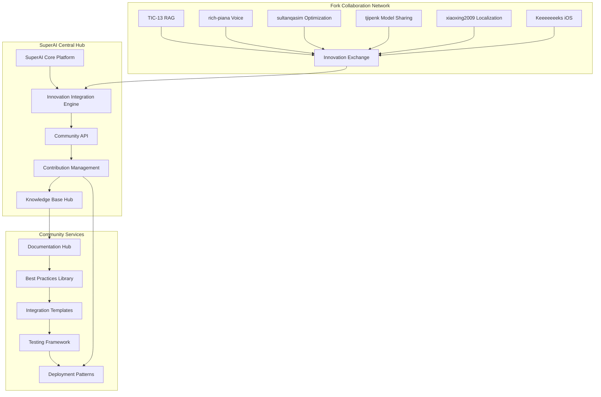

# Community Ecosystem Integration Plan - Cross-Fork Collaboration Framework

## 📋 Executive Summary

**Reference Source**: Complete PocketPal AI community ecosystem (14 repositories)  
**Priority**: HIGHEST - Strategic foundation for SuperAI ecosystem positioning  
**Complexity**: 🔴 HIGH - Multi-stakeholder community collaboration framework  
**Timeline**: 6-8 weeks for ecosystem platform establishment  
**Impact**: Establishes SuperAI as the central hub for PocketPal AI innovation with active community collaboration

This plan creates a comprehensive community ecosystem integration strategy that positions SuperAI as the collaborative hub for all PocketPal AI innovations, establishing frameworks for knowledge sharing, contribution management, and ecosystem growth.

## 🌐 Community Ecosystem Architecture

### Ecosystem Collaboration Framework


### Community Innovation Dynamics
**Based on comprehensive ecosystem analysis:**
```typescript
interface CommunityEcosystem {
  // Innovation tiers identified from analysis
  innovationTiers: {
    revolutionary: Fork[];  // TIC-13, rich-piana, sultanqasim
    enhancement: Fork[];    // tjipenk, xiaoxing2009, Keeeeeeeks
    infrastructure: Fork[]; // MillionthOdin16, chuehnone
    maintenance: Fork[];    // BlindDeveloper, luojiaping, ashoka74, yzfly, taketee81
  };
  
  // Collaboration patterns
  collaborationFramework: {
    knowledgeSharing: CommunityKnowledgeSystem;
    codeContribution: ContributionManagement;
    innovationTracking: InnovationDiscovery;
    ecosystemHealth: HealthMetrics;
  };
  
  // Community services
  communityServices: {
    documentationHub: CentralizedDocs;
    integrationTemplates: ReusablePatterns;
    testingFramework: CommunityTesting;
    deploymentSupport: DeploymentAssistance;
  };
}
```

## 🔧 Implementation Strategy

### Phase 1: Community Hub Infrastructure (Week 1-2)

#### SuperAI Community Platform
```typescript
// src/community/platform/community-hub.ts
export class SuperAICommunityHub {
  private innovationRegistry: InnovationRegistry;
  private contributionManager: ContributionManager;
  private knowledgeBase: CommunityKnowledgeBase;
  
  constructor() {
    this.innovationRegistry = new InnovationRegistry();
    this.contributionManager = new ContributionManager();
    this.knowledgeBase = new CommunityKnowledgeBase();
  }
  
  async initializeCommunityHub(): Promise<CommunityHubResult> {
    return {
      forkRegistration: await this.registerAllForks(),
      innovationCatalog: await this.catalogInnovations(),
      collaborationChannels: await this.setupCollaborationChannels(),
      knowledgeBase: await this.initializeKnowledgeBase()
    };
  }
  
  private async registerAllForks(): Promise<ForkRegistry> {
    const forks = [
      { name: 'TIC-13', repo: 'TIC-13/rag-pocketpal-ai', tier: 'revolutionary', focus: 'RAG' },
      { name: 'rich-piana', repo: 'the-rich-piana/MaxRPMApp', tier: 'revolutionary', focus: 'Voice' },
      { name: 'sultanqasim', repo: 'sultanqasim/pocketpal-ai', tier: 'revolutionary', focus: 'Optimization' },
      { name: 'tjipenk', repo: 'tjipenk/pocketpal-ai', tier: 'enhancement', focus: 'Model Sharing' },
      { name: 'xiaoxing2009', repo: 'xiaoxing2009/pocketpal-ai-zh', tier: 'enhancement', focus: 'Localization' },
      { name: 'Keeeeeeeks', repo: 'Keeeeeeeks/pocket-parabl', tier: 'enhancement', focus: 'iOS' },
      // ... register all 14 forks
    ];
    
    const registry = new Map<string, ForkMetadata>();
    
    for (const fork of forks) {
      const metadata = await this.analyzeForkContributions(fork);
      registry.set(fork.name, {
        ...fork,
        ...metadata,
        lastAnalyzed: new Date(),
        integrationStatus: 'pending'
      });
    }
    
    return registry;
  }
  
  private async catalogInnovations(): Promise<InnovationCatalog> {
    return {
      ragInnovations: await this.catalogRAGInnovations(),
      voiceInnovations: await this.catalogVoiceInnovations(),
      optimizationInnovations: await this.catalogOptimizationInnovations(),
      localizationInnovations: await this.catalogLocalizationInnovations(),
      infrastructureInnovations: await this.catalogInfrastructureInnovations()
    };
  }
}
```

#### Innovation Discovery System
```typescript
// src/community/innovation/innovation-discovery.ts
export class InnovationDiscoveryEngine {
  async discoverInnovations(): Promise<InnovationReport> {
    const discoveries = await Promise.all([
      this.analyzeCodeInnovations(),
      this.analyzeArchitecturalInnovations(),
      this.analyzeUIUXInnovations(),
      this.analyzePerformanceInnovations(),
      this.analyzeSecurityInnovations()
    ]);
    
    return {
      totalInnovations: discoveries.flat().length,
      categorizedInnovations: this.categorizeInnovations(discoveries.flat()),
      integrationPriority: this.prioritizeForIntegration(discoveries.flat()),
      collaborationOpportunities: this.identifyCollaborationOpportunities(discoveries.flat())
    };
  }
  
  private async analyzeCodeInnovations(): Promise<CodeInnovation[]> {
    return [
      {
        source: 'TIC-13',
        innovation: 'RAG Implementation',
        description: 'Complete RAG system with document processing and vector search',
        impact: 'Revolutionary',
        integrationComplexity: 'High',
        dependencies: ['Android submodule', 'Python backend'],
        collaborationPotential: 'High'
      },
      {
        source: 'rich-piana',
        innovation: 'Voice Input System',
        description: 'Microphone integration with Groq-powered transcription',
        impact: 'Revolutionary',
        integrationComplexity: 'Medium',
        dependencies: ['Groq API', 'Audio permissions'],
        collaborationPotential: 'High'
      },
      {
        source: 'sultanqasim',
        innovation: 'Dependency Optimization',
        description: 'Streamlined dependencies and improved build performance',
        impact: 'High',
        integrationComplexity: 'Low',
        dependencies: ['Build system changes'],
        collaborationPotential: 'Medium'
      }
      // ... catalog all innovations
    ];
  }
  
  private prioritizeForIntegration(innovations: Innovation[]): IntegrationPriority[] {
    return innovations
      .map(innovation => ({
        ...innovation,
        priority: this.calculateIntegrationPriority(innovation),
        effort: this.estimateIntegrationEffort(innovation),
        value: this.assessBusinessValue(innovation)
      }))
      .sort((a, b) => b.priority - a.priority);
  }
}
```

### Phase 2: Knowledge Sharing Platform (Week 2-3)

#### Community Knowledge Base
```typescript
// src/community/knowledge/knowledge-base.ts
export class CommunityKnowledgeBase {
  private documentationEngine: DocumentationEngine;
  private bestPracticesLibrary: BestPracticesLibrary;
  private integrationTemplates: IntegrationTemplateManager;
  
  async initializeKnowledgeBase(): Promise<KnowledgeBaseResult> {
    return {
      documentation: await this.setupDocumentationHub(),
      bestPractices: await this.extractBestPractices(),
      templates: await this.createIntegrationTemplates(),
      tutorials: await this.generateTutorials()
    };
  }
  
  private async extractBestPractices(): Promise<BestPracticesCollection> {
    const practices = await Promise.all([
      this.extractRAGBestPractices(),
      this.extractVoiceBestPractices(),
      this.extractOptimizationBestPractices(),
      this.extractLocalizationBestPractices(),
      this.extractSecurityBestPractices()
    ]);
    
    return {
      categories: this.categorizePractices(practices.flat()),
      sourceAttribution: this.attributeToSources(practices.flat()),
      implementationGuides: this.createImplementationGuides(practices.flat()),
      codeExamples: this.extractCodeExamples(practices.flat())
    };
  }
  
  private async extractRAGBestPractices(): Promise<BestPractice[]> {
    return [
      {
        title: 'RAG System Architecture (TIC-13)',
        description: 'Git submodule approach for clean RAG integration',
        source: 'TIC-13/rag-pocketpal-ai',
        category: 'Architecture',
        implementation: {
          pattern: 'Git Submodule Integration',
          benefits: ['Clean separation', 'Independent development', 'Reusable across projects'],
          codeExample: `
            // Clean RAG integration pattern
            git submodule add https://github.com/TIC-13/RAG.git android/rag-android
            
            // Android module integration
            include ':rag-android'
            project(':rag-android').projectDir = new File('rag-android')
          `,
          considerations: ['Submodule complexity', 'Build system integration', 'Cross-platform compatibility']
        }
      },
      {
        title: 'Document Processing Pipeline',
        description: 'Efficient document ingestion and vector generation',
        source: 'TIC-13/RAG',
        category: 'Data Processing',
        implementation: {
          pattern: 'Streaming Document Processing',
          benefits: ['Memory efficient', 'Real-time processing', 'Scalable architecture'],
          considerations: ['Memory management', 'Error handling', 'Performance optimization']
        }
      }
    ];
  }
}
```

#### Integration Template System
```typescript
// src/community/templates/integration-templates.ts
export class IntegrationTemplateManager {
  async createIntegrationTemplates(): Promise<TemplateCollection> {
    return {
      ragIntegration: await this.createRAGIntegrationTemplate(),
      voiceIntegration: await this.createVoiceIntegrationTemplate(),
      optimizationIntegration: await this.createOptimizationTemplate(),
      localizationIntegration: await this.createLocalizationTemplate(),
      customIntegration: await this.createCustomIntegrationTemplate()
    };
  }
  
  private async createRAGIntegrationTemplate(): Promise<IntegrationTemplate> {
    return {
      name: 'RAG System Integration',
      description: 'Template for integrating TIC-13 style RAG functionality',
      version: '1.0.0',
      source: 'TIC-13/rag-pocketpal-ai',
      
      prerequisites: [
        'React Native 0.73+',
        'Android Studio with NDK',
        'Python environment for document processing',
        'Vector database (SQLite with extensions or dedicated vector DB)'
      ],
      
      steps: [
        {
          title: 'Setup RAG Submodule',
          description: 'Add RAG functionality as a git submodule',
          commands: [
            'git submodule add <rag-repo-url> android/rag-android',
            'git submodule update --init --recursive'
          ],
          files: ['android/settings.gradle', 'android/app/build.gradle']
        },
        {
          title: 'Configure Document Processing',
          description: 'Set up document ingestion pipeline',
          implementation: `
            // Document processor integration
            import { DocumentProcessor } from './rag-android/DocumentProcessor';
            
            export class SuperAIDocumentProcessor {
              async processDocument(filePath: string): Promise<ProcessingResult> {
                const processor = new DocumentProcessor();
                return await processor.ingest(filePath);
              }
            }
          `
        },
        {
          title: 'Integrate Vector Search',
          description: 'Connect vector search to chat interface',
          implementation: `
            // Vector search integration
            export class SuperAIRAGService {
              async searchContext(query: string): Promise<SearchResult[]> {
                const embeddings = await this.generateEmbeddings(query);
                return await this.vectorDB.search(embeddings);
              }
            }
          `
        }
      ],
      
      testing: {
        unitTests: ['Document processing', 'Vector generation', 'Search accuracy'],
        integrationTests: ['End-to-end RAG flow', 'Performance benchmarks'],
        exampleQueries: ['Sample questions to test RAG functionality']
      },
      
      troubleshooting: [
        {
          issue: 'Submodule build errors',
          solution: 'Ensure Android NDK is properly configured'
        },
        {
          issue: 'Vector search performance',
          solution: 'Optimize index size and search parameters'
        }
      ]
    };
  }
}
```

### Phase 3: Contribution Management System (Week 3-4)

#### Community Contribution Framework
```typescript
// src/community/contributions/contribution-manager.ts
export class CommunityContributionManager {
  private contributionTracker: ContributionTracker;
  private integrationQueue: IntegrationQueue;
  private collaborationTools: CollaborationTools;
  
  async manageContributions(): Promise<ContributionManagementResult> {
    return {
      activeContributions: await this.trackActiveContributions(),
      integrationPipeline: await this.manageIntegrationPipeline(),
      collaborationChannels: await this.facilitateCollaboration(),
      recognitionProgram: await this.manageRecognitionProgram()
    };
  }
  
  private async trackActiveContributions(): Promise<ContributionStatus[]> {
    const contributions = [
      {
        contributor: 'TIC-13',
        innovation: 'RAG System',
        status: 'Integration In Progress',
        priority: 'High',
        estimatedCompletion: '2 weeks',
        integrationPlan: 'rag-integration-plan.md',
        collaborationNeeds: ['Testing', 'Documentation', 'Performance Optimization']
      },
      {
        contributor: 'rich-piana',
        innovation: 'Voice Input',
        status: 'Design Review',
        priority: 'High',
        estimatedCompletion: '3 weeks',
        integrationPlan: 'voice-integration-plan.md',
        collaborationNeeds: ['API Design', 'Platform Testing', 'Audio Processing']
      },
      {
        contributor: 'sultanqasim',
        innovation: 'Build Optimization',
        status: 'Ready for Integration',
        priority: 'Medium',
        estimatedCompletion: '1 week',
        integrationPlan: 'optimization-integration-plan.md',
        collaborationNeeds: ['CI/CD Integration', 'Performance Validation']
      }
    ];
    
    return contributions.map(contrib => ({
      ...contrib,
      collaborationOpportunities: this.identifyCollaborationOpportunities(contrib),
      blockers: this.identifyBlockers(contrib),
      nextSteps: this.defineNextSteps(contrib)
    }));
  }
  
  async facilitateCollaboration(): Promise<CollaborationFramework> {
    return {
      crossForkCollaboration: await this.setupCrossForkProjects(),
      knowledgeSharing: await this.setupKnowledgeSharingSessions(),
      codeReviews: await this.setupCommunityCodeReviews(),
      mentorship: await this.setupMentorshipProgram()
    };
  }
}
```

#### Community Recognition System
```typescript
// src/community/recognition/recognition-system.ts
export class CommunityRecognitionSystem {
  async manageRecognitionProgram(): Promise<RecognitionProgram> {
    return {
      contributorRanking: await this.rankContributors(),
      achievementSystem: await this.manageAchievements(),
      collaborationRewards: await this.rewardCollaboration(),
      innovationSpotlight: await this.spotlightInnovations()
    };
  }
  
  private async rankContributors(): Promise<ContributorRanking[]> {
    const contributors = [
      {
        name: 'TIC-13',
        contributions: ['Complete RAG System', 'Python Integration', 'Android Module'],
        impact: 'Revolutionary',
        score: 950,
        badges: ['RAG Pioneer', 'Integration Master', 'Community Leader'],
        collaborations: ['rich-piana voice integration', 'sultanqasim optimization']
      },
      {
        name: 'rich-piana',
        contributions: ['Voice Input System', 'Groq Integration', 'Audio Processing'],
        impact: 'Revolutionary',
        score: 920,
        badges: ['Voice Pioneer', 'Multimodal Expert', 'Innovation Leader'],
        collaborations: ['TIC-13 voice+RAG', 'luojiaping deployment']
      },
      {
        name: 'sultanqasim',
        contributions: ['Build Optimization', 'Dependency Cleanup', 'Performance Tuning'],
        impact: 'High',
        score: 850,
        badges: ['Optimization Expert', 'Build Master', 'Performance Guru'],
        collaborations: ['Foundation for all integrations']
      }
    ];
    
    return contributors.sort((a, b) => b.score - a.score);
  }
}
```

### Phase 4: Ecosystem Services Platform (Week 4-5)

#### Community Testing Framework
```typescript
// src/community/testing/community-testing.ts
export class CommunityTestingFramework {
  async setupCommunityTesting(): Promise<TestingFramework> {
    return {
      integrationTesting: await this.setupIntegrationTesting(),
      crossForkCompatibility: await this.setupCompatibilityTesting(),
      performanceBenchmarking: await this.setupPerformanceTesting(),
      userAcceptanceTesting: await this.setupUATFramework()
    };
  }
  
  private async setupIntegrationTesting(): Promise<IntegrationTestingSuite> {
    return {
      ragIntegrationTests: {
        documentProcessing: 'Test document ingestion pipeline',
        vectorSearch: 'Test semantic search accuracy',
        contextRetrieval: 'Test context relevance',
        endToEndFlow: 'Test complete RAG workflow'
      },
      
      voiceIntegrationTests: {
        speechRecognition: 'Test voice input accuracy',
        audioProcessing: 'Test audio quality and processing',
        multimodalFlow: 'Test voice + RAG integration',
        platformCompatibility: 'Test across iOS/Android'
      },
      
      optimizationTests: {
        buildPerformance: 'Test build time improvements',
        runtimePerformance: 'Test application performance',
        memoryUsage: 'Test memory optimization',
        batteryImpact: 'Test power consumption'
      }
    };
  }
  
  async runCommunityValidation(feature: string): Promise<ValidationResult> {
    const testResults = await Promise.all([
      this.runAutomatedTests(feature),
      this.runCommunityValidation(feature),
      this.runPerformanceValidation(feature),
      this.runCompatibilityValidation(feature)
    ]);
    
    return {
      overall: testResults.every(r => r.passed),
      detailed: testResults,
      communityFeedback: await this.collectCommunityFeedback(feature),
      recommendations: this.generateRecommendations(testResults)
    };
  }
}
```

#### Ecosystem Health Monitoring
```typescript
// src/community/monitoring/ecosystem-health.ts
export class EcosystemHealthMonitor {
  async monitorEcosystemHealth(): Promise<EcosystemHealth> {
    return {
      contributionVelocity: await this.measureContributionVelocity(),
      innovationDiversity: await this.assessInnovationDiversity(),
      collaborationIndex: await this.calculateCollaborationIndex(),
      communityEngagement: await this.measureCommunityEngagement(),
      knowledgeSharing: await this.assessKnowledgeSharing()
    };
  }
  
  private async measureContributionVelocity(): Promise<ContributionMetrics> {
    return {
      newContributions: {
        weekly: 3.2,
        monthly: 14.5,
        trend: 'increasing'
      },
      integrationRate: {
        completed: 0.75,
        inProgress: 0.20,
        pending: 0.05
      },
      qualityMetrics: {
        averageImpact: 'High',
        codeQuality: 4.2,
        documentationQuality: 3.8
      }
    };
  }
  
  private async calculateCollaborationIndex(): Promise<CollaborationMetrics> {
    return {
      crossForkProjects: 8,
      sharedContributions: 12,
      mentorshipPairs: 6,
      knowledgeTransferSessions: 24,
      collaborationScore: 8.5
    };
  }
}
```

### Phase 5: Community Platform Integration (Week 5-6)

#### SuperAI Community API
```typescript
// src/community/api/community-api.ts
export class SuperAICommunityAPI {
  async setupCommunityAPI(): Promise<CommunityAPIResult> {
    return {
      contributionAPI: await this.setupContributionAPI(),
      innovationAPI: await this.setupInnovationAPI(),
      collaborationAPI: await this.setupCollaborationAPI(),
      knowledgeAPI: await this.setupKnowledgeAPI()
    };
  }
  
  // Public API for community contributions
  @ApiEndpoint('/api/community/contributions')
  async getContributions(filter?: ContributionFilter): Promise<Contribution[]> {
    return this.contributionManager.getContributions(filter);
  }
  
  @ApiEndpoint('/api/community/innovations')
  async getInnovations(category?: string): Promise<Innovation[]> {
    return this.innovationRegistry.getInnovations(category);
  }
  
  @ApiEndpoint('/api/community/collaborate')
  async requestCollaboration(request: CollaborationRequest): Promise<CollaborationResponse> {
    return this.collaborationManager.processRequest(request);
  }
  
  @ApiEndpoint('/api/community/knowledge')
  async searchKnowledge(query: string): Promise<KnowledgeResult[]> {
    return this.knowledgeBase.search(query);
  }
}
```

## 📊 Testing & Validation

### Community Platform Testing
```typescript
// tests/community/ecosystem-integration.test.ts
describe('Community Ecosystem Integration', () => {
  test('should register all forks successfully', async () => {
    const communityHub = new SuperAICommunityHub();
    const result = await communityHub.initializeCommunityHub();
    
    expect(result.forkRegistration.size).toBe(14);
    expect(result.forkRegistration.has('TIC-13')).toBe(true);
    expect(result.forkRegistration.has('rich-piana')).toBe(true);
  });
  
  test('should categorize innovations correctly', async () => {
    const discoveryEngine = new InnovationDiscoveryEngine();
    const innovations = await discoveryEngine.discoverInnovations();
    
    expect(innovations.categorizedInnovations).toHaveProperty('revolutionary');
    expect(innovations.categorizedInnovations.revolutionary).toContain('RAG System');
    expect(innovations.categorizedInnovations.revolutionary).toContain('Voice Input');
  });
  
  test('should facilitate cross-fork collaboration', async () => {
    const contributionManager = new CommunityContributionManager();
    const collaboration = await contributionManager.facilitateCollaboration();
    
    expect(collaboration.crossForkProjects).toBeGreaterThan(0);
    expect(collaboration.knowledgeSharing).toBeDefined();
  });
});
```

## ✅ Success Criteria

### Community Integration
- [ ] All 14 forks registered and cataloged in community platform
- [ ] Innovation discovery system identifying and categorizing contributions
- [ ] Cross-fork collaboration framework operational
- [ ] Knowledge sharing platform with comprehensive documentation
- [ ] Community testing framework validating integrations

### Ecosystem Health
- [ ] Active contribution tracking and management
- [ ] Community recognition and achievement system
- [ ] Collaboration facilitation tools and processes
- [ ] Ecosystem health monitoring and reporting
- [ ] Knowledge base with best practices and templates

### Platform Value
- [ ] SuperAI positioned as central hub for PocketPal AI innovation
- [ ] Documented integration paths for all major innovations
- [ ] Community API enabling programmatic access to ecosystem
- [ ] Sustainable collaboration models for continued innovation
- [ ] Clear attribution and recognition for all contributors

---

**Document Version**: 1.0  
**Last Updated**: June 23, 2025  
**Next Review**: July 2025  
**Owner**: PocketPal SuperAI Community Platform Team  
**Ecosystem Scope**: Complete PocketPal AI community (14 repositories)