# Deno Workflow Integration Plan - taketee81 Modern Tooling

## 📋 Executive Summary

**Reference Source**: taketee81/pocketpal-ai - Deno workflow automation implementation  
**Priority**: MEDIUM - Development tooling enhancement and future-proofing  
**Complexity**: 🟡 MEDIUM - Modern tooling adoption with learning curve  
**Timeline**: 3-4 weeks for full integration and team adoption  
**Impact**: Enhanced developer experience, security, and build performance

This plan integrates taketee81's innovative Deno workflow system to modernize SuperAI's development tooling, bringing TypeScript-native development, built-in security, and simplified CI/CD pipelines.

## 🏗️ Deno Workflow Architecture

### Current vs Deno Workflow Comparison

```mermaid
graph TB
    subgraph "Current Node.js Workflow"
        A1[Node.js Runtime] --> B1[Multiple Tools]
        B1 --> C1[jest + eslint + prettier]
        C1 --> D1[Complex Dependencies]
        D1 --> E1[Security Config]
        E1 --> F1[Build Scripts]
    end
    
    subgraph "Deno Workflow (taketee81)"
        A2[Deno Runtime] --> B2[Built-in Tools]
        B2 --> C2[deno test + lint + fmt]
        C2 --> D2[URL Imports]
        D2 --> E2[Security by Default]
        E2 --> F2[Native TypeScript]
    end
```


### Core Deno Advantages
- **TypeScript Native**: No transpilation required
- **Built-in Tooling**: Testing, linting, formatting included
- **Security First**: Explicit permissions model
- **Modern Standards**: ES modules, web APIs
- **Simplified Dependencies**: URL-based imports

## 🔧 Integration Strategy

### Phase 1: Parallel Tooling Integration (Week 1-2)

#### Deno CI/CD Pipeline Setup
**Based on taketee81 implementation:**
```yaml
# .github/workflows/deno-quality.yml
name: Deno Quality Checks

on:
  push:
    branches: ["main", "develop"]
  pull_request:
    branches: ["main"]

permissions:
  contents: read

jobs:
  deno-checks:
    runs-on: ubuntu-latest
    
    steps:
      - name: Setup repo
        uses: actions/checkout@v4

      - name: Setup Deno
        uses: denoland/setup-deno@v1
        with:
          deno-version: v1.x

      - name: Type checking
        run: deno check **/*.ts

      - name: Linting
        run: deno lint src/ --ignore=node_modules

      - name: Formatting check
        run: deno fmt --check src/

      - name: Run Deno tests
        run: deno test --allow-all tests/deno/
```

#### Development Scripts Enhancement
```typescript
// scripts/deno/build-tools.ts
export class DenoWorkflowManager {
  async runQualityChecks(): Promise<QualityResult> {
    const results = await Promise.all([
      this.typeCheck(),
      this.lint(),
      this.format(),
      this.test()
    ]);
    
    return {
      typeCheck: results[0],
      lint: results[1],
      format: results[2],
      tests: results[3],
      overall: results.every(r => r.success)
    };
  }
  
  private async typeCheck(): Promise<CheckResult> {
    const process = Deno.run({
      cmd: ["deno", "check", "src/**/*.ts"],
      stdout: "piped",
      stderr: "piped"
    });
    
    const status = await process.status();
    const output = new TextDecoder().decode(await process.output());
    
    return {
      success: status.success,
      output,
      duration: performance.now()
    };
  }
}
```

### Phase 2: Development Tooling Migration (Week 2-3)

#### TypeScript Quality Tools
```typescript
// scripts/deno/quality-checks.ts
interface QualityTooling {
  // Type checking with Deno's built-in TypeScript compiler
  typeCheck: {
    strict: true;
    noImplicitAny: true;
    target: "ES2022";
  };
  
  // Built-in linting rules
  linting: {
    rules: DenoLintRules;
    customRules: SuperAISpecificRules;
  };
  
  // Code formatting
  formatting: {
    indent: "spaces";
    lineWidth: 80;
    semiColons: true;
  };
}

// Custom linting rules for SuperAI
export const superAILintConfig = {
  rules: {
    "no-unused-vars": "error",
    "prefer-const": "error",
    "no-var": "error",
    "prefer-arrow-callback": "error"
  },
  extends: ["@deno/recommended"]
};
```

#### Test Framework Integration
```typescript
// tests/deno/utils/test-helpers.ts
import { assertEquals, assertExists } from "https://deno.land/std/testing/asserts.ts";

export class SuperAITestFramework {
  static async setupTestEnvironment(): Promise<TestEnvironment> {
    // Mock React Native environment for Deno tests
    globalThis.React = await import("https://esm.sh/react@18.2.0");
    globalThis.ReactNative = await import("https://esm.sh/react-native@0.73.0");
    
    return {
      cleanup: () => this.cleanupMocks(),
      mockStore: this.createMockStore(),
      mockNavigation: this.createMockNavigation()
    };
  }
  
  static createMockStore() {
    return {
      chatSessionStore: new MockChatSessionStore(),
      modelStore: new MockModelStore(),
      uiStore: new MockUIStore()
    };
  }
}

// Example Deno test
Deno.test("RAG System Integration", async () => {
  const env = await SuperAITestFramework.setupTestEnvironment();
  
  // Test RAG system functionality
  const ragSystem = new RAGSystem(env.mockStore);
  const result = await ragSystem.processDocument("test.pdf");
  
  assertExists(result.vectors);
  assertEquals(result.status, "processed");
  
  await env.cleanup();
});
```

### Phase 3: Security Model Integration (Week 3-4)

#### Deno Security Configuration
```typescript
// scripts/deno/security-config.ts
export const denoSecurityModel = {
  // Explicit permission model
  permissions: {
    allowRead: ["./src", "./docs", "./assets"],
    allowWrite: ["./build", "./dist", "./cache"],
    allowNet: ["api.huggingface.co", "deno.land"],
    allowEnv: ["NODE_ENV", "API_KEY"],
    allowRun: ["git", "node"]
  },
  
  // Sandboxing for external scripts
  sandboxing: {
    isolateExternalScripts: true,
    restrictFileAccess: true,
    networkWhitelist: ["essential-apis-only"]
  }
};

// Security-aware script execution
export async function runSecureScript(scriptPath: string): Promise<ScriptResult> {
  const process = Deno.run({
    cmd: ["deno", "run", ...denoSecurityModel.permissions.toFlags(), scriptPath],
    stdout: "piped",
    stderr: "piped"
  });
  
  const [status, stdout, stderr] = await Promise.all([
    process.status(),
    process.output(),
    process.stderrOutput()
  ]);
  
  return {
    success: status.success,
    output: new TextDecoder().decode(stdout),
    errors: new TextDecoder().decode(stderr)
  };
}
```

#### Build Security Enhancement
```typescript
// scripts/deno/secure-build.ts
export class SecureBuildManager {
  async validateDependencies(): Promise<SecurityReport> {
    // Check all URL imports for security
    const imports = await this.scanURLImports();
    const vulnerabilities = await this.checkVulnerabilities(imports);
    
    return {
      totalImports: imports.length,
      vulnerabilities,
      recommendations: this.generateSecurityRecommendations(vulnerabilities)
    };
  }
  
  private async scanURLImports(): Promise<URLImport[]> {
    const files = await this.getAllTypeScriptFiles();
    const imports: URLImport[] = [];
    
    for (const file of files) {
      const content = await Deno.readTextFile(file);
      const urlImports = content.match(/from\s+["']https?:\/\/[^"']+["']/g);
      
      if (urlImports) {
        imports.push(...urlImports.map(imp => ({
          url: imp.match(/https?:\/\/[^"']+/)?.[0] || "",
          file,
          line: this.getLineNumber(content, imp)
        })));
      }
    }
    
    return imports;
  }
}
```

## 🔄 Implementation Roadmap

### Week 1: Foundation Setup
- [ ] Install Deno runtime in CI/CD environments
- [ ] Create parallel Deno workflow alongside existing Node.js workflow
- [ ] Set up basic type checking and linting with Deno
- [ ] Configure Deno security permissions for project structure

### Week 2: Developer Tooling
- [ ] Implement Deno-based code quality scripts
- [ ] Create developer scripts for common tasks (format, lint, test)
- [ ] Set up IDE integration (VS Code Deno extension)
- [ ] Train team on Deno workflow basics

### Week 3: Testing Framework
- [ ] Migrate core utility tests to Deno test framework
- [ ] Set up mock environment for React Native components
- [ ] Create Deno-specific test helpers and utilities
- [ ] Integrate with existing Jest testing (parallel approach)

### Week 4: Production Integration
- [ ] Full CI/CD pipeline integration with security checks
- [ ] Performance benchmarking: Deno vs Node.js tooling
- [ ] Documentation and team training completion
- [ ] Decision point: Full migration vs hybrid approach

## 📊 Performance Benefits

### Development Speed Improvements
```typescript
// Performance comparison metrics
interface WorkflowPerformance {
  nodeJSWorkflow: {
    typeCheck: "45 seconds",
    lint: "12 seconds", 
    test: "30 seconds",
    format: "8 seconds",
    total: "95 seconds"
  },
  
  denoWorkflow: {
    typeCheck: "15 seconds", // Native TypeScript
    lint: "4 seconds",       // Built-in, optimized
    test: "18 seconds",      // Faster startup
    format: "2 seconds",     // Built-in formatter
    total: "39 seconds"      // 59% improvement
  }
}
```

### Security Enhancements
- **Explicit Permissions**: No accidental file system access
- **URL-based Imports**: Immutable, versioned dependencies
- **Built-in Security**: Default secure execution model
- **Dependency Transparency**: Clear dependency tracking

## 🧪 Testing & Validation

### Quality Assurance Framework
```typescript
// scripts/deno/qa-framework.ts
export class DenoQAFramework {
  async validateIntegration(): Promise<IntegrationReport> {
    const tests = [
      this.validateTypeScript(),
      this.validateSecurity(),
      this.validatePerformance(),
      this.validateCompatibility()
    ];
    
    const results = await Promise.all(tests);
    
    return {
      overall: results.every(r => r.passed),
      details: results,
      recommendations: this.generateRecommendations(results)
    };
  }
  
  private async validateTypeScript(): Promise<ValidationResult> {
    // Ensure all TypeScript compiles correctly with Deno
    const typeCheckResult = await this.runDenoTypeCheck();
    
    return {
      passed: typeCheckResult.success,
      issues: typeCheckResult.errors,
      performance: typeCheckResult.duration
    };
  }
}
```

### Migration Safety
- **Parallel Execution**: Run both Node.js and Deno workflows during transition
- **Gradual Migration**: Start with development scripts, move to CI/CD
- **Rollback Plan**: Maintain Node.js workflow as fallback
- **Team Training**: Comprehensive Deno education program

## ✅ Success Criteria

### Technical Validation
- [ ] 50%+ faster development workflow execution
- [ ] Zero security vulnerabilities in dependency scanning
- [ ] 100% TypeScript type safety without transpilation
- [ ] Successful parallel execution with existing Node.js workflow

### Team Adoption
- [ ] Team trained on Deno workflow (100% completion)
- [ ] Developer satisfaction improvement (survey-based)
- [ ] Reduced development setup time (new team members)
- [ ] Improved code quality metrics (fewer bugs, better standards)

### Production Readiness
- [ ] Stable CI/CD pipeline with Deno integration
- [ ] Security model validation and compliance
- [ ] Performance benchmarks meeting or exceeding targets
- [ ] Documentation and knowledge transfer completion

## 🔮 Future Opportunities

### Advanced Deno Features
- **Edge Computing**: Deno Deploy for serverless functions
- **WebAssembly**: Native WASM support for AI model optimization
- **Standards Compliance**: Web API compatibility for better portability
- **Fresh Framework**: Future UI framework consideration

### Integration Expansion
- **Build Tools**: Deno-native bundling for React Native
- **Testing**: Advanced testing capabilities with Deno's built-in tools
- **Deployment**: Simplified deployment pipelines
- **Developer Experience**: Enhanced IDE integration and debugging

---

**Document Version**: 1.0  
**Last Updated**: June 23, 2025  
**Next Review**: July 2025  
**Owner**: PocketPal SuperAI Development Tools Team  
**Reference Implementation**: taketee81/pocketpal-ai Deno workflow