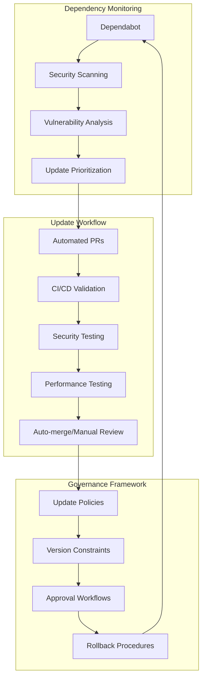

# Dependency Management Integration Plan - BlindDeveloper Automated System

## 📋 Executive Summary

**Reference Source**: BlindDeveloper/pocketpal-ai - Automated dependency management via Dependabot  
**Priority**: HIGH - Critical for security, stability, and maintenance efficiency  
**Complexity**: 🟡 MEDIUM - Automated tooling setup with governance frameworks  
**Timeline**: 2-3 weeks for complete automation framework  
**Impact**: Proactive security updates, reduced maintenance overhead, improved stability

This plan integrates BlindDeveloper's sophisticated automated dependency management approach to establish enterprise-grade dependency governance for SuperAI, including automated security updates, vulnerability scanning, and systematic maintenance workflows.

## 🏗️ Dependency Management Architecture

### Automated Dependency Framework


### Dependency Strategy Overview
**Based on BlindDeveloper implementation analysis:**
```typescript
interface DependencyManagementSystem {
  // Automated monitoring and updates
  automation: {
    dependabot: DependabotConfiguration;
    securityScanning: SecurityScanConfig;
    vulnerabilityAlerts: VulnerabilityMonitoring;
    automatedUpdates: UpdateAutomationConfig;
  };
  
  // Governance and policies
  governance: {
    updatePolicies: UpdatePolicyFramework;
    versionConstraints: VersionConstraintSystem;
    approvalWorkflows: ApprovalWorkflowConfig;
    rollbackProcedures: RollbackManagement;
  };
  
  // Quality assurance
  qualityGates: {
    securityTesting: SecurityTestingSuite;
    performanceTesting: PerformanceValidation;
    compatibilityTesting: CompatibilityValidation;
    regressionTesting: RegressionTestSuite;
  };
  
  // Monitoring and analytics
  monitoring: {
    dependencyHealth: HealthMetrics;
    updateVelocity: UpdateMetrics;
    securityPosture: SecurityMetrics;
    maintenanceOverhead: MaintenanceMetrics;
  };
}
```

## 🔧 Implementation Strategy

### Phase 1: Dependabot Configuration (Week 1)

#### Advanced Dependabot Setup
**Enhanced from BlindDeveloper's configuration:**
```yaml
# .github/dependabot.yml - SuperAI Dependency Management
version: 2
updates:
  # React Native JavaScript/TypeScript dependencies
  - package-ecosystem: "npm"
    directory: "/"
    schedule:
      interval: "weekly"
      day: "tuesday"
      time: "09:00"
      timezone: "UTC"
    
    # Security updates (immediate)
    open-pull-requests-limit: 20
    
    # Grouping strategy for manageable PRs
    groups:
      # Critical security updates (auto-merge eligible)
      security-patches:
        applies-to: security-updates
        patterns:
          - "*"
      
      # Major framework updates (manual review required)
      major-frameworks:
        patterns:
          - "react"
          - "react-native"
          - "@react-native/*"
          - "@react-navigation/*"
        update-types:
          - "version-update:semver-major"
      
      # Development dependencies (auto-merge eligible)
      dev-dependencies:
        dependency-type: "development"
        update-types:
          - "version-update:semver-patch"
          - "version-update:semver-minor"
      
      # Production patches (controlled auto-merge)
      production-patches:
        dependency-type: "production"
        update-types:
          - "version-update:semver-patch"
      
      # AI/ML specific dependencies
      ai-dependencies:
        patterns:
          - "@pocketpalai/*"
          - "*llama*"
          - "*anthropic*"
          - "*openai*"
          - "groq-sdk"
          - "@langchain/*"
    
    # Update commit message format
    commit-message:
      prefix: "chore(deps)"
      prefix-development: "chore(deps-dev)"
      include: "scope"
    
    # Review assignment
    reviewers:
      - "superai-maintainers"
    assignees:
      - "dependency-manager"
    
    # Labels for categorization
    labels:
      - "dependencies"
      - "automated"
    
    # Ignore problematic packages or versions
    ignore:
      - dependency-name: "react-native"
        update-types: ["version-update:semver-major"]
      - dependency-name: "@pocketpalai/llama.rn"
        # Keep pinned to tested version
        
  # iOS CocoaPods dependencies
  - package-ecosystem: "cocoapods"
    directory: "/ios"
    schedule:
      interval: "weekly"
      day: "wednesday"
      time: "09:00"
      timezone: "UTC"
    open-pull-requests-limit: 5
    
    commit-message:
      prefix: "chore(ios-deps)"
    
    labels:
      - "dependencies"
      - "ios"
      - "automated"
  
  # Android Gradle dependencies
  - package-ecosystem: "gradle"
    directory: "/android"
    schedule:
      interval: "weekly"
      day: "thursday"
      time: "09:00"
      timezone: "UTC"
    open-pull-requests-limit: 5
    
    commit-message:
      prefix: "chore(android-deps)"
    
    labels:
      - "dependencies"
      - "android"
      - "automated"
  
  # GitHub Actions dependencies
  - package-ecosystem: "github-actions"
    directory: "/"
    schedule:
      interval: "monthly"
      day: "first-monday"
      time: "09:00"
      timezone: "UTC"
    
    commit-message:
      prefix: "chore(ci)"
    
    labels:
      - "dependencies"
      - "ci"
      - "automated"
```

#### Dependency Security Configuration
```typescript
// scripts/dependency/security-config.ts
export class DependencySecurityManager {
  async configureSecurity(): Promise<SecurityConfiguration> {
    return {
      vulnerabilityScanning: await this.setupVulnerabilityScanning(),
      licenseCompliance: await this.setupLicenseCompliance(),
      supplyChainSecurity: await this.setupSupplyChainSecurity(),
      securityPolicies: await this.definecurityPolicies()
    };
  }
  
  private async setupVulnerabilityScanning(): Promise<VulnerabilityConfig> {
    return {
      tools: {
        npmAudit: {
          enabled: true,
          level: 'moderate',
          autoFix: true,
          production: true
        },
        
        snyk: {
          enabled: true,
          monitoring: true,
          autoPatching: true,
          threshold: 'medium'
        },
        
        githubSecurity: {
          advisories: true,
          dependabotAlerts: true,
          codeScanning: true
        }
      },
      
      scanning: {
        frequency: 'daily',
        scope: ['direct', 'transitive'],
        excludeDevDependencies: false,
        failThreshold: 'high'
      },
      
      reporting: {
        format: ['json', 'sarif'],
        uploadToSecurity: true,
        generateReports: true,
        notificationChannels: ['slack', 'email']
      }
    };
  }
  
  private async setupSupplyChainSecurity(): Promise<SupplyChainConfig> {
    return {
      packageIntegrity: {
        checksumValidation: true,
        signatureVerification: true,
        sourceVerification: true
      },
      
      repositorySecurity: {
        allowedRegistries: [
          'https://registry.npmjs.org',
          'https://cdn.jsdelivr.net',
          'https://registry.yarnpkg.com'
        ],
        
        blockedPackages: [
          // Known malicious packages
          'malicious-package-example'
        ],
        
        trustedMaintainers: [
          '@react-native-community',
          '@pocketpalai',
          '@anthropic'
        ]
      },
      
      downloadSecurity: {
        httpsOnly: true,
        checksumValidation: true,
        timeout: 30000,
        retryPolicy: {
          attempts: 3,
          backoff: 'exponential'
        }
      }
    };
  }
}
```

### Phase 2: Update Automation Workflows (Week 1-2)

#### Intelligent Auto-merge System
```yaml
# .github/workflows/dependency-auto-merge.yml
name: Dependency Auto-merge

on:
  pull_request:
    types: [opened, synchronize, reopened]

jobs:
  # Analyze dependency update for auto-merge eligibility
  analyze-update:
    runs-on: ubuntu-latest
    if: ${{ github.actor == 'dependabot[bot]' }}
    outputs:
      auto-merge-eligible: ${{ steps.analysis.outputs.eligible }}
      risk-level: ${{ steps.analysis.outputs.risk }}
      update-type: ${{ steps.analysis.outputs.type }}
    
    steps:
      - name: Checkout code
        uses: actions/checkout@v4
      
      - name: Analyze dependency update
        id: analysis
        run: |
          # Parse PR title and description for update details
          UPDATE_TYPE=$(echo "${{ github.event.pull_request.title }}" | grep -oE "(patch|minor|major)")
          PACKAGE_NAME=$(echo "${{ github.event.pull_request.title }}" | grep -oE "bump [^[:space:]]+" | cut -d' ' -f2)
          
          # Determine auto-merge eligibility
          ELIGIBLE="false"
          RISK="medium"
          
          # Security patches are always eligible
          if [[ "${{ github.event.pull_request.title }}" == *"security"* ]]; then
            ELIGIBLE="true"
            RISK="low"
          # Patch updates for dev dependencies
          elif [[ "$UPDATE_TYPE" == "patch" ]] && [[ "${{ github.event.pull_request.body }}" == *"devDependencies"* ]]; then
            ELIGIBLE="true"
            RISK="low"
          # Minor updates for specific trusted packages
          elif [[ "$UPDATE_TYPE" == "minor" ]] && [[ "$PACKAGE_NAME" =~ ^(@babel|@types|eslint|prettier) ]]; then
            ELIGIBLE="true"
            RISK="low"
          fi
          
          echo "eligible=$ELIGIBLE" >> $GITHUB_OUTPUT
          echo "risk=$RISK" >> $GITHUB_OUTPUT
          echo "type=$UPDATE_TYPE" >> $GITHUB_OUTPUT
  
  # Run comprehensive tests for dependency updates
  dependency-validation:
    runs-on: ubuntu-latest
    needs: analyze-update
    if: ${{ needs.analyze-update.outputs.auto-merge-eligible == 'true' }}
    
    steps:
      - name: Checkout code
        uses: actions/checkout@v4
        with:
          ref: ${{ github.event.pull_request.head.ref }}
      
      - name: Setup build environment
        uses: ./.github/actions/setup-build-env
        with:
          node-version: '20.x'
          java-version: '17'
          ruby-version: '3.2.3'
      
      - name: Install dependencies
        run: yarn install --frozen-lockfile
      
      - name: Run security audit
        run: |
          yarn audit --level moderate
          npm audit signatures
      
      - name: Type checking
        run: yarn typecheck
      
      - name: Linting
        run: yarn lint
      
      - name: Unit tests
        run: yarn test --coverage --watchAll=false
      
      - name: Build validation
        run: |
          # Android build validation
          cd android && ./gradlew assembleDebug --no-daemon
          
          # iOS build validation (if on macOS runner)
          # cd ios && xcodebuild -workspace SuperAI.xcworkspace -scheme SuperAI -configuration Debug -destination 'generic/platform=iOS Simulator' build
      
      - name: Performance regression test
        run: |
          # Run performance benchmarks to ensure no regression
          yarn test:performance --threshold=5%  # Allow 5% performance variance
      
      - name: Security scan
        run: |
          # Additional security scanning
          yarn run security:scan
          
          # Check for new vulnerabilities introduced
          yarn audit --audit-level moderate
  
  # Auto-merge if all validations pass
  auto-merge:
    runs-on: ubuntu-latest
    needs: [analyze-update, dependency-validation]
    if: ${{ needs.analyze-update.outputs.auto-merge-eligible == 'true' && needs.dependency-validation.result == 'success' }}
    
    steps:
      - name: Auto-merge dependency update
        uses: pascalgn/merge-action@v0.15.6
        with:
          github_token: ${{ secrets.GITHUB_TOKEN }}
          merge_method: squash
          merge_commit_message: |
            ${{ github.event.pull_request.title }}
            
            Auto-merged dependency update after validation:
            - Security audit: ✅ Passed
            - Type checking: ✅ Passed  
            - Tests: ✅ Passed
            - Build validation: ✅ Passed
            - Performance regression: ✅ Passed
            
            Risk level: ${{ needs.analyze-update.outputs.risk }}
            Update type: ${{ needs.analyze-update.outputs.update-type }}
      
      - name: Notify team
        if: success()
        uses: 8398a7/action-slack@v3
        with:
          status: success
          text: |
            🤖 Auto-merged dependency update: ${{ github.event.pull_request.title }}
            Risk: ${{ needs.analyze-update.outputs.risk }} | Type: ${{ needs.analyze-update.outputs.update-type }}
        env:
          SLACK_WEBHOOK_URL: ${{ secrets.SLACK_WEBHOOK }}
```

#### Manual Review Workflow
```yaml
# .github/workflows/dependency-review.yml
name: Dependency Review Required

on:
  pull_request:
    types: [opened, synchronize, reopened]

jobs:
  require-manual-review:
    runs-on: ubuntu-latest
    if: ${{ github.actor == 'dependabot[bot]' }}
    
    steps:
      - name: Check if manual review required
        run: |
          # Major version updates always require manual review
          if [[ "${{ github.event.pull_request.title }}" == *"major"* ]]; then
            echo "🚨 Major version update detected - Manual review required"
            exit 0
          fi
          
          # React Native updates require manual review
          if [[ "${{ github.event.pull_request.title }}" == *"react-native"* ]]; then
            echo "⚛️ React Native update detected - Manual review required"
            exit 0
          fi
          
          # AI/ML dependency updates require manual review
          if [[ "${{ github.event.pull_request.title }}" =~ (llama|anthropic|openai|groq) ]]; then
            echo "🤖 AI/ML dependency update detected - Manual review required"
            exit 0
          fi
      
      - name: Request reviews
        uses: alexlapp/pr-reviewer-action@v1
        with:
          github-token: ${{ secrets.GITHUB_TOKEN }}
          reviewers: |
            superai-tech-lead
            superai-security-team
          team-reviewers: |
            superai-maintainers
      
      - name: Add review labels
        uses: actions/github-script@v6
        with:
          script: |
            github.rest.issues.addLabels({
              issue_number: context.issue.number,
              owner: context.repo.owner,
              repo: context.repo.repo,
              labels: ['needs-manual-review', 'high-priority']
            })
      
      - name: Add detailed review comment
        uses: actions/github-script@v6
        with:
          script: |
            const comment = `## 🔍 Manual Review Required
            
            This dependency update requires manual review due to:
            - High impact potential
            - Security implications
            - Breaking change possibility
            
            ### Review Checklist
            - [ ] Breaking changes documented and mitigated
            - [ ] Security implications assessed
            - [ ] Performance impact evaluated
            - [ ] Integration tests validate compatibility
            - [ ] Migration guide available (if needed)
            
            ### Testing Instructions
            1. Pull this branch locally
            2. Run comprehensive test suite
            3. Test critical user flows
            4. Validate performance benchmarks
            5. Check for any breaking changes
            
            Please approve when review is complete.`;
            
            github.rest.issues.createComment({
              issue_number: context.issue.number,
              owner: context.repo.owner,
              repo: context.repo.repo,
              body: comment
            })
```

### Phase 3: Governance and Policy Framework (Week 2-3)

#### Dependency Policy Engine
```typescript
// scripts/dependency/policy-engine.ts
export class DependencyPolicyEngine {
  private policies: DependencyPolicy[];
  private riskAssessment: RiskAssessmentEngine;
  private complianceValidator: ComplianceValidator;
  
  async evaluateUpdate(update: DependencyUpdate): Promise<PolicyEvaluation> {
    const evaluations = await Promise.all([
      this.evaluateSecurityPolicy(update),
      this.evaluateVersionPolicy(update),
      this.evaluateLicensePolicy(update),
      this.evaluatePerformancePolicy(update),
      this.evaluateCompatibilityPolicy(update)
    ]);
    
    return {
      allowed: evaluations.every(e => e.approved),
      evaluations,
      requiredActions: this.generateRequiredActions(evaluations),
      riskLevel: this.calculateRiskLevel(evaluations),
      approvalRequired: this.determineApprovalRequired(evaluations)
    };
  }
  
  private async evaluateSecurityPolicy(update: DependencyUpdate): Promise<PolicyEvaluation> {
    const securityRisks = await this.riskAssessment.assessSecurityRisks(update);
    
    return {
      policy: 'Security Policy',
      approved: securityRisks.level !== 'critical',
      conditions: [
        {
          requirement: 'No critical vulnerabilities',
          met: securityRisks.criticalVulnerabilities === 0,
          details: `Found ${securityRisks.criticalVulnerabilities} critical vulnerabilities`
        },
        {
          requirement: 'Security audit passed',
          met: securityRisks.auditPassed,
          details: securityRisks.auditDetails
        },
        {
          requirement: 'Trusted source',
          met: securityRisks.trustedSource,
          details: `Source: ${update.package.registry}`
        }
      ],
      actions: securityRisks.level === 'high' ? ['security-review-required'] : []
    };
  }
  
  private async evaluateVersionPolicy(update: DependencyUpdate): Promise<PolicyEvaluation> {
    const versionAnalysis = this.analyzeVersionUpdate(update);
    
    return {
      policy: 'Version Policy',
      approved: this.isVersionUpdateAllowed(versionAnalysis),
      conditions: [
        {
          requirement: 'Semantic versioning compliance',
          met: versionAnalysis.semverCompliant,
          details: `Update type: ${versionAnalysis.updateType}`
        },
        {
          requirement: 'Breaking change assessment',
          met: !versionAnalysis.hasBreakingChanges || versionAnalysis.breakingChangesDocumented,
          details: versionAnalysis.breakingChangesSummary
        },
        {
          requirement: 'Version constraint compliance',
          met: versionAnalysis.meetsConstraints,
          details: `Constraints: ${versionAnalysis.constraints}`
        }
      ],
      actions: versionAnalysis.updateType === 'major' ? ['manual-review-required'] : []
    };
  }
}
```

#### Update Impact Assessment
```typescript
// scripts/dependency/impact-assessment.ts
export class UpdateImpactAssessment {
  async assessImpact(update: DependencyUpdate): Promise<ImpactAssessment> {
    const impacts = await Promise.all([
      this.assessSecurityImpact(update),
      this.assessPerformanceImpact(update),
      this.assessCompatibilityImpact(update),
      this.assessMaintainabilityImpact(update)
    ]);
    
    return {
      overall: this.calculateOverallImpact(impacts),
      detailed: impacts,
      recommendations: this.generateRecommendations(impacts),
      migrationRequirements: this.identifyMigrationRequirements(impacts)
    };
  }
  
  private async assessPerformanceImpact(update: DependencyUpdate): Promise<PerformanceImpact> {
    // Run performance benchmarks with new dependency
    const benchmarkResults = await this.runPerformanceBenchmarks(update);
    
    return {
      category: 'Performance',
      impact: benchmarkResults.overallImpact,
      metrics: {
        bundleSize: {
          before: benchmarkResults.bundleSize.before,
          after: benchmarkResults.bundleSize.after,
          change: benchmarkResults.bundleSize.change,
          percentage: benchmarkResults.bundleSize.percentage
        },
        loadTime: {
          before: benchmarkResults.loadTime.before,
          after: benchmarkResults.loadTime.after,
          change: benchmarkResults.loadTime.change,
          percentage: benchmarkResults.loadTime.percentage
        },
        memoryUsage: {
          before: benchmarkResults.memoryUsage.before,
          after: benchmarkResults.memoryUsage.after,
          change: benchmarkResults.memoryUsage.change,
          percentage: benchmarkResults.memoryUsage.percentage
        }
      },
      acceptable: Math.abs(benchmarkResults.overallImpact) < 5, // 5% threshold
      concerns: benchmarkResults.concerns,
      optimizations: benchmarkResults.recommendedOptimizations
    };
  }
  
  private async assessCompatibilityImpact(update: DependencyUpdate): Promise<CompatibilityImpact> {
    const compatibility = await this.checkCompatibility(update);
    
    return {
      category: 'Compatibility',
      impact: compatibility.overallRisk,
      platforms: {
        ios: compatibility.ios,
        android: compatibility.android,
        web: compatibility.web
      },
      breakingChanges: compatibility.breakingChanges,
      migrationRequired: compatibility.migrationRequired,
      testingRequired: compatibility.testingRequired,
      rollbackPlan: compatibility.rollbackPlan
    };
  }
}
```

## 📊 Testing & Validation

### Dependency Management Testing
```typescript
// tests/dependency/dependency-management.test.ts
describe('Dependency Management System', () => {
  test('should auto-merge security patches', async () => {
    const policyEngine = new DependencyPolicyEngine();
    const securityUpdate = {
      package: { name: '@babel/runtime', version: '7.27.6' },
      updateType: 'patch',
      securityFix: true,
      vulnerabilities: []
    };
    
    const evaluation = await policyEngine.evaluateUpdate(securityUpdate);
    
    expect(evaluation.allowed).toBe(true);
    expect(evaluation.approvalRequired).toBe(false);
  });
  
  test('should require manual review for major updates', async () => {
    const policyEngine = new DependencyPolicyEngine();
    const majorUpdate = {
      package: { name: 'react-native', version: '0.77.0' },
      updateType: 'major',
      breakingChanges: true
    };
    
    const evaluation = await policyEngine.evaluateUpdate(majorUpdate);
    
    expect(evaluation.approvalRequired).toBe(true);
    expect(evaluation.requiredActions).toContain('manual-review-required');
  });
  
  test('should assess performance impact correctly', async () => {
    const impactAssessment = new UpdateImpactAssessment();
    const update = {
      package: { name: 'heavy-library', version: '2.0.0' },
      bundleSize: { increase: 150000 } // 150KB increase
    };
    
    const impact = await impactAssessment.assessImpact(update);
    
    expect(impact.detailed.performance.acceptable).toBeDefined();
    expect(impact.recommendations).toBeDefined();
  });
});
```

## ✅ Success Criteria

### Automation Excellence
- [ ] Dependabot configured for all package ecosystems (npm, CocoaPods, Gradle)
- [ ] Intelligent auto-merge system operational with safety checks
- [ ] Security vulnerability scanning and automated patching
- [ ] Performance regression testing for dependency updates
- [ ] Comprehensive governance framework with policy enforcement

### Security & Compliance
- [ ] Zero critical vulnerabilities in dependency chain
- [ ] Supply chain security measures implemented
- [ ] License compliance validation
- [ ] Security audit integration with update workflow
- [ ] Vulnerability monitoring and alerting

### Operational Efficiency
- [ ] 80%+ of safe updates auto-merged without manual intervention
- [ ] Manual review required only for high-risk changes
- [ ] Comprehensive impact assessment for all updates
- [ ] Rollback procedures documented and tested
- [ ] Team notification and reporting systems operational

---

**Document Version**: 1.0  
**Last Updated**: June 23, 2025  
**Next Review**: July 2025  
**Owner**: PocketPal SuperAI Dependency Management Team  
**Reference Implementation**: BlindDeveloper/pocketpal-ai automated dependency system