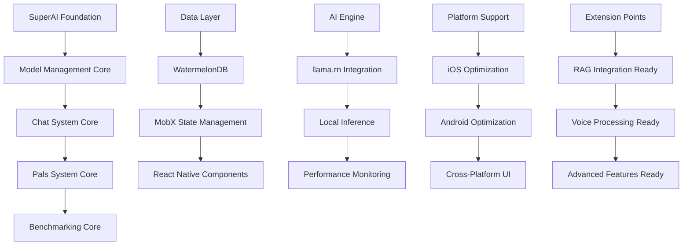

# Foundation Architecture Integration Plan - Original PocketPal AI Core to SuperAI

## 📋 Executive Summary

**Integration Target**: Original PocketPal AI foundation architecture into SuperAI  
**Priority**: CRITICAL - Foundation requirement for all other integrations  
**Complexity**: 🔴 High - Core architectural decisions affecting all components  
**Timeline**: 6-8 weeks for complete foundation implementation  
**Impact**: Establishes SuperAI foundation with proven model management, chat system, and cross-platform capabilities

This plan details the integration of the robust original PocketPal AI architecture as the foundation for SuperAI, preserving its strengths while preparing for advanced features like RAG, voice processing, and platform optimizations.

## 🏗️ Foundation Architecture Framework

### Core System Integration Flow


### Foundation Architecture Framework
```typescript
interface SuperAIFoundationArchitecture {
  // Core model management
  modelManagement: {
    modelStore: ModelManagementService;
    inferenceEngine: LocalInferenceService;
    huggingFaceIntegration: HuggingFaceService;
    modelValidation: ModelValidationService;
  };
  
  // Chat system foundation
  chatSystem: {
    sessionManager: ChatSessionService;
    messageSystem: MessageManagementService;
    realTimeInference: InferenceOrchestrator;
    multimodalSupport: MultimodalService;
  };
  
  // Personalization system
  personalizationSystem: {
    palsManager: PalsManagementService;
    assistantPals: AssistantPalService;
    roleplayPals: RoleplayPalService;
    videoPals: VideoPalService;
  };
  
  // Performance and monitoring
  performanceSystem: {
    benchmarkingService: BenchmarkingService;
    performanceMonitor: PerformanceTrackingService;
    resourceManager: ResourceOptimizationService;
    metricsCollector: MetricsCollectionService;
  };
  
  // Extension architecture
  extensionArchitecture: {
    ragIntegrationPoints: RAGExtensionInterface;
    voiceIntegrationPoints: VoiceExtensionInterface;
    optimizationPoints: PerformanceExtensionInterface;
    platformExtensions: PlatformExtensionInterface;
  };
}
```

## 🛠️ Implementation Strategy

### Phase 1: Core Foundation Setup (Week 1-2)

#### 1.1 Model Management Foundation
```typescript
// SuperAI Model Management Core
class SuperAIModelManager {
  private modelStore: ModelStore;
  private inferenceEngine: LlamaInferenceEngine;
  private downloadManager: ModelDownloadManager;
  private validationService: ModelValidationService;
  
  async initializeModelManagement(): Promise<ModelManagerInitResult> {
    // 1. Initialize model store with SuperAI enhancements
    await this.initializeEnhancedModelStore();
    
    // 2. Setup inference engine with monitoring
    await this.setupInferenceEngine();
    
    // 3. Configure Hugging Face integration
    await this.setupHuggingFaceIntegration();
    
    // 4. Setup extension points for RAG and voice
    await this.setupModelExtensionPoints();
    
    return {
      modelsAvailable: await this.getAvailableModels(),
      inferenceReady: this.inferenceEngine.isReady(),
      extensionPointsReady: true,
      totalMemoryAllocated: await this.getMemoryUsage()
    };
  }
  
  private async initializeEnhancedModelStore(): Promise<void> {
    this.modelStore = new EnhancedModelStore({
      // Preserve original capabilities
      huggingFaceIntegration: true,
      localModelManagement: true,
      multiModelSupport: true,
      
      // Add SuperAI enhancements
      ragModelSupport: true,
      voiceModelSupport: true,
      optimizedMemoryManagement: true,
      extensionArchitecture: true
    });
    
    // Register SuperAI-specific model types
    this.modelStore.registerModelType('rag-optimized', {
      requiredCapabilities: ['embedding-generation', 'context-aware'],
      memoryOptimization: 'high',
      cachingStrategy: 'embedding-cache'
    });
    
    this.modelStore.registerModelType('voice-optimized', {
      requiredCapabilities: ['audio-processing', 'speech-to-text'],
      memoryOptimization: 'moderate',
      cachingStrategy: 'audio-buffer'
    });
  }
  
  async loadModelWithExtensions(
    modelId: string, 
    extensions: ModelExtension[]
  ): Promise<ExtendedModelHandle> {
    // Load base model using original proven logic
    const baseModel = await this.inferenceEngine.loadModel(modelId);
    
    // Apply SuperAI extensions
    const extendedModel = new ExtendedModelHandle(baseModel);
    
    for (const extension of extensions) {
      switch (extension.type) {
        case 'rag':
          await this.attachRAGCapabilities(extendedModel, extension.config);
          break;
        case 'voice':
          await this.attachVoiceCapabilities(extendedModel, extension.config);
          break;
        case 'optimization':
          await this.attachOptimizations(extendedModel, extension.config);
          break;
      }
    }
    
    return extendedModel;
  }
  
  private async attachRAGCapabilities(
    model: ExtendedModelHandle, 
    config: RAGExtensionConfig
  ): Promise<void> {
    // Prepare model for RAG integration
    model.addCapability('embedding-generation', {
      embeddingDimensions: config.embeddingDimensions,
      maxContextLength: config.maxContextLength,
      chunkingStrategy: config.chunkingStrategy
    });
    
    // Setup vector storage integration points
    model.addIntegrationPoint('vector-store', {
      interface: 'VectorStoreInterface',
      capabilities: ['similarity-search', 'context-retrieval']
    });
  }
}
```

#### 1.2 Enhanced Chat System Foundation
```typescript
// SuperAI Chat System Core
class SuperAIChatManager {
  private chatSessionStore: ChatSessionStore;
  private messageProcessor: MessageProcessor;
  private inferenceOrchestrator: InferenceOrchestrator;
  private multimodalHandler: MultimodalHandler;
  
  async initializeChatSystem(): Promise<ChatSystemInitResult> {
    // 1. Setup enhanced session management
    await this.initializeSessionManagement();
    
    // 2. Configure message processing with extensions
    await this.initializeMessageProcessing();
    
    // 3. Setup inference orchestration
    await this.initializeInferenceOrchestration();
    
    // 4. Prepare multimodal capabilities
    await this.initializeMultimodalSupport();
    
    return {
      sessionManagerReady: true,
      messageProcessingReady: true,
      inferenceReady: true,
      multimodalReady: true,
      extensionPointsConfigured: true
    };
  }
  
  private async initializeSessionManagement(): Promise<void> {
    this.chatSessionStore = new EnhancedChatSessionStore({
      // Preserve original session capabilities
      persistentSessions: true,
      messageHistory: true,
      realTimeUpdates: true,
      
      // Add SuperAI enhancements
      ragContextManagement: true,
      voiceInteractionSupport: true,
      advancedPersonalization: true,
      performanceTracking: true
    });
    
    // Setup extension points for RAG context
    this.chatSessionStore.addExtensionPoint('rag-context', {
      interface: 'RAGContextInterface',
      capabilities: ['document-retrieval', 'context-injection']
    });
    
    // Setup extension points for voice
    this.chatSessionStore.addExtensionPoint('voice-interaction', {
      interface: 'VoiceInteractionInterface',
      capabilities: ['speech-to-text', 'text-to-speech', 'voice-commands']
    });
  }
  
  async processMessageWithExtensions(
    sessionId: string,
    message: EnhancedMessage,
    processingOptions: MessageProcessingOptions
  ): Promise<MessageProcessingResult> {
    // Use original message processing as foundation
    const baseResult = await this.messageProcessor.processMessage(message);
    
    // Apply SuperAI extensions based on message type and options
    if (processingOptions.enableRAG) {
      const ragContext = await this.retrieveRAGContext(message);
      baseResult.context = { ...baseResult.context, ...ragContext };
    }
    
    if (processingOptions.enableVoice && message.hasAudio) {
      const voiceProcessing = await this.processVoiceInput(message);
      baseResult.voiceData = voiceProcessing;
    }
    
    // Generate response with enhanced context
    const response = await this.inferenceOrchestrator.generateResponse({
      message: baseResult.processedMessage,
      context: baseResult.context,
      sessionHistory: await this.chatSessionStore.getSessionHistory(sessionId),
      extensionData: baseResult.extensionData
    });
    
    return {
      processedMessage: baseResult.processedMessage,
      generatedResponse: response,
      processingMetrics: baseResult.metrics,
      extensionResults: baseResult.extensionData
    };
  }
}
```

### Phase 2: Pals System Enhancement (Week 3-4)

#### 2.1 Enhanced Personalization Framework
```typescript
// SuperAI Pals System with Extensions
class SuperAIPalsManager {
  private palsStore: EnhancedPalsStore;
  private assistantPalService: AssistantPalService;
  private roleplayPalService: RoleplayPalService;
  private videoPalService: VideoPalService;
  
  async initializePalsSystem(): Promise<PalsSystemInitResult> {
    // 1. Setup enhanced pals store
    await this.initializeEnhancedPalsStore();
    
    // 2. Configure assistant pals with RAG capabilities
    await this.initializeAssistantPals();
    
    // 3. Setup roleplay pals with advanced personality
    await this.initializeRoleplayPals();
    
    // 4. Configure video pals with multimodal support
    await this.initializeVideoPals();
    
    return {
      assistantPalsReady: true,
      roleplayPalsReady: true,
      videoPalsReady: true,
      ragIntegrationReady: true,
      voiceIntegrationReady: true
    };
  }
  
  async createRAGEnabledAssistantPal(
    palConfig: AssistantPalConfig,
    ragConfig: RAGPalConfiguration
  ): Promise<RAGEnabledPal> {
    // Create base assistant pal using original system
    const basePal = await this.assistantPalService.createAssistantPal(palConfig);
    
    // Enhance with RAG capabilities
    const ragEnabledPal = new RAGEnabledPal(basePal, {
      documentSources: ragConfig.documentSources,
      embeddingModel: ragConfig.embeddingModel,
      retrievalStrategy: ragConfig.retrievalStrategy,
      contextWindow: ragConfig.contextWindow
    });
    
    // Setup knowledge base integration
    await ragEnabledPal.initializeKnowledgeBase({
      vectorStore: ragConfig.vectorStore,
      indexingStrategy: ragConfig.indexingStrategy,
      updatePolicy: ragConfig.updatePolicy
    });
    
    return ragEnabledPal;
  }
  
  async createVoiceEnabledRoleplayPal(
    palConfig: RoleplayPalConfig,
    voiceConfig: VoicePalConfiguration
  ): Promise<VoiceEnabledPal> {
    // Create base roleplay pal
    const basePal = await this.roleplayPalService.createRoleplayPal(palConfig);
    
    // Enhance with voice capabilities
    const voiceEnabledPal = new VoiceEnabledPal(basePal, {
      voicePersonality: voiceConfig.voicePersonality,
      speechPatterns: voiceConfig.speechPatterns,
      emotionalRange: voiceConfig.emotionalRange,
      responseStyle: voiceConfig.responseStyle
    });
    
    // Setup voice processing pipeline
    await voiceEnabledPal.initializeVoiceProcessing({
      speechToText: voiceConfig.speechToText,
      textToSpeech: voiceConfig.textToSpeech,
      voiceCommands: voiceConfig.voiceCommands
    });
    
    return voiceEnabledPal;
  }
}
```

### Phase 3: Performance Foundation (Week 5-6)

#### 3.1 Enhanced Benchmarking and Monitoring
```typescript
// SuperAI Performance Management System
class SuperAIPerformanceManager {
  private benchmarkingService: EnhancedBenchmarkingService;
  private performanceMonitor: PerformanceMonitor;
  private resourceOptimizer: ResourceOptimizer;
  private metricsCollector: MetricsCollector;
  
  async initializePerformanceSystem(): Promise<PerformanceSystemInitResult> {
    // 1. Setup enhanced benchmarking
    await this.initializeBenchmarking();
    
    // 2. Configure real-time performance monitoring
    await this.initializePerformanceMonitoring();
    
    // 3. Setup resource optimization
    await this.initializeResourceOptimization();
    
    // 4. Configure metrics collection
    await this.initializeMetricsCollection();
    
    return {
      benchmarkingReady: true,
      monitoringActive: true,
      optimizationEnabled: true,
      metricsCollectionActive: true
    };
  }
  
  async runComprehensiveBenchmark(
    testSuite: BenchmarkTestSuite
  ): Promise<ComprehensiveBenchmarkResult> {
    const results: ComprehensiveBenchmarkResult = {
      baselinePerformance: {},
      ragPerformance: {},
      voicePerformance: {},
      optimizationImpact: {},
      deviceMetrics: {},
      recommendations: []
    };
    
    // Run baseline performance tests (original PocketPal capabilities)
    results.baselinePerformance = await this.benchmarkingService.runBaselineTests({
      modelLoading: true,
      inferenceSpeed: true,
      memoryUsage: true,
      chatResponseTime: true
    });
    
    // Test RAG performance enhancements
    if (testSuite.includeRAG) {
      results.ragPerformance = await this.benchmarkRAGCapabilities({
        documentIndexing: true,
        embeddingGeneration: true,
        vectorSearch: true,
        contextRetrieval: true,
        augmentedInference: true
      });
    }
    
    // Test voice processing performance
    if (testSuite.includeVoice) {
      results.voicePerformance = await this.benchmarkVoiceCapabilities({
        speechToText: true,
        textToSpeech: true,
        voiceCommands: true,
        realTimeProcessing: true
      });
    }
    
    // Analyze optimization impact
    results.optimizationImpact = await this.analyzeOptimizationImpact(results);
    
    // Generate recommendations
    results.recommendations = await this.generatePerformanceRecommendations(results);
    
    return results;
  }
  
  private async benchmarkRAGCapabilities(
    ragTests: RAGBenchmarkConfig
  ): Promise<RAGPerformanceMetrics> {
    const metrics: RAGPerformanceMetrics = {};
    
    if (ragTests.documentIndexing) {
      metrics.indexingSpeed = await this.measureDocumentIndexingSpeed();
      metrics.indexingMemoryUsage = await this.measureIndexingMemoryUsage();
    }
    
    if (ragTests.vectorSearch) {
      metrics.searchLatency = await this.measureVectorSearchLatency();
      metrics.searchAccuracy = await this.measureSearchAccuracy();
    }
    
    if (ragTests.augmentedInference) {
      metrics.augmentedResponseTime = await this.measureAugmentedInferenceTime();
      metrics.contextUtilization = await this.measureContextUtilization();
    }
    
    return metrics;
  }
}
```

### Phase 4: Extension Architecture (Week 7-8)

#### 4.1 Future-Ready Extension Framework
```typescript
// SuperAI Extension Architecture
class SuperAIExtensionFramework {
  private extensionRegistry: ExtensionRegistry;
  private integrationPoints: Map<string, IntegrationPoint>;
  private extensionLoader: ExtensionLoader;
  
  async initializeExtensionFramework(): Promise<ExtensionFrameworkInitResult> {
    // 1. Setup extension registry
    await this.initializeExtensionRegistry();
    
    // 2. Configure integration points
    await this.setupIntegrationPoints();
    
    // 3. Load core extensions
    await this.loadCoreExtensions();
    
    return {
      registryReady: true,
      integrationPointsConfigured: true,
      coreExtensionsLoaded: true,
      availableExtensions: await this.getAvailableExtensions()
    };
  }
  
  private async setupIntegrationPoints(): Promise<void> {
    // RAG Integration Points
    this.integrationPoints.set('rag-document-processing', {
      interface: 'DocumentProcessingInterface',
      capabilities: ['chunking', 'embedding', 'indexing'],
      extensionType: 'rag'
    });
    
    this.integrationPoints.set('rag-vector-storage', {
      interface: 'VectorStorageInterface',
      capabilities: ['storage', 'similarity-search', 'metadata-filtering'],
      extensionType: 'rag'
    });
    
    // Voice Integration Points
    this.integrationPoints.set('voice-speech-to-text', {
      interface: 'SpeechToTextInterface',
      capabilities: ['transcription', 'language-detection', 'noise-reduction'],
      extensionType: 'voice'
    });
    
    this.integrationPoints.set('voice-text-to-speech', {
      interface: 'TextToSpeechInterface',
      capabilities: ['synthesis', 'voice-cloning', 'emotion-modeling'],
      extensionType: 'voice'
    });
    
    // Platform Optimization Points
    this.integrationPoints.set('ios-neural-engine', {
      interface: 'NeuralEngineInterface',
      capabilities: ['model-acceleration', 'memory-optimization'],
      extensionType: 'platform-optimization'
    });
    
    this.integrationPoints.set('android-gpu-acceleration', {
      interface: 'GPUAccelerationInterface',
      capabilities: ['gpu-inference', 'memory-management'],
      extensionType: 'platform-optimization'
    });
  }
  
  async loadExtension(
    extensionId: string,
    integrationPointId: string,
    config: ExtensionConfig
  ): Promise<LoadedExtension> {
    // Validate extension compatibility
    const integrationPoint = this.integrationPoints.get(integrationPointId);
    if (!integrationPoint) {
      throw new Error(`Integration point ${integrationPointId} not found`);
    }
    
    // Load and configure extension
    const extension = await this.extensionLoader.loadExtension(extensionId, config);
    
    // Verify interface compatibility
    await this.verifyExtensionCompatibility(extension, integrationPoint);
    
    // Register extension
    await this.extensionRegistry.registerExtension(extension, integrationPointId);
    
    return {
      extension,
      integrationPoint: integrationPointId,
      capabilities: await extension.getCapabilities(),
      status: 'loaded'
    };
  }
}
```

## 🔧 Database Schema Enhancement

### Enhanced WatermelonDB Schema
```typescript
// SuperAI Enhanced Database Schema
interface SuperAIDatabase extends OriginalPocketPalDatabase {
  // Original tables (preserved)
  chatSessions: ChatSession[];
  messages: Message[];
  completionSettings: CompletionSetting[];
  globalSettings: GlobalSetting[];
  
  // SuperAI enhancements
  ragDocuments: RAGDocument[];
  vectorEmbeddings: VectorEmbedding[];
  voiceInteractions: VoiceInteraction[];
  performanceMetrics: PerformanceMetric[];
  extensionConfigs: ExtensionConfig[];
  palEnhancements: PalEnhancement[];
}

interface RAGDocument {
  id: string;
  title: string;
  content: string;
  chunks: DocumentChunk[];
  embeddingIds: string[];
  metadata: object;
  indexedAt: Date;
  lastUpdated: Date;
}

interface VoiceInteraction {
  id: string;
  sessionId: string;
  audioData: string; // base64 or file path
  transcription: string;
  voiceCommand?: VoiceCommand;
  processingTime: number;
  timestamp: Date;
}

interface PerformanceMetric {
  id: string;
  metricType: 'inference' | 'rag' | 'voice' | 'system';
  value: number;
  unit: string;
  context: object;
  timestamp: Date;
}
```

## 📱 Platform Foundation Setup

### iOS Foundation Enhancements
```typescript
// iOS-Specific Foundation Enhancements
class SuperAI_iOS_Foundation {
  async setupiOSFoundation(): Promise<iOSFoundationResult> {
    // 1. Configure Core ML integration points
    await this.setupCorMLIntegrationPoints();
    
    // 2. Prepare Neural Engine access
    await this.prepareNeuralEngineAccess();
    
    // 3. Setup iOS-specific optimizations
    await this.setupiOSOptimizations();
    
    // 4. Configure ecosystem integration points
    await this.setupEcosystemIntegration();
    
    return {
      coreMLReady: true,
      neuralEngineAccessible: await this.checkNeuralEngineAvailability(),
      optimizationsActive: true,
      ecosystemIntegrationReady: true
    };
  }
  
  private async setupCorMLIntegrationPoints(): Promise<void> {
    // Prepare for Core ML model optimization
    // Setup conversion pipeline for llama.rn -> Core ML
    // Configure memory management for Core ML models
  }
}
```

### Android Foundation Enhancements
```typescript
// Android-Specific Foundation Enhancements  
class SuperAI_Android_Foundation {
  async setupAndroidFoundation(): Promise<AndroidFoundationResult> {
    // 1. Configure GPU acceleration points
    await this.setupGPUAccelerationPoints();
    
    // 2. Prepare NPU access (if available)
    await this.prepareNPUAccess();
    
    // 3. Setup Android-specific optimizations
    await this.setupAndroidOptimizations();
    
    // 4. Configure system integration points
    await this.setupSystemIntegration();
    
    return {
      gpuAccelerationReady: true,
      npuAccessible: await this.checkNPUAvailability(),
      optimizationsActive: true,
      systemIntegrationReady: true
    };
  }
}
```

## 📊 Testing and Quality Assurance

### Comprehensive Testing Framework
```typescript
// SuperAI Foundation Testing Suite
class SuperAIFoundationTestSuite {
  async runFoundationTests(): Promise<FoundationTestResults> {
    const results: FoundationTestResults = {
      modelManagementTests: await this.testModelManagement(),
      chatSystemTests: await this.testChatSystem(),
      palsSystemTests: await this.testPalsSystem(),
      performanceTests: await this.testPerformanceFramework(),
      extensionTests: await this.testExtensionFramework(),
      integrationTests: await this.testCrossComponentIntegration()
    };
    
    return results;
  }
  
  private async testModelManagement(): Promise<ModelManagementTestResults> {
    return {
      modelLoading: await this.testModelLoading(),
      huggingFaceIntegration: await this.testHuggingFaceIntegration(),
      modelValidation: await this.testModelValidation(),
      memoryManagement: await this.testModelMemoryManagement(),
      extensionSupport: await this.testModelExtensionSupport()
    };
  }
  
  private async testExtensionFramework(): Promise<ExtensionTestResults> {
    return {
      ragExtensionPoints: await this.testRAGExtensionPoints(),
      voiceExtensionPoints: await this.testVoiceExtensionPoints(),
      platformExtensionPoints: await this.testPlatformExtensionPoints(),
      extensionCompatibility: await this.testExtensionCompatibility()
    };
  }
}
```

## 🎯 Success Metrics and Monitoring

### Foundation Health Monitoring
```typescript
// SuperAI Foundation Health Monitor
class SuperAIFoundationHealthMonitor {
  async monitorFoundationHealth(): Promise<FoundationHealthReport> {
    return {
      coreStability: await this.assessCoreStability(),
      performanceBaseline: await this.measurePerformanceBaseline(),
      memoryEfficiency: await this.assessMemoryEfficiency(),
      extensionReadiness: await this.assessExtensionReadiness(),
      platformCompatibility: await this.assessPlatformCompatibility(),
      
      recommendations: await this.generateHealthRecommendations()
    };
  }
  
  private async assessCoreStability(): Promise<StabilityMetrics> {
    return {
      modelLoadingStability: await this.measureModelLoadingStability(),
      chatSystemStability: await this.measureChatSystemStability(),
      inferenceStability: await this.measureInferenceStability(),
      memoryStability: await this.measureMemoryStability()
    };
  }
}
```

## 📋 Implementation Checklist

### Phase 1: Core Foundation (Week 1-2)
- [ ] **Model Management Core**
  - [ ] Enhanced ModelStore with extension points
  - [ ] Hugging Face integration with SuperAI enhancements
  - [ ] Model validation with security checks
  - [ ] Memory optimization framework
  
- [ ] **Chat System Foundation**
  - [ ] Enhanced ChatSessionStore
  - [ ] Message processing with extension support
  - [ ] Inference orchestration framework
  - [ ] Real-time performance monitoring

### Phase 2: Pals System Enhancement (Week 3-4)
- [ ] **Enhanced Pals Framework**
  - [ ] RAG-enabled assistant pals
  - [ ] Voice-enabled roleplay pals
  - [ ] Multimodal video pals
  - [ ] Advanced personalization engine

### Phase 3: Performance Foundation (Week 5-6)
- [ ] **Benchmarking and Monitoring**
  - [ ] Comprehensive benchmark suite
  - [ ] Real-time performance monitoring
  - [ ] Resource optimization framework
  - [ ] Metrics collection and analysis

### Phase 4: Extension Architecture (Week 7-8)
- [ ] **Extension Framework**
  - [ ] Extension registry and loader
  - [ ] Integration point configuration
  - [ ] Compatibility verification system
  - [ ] Extension lifecycle management

## 🚀 Next Steps and Integration Readiness

This foundation architecture integration establishes SuperAI's core capabilities while preparing for advanced features:

1. **RAG Integration Ready**: Extension points configured for document processing and vector storage
2. **Voice Processing Ready**: Integration points prepared for speech-to-text and text-to-speech
3. **Platform Optimization Ready**: Foundation prepared for iOS Neural Engine and Android GPU acceleration
4. **Performance Monitoring Ready**: Comprehensive benchmarking and monitoring framework
5. **Security Ready**: Enhanced privacy and security framework foundation

The foundation preserves all proven capabilities from the original PocketPal AI while creating a robust, extensible architecture for SuperAI's advanced features.

---

**Document Version**: 1.0  
**Last Updated**: June 23, 2025  
**Implementation Status**: Ready for Development  
**Integration Priority**: CRITICAL - Must be completed before other integrations