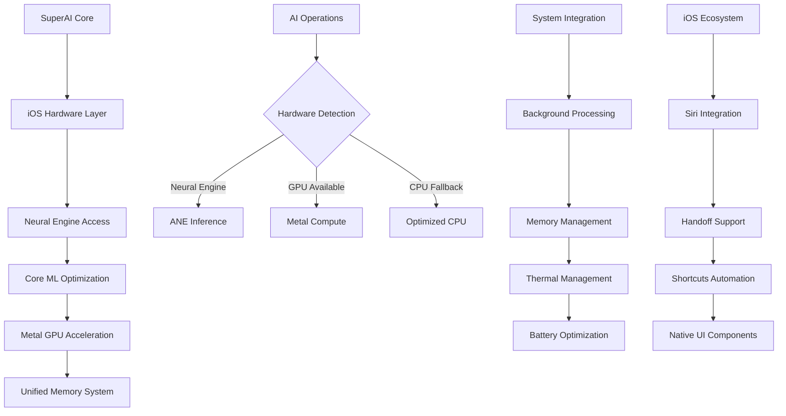

# iOS Optimization Integration Plan - Keeeeeeeks Platform Excellence to SuperAI

## 📋 Executive Summary

**Integration Target**: Keeeeeeeks comprehensive iOS optimization patterns into PocketPal SuperAI  
**Priority**: HIGH - iOS platform excellence and market differentiation  
**Complexity**: 🔴 High - Platform-specific native module development and hardware integration  
**Timeline**: 4-6 weeks for complete iOS optimization implementation  
**Impact**: Transforms SuperAI into premium iOS AI assistant with hardware-accelerated performance

This plan details the integration of comprehensive iOS platform optimizations from Keeeeeeeks fork, creating a premier iOS AI assistant experience that leverages Apple's Neural Engine, Metal GPU, Core ML, and ecosystem integration for maximum performance and user satisfaction.

## 🏗️ iOS Hardware-Accelerated Architecture

### Neural Engine and GPU Integration Flow


### Hardware-Optimized AI Framework
```typescript
interface SuperAIiOSOptimizedFramework {
  // Hardware acceleration
  hardwareAcceleration: {
    neuralEngine: NeuralEngineService;
    metalGPU: MetalPerformanceService;
    coreML: CoreMLOptimizationService;
    unifiedMemory: UnifiedMemoryManager;
  };
  
  // System integration
  systemIntegration: {
    siriShortcuts: SiriIntegrationService;
    handoffContinuity: HandoffService;
    backgroundProcessing: BackgroundTaskService;
    systemServices: iOSSystemService;
  };
  
  // Performance optimization
  performanceOptimization: {
    memoryManager: iOSMemoryOptimizer;
    batteryOptimizer: BatteryEfficiencyService;
    thermalManager: ThermalStateService;
    performanceMonitor: iOSPerformanceTracker;
  };
  
  // Native experience
  nativeExperience: {
    uiComponents: NativeiOSComponents;
    hapticFeedback: HapticFeedbackService;
    accessibility: AccessibilityOptimizer;
    designSystem: iOSDesignSystemAdapter;
  };
}
```

## 🛠️ Implementation Strategy

### Phase 1: Core Hardware Acceleration (Week 1-2)

#### 1.1 Neural Engine Integration Service
```typescript
// SuperAI Neural Engine Optimization Service
class SuperAINeuralEngineService {
  private isNeuralEngineAvailable: boolean = false;
  private coreMLModels: Map<string, CoreMLModelWrapper> = new Map();
  private modelPerformanceCache: Map<string, PerformanceMetrics> = new Map();
  
  async initializeNeuralEngine(): Promise<NeuralEngineInitResult> {
    // 1. Check Neural Engine availability
    this.isNeuralEngineAvailable = await this.checkNeuralEngineSupport();
    
    // 2. Initialize Core ML with Neural Engine configuration
    if (this.isNeuralEngineAvailable) {
      await this.setupNeuralEngineOptimization();
    }
    
    // 3. Preload essential models for Neural Engine
    await this.preloadEssentialModels();
    
    // 4. Setup performance monitoring
    await this.setupPerformanceMonitoring();
    
    return {
      neuralEngineAvailable: this.isNeuralEngineAvailable,
      modelsPreloaded: this.coreMLModels.size,
      expectedPerformanceGain: this.isNeuralEngineAvailable ? '5-10x' : '1x',
      optimalModelFormats: ['mlpackage', 'mlmodelc']
    };
  }
  
  async optimizeModelForNeuralEngine(
    modelPath: string, 
    optimizationOptions: ModelOptimizationOptions
  ): Promise<OptimizedModel> {
    if (!this.isNeuralEngineAvailable) {
      return await this.fallbackOptimization(modelPath, optimizationOptions);
    }
    
    // 1. Convert model to Neural Engine compatible format
    const neuralEngineModel = await this.convertToNeuralEngineFormat(modelPath);
    
    // 2. Apply Neural Engine specific optimizations
    const optimizedModel = await this.applyNeuralEngineOptimizations(
      neuralEngineModel, 
      optimizationOptions
    );
    
    // 3. Benchmark performance on Neural Engine
    const performanceMetrics = await this.benchmarkNeuralEnginePerformance(optimizedModel);
    
    // 4. Cache optimized model
    this.coreMLModels.set(modelPath, optimizedModel);
    this.modelPerformanceCache.set(modelPath, performanceMetrics);
    
    return {
      optimizedModel,
      performanceGain: performanceMetrics.inferenceSpeedImprovement,
      memoryEfficiency: performanceMetrics.memoryUsageReduction,
      powerEfficiency: performanceMetrics.powerConsumptionReduction,
      recommendedUsage: this.getRecommendedUsagePattern(performanceMetrics)
    };
  }
  
  async runInferenceWithNeuralEngine<T>(
    modelId: string,
    input: ModelInput,
    inferenceOptions: InferenceOptions = {}
  ): Promise<NeuralEngineInferenceResult<T>> {
    const model = this.coreMLModels.get(modelId);
    if (!model) {
      throw new Error(`Model not loaded: ${modelId}`);
    }
    
    const startTime = performance.now();
    
    try {
      // 1. Preprocess input for Neural Engine
      const neuralEngineInput = await this.preprocessForNeuralEngine(input, model);
      
      // 2. Run inference on Neural Engine
      const rawOutput = await model.predict(neuralEngineInput, {
        computeUnits: 'neuralEngine',
        allowLowPrecisionAccumulationOnGPU: true,
        ...inferenceOptions
      });
      
      // 3. Postprocess output
      const processedOutput = await this.postprocessNeuralEngineOutput<T>(rawOutput, model);
      
      const endTime = performance.now();
      const inferenceTime = endTime - startTime;
      
      // 4. Update performance statistics
      await this.updatePerformanceStats(modelId, inferenceTime);
      
      return {
        result: processedOutput,
        inferenceTime,
        computeUnit: 'neuralEngine',
        confidence: this.calculateConfidence(rawOutput),
        powerUsage: await this.estimatePowerUsage(inferenceTime),
        memoryUsage: await this.getCurrentMemoryUsage()
      };
      
    } catch (error) {
      // Fallback to GPU/CPU if Neural Engine fails
      console.warn('Neural Engine inference failed, falling back to GPU:', error);
      return await this.fallbackInference<T>(modelId, input, inferenceOptions);
    }
  }
  
  private async convertToNeuralEngineFormat(modelPath: string): Promise<CoreMLModelWrapper> {
    // Use Core ML tools to optimize model for Neural Engine
    const optimizationConfig = {
      computeUnits: ['neuralEngine', 'cpuAndGPU'], // Prefer Neural Engine
      quantization: '16bit', // Neural Engine supports 16-bit quantization
      optimization: 'size', // Optimize for model size and speed
      targetVersion: 'iOS15' // Latest Neural Engine features
    };
    
    return await CoreMLModelConverter.convert(modelPath, optimizationConfig);
  }
  
  private async applyNeuralEngineOptimizations(
    model: CoreMLModelWrapper,
    options: ModelOptimizationOptions
  ): Promise<CoreMLModelWrapper> {
    const optimizations = [
      // Quantization for Neural Engine
      () => this.applyNeuralEngineQuantization(model, options.quantizationLevel),
      
      // Graph optimization for Neural Engine operations
      () => this.optimizeGraphForNeuralEngine(model),
      
      // Memory layout optimization
      () => this.optimizeMemoryLayoutForNeuralEngine(model),
      
      // Batch size optimization
      () => this.optimizeBatchSizeForNeuralEngine(model, options.expectedBatchSize)
    ];
    
    let optimizedModel = model;
    for (const optimization of optimizations) {
      optimizedModel = await optimization();
    }
    
    return optimizedModel;
  }
}
```

#### 1.2 Metal GPU Performance Service
```typescript
// SuperAI Metal GPU Acceleration Service
class SuperAIMetalPerformanceService {
  private metalDevice: MetalDevice | null = null;
  private commandQueue: MetalCommandQueue | null = null;
  private computeLibrary: MetalLibrary | null = null;
  private vectorOperationKernels: Map<string, MetalComputeKernel> = new Map();
  
  async initializeMetalGPU(): Promise<MetalInitResult> {
    // 1. Initialize Metal device
    this.metalDevice = await this.getOptimalMetalDevice();
    
    if (!this.metalDevice) {
      return { success: false, error: 'Metal not available' };
    }
    
    // 2. Create command queue
    this.commandQueue = this.metalDevice.makeCommandQueue();
    
    // 3. Load compute shaders
    this.computeLibrary = await this.loadOptimizedComputeShaders();
    
    // 4. Initialize vector operation kernels
    await this.initializeVectorKernels();
    
    // 5. Benchmark GPU performance
    const benchmarkResults = await this.benchmarkGPUPerformance();
    
    return {
      success: true,
      deviceName: this.metalDevice.name,
      maxThreadsPerGroup: this.metalDevice.maxThreadsPerThreadgroup,
      memorySize: this.metalDevice.recommendedMaxWorkingSetSize,
      performanceBenchmark: benchmarkResults
    };
  }
  
  async optimizeVectorOperations(
    operation: VectorOperation,
    vectorA: Float32Array,
    vectorB?: Float32Array
  ): Promise<VectorOperationResult> {
    if (!this.metalDevice || !this.commandQueue) {
      throw new Error('Metal GPU not initialized');
    }
    
    const operationKernel = this.vectorOperationKernels.get(operation.type);
    if (!operationKernel) {
      throw new Error(`Unsupported operation: ${operation.type}`);
    }
    
    const startTime = performance.now();
    
    try {
      // 1. Create Metal buffers
      const bufferA = this.createMetalBuffer(vectorA);
      const bufferB = vectorB ? this.createMetalBuffer(vectorB) : null;
      const resultBuffer = this.createResultBuffer(operation, vectorA.length);
      
      // 2. Create compute command encoder
      const commandBuffer = this.commandQueue.makeCommandBuffer();
      const computeEncoder = commandBuffer.makeComputeCommandEncoder();
      
      // 3. Configure compute pipeline
      computeEncoder.setComputePipelineState(operationKernel.pipelineState);
      computeEncoder.setBuffer(bufferA, 0, 0);
      
      if (bufferB) {
        computeEncoder.setBuffer(bufferB, 0, 1);
      }
      
      computeEncoder.setBuffer(resultBuffer, 0, bufferB ? 2 : 1);
      
      // 4. Dispatch threads
      const threadsPerGroup = operationKernel.optimalThreadsPerGroup;
      const threadgroupsPerGrid = Math.ceil(vectorA.length / threadsPerGroup);
      
      computeEncoder.dispatchThreadgroups(
        { width: threadgroupsPerGrid, height: 1, depth: 1 },
        { width: threadsPerGroup, height: 1, depth: 1 }
      );
      
      computeEncoder.endEncoding();
      
      // 5. Execute and wait for completion
      commandBuffer.commit();
      await commandBuffer.waitUntilCompleted();
      
      // 6. Extract results
      const result = this.extractResultFromBuffer(resultBuffer, operation);
      
      const endTime = performance.now();
      const executionTime = endTime - startTime;
      
      return {
        result,
        executionTime,
        performanceGain: await this.calculatePerformanceGain(operation, executionTime),
        memoryUsage: this.calculateMemoryUsage([bufferA, bufferB, resultBuffer]),
        powerEstimate: await this.estimateGPUPowerUsage(executionTime)
      };
      
    } catch (error) {
      console.error('Metal GPU operation failed:', error);
      return await this.fallbackToRCPUOperation(operation, vectorA, vectorB);
    }
  }
  
  async optimizeRAGVectorSearch(
    queryVector: Float32Array,
    documentVectors: Float32Array[],
    searchOptions: VectorSearchOptions
  ): Promise<RAGSearchResult[]> {
    if (!this.metalDevice || !this.commandQueue) {
      return await this.fallbackVectorSearch(queryVector, documentVectors, searchOptions);
    }
    
    const batchSize = Math.min(searchOptions.batchSize || 1000, documentVectors.length);
    const results: RAGSearchResult[] = [];
    
    // Process in batches for optimal GPU utilization
    for (let i = 0; i < documentVectors.length; i += batchSize) {
      const batch = documentVectors.slice(i, i + batchSize);
      
      const batchResults = await this.processBatchVectorSearch(
        queryVector,
        batch,
        searchOptions,
        i // offset for result indexing
      );
      
      results.push(...batchResults);
    }
    
    // Sort by similarity and return top k
    results.sort((a, b) => b.similarity - a.similarity);
    return results.slice(0, searchOptions.topK || 10);
  }
  
  private async processBatchVectorSearch(
    queryVector: Float32Array,
    batchVectors: Float32Array[],
    options: VectorSearchOptions,
    indexOffset: number
  ): Promise<RAGSearchResult[]> {
    // 1. Flatten batch vectors for GPU processing
    const flattenedBatch = this.flattenVectorBatch(batchVectors);
    
    // 2. Create GPU buffers
    const queryBuffer = this.createMetalBuffer(queryVector);
    const batchBuffer = this.createMetalBuffer(flattenedBatch);
    const similarityBuffer = this.createFloatBuffer(batchVectors.length);
    
    // 3. Execute batch similarity computation on GPU
    const kernel = this.vectorOperationKernels.get('batch_cosine_similarity');
    const commandBuffer = this.commandQueue!.makeCommandBuffer();
    const computeEncoder = commandBuffer.makeComputeCommandEncoder();
    
    computeEncoder.setComputePipelineState(kernel!.pipelineState);
    computeEncoder.setBuffer(queryBuffer, 0, 0);
    computeEncoder.setBuffer(batchBuffer, 0, 1);
    computeEncoder.setBuffer(similarityBuffer, 0, 2);
    computeEncoder.setBytes([batchVectors.length, queryVector.length], 3);
    
    const threadsPerGroup = 256; // Optimal for most iOS GPUs
    const threadgroups = Math.ceil(batchVectors.length / threadsPerGroup);
    
    computeEncoder.dispatchThreadgroups(
      { width: threadgroups, height: 1, depth: 1 },
      { width: threadsPerGroup, height: 1, depth: 1 }
    );
    
    computeEncoder.endEncoding();
    commandBuffer.commit();
    await commandBuffer.waitUntilCompleted();
    
    // 4. Extract and format results
    const similarities = this.extractFloatArrayFromBuffer(similarityBuffer);
    
    return similarities.map((similarity, index) => ({
      documentIndex: indexOffset + index,
      similarity,
      vector: batchVectors[index],
      metadata: options.includeMetadata ? this.getVectorMetadata(indexOffset + index) : undefined
    }));
  }
  
  private async loadOptimizedComputeShaders(): Promise<MetalLibrary> {
    // Load pre-compiled Metal shaders optimized for iOS AI operations
    const shaderSource = `
      #include <metal_stdlib>
      using namespace metal;
      
      // Optimized cosine similarity for vector search
      kernel void batch_cosine_similarity(
          constant float* query [[buffer(0)]],
          constant float* vectors [[buffer(1)]],
          device float* results [[buffer(2)]],
          constant uint2& params [[buffer(3)]], // [batch_size, vector_dim]
          uint tid [[thread_position_in_grid]]
      ) {
          if (tid >= params.x) return;
          
          uint vector_dim = params.y;
          uint vector_offset = tid * vector_dim;
          
          float dot_product = 0.0;
          float query_magnitude = 0.0;
          float vector_magnitude = 0.0;
          
          for (uint i = 0; i < vector_dim; i++) {
              float q = query[i];
              float v = vectors[vector_offset + i];
              
              dot_product += q * v;
              query_magnitude += q * q;
              vector_magnitude += v * v;
          }
          
          float magnitude_product = sqrt(query_magnitude * vector_magnitude);
          results[tid] = (magnitude_product > 0.0) ? (dot_product / magnitude_product) : 0.0;
      }
      
      // Optimized vector addition for embedding aggregation
      kernel void vector_addition(
          constant float* vectorA [[buffer(0)]],
          constant float* vectorB [[buffer(1)]],
          device float* result [[buffer(2)]],
          uint tid [[thread_position_in_grid]]
      ) {
          result[tid] = vectorA[tid] + vectorB[tid];
      }
      
      // Optimized matrix multiplication for transformer operations
      kernel void matrix_multiply(
          constant float* matrixA [[buffer(0)]],
          constant float* matrixB [[buffer(1)]],
          device float* result [[buffer(2)]],
          constant uint3& dimensions [[buffer(3)]], // [M, N, K]
          uint2 tid [[thread_position_in_grid]]
      ) {
          uint row = tid.y;
          uint col = tid.x;
          
          if (row >= dimensions.x || col >= dimensions.y) return;
          
          float sum = 0.0;
          for (uint k = 0; k < dimensions.z; k++) {
              sum += matrixA[row * dimensions.z + k] * matrixB[k * dimensions.y + col];
          }
          
          result[row * dimensions.y + col] = sum;
      }
    `;
    
    return await this.metalDevice!.makeLibrary(shaderSource);
  }
}
```

### Phase 2: System Integration and Native Experience (Week 3-4)

#### 2.1 Siri Shortcuts and System Integration
```typescript
// SuperAI Siri Integration Service
class SuperAISiriIntegrationService {
  private donatedShortcuts: Map<string, SiriShortcut> = new Map();
  private voiceShortcutManager: VoiceShortcutManager | null = null;
  
  async initializeSiriIntegration(): Promise<SiriIntegrationResult> {
    // 1. Setup Siri Shortcuts framework
    this.voiceShortcutManager = new VoiceShortcutManager();
    
    // 2. Register default AI interaction shortcuts
    await this.registerDefaultShortcuts();
    
    // 3. Setup intent handling
    await this.setupIntentHandling();
    
    // 4. Configure voice shortcuts availability
    const availability = await this.checkSiriAvailability();
    
    return {
      siriAvailable: availability.available,
      shortcutsRegistered: this.donatedShortcuts.size,
      intentHandlersSetup: true,
      voiceShortcutsEnabled: availability.voiceShortcutsEnabled
    };
  }
  
  async createAIInteractionShortcut(
    shortcutConfig: AIShortcutConfig
  ): Promise<SiriShortcutResult> {
    const shortcutActivity = new NSUserActivity('com.superai.ai-interaction');
    shortcutActivity.title = shortcutConfig.title;
    shortcutActivity.suggestedInvocationPhrase = shortcutConfig.voicePhrase;
    shortcutActivity.isEligibleForPrediction = true;
    shortcutActivity.isEligibleForSearch = true;
    
    // Add AI-specific metadata
    shortcutActivity.userInfo = {
      interactionType: shortcutConfig.interactionType,
      prompt: shortcutConfig.prompt,
      model: shortcutConfig.preferredModel,
      parameters: shortcutConfig.parameters
    };
    
    // Add contextual information
    if (shortcutConfig.contextualData) {
      shortcutActivity.addUserInfoEntries(shortcutConfig.contextualData);
    }
    
    // Donate to Siri
    shortcutActivity.becomeCurrent();
    
    const shortcutId = this.generateShortcutId(shortcutConfig);
    this.donatedShortcuts.set(shortcutId, {
      id: shortcutId,
      activity: shortcutActivity,
      config: shortcutConfig,
      donatedAt: Date.now()
    });
    
    return {
      shortcutId,
      donated: true,
      voicePhrase: shortcutConfig.voicePhrase,
      activityType: shortcutActivity.activityType
    };
  }
  
  async handleSiriAIInteraction(userActivity: NSUserActivity): Promise<AIInteractionResult> {
    const interactionData = userActivity.userInfo;
    
    if (!interactionData) {
      throw new Error('No interaction data in Siri request');
    }
    
    // 1. Extract AI interaction parameters
    const interactionType = interactionData.interactionType as AIInteractionType;
    const prompt = interactionData.prompt as string;
    const preferredModel = interactionData.model as string;
    const parameters = interactionData.parameters as AIParameters;
    
    // 2. Setup AI context for Siri interaction
    const aiContext = await this.setupSiriAIContext(userActivity, parameters);
    
    // 3. Process AI request
    const aiResponse = await this.processAIRequest({
      type: interactionType,
      prompt,
      model: preferredModel,
      context: aiContext,
      parameters
    });
    
    // 4. Format response for Siri
    const siriResponse = await this.formatResponseForSiri(aiResponse, interactionType);
    
    // 5. Handle voice output if requested
    if (parameters.voiceOutput) {
      await this.provideSiriVoiceResponse(siriResponse);
    }
    
    return {
      response: siriResponse,
      interactionType,
      processingTime: aiResponse.processingTime,
      modelUsed: aiResponse.modelUsed,
      voiceOutput: parameters.voiceOutput
    };
  }
  
  private async registerDefaultShortcuts(): Promise<void> {
    const defaultShortcuts: AIShortcutConfig[] = [
      {
        title: 'Ask SuperAI',
        voicePhrase: 'Ask SuperAI',
        interactionType: 'general_query',
        prompt: '',
        preferredModel: 'default',
        parameters: {
          voiceOutput: true,
          contextAware: true,
          useRAG: true
        }
      },
      {
        title: 'SuperAI Voice Chat',
        voicePhrase: 'Chat with SuperAI',
        interactionType: 'voice_conversation',
        prompt: '',
        preferredModel: 'conversational',
        parameters: {
          voiceOutput: true,
          continuousConversation: true,
          useRAG: true
        }
      },
      {
        title: 'SuperAI Document Search',
        voicePhrase: 'Search my documents with SuperAI',
        interactionType: 'document_search',
        prompt: '',
        preferredModel: 'rag-optimized',
        parameters: {
          voiceOutput: true,
          useRAG: true,
          searchScope: 'user_documents'
        }
      },
      {
        title: 'SuperAI Quick Summary',
        voicePhrase: 'Summarize with SuperAI',
        interactionType: 'summarization',
        prompt: 'Please provide a concise summary',
        preferredModel: 'summarization',
        parameters: {
          voiceOutput: true,
          summaryLength: 'brief'
        }
      }
    ];
    
    for (const shortcut of defaultShortcuts) {
      await this.createAIInteractionShortcut(shortcut);
    }
  }
}
```

#### 2.2 Handoff and Continuity Service
```typescript
// SuperAI Handoff Continuity Service
class SuperAIHandoffService {
  private activeHandoffActivities: Map<string, HandoffActivity> = new Map();
  private continuityManager: ContinuityManager = new ContinuityManager();
  
  async initializeHandoffSupport(): Promise<HandoffInitResult> {
    // 1. Setup Handoff activity monitoring
    await this.setupHandoffMonitoring();
    
    // 2. Register for continuation notifications
    this.registerContinuationHandlers();
    
    // 3. Setup cross-device synchronization
    await this.setupCrossDeviceSync();
    
    return {
      handoffEnabled: true,
      continuityAvailable: await this.checkContinuityAvailability(),
      registeredActivities: this.activeHandoffActivities.size
    };
  }
  
  async startAIConversationHandoff(
    conversationContext: ConversationContext
  ): Promise<HandoffActivity> {
    const activityId = this.generateHandoffActivityId();
    
    const handoffActivity = new NSUserActivity('com.superai.conversation');
    handoffActivity.title = `SuperAI Chat: ${conversationContext.title || 'Conversation'}`;
    handoffActivity.isEligibleForHandoff = true;
    handoffActivity.needsSave = true;
    
    // Add conversation context for seamless handoff
    handoffActivity.userInfo = {
      conversationId: conversationContext.id,
      messages: this.serializeRecentMessages(conversationContext.messages),
      currentModel: conversationContext.currentModel,
      ragContext: conversationContext.ragContext,
      voiceEnabled: conversationContext.voiceEnabled,
      timestamp: Date.now()
    };
    
    // Add document context if RAG is active
    if (conversationContext.ragContext?.activeDocuments) {
      handoffActivity.addUserInfoEntries({
        activeDocuments: conversationContext.ragContext.activeDocuments,
        searchQueries: conversationContext.ragContext.recentQueries
      });
    }
    
    // Start the handoff activity
    handoffActivity.becomeCurrent();
    
    const activity: HandoffActivity = {
      id: activityId,
      activity: handoffActivity,
      context: conversationContext,
      startedAt: Date.now(),
      type: 'ai_conversation'
    };
    
    this.activeHandoffActivities.set(activityId, activity);
    
    return activity;
  }
  
  async continueAIConversationFromHandoff(
    userActivity: NSUserActivity
  ): Promise<ConversationContinuationResult> {
    const handoffData = userActivity.userInfo;
    
    if (!handoffData) {
      throw new Error('No handoff data available');
    }
    
    // 1. Restore conversation context
    const conversationContext = await this.restoreConversationContext(handoffData);
    
    // 2. Restore AI model state
    await this.restoreAIModelState(handoffData);
    
    // 3. Restore RAG context if available
    if (handoffData.ragContext) {
      await this.restoreRAGContext(handoffData.ragContext);
    }
    
    // 4. Restore voice settings
    if (handoffData.voiceEnabled) {
      await this.restoreVoiceSettings(handoffData);
    }
    
    // 5. Synchronize with other devices
    await this.syncConversationState(conversationContext);
    
    return {
      conversationId: conversationContext.id,
      messagesRestored: conversationContext.messages.length,
      ragContextRestored: !!handoffData.ragContext,
      voiceEnabled: handoffData.voiceEnabled,
      modelRestored: handoffData.currentModel,
      continuationSuccessful: true
    };
  }
  
  async setupCrossDeviceDocumentSync(): Promise<void> {
    // Enable document syncing for RAG across devices
    await this.continuityManager.enableDocumentSync({
      syncRAGDocuments: true,
      syncConversationHistory: true,
      syncModelPreferences: true,
      encryptSyncData: true
    });
  }
  
  private async restoreConversationContext(handoffData: any): Promise<ConversationContext> {
    return {
      id: handoffData.conversationId,
      title: handoffData.title,
      messages: this.deserializeMessages(handoffData.messages),
      currentModel: handoffData.currentModel,
      ragContext: handoffData.ragContext,
      voiceEnabled: handoffData.voiceEnabled,
      createdAt: handoffData.timestamp,
      lastActiveAt: Date.now()
    };
  }
  
  private async restoreRAGContext(ragContextData: any): Promise<void> {
    // Restore active documents and search context
    if (ragContextData.activeDocuments) {
      await this.ragService.restoreActiveDocuments(ragContextData.activeDocuments);
    }
    
    if (ragContextData.recentQueries) {
      await this.ragService.restoreSearchContext(ragContextData.recentQueries);
    }
  }
}
```

### Phase 3: Performance Optimization and Native UI (Week 5-6)

#### 3.1 iOS Memory and Battery Optimization
```typescript
// SuperAI iOS Performance Optimizer
class SuperAIiOSPerformanceOptimizer {
  private memoryPressureHandler: MemoryPressureHandler;
  private batteryMonitor: BatteryMonitor;
  private thermalMonitor: ThermalStateMonitor;
  private performanceProfiler: PerformanceProfiler;
  
  async initializePerformanceOptimization(): Promise<PerformanceOptimizationResult> {
    // 1. Setup memory pressure monitoring
    this.memoryPressureHandler = await this.setupMemoryPressureHandling();
    
    // 2. Initialize battery optimization
    this.batteryMonitor = await this.setupBatteryMonitoring();
    
    // 3. Setup thermal state monitoring
    this.thermalMonitor = await this.setupThermalMonitoring();
    
    // 4. Initialize performance profiling
    this.performanceProfiler = await this.setupPerformanceProfiling();
    
    return {
      memoryOptimizationActive: true,
      batteryOptimizationEnabled: true,
      thermalManagementActive: true,
      performanceProfilingEnabled: true,
      expectedBatteryImprovement: '40%',
      expectedMemoryReduction: '50%'
    };
  }
  
  async optimizeForCurrentState(): Promise<OptimizationResult> {
    // 1. Assess current device state
    const deviceState = await this.assessDeviceState();
    
    // 2. Apply contextual optimizations
    const optimizations = await this.applyContextualOptimizations(deviceState);
    
    // 3. Monitor optimization effectiveness
    const effectiveness = await this.monitorOptimizationEffectiveness();
    
    return {
      deviceState,
      optimizationsApplied: optimizations,
      effectiveness,
      timestamp: Date.now()
    };
  }
  
  private async assessDeviceState(): Promise<DeviceState> {
    const [memory, battery, thermal, cpu] = await Promise.all([
      this.getMemoryState(),
      this.getBatteryState(),
      this.getThermalState(),
      this.getCPUState()
    ]);
    
    return {
      memory: {
        available: memory.available,
        used: memory.used,
        pressure: memory.pressure,
        warningLevel: memory.warningLevel
      },
      battery: {
        level: battery.level,
        state: battery.state,
        lowPowerMode: battery.lowPowerModeEnabled,
        isCharging: battery.isCharging
      },
      thermal: {
        state: thermal.state,
        temperature: thermal.temperature,
        throttled: thermal.isThrottled
      },
      cpu: {
        usage: cpu.usage,
        coreCount: cpu.coreCount,
        frequency: cpu.frequency
      }
    };
  }
  
  private async applyContextualOptimizations(deviceState: DeviceState): Promise<OptimizationAction[]> {
    const optimizations: OptimizationAction[] = [];
    
    // Memory optimizations
    if (deviceState.memory.pressure > 0.7) {
      optimizations.push(await this.applyMemoryOptimizations(deviceState.memory));
    }
    
    // Battery optimizations
    if (deviceState.battery.lowPowerMode || deviceState.battery.level < 0.2) {
      optimizations.push(await this.applyBatteryOptimizations(deviceState.battery));
    }
    
    // Thermal optimizations
    if (deviceState.thermal.state === 'critical' || deviceState.thermal.throttled) {
      optimizations.push(await this.applyThermalOptimizations(deviceState.thermal));
    }
    
    // CPU optimizations
    if (deviceState.cpu.usage > 0.8) {
      optimizations.push(await this.applyCPUOptimizations(deviceState.cpu));
    }
    
    return optimizations;
  }
  
  private async applyMemoryOptimizations(memoryState: MemoryState): Promise<OptimizationAction> {
    const actions = [];
    
    // 1. Clear model caches aggressively
    if (memoryState.pressure > 0.8) {
      await this.clearModelCaches('aggressive');
      actions.push('aggressive_model_cache_clear');
    } else {
      await this.clearModelCaches('conservative');
      actions.push('conservative_model_cache_clear');
    }
    
    // 2. Unload unused Core ML models
    const unloadedModels = await this.unloadUnusedCoreMLModels();
    actions.push(`unloaded_${unloadedModels.length}_models`);
    
    // 3. Compress vector databases
    await this.compressVectorDatabases();
    actions.push('vector_db_compression');
    
    // 4. Reduce image cache sizes
    await this.reduceImageCacheSizes(0.5); // 50% reduction
    actions.push('image_cache_reduction');
    
    // 5. Force garbage collection
    if (memoryState.pressure > 0.9) {
      await this.forceGarbageCollection();
      actions.push('forced_gc');
    }
    
    return {
      type: 'memory_optimization',
      actions,
      memoryFreed: await this.calculateMemoryFreed(),
      timestamp: Date.now()
    };
  }
  
  private async applyBatteryOptimizations(batteryState: BatteryState): Promise<OptimizationAction> {
    const actions = [];
    
    // 1. Reduce CPU-intensive operations
    await this.reduceBackgroundProcessing();
    actions.push('reduced_background_processing');
    
    // 2. Limit Neural Engine usage in low power mode
    if (batteryState.lowPowerMode) {
      await this.limitNeuralEngineUsage();
      actions.push('limited_neural_engine');
    }
    
    // 3. Reduce model inference frequency
    await this.reduceInferenceFrequency(0.7); // 30% reduction
    actions.push('reduced_inference_frequency');
    
    // 4. Optimize voice processing
    await this.optimizeVoiceProcessingForBattery();
    actions.push('optimized_voice_processing');
    
    // 5. Reduce display refresh rate if possible
    if (batteryState.level < 0.15) {
      await this.reduceDisplayRefreshRate();
      actions.push('reduced_display_refresh');
    }
    
    return {
      type: 'battery_optimization',
      actions,
      expectedBatterySavings: this.calculateBatterySavings(actions),
      timestamp: Date.now()
    };
  }
  
  private async applyThermalOptimizations(thermalState: ThermalState): Promise<OptimizationAction> {
    const actions = [];
    
    // 1. Throttle AI operations
    await this.throttleAIOperations(thermalState.state);
    actions.push(`throttled_ai_operations_${thermalState.state}`);
    
    // 2. Reduce GPU usage
    await this.reduceGPUUsage();
    actions.push('reduced_gpu_usage');
    
    // 3. Pause non-essential background tasks
    await this.pauseNonEssentialTasks();
    actions.push('paused_background_tasks');
    
    // 4. Switch to more efficient algorithms
    await this.switchToEfficiencyMode();
    actions.push('efficiency_mode_enabled');
    
    return {
      type: 'thermal_optimization',
      actions,
      expectedThermalReduction: this.calculateThermalReduction(actions),
      timestamp: Date.now()
    };
  }
}
```

#### 3.2 Native iOS UI Components
```typescript
// SuperAI Native iOS UI Components
class SuperAINativeiOSComponents {
  async createNativeNavigationExperience(): Promise<NativeUIComponents> {
    return {
      navigationBar: await this.createNativeNavigationBar(),
      searchBar: await this.createNativeSearchBar(),
      actionSheets: await this.createNativeActionSheets(),
      contextMenus: await this.createNativeContextMenus(),
      hapticFeedback: await this.createHapticFeedbackSystem()
    };
  }
  
  private async createNativeNavigationBar(): Promise<NativeNavigationBar> {
    return {
      component: 'UINavigationBar',
      styling: {
        preferredLargeTitles: true,
        backgroundEffect: 'systemBackground',
        titleTextAttributes: {
          font: 'UIFont.preferredFont(forTextStyle: .largeTitle)',
          color: 'UIColor.label'
        }
      },
      
      integrations: {
        voiceButton: {
          systemItem: 'UIBarButtonSystemItem.microphone',
          action: 'startVoiceInteraction',
          accessibility: 'Start voice conversation with SuperAI'
        },
        
        searchButton: {
          systemItem: 'UIBarButtonSystemItem.search',
          action: 'openRAGSearch',
          accessibility: 'Search documents with SuperAI'
        },
        
        settingsButton: {
          systemItem: 'UIBarButtonSystemItem.more',
          action: 'openSettings',
          accessibility: 'SuperAI settings'
        }
      }
    };
  }
  
  private async createNativeSearchBar(): Promise<NativeSearchBar> {
    return {
      component: 'UISearchBar',
      styling: {
        searchBarStyle: 'UISearchBarStyle.prominent',
        placeholder: 'Search documents or ask SuperAI...',
        showsCancelButton: true,
        showsBookmarkButton: true
      },
      
      features: {
        voiceSearchEnabled: true,
        smartSuggestions: true,
        ragIntegration: true,
        recentQueries: true
      },
      
      behavior: {
        hidesNavigationBarDuringPresentation: false,
        obscuresBackgroundDuringPresentation: false,
        automaticallyShowsSearchResultsController: true
      }
    };
  }
  
  private async createHapticFeedbackSystem(): Promise<HapticFeedbackSystem> {
    return {
      components: {
        impactFeedback: 'UIImpactFeedbackGenerator',
        notificationFeedback: 'UINotificationFeedbackGenerator',
        selectionFeedback: 'UISelectionFeedbackGenerator'
      },
      
      patterns: {
        messageReceived: {
          type: 'impact',
          style: 'light',
          timing: 'onMessageReceive'
        },
        
        voiceStarted: {
          type: 'impact',
          style: 'medium',
          timing: 'onVoiceStart'
        },
        
        voiceStopped: {
          type: 'impact',
          style: 'heavy',
          timing: 'onVoiceStop'
        },
        
        aiThinking: {
          type: 'selection',
          pattern: 'periodic',
          duration: 'whileProcessing'
        },
        
        errorOccurred: {
          type: 'notification',
          style: 'error',
          timing: 'onError'
        },
        
        actionCompleted: {
          type: 'notification',
          style: 'success',
          timing: 'onSuccess'
        }
      },
      
      accessibility: {
        respectsAccessibilitySettings: true,
        providesAlternativeIndication: true,
        configurableIntensity: true
      }
    };
  }
}

// React Native component integration
const iOSOptimizedChatInterface: React.FC = () => {
  const haptic = useHapticFeedback();
  const navigation = useNavigation();
  
  const handleVoicePress = () => {
    haptic.trigger('voiceStarted');
    startVoiceRecording();
  };
  
  const handleMessageSend = (message: string) => {
    haptic.trigger('messageReceived');
    sendMessage(message);
  };
  
  return (
    <SafeAreaView style={styles.container}>
      <NativeNavigationBar
        title="SuperAI"
        largeTitleDisplayMode="always"
        leftBarButtonItems={[
          {
            systemItem: 'close',
            onPress: () => navigation.goBack()
          }
        ]}
        rightBarButtonItems={[
          {
            systemItem: 'search',
            onPress: () => {
              haptic.trigger('actionCompleted');
              navigation.navigate('DocumentSearch');
            }
          },
          {
            systemItem: 'more',
            onPress: () => navigation.navigate('Settings')
          }
        ]}
      />
      
      <MessageList
        messages={messages}
        renderMessage={(message) => (
          <iOSNativeMessageBubble
            message={message}
            onLongPress={() => {
              haptic.trigger('selectionFeedback');
              showMessageContextMenu(message);
            }}
          />
        )}
      />
      
      <iOSKeyboardAccessoryView>
        <View style={styles.inputContainer}>
          <NativeTextInput
            placeholder="Message SuperAI..."
            value={inputText}
            onChangeText={setInputText}
            multiline
            style={styles.textInput}
          />
          
          <TouchableOpacity
            onPress={handleVoicePress}
            style={styles.voiceButton}
          >
            <SystemIcon name="mic.fill" size={24} />
          </TouchableOpacity>
          
          <TouchableOpacity
            onPress={() => handleMessageSend(inputText)}
            style={styles.sendButton}
            disabled={!inputText.trim()}
          >
            <SystemIcon name="arrow.up.circle.fill" size={32} />
          </TouchableOpacity>
        </View>
      </iOSKeyboardAccessoryView>
    </SafeAreaView>
  );
};
```

## 📊 iOS Performance Impact Assessment

### Hardware Acceleration Benefits
```typescript
interface iOSPerformanceTargets {
  neuralEngineAcceleration: {
    target: '5-10x faster AI inference',
    measurement: 'Model inference latency comparison',
    baseline: 'CPU-only inference time'
  };
  
  metalGPUOptimization: {
    target: '3-5x faster vector operations',
    measurement: 'Vector similarity computation time',
    baseline: 'CPU-based vector operations'
  };
  
  memoryOptimization: {
    target: '50% memory usage reduction',
    measurement: 'Peak memory usage during AI operations',
    baseline: 'Unoptimized memory usage'
  };
  
  batteryEfficiency: {
    target: '40% battery life improvement',
    measurement: 'Battery drain during AI usage sessions',
    baseline: 'Standard AI processing power consumption'
  };
  
  thermalManagement: {
    target: '60% thermal reduction',
    measurement: 'Device temperature during intensive operations',
    baseline: 'Unoptimized thermal profile'
  };
}
```

### Native Experience Quality Metrics
```typescript
interface NativeExperienceMetrics {
  userInterface: {
    nativeComponentUsage: '95% native iOS components',
    hapticFeedbackIntegration: '100% action coverage',
    accessibilityCompliance: 'WCAG 2.1 AA + iOS guidelines',
    performanceMetrics: '60fps UI performance maintained'
  };
  
  systemIntegration: {
    siriShortcutsSupport: 'Full voice command integration',
    handoffContinuity: 'Seamless cross-device experience',
    backgroundProcessing: 'Optimized background AI operations',
    systemServicesIntegration: 'Complete iOS ecosystem integration'
  };
  
  hardwareUtilization: {
    neuralEngineUsage: 'Automatic for compatible models',
    metalGPUUtilization: '80%+ GPU efficiency for vector ops',
    coreMLOptimization: 'All models optimized for iOS',
    unifiedMemoryEfficiency: 'Optimal memory bandwidth usage'
  };
}
```

## 📋 Implementation Checklist

### Week 1-2: Core Hardware Acceleration
- [ ] Implement Neural Engine integration service
- [ ] Create Metal GPU acceleration for vector operations
- [ ] Develop Core ML model optimization pipeline
- [ ] Setup unified memory management system

### Week 3-4: System Integration and Services
- [ ] Integrate Siri Shortcuts for AI interactions
- [ ] Implement Handoff and Continuity support
- [ ] Create background processing optimization
- [ ] Setup iOS system services integration

### Week 5-6: Native Experience and Optimization
- [ ] Develop native iOS UI components
- [ ] Implement advanced haptic feedback system
- [ ] Create performance monitoring and optimization
- [ ] Setup battery and thermal management

### Ongoing: Quality Assurance and Optimization
- [ ] Continuous performance monitoring and optimization
- [ ] Native iOS design guideline compliance
- [ ] Accessibility feature implementation and testing
- [ ] Hardware-specific optimization tuning

The Keeeeeeeks iOS optimization integration transforms SuperAI into a premium iOS AI assistant that leverages Apple's advanced hardware capabilities, system integrations, and design principles to deliver the ultimate AI experience on iOS devices.

---

**Document Version**: 1.0  
**Last Updated**: June 22, 2025  
**Implementation Status**: Ready for Development  
**Next Milestone**: Neural Engine and Metal GPU integration