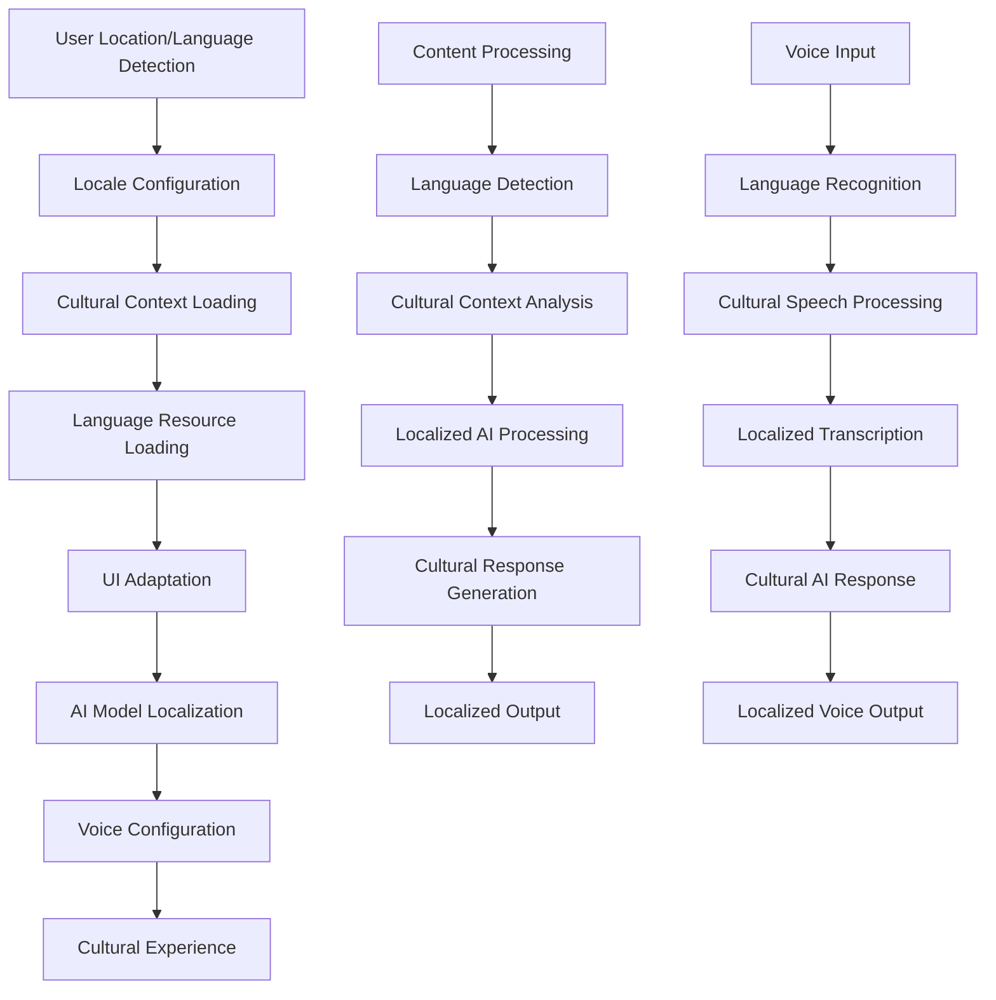

# Localization Integration Plan - xiaoxing2009 Global i18n Framework to SuperAI

## 📋 Executive Summary

**Integration Target**: xiaoxing2009 comprehensive localization framework into PocketPal SuperAI  
**Priority**: HIGH - Global market accessibility foundation  
**Complexity**: 🟡 Medium - Well-defined localization patterns with cultural depth  
**Timeline**: 3-4 weeks for complete global localization implementation  
**Impact**: Transforms SuperAI into globally accessible AI assistant with deep cultural adaptation

This plan details the integration of comprehensive internationalization (i18n) capabilities from xiaoxing2009 fork, creating a robust global localization framework that enables SuperAI to deliver culturally authentic experiences across multiple languages, regions, and cultures.

## 🏗️ Global Localization Architecture

### Multi-Cultural AI System Flow


### Core Localization Framework
```typescript
interface SuperAIGlobalLocalizationFramework {
  // Locale management
  localeManagement: {
    detection: LocaleDetectionService;
    configuration: LocaleConfigurationService;
    switching: LocaleSwitchingService;
    fallback: FallbackLocaleService;
  };
  
  // Cultural adaptation
  culturalAdaptation: {
    context: CulturalContextService;
    ui: UIAdaptationService;
    formatting: FormattingService;
    preferences: CulturalPreferenceService;
  };
  
  // AI localization
  aiLocalization: {
    models: LocalizedModelService;
    prompts: LocalizedPromptService;
    responses: CulturalResponseService;
    context: CulturalAIContextService;
  };
  
  // Voice localization
  voiceLocalization: {
    recognition: MultilingualSpeechRecognition;
    synthesis: MultilingualTTS;
    adaptation: VoiceCulturalAdaptation;
    accents: AccentRecognitionService;
  };
  
  // Content localization
  contentLocalization: {
    rag: MultilingualRAGService;
    documents: DocumentLocalizationService;
    translation: TranslationService;
    search: CrossLingualSearchService;
  };
}
```

## 🛠️ Implementation Strategy

### Phase 1: Core Localization Infrastructure (Week 1-2)

#### 1.1 Advanced Locale Detection and Management
```typescript
// SuperAI Locale Detection Service
class SuperAILocaleDetectionService {
  async detectOptimalLocale(): Promise<LocaleDetectionResult> {
    const detectionSources = await Promise.all([
      this.detectSystemLocale(),
      this.detectGeographicLocale(),
      this.detectUserPreferenceLocale(),
      this.detectContentLanguagePatterns(),
      this.detectVoiceLanguageHistory()
    ]);
    
    const confidence = this.calculateLocaleConfidence(detectionSources);
    const recommendedLocale = this.selectBestLocale(detectionSources, confidence);
    
    return {
      detectedLocale: recommendedLocale,
      confidence,
      sources: detectionSources,
      alternativeLocales: this.getAlternativeLocales(detectionSources),
      culturalContext: await this.getCulturalContext(recommendedLocale)
    };
  }
  
  private async detectSystemLocale(): Promise<LocaleSource> {
    const systemLocale = await this.getDeviceLocale();
    
    return {
      source: 'system',
      locale: systemLocale,
      confidence: 0.8,
      metadata: {
        deviceLanguage: systemLocale.split('-')[0],
        region: systemLocale.split('-')[1],
        timezone: Intl.DateTimeFormat().resolvedOptions().timeZone
      }
    };
  }
  
  private async detectGeographicLocale(): Promise<LocaleSource> {
    try {
      const location = await this.getCurrentLocation();
      const geoLocale = await this.getLocaleFromLocation(location);
      
      return {
        source: 'geographic',
        locale: geoLocale,
        confidence: 0.6,
        metadata: {
          country: location.country,
          region: location.region,
          accuracy: location.accuracy
        }
      };
    } catch (error) {
      return {
        source: 'geographic',
        locale: null,
        confidence: 0,
        error: 'Location unavailable'
      };
    }
  }
  
  private async detectContentLanguagePatterns(): Promise<LocaleSource> {
    const recentMessages = await this.getRecentUserMessages(50);
    const languageAnalysis = await this.analyzeTextLanguages(recentMessages);
    
    return {
      source: 'content_patterns',
      locale: languageAnalysis.primaryLanguage,
      confidence: languageAnalysis.confidence,
      metadata: {
        detectedLanguages: languageAnalysis.languages,
        messageCount: recentMessages.length,
        analysisMethod: 'nlp_language_detection'
      }
    };
  }
}
```

#### 1.2 Comprehensive Cultural Context Framework
```typescript
// SuperAI Cultural Context Service
class SuperAICulturalContextService {
  private culturalContexts: Map<string, CulturalContext> = new Map();
  
  async initializeCulturalContexts(): Promise<void> {
    const contexts = [
      await this.createChineseTraditionalContext(),
      await this.createChineseSimplifiedContext(),
      await this.createJapaneseContext(),
      await this.createKoreanContext(),
      await this.createAmericanContext(),
      await this.createEuropeanContexts(),
      await this.createArabicContext(),
      await this.createIndianContext()
    ];
    
    contexts.forEach(context => {
      this.culturalContexts.set(context.locale, context);
    });
  }
  
  private async createChineseTraditionalContext(): Promise<CulturalContext> {
    return {
      locale: 'zh-TW',
      name: 'Traditional Chinese (Taiwan)',
      culturalValues: {
        collectivism: 'high',
        formalityPreference: 'high',
        hierarchyRespect: 'very_high',
        indirectCommunication: 'high',
        contextDependency: 'very_high'
      },
      
      communicationStyle: {
        formality: 'polite_formal',
        directness: 'indirect',
        emotionalExpression: 'restrained',
        conflictAvoidance: 'high',
        honorifics: 'important'
      },
      
      aiPersonality: {
        responseStyle: 'humble_helpful',
        formalityLevel: 'respectful',
        culturalReferences: 'taiwanese_traditional',
        humorStyle: 'subtle_wordplay',
        adviceApproach: 'gentle_suggestions'
      },
      
      dateTimePreferences: {
        calendar: 'gregorian_with_traditional',
        dateFormat: 'YYYY年MM月DD日',
        timeFormat: '24hour',
        weekStart: 'monday',
        holidays: await this.loadTaiwaneseHolidays()
      },
      
      numberFormatting: {
        decimalSeparator: '.',
        thousandsSeparator: ',',
        currency: 'TWD',
        currencySymbol: 'NT$',
        largeNumbers: 'chinese_units' // 萬, 億
      },
      
      colorPreferences: {
        primary: '#DC143C', // Traditional red
        auspicious: ['#FFD700', '#FF6B35', '#8B0000'],
        inauspicious: ['#000000', '#FFFFFF'], // Avoid for celebrations
        seasonal: await this.getSeasonalColors('taiwan')
      },
      
      uiPreferences: {
        layoutDensity: 'comfortable',
        fontWeight: 'medium',
        iconStyle: 'traditional_influenced',
        navigationStyle: 'hierarchical',
        confirmationPatterns: 'double_confirmation'
      }
    };
  }
  
  private async createChineseSimplifiedContext(): Promise<CulturalContext> {
    return {
      locale: 'zh-CN',
      name: 'Simplified Chinese (Mainland)',
      culturalValues: {
        collectivism: 'very_high',
        formalityPreference: 'medium',
        hierarchyRespect: 'high',
        indirectCommunication: 'medium',
        contextDependency: 'high'
      },
      
      communicationStyle: {
        formality: 'respectful_casual',
        directness: 'moderately_direct',
        emotionalExpression: 'moderate',
        conflictAvoidance: 'medium',
        honorifics: 'contextual'
      },
      
      aiPersonality: {
        responseStyle: 'friendly_helpful',
        formalityLevel: 'appropriately_respectful',
        culturalReferences: 'mainland_contemporary',
        humorStyle: 'clever_wordplay',
        adviceApproach: 'practical_guidance'
      },
      
      dateTimePreferences: {
        calendar: 'gregorian',
        dateFormat: 'YYYY年MM月DD日',
        timeFormat: '24hour',
        weekStart: 'monday',
        holidays: await this.loadMainlandHolidays()
      },
      
      numberFormatting: {
        decimalSeparator: '.',
        thousandsSeparator: ',',
        currency: 'CNY',
        currencySymbol: '¥',
        largeNumbers: 'chinese_units'
      },
      
      colorPreferences: {
        primary: '#FF0000', // Red
        auspicious: ['#FFD700', '#FF6B35'],
        modern: ['#1890FF', '#52C41A'],
        seasonal: await this.getSeasonalColors('china')
      },
      
      uiPreferences: {
        layoutDensity: 'dense',
        fontWeight: 'normal',
        iconStyle: 'modern_simplified',
        navigationStyle: 'efficient',
        confirmationPatterns: 'streamlined'
      }
    };
  }
  
  private async createJapaneseContext(): Promise<CulturalContext> {
    return {
      locale: 'ja-JP',
      name: 'Japanese (Japan)',
      culturalValues: {
        collectivism: 'very_high',
        formalityPreference: 'very_high',
        hierarchyRespect: 'extremely_high',
        indirectCommunication: 'very_high',
        contextDependency: 'extremely_high'
      },
      
      communicationStyle: {
        formality: 'keigo_appropriate',
        directness: 'very_indirect',
        emotionalExpression: 'highly_restrained',
        conflictAvoidance: 'extremely_high',
        honorifics: 'essential'
      },
      
      aiPersonality: {
        responseStyle: 'extremely_polite',
        formalityLevel: 'appropriate_keigo',
        culturalReferences: 'japanese_traditional_modern',
        humorStyle: 'situation_appropriate',
        adviceApproach: 'respectful_suggestions'
      },
      
      dateTimePreferences: {
        calendar: 'gregorian_with_era',
        dateFormat: 'YYYY年MM月DD日',
        timeFormat: '24hour',
        weekStart: 'sunday',
        holidays: await this.loadJapaneseHolidays(),
        eraSystem: 'reiwa'
      },
      
      numberFormatting: {
        decimalSeparator: '.',
        thousandsSeparator: ',',
        currency: 'JPY',
        currencySymbol: '¥',
        largeNumbers: 'japanese_units' // 万, 億
      },
      
      colorPreferences: {
        primary: '#E60026', // Japan red
        traditional: ['#DC143C', '#FFD700', '#FFFFFF'],
        seasonal: await this.getSeasonalColors('japan'),
        harmony: 'wa_influenced'
      },
      
      uiPreferences: {
        layoutDensity: 'spacious',
        fontWeight: 'light',
        iconStyle: 'minimalist_refined',
        navigationStyle: 'intuitive_respectful',
        confirmationPatterns: 'thorough_confirmation'
      }
    };
  }
}
```

### Phase 2: AI and Voice Localization (Week 2-3)

#### 2.1 Culturally-Aware AI Model Integration
```typescript
// SuperAI Localized Model Manager
class SuperAILocalizedModelManager {
  async createLocalizedAIExperience(locale: string, baseModel: AIModel): Promise<LocalizedAIModel> {
    const culturalContext = await this.getCulturalContext(locale);
    const localizedPrompts = await this.generateLocalizedPrompts(locale, culturalContext);
    const responseFormatter = await this.createCulturalResponseFormatter(locale);
    
    return new LocalizedAIModel({
      baseModel,
      locale,
      culturalContext,
      prompts: localizedPrompts,
      responseFormatter,
      behaviorAdaptations: await this.createBehaviorAdaptations(locale)
    });
  }
  
  private async generateLocalizedPrompts(locale: string, cultural: CulturalContext): Promise<LocalizedPrompts> {
    const prompts: LocalizedPrompts = {
      systemPrompt: await this.createCulturalSystemPrompt(locale, cultural),
      conversationStarters: await this.createCulturalConversationStarters(locale),
      responseGuidelines: await this.createCulturalResponseGuidelines(locale),
      errorHandling: await this.createCulturalErrorMessages(locale),
      confirmationPatterns: await this.createCulturalConfirmations(locale)
    };
    
    switch (locale) {
      case 'zh-TW':
        prompts.systemPrompt = `
你是一個智能助手，專門為台灣用戶提供服務。請：
- 使用繁體中文進行回應
- 保持禮貌和尊重的語調
- 考慮台灣的文化背景和價值觀
- 使用台灣常用的詞彙和表達方式
- 在適當時候引用台灣的文化、歷史或社會背景
- 尊重傳統價值觀，同時體現現代台灣社會的開放性
        `.trim();
        break;
        
      case 'zh-CN':
        prompts.systemPrompt = `
你是一个智能助手，专门为中国大陆用户提供服务。请：
- 使用简体中文进行回应
- 保持友好和专业的语调
- 考虑中国的文化背景和社会环境
- 使用大陆地区常用的词汇和表达方式
- 在适当时候引用中国的文化、历史或社会背景
- 体现现代中国社会的特点和价值观念
        `.trim();
        break;
        
      case 'ja-JP':
        prompts.systemPrompt = `
あなたは日本のユーザー向けのAIアシスタントです。以下を心がけてください：
- 適切な敬語を使用して回答する
- 日本の文化的背景と社会的な文脈を考慮する
- 相手の立場や状況に配慮した表現を使う
- 必要に応じて日本の文化、歴史、社会的背景を参照する
- 和の精神と現代日本社会の価値観を反映する
- 丁寧で思いやりのある対応を心がける
        `.trim();
        break;
        
      case 'ko-KR':
        prompts.systemPrompt = `
당신은 한국 사용자를 위한 AI 어시스턴트입니다. 다음을 유의해 주세요：
- 적절한 경어를 사용하여 답변하기
- 한국의 문화적 배경과 사회적 맥락을 고려하기
- 상대방의 입장과 상황을 배려한 표현 사용하기
- 필요시 한국의 문화, 역사, 사회적 배경 참조하기
- 예의와 정중함을 바탕으로 한 현대 한국 사회 가치관 반영하기
        `.trim();
        break;
    }
    
    return prompts;
  }
  
  private async createCulturalResponseFormatter(locale: string): Promise<CulturalResponseFormatter> {
    return new CulturalResponseFormatter({
      locale,
      formattingRules: await this.getCulturalFormattingRules(locale),
      emotionExpression: await this.getEmotionExpressionRules(locale),
      politenessLevel: await this.getPolitenessLevel(locale),
      culturalReferences: await this.getCulturalReferenceGuidelines(locale)
    });
  }
  
  private async createBehaviorAdaptations(locale: string): Promise<BehaviorAdaptations> {
    const cultural = await this.getCulturalContext(locale);
    
    return {
      responseLength: this.getPreferredResponseLength(cultural),
      detailLevel: this.getPreferredDetailLevel(cultural),
      exampleUsage: this.getExampleUsagePreference(cultural),
      questionStyle: this.getQuestioningStyle(cultural),
      suggestionApproach: this.getSuggestionApproach(cultural),
      errorHandling: this.getErrorHandlingStyle(cultural),
      confirmationStyle: this.getConfirmationStyle(cultural)
    };
  }
}
```

#### 2.2 Multilingual Voice Processing Integration
```typescript
// SuperAI Multilingual Voice Service
class SuperAIMultilingualVoiceService {
  private voiceConfigs: Map<string, VoiceConfiguration> = new Map();
  private speechRecognizers: Map<string, SpeechRecognizer> = new Map();
  private ttsEngines: Map<string, TTSEngine> = new Map();
  
  async initializeMultilingualVoice(): Promise<VoiceInitResult> {
    const supportedLocales = [
      'en-US', 'zh-TW', 'zh-CN', 'ja-JP', 'ko-KR', 
      'es-ES', 'fr-FR', 'de-DE', 'ar-SA', 'hi-IN'
    ];
    
    for (const locale of supportedLocales) {
      await this.initializeVoiceForLocale(locale);
    }
    
    return {
      supportedLocales,
      recognizersReady: this.speechRecognizers.size,
      ttsEnginesReady: this.ttsEngines.size,
      defaultLocale: await this.detectDefaultVoiceLocale()
    };
  }
  
  private async initializeVoiceForLocale(locale: string): Promise<void> {
    const config = await this.createVoiceConfigForLocale(locale);
    this.voiceConfigs.set(locale, config);
    
    // Initialize speech recognition
    const recognizer = await this.createSpeechRecognizer(locale, config);
    this.speechRecognizers.set(locale, recognizer);
    
    // Initialize TTS engine
    const ttsEngine = await this.createTTSEngine(locale, config);
    this.ttsEngines.set(locale, ttsEngine);
  }
  
  async processMultilingualSpeech(audioData: ArrayBuffer): Promise<MultilingualSpeechResult> {
    // 1. Detect language from audio
    const languageDetection = await this.detectSpeechLanguage(audioData);
    
    // 2. Transcribe using language-specific recognizer
    const transcription = await this.transcribeInLanguage(audioData, languageDetection.locale);
    
    // 3. Process with culturally-aware AI
    const culturalResponse = await this.processWithCulturalAI(
      transcription.text, 
      languageDetection.locale
    );
    
    // 4. Generate culturally-appropriate voice response
    const voiceResponse = await this.generateCulturalVoiceResponse(
      culturalResponse,
      languageDetection.locale
    );
    
    return {
      detectedLanguage: languageDetection.locale,
      confidence: languageDetection.confidence,
      transcription,
      response: culturalResponse,
      audioResponse: voiceResponse,
      culturalAdaptations: await this.getCulturalAdaptations(languageDetection.locale)
    };
  }
  
  private async createVoiceConfigForLocale(locale: string): Promise<VoiceConfiguration> {
    const culturalContext = await this.getCulturalContext(locale);
    
    const baseConfigs: Record<string, VoiceConfiguration> = {
      'zh-TW': {
        speechRecognition: {
          language: 'zh-TW',
          dialect: 'taiwan',
          modelVariant: 'traditional-chinese',
          culturalAdaptations: {
            toneRecognition: true,
            formalityDetection: true,
            regionalAccents: ['taipei', 'taichung', 'kaohsiung'],
            contextualInterpretation: true
          }
        },
        textToSpeech: {
          voice: 'zh-TW-female-natural',
          rate: 0.9, // Slightly slower for clarity
          pitch: 1.1, // Higher pitch culturally preferred
          volume: 0.8,
          prosody: {
            emotionalRange: 'moderate',
            formalityExpression: true,
            culturalIntonation: 'taiwanese'
          }
        },
        languageModel: {
          acousticModel: 'mandarin-traditional-taiwan',
          languageModel: 'zh-tw-conversational',
          vocabulary: 'traditional-chinese-modern',
          culturalTerms: await this.loadTaiwaneseCulturalTerms()
        }
      },
      
      'zh-CN': {
        speechRecognition: {
          language: 'zh-CN',
          dialect: 'putonghua',
          modelVariant: 'simplified-chinese',
          culturalAdaptations: {
            toneRecognition: true,
            formalityDetection: true,
            regionalAccents: ['beijing', 'shanghai', 'guangzhou', 'shenzhen'],
            contextualInterpretation: true
          }
        },
        textToSpeech: {
          voice: 'zh-CN-female-standard',
          rate: 1.0,
          pitch: 1.0,
          volume: 0.8,
          prosody: {
            emotionalRange: 'full',
            formalityExpression: true,
            culturalIntonation: 'standard-mandarin'
          }
        },
        languageModel: {
          acousticModel: 'mandarin-simplified-china',
          languageModel: 'zh-cn-conversational',
          vocabulary: 'simplified-chinese-contemporary',
          culturalTerms: await this.loadChineseCulturalTerms()
        }
      },
      
      'ja-JP': {
        speechRecognition: {
          language: 'ja-JP',
          dialect: 'tokyo-standard',
          modelVariant: 'japanese-polite',
          culturalAdaptations: {
            keigoDetection: true,
            formalityLevels: ['casual', 'polite', 'respectful', 'humble'],
            regionalAccents: ['tokyo', 'kansai', 'tohoku'],
            contextualHonorific: true
          }
        },
        textToSpeech: {
          voice: 'ja-JP-female-polite',
          rate: 0.85, // Slower for politeness
          pitch: 1.05, // Slightly higher for politeness
          volume: 0.75,
          prosody: {
            emotionalRange: 'restrained',
            keigoExpression: true,
            culturalIntonation: 'japanese-polite'
          }
        },
        languageModel: {
          acousticModel: 'japanese-standard-polite',
          languageModel: 'ja-jp-keigo-aware',
          vocabulary: 'japanese-comprehensive-keigo',
          culturalTerms: await this.loadJapaneseCulturalTerms()
        }
      }
    };
    
    return baseConfigs[locale] || baseConfigs['en-US'];
  }
  
  private async generateCulturalVoiceResponse(
    response: string, 
    locale: string
  ): Promise<VoiceResponseResult> {
    const voiceConfig = this.voiceConfigs.get(locale);
    const culturalContext = await this.getCulturalContext(locale);
    
    // Apply cultural adaptations to the text before TTS
    const culturallyAdaptedText = await this.applyCulturalTextAdaptations(response, culturalContext);
    
    // Generate speech with cultural prosody
    const audioData = await this.ttsEngines.get(locale)!.synthesize(culturallyAdaptedText, {
      voice: voiceConfig!.textToSpeech.voice,
      rate: voiceConfig!.textToSpeech.rate,
      pitch: voiceConfig!.textToSpeech.pitch,
      culturalProsody: voiceConfig!.textToSpeech.prosody
    });
    
    return {
      audioData,
      duration: await this.calculateAudioDuration(audioData),
      culturalAdaptations: this.getCulturalTextAdaptations(culturallyAdaptedText, response),
      voiceCharacteristics: voiceConfig!.textToSpeech
    };
  }
}
```

### Phase 3: Content and RAG Localization (Week 3-4)

#### 3.1 Multilingual RAG System Integration
```typescript
// SuperAI Multilingual RAG Service
class SuperAIMultilingualRAGService {
  async processMultilingualDocument(
    documentPath: string,
    metadata: DocumentMetadata
  ): Promise<MultilingualDocumentResult> {
    // 1. Detect document language(s)
    const languageAnalysis = await this.analyzeDocumentLanguages(documentPath);
    
    // 2. Extract and preprocess text with language-specific handling
    const extractedContent = await this.extractMultilingualContent(documentPath, languageAnalysis);
    
    // 3. Apply language-specific chunking strategies
    const localizedChunks = await this.createLocalizedChunks(extractedContent);
    
    // 4. Generate embeddings using language-appropriate models
    const multilingualEmbeddings = await this.generateMultilingualEmbeddings(localizedChunks);
    
    // 5. Store with comprehensive language metadata
    const storageResult = await this.storeMultilingualDocument(multilingualEmbeddings, metadata);
    
    return {
      documentId: storageResult.documentId,
      detectedLanguages: languageAnalysis.languages,
      chunksCreated: localizedChunks.length,
      embeddingsGenerated: multilingualEmbeddings.length,
      crossLingualMappings: await this.createCrossLingualMappings(localizedChunks)
    };
  }
  
  async searchMultilingualKnowledge(
    query: string,
    userLocale: string,
    searchOptions: MultilingualSearchOptions = {}
  ): Promise<MultilingualSearchResult> {
    // 1. Analyze query language and cultural context
    const queryAnalysis = await this.analyzeQueryLanguageAndCulture(query, userLocale);
    
    // 2. Search in primary language with cultural context
    const primaryResults = await this.searchWithCulturalContext(query, queryAnalysis);
    
    // 3. Search in related languages for comprehensive results
    const crossLingualResults = await this.searchCrossLingual(query, queryAnalysis, searchOptions);
    
    // 4. Translate and culturally adapt results as needed
    const adaptedResults = await this.adaptResultsForUser(
      [...primaryResults, ...crossLingualResults],
      userLocale,
      queryAnalysis.culturalContext
    );
    
    // 5. Rank results considering cultural relevance
    const rankedResults = await this.rankWithCulturalRelevance(adaptedResults, queryAnalysis);
    
    return {
      query,
      userLocale,
      queryLanguage: queryAnalysis.detectedLanguage,
      culturalContext: queryAnalysis.culturalContext,
      results: rankedResults,
      searchSources: this.combineSearchSources(primaryResults, crossLingualResults),
      culturalAdaptations: this.getCulturalAdaptations(rankedResults, userLocale)
    };
  }
  
  private async createLocalizedChunks(content: MultilingualContent): Promise<LocalizedChunk[]> {
    const chunks: LocalizedChunk[] = [];
    
    for (const [language, text] of Object.entries(content.textByLanguage)) {
      const languageChunks = await this.chunkByLanguage(text, language);
      
      chunks.push(...languageChunks.map(chunk => ({
        ...chunk,
        language,
        culturalContext: this.getCulturalContextForLanguage(language),
        crossLingualReferences: this.findCrossLingualReferences(chunk, content)
      })));
    }
    
    return chunks;
  }
  
  private async chunkByLanguage(text: string, language: string): Promise<TextChunk[]> {
    const chunkingStrategy = this.getLanguageSpecificChunkingStrategy(language);
    
    switch (language) {
      case 'zh-TW':
      case 'zh-CN':
        return await this.chunkChineseText(text, language);
      case 'ja-JP':
        return await this.chunkJapaneseText(text);
      case 'ko-KR':
        return await this.chunkKoreanText(text);
      case 'ar-SA':
        return await this.chunkArabicText(text);
      default:
        return await this.chunkLatinBasedText(text, language);
    }
  }
  
  private async chunkChineseText(text: string, variant: 'zh-TW' | 'zh-CN'): Promise<TextChunk[]> {
    // Use language-specific segmentation
    const segmenter = variant === 'zh-TW' ? 
      this.traditionalChineseSegmenter : 
      this.simplifiedChineseSegmenter;
    
    const sentences = await segmenter.segmentIntoSentences(text);
    const chunks: TextChunk[] = [];
    
    let currentChunk = '';
    let currentTokenCount = 0;
    const maxTokens = 400; // Optimal for Chinese text
    
    for (const sentence of sentences) {
      const sentenceTokens = await this.countChineseTokens(sentence);
      
      if (currentTokenCount + sentenceTokens > maxTokens && currentChunk) {
        chunks.push({
          content: currentChunk.trim(),
          tokens: currentTokenCount,
          language: variant,
          type: 'semantic',
          metadata: {
            sentenceCount: this.countSentences(currentChunk),
            characterCount: currentChunk.length,
            traditionalSimplifiedMix: await this.detectMixedScript(currentChunk)
          }
        });
        
        currentChunk = sentence;
        currentTokenCount = sentenceTokens;
      } else {
        currentChunk += (currentChunk ? ' ' : '') + sentence;
        currentTokenCount += sentenceTokens;
      }
    }
    
    if (currentChunk) {
      chunks.push({
        content: currentChunk.trim(),
        tokens: currentTokenCount,
        language: variant,
        type: 'semantic',
        metadata: {
          sentenceCount: this.countSentences(currentChunk),
          characterCount: currentChunk.length,
          traditionalSimplifiedMix: await this.detectMixedScript(currentChunk)
        }
      });
    }
    
    return chunks;
  }
  
  private async generateMultilingualEmbeddings(chunks: LocalizedChunk[]): Promise<MultilingualEmbeddedChunk[]> {
    const embeddedChunks: MultilingualEmbeddedChunk[] = [];
    
    for (const chunk of chunks) {
      const embeddingModel = await this.getLanguageSpecificEmbeddingModel(chunk.language);
      const embedding = await embeddingModel.encode(chunk.content);
      
      // Generate cross-lingual embeddings for major languages
      const crossLingualEmbeddings = await this.generateCrossLingualEmbeddings(chunk);
      
      embeddedChunks.push({
        ...chunk,
        embedding,
        crossLingualEmbeddings,
        embeddingModel: embeddingModel.name,
        culturalSemantics: await this.extractCulturalSemantics(chunk.content, chunk.language)
      });
    }
    
    return embeddedChunks;
  }
}
```

#### 3.2 Cultural UI Adaptation System
```typescript
// SuperAI Cultural UI Adapter
class SuperAICulturalUIAdapter {
  async adaptUIForCulture(locale: string): Promise<CulturalUIAdaptations> {
    const culturalContext = await this.getCulturalContext(locale);
    
    return {
      layout: await this.createCulturalLayout(locale, culturalContext),
      typography: await this.createCulturalTypography(locale),
      colors: await this.createCulturalColorScheme(locale, culturalContext),
      interactions: await this.createCulturalInteractions(locale, culturalContext),
      components: await this.createCulturalComponents(locale)
    };
  }
  
  private async createCulturalLayout(locale: string, cultural: CulturalContext): Promise<LayoutAdaptations> {
    const layouts: Record<string, LayoutAdaptations> = {
      'zh-TW': {
        direction: 'ltr',
        density: 'comfortable',
        spacing: 'generous',
        hierarchy: 'clear_respectful',
        navigation: 'hierarchical_clear',
        confirmations: 'thorough_polite',
        specialFeatures: {
          traditionalElements: true,
          fengShuiConsiderations: true,
          respectfulSpacing: true
        }
      },
      
      'zh-CN': {
        direction: 'ltr',
        density: 'efficient',
        spacing: 'optimal',
        hierarchy: 'clear_modern',
        navigation: 'streamlined_efficient',
        confirmations: 'clear_concise',
        specialFeatures: {
          modernEfficiency: true,
          pragmaticDesign: true,
          functionalFocus: true
        }
      },
      
      'ja-JP': {
        direction: 'ltr',
        density: 'spacious',
        spacing: 'respectful',
        hierarchy: 'subtle_clear',
        navigation: 'intuitive_respectful',
        confirmations: 'extremely_thorough',
        specialFeatures: {
          waInfluence: true,
          minimalistAesthetic: true,
          respectfulInteractions: true,
          seasonalAdaptations: true
        }
      },
      
      'ar-SA': {
        direction: 'rtl',
        density: 'comfortable',
        spacing: 'generous',
        hierarchy: 'clear_formal',
        navigation: 'rtl_optimized',
        confirmations: 'formal_thorough',
        specialFeatures: {
          rtlOptimized: true,
          formalPresentation: true,
          culturalRespect: true
        }
      }
    };
    
    return layouts[locale] || layouts['en-US'];
  }
  
  private async createCulturalTypography(locale: string): Promise<TypographyAdaptations> {
    const typography: Record<string, TypographyAdaptations> = {
      'zh-TW': {
        primaryFont: 'NotoSansCJK-TC',
        fallbackFonts: ['PingFang TC', 'Heiti TC', 'STHeiti'],
        fontSize: {
          scale: 1.1,
          lineHeight: 1.6,
          letterSpacing: 0.02
        },
        culturalAdaptations: {
          traditionalCharacterOptimization: true,
          readabilityEnhancement: true,
          respectfulPresentation: true
        }
      },
      
      'zh-CN': {
        primaryFont: 'NotoSansCJK-SC',
        fallbackFonts: ['PingFang SC', 'Heiti SC', 'SimHei'],
        fontSize: {
          scale: 1.0,
          lineHeight: 1.5,
          letterSpacing: 0.01
        },
        culturalAdaptations: {
          simplifiedCharacterOptimization: true,
          efficiencyFocus: true,
          modernPresentation: true
        }
      },
      
      'ja-JP': {
        primaryFont: 'NotoSansCJK-JP',
        fallbackFonts: ['Hiragino Sans', 'Yu Gothic', 'Meiryo'],
        fontSize: {
          scale: 0.95,
          lineHeight: 1.7,
          letterSpacing: 0.03
        },
        culturalAdaptations: {
          hiraganaKatakanaBalance: true,
          respectfulSpacing: true,
          readabilityPriority: true
        }
      }
    };
    
    return typography[locale] || this.getDefaultTypography();
  }
  
  private async createCulturalColorScheme(locale: string, cultural: CulturalContext): Promise<ColorSchemeAdaptations> {
    return {
      primary: cultural.colorPreferences.primary,
      secondary: this.selectSecondaryColor(cultural),
      accent: this.selectAccentColors(cultural),
      background: this.createCulturalBackgrounds(cultural),
      text: this.createCulturalTextColors(cultural),
      status: this.createCulturalStatusColors(cultural),
      seasonal: await this.createSeasonalAdaptations(locale, cultural)
    };
  }
}
```

## 📊 Performance and Cultural Impact Metrics

### Localization Performance Targets
```typescript
interface LocalizationPerformanceTargets {
  languageSwitching: {
    target: '<500ms complete locale switching',
    measurement: 'UI re-render and content loading time',
    optimization: 'Preloaded resources and intelligent caching'
  };
  
  culturalAdaptation: {
    target: '<200ms cultural context application',
    measurement: 'Cultural UI and AI behavior adaptation time',
    optimization: 'Pre-computed cultural adaptations'
  };
  
  multilingualSearch: {
    target: '<1 second cross-lingual search',
    measurement: 'Query processing and result retrieval time',
    optimization: 'Language-specific indexing and caching'
  };
  
  voiceLocalization: {
    target: '<2 seconds language detection and processing',
    measurement: 'Audio language detection and localized response',
    optimization: 'Parallel processing and model optimization'
  };
  
  memoryFootprint: {
    target: '<100MB additional per active locale',
    measurement: 'Memory usage for locale resources',
    optimization: 'On-demand loading and compression'
  };
}
```

### Cultural Authenticity Metrics
```typescript
interface CulturalAuthenticityMetrics {
  languageAccuracy: {
    target: '95% cultural appropriateness',
    measurement: 'Native speaker validation and feedback',
    validation: 'Cultural review panel assessment'
  };
  
  culturalRelevance: {
    target: '90% culturally relevant responses',
    measurement: 'Cultural context understanding and application',
    validation: 'Cultural expert review and user feedback'
  };
  
  localizedUX: {
    target: '95% locale-appropriate user experience',
    measurement: 'UI/UX cultural adaptation effectiveness',
    validation: 'Regional user testing and feedback'
  };
  
  voiceCulturalAccuracy: {
    target: '90% culturally appropriate speech patterns',
    measurement: 'Voice prosody and cultural speech characteristics',
    validation: 'Native speaker audio evaluation'
  };
}
```

## 📋 Implementation Checklist

### Week 1-2: Core Localization Infrastructure
- [ ] Implement advanced locale detection and management
- [ ] Create comprehensive cultural context framework
- [ ] Build efficient locale resource loading system
- [ ] Setup cultural UI adaptation system

### Week 2-3: AI and Voice Localization
- [ ] Integrate culturally-aware AI model management
- [ ] Implement multilingual voice processing pipeline
- [ ] Create cultural response formatting system
- [ ] Setup voice cultural adaptation service

### Week 3-4: Content and RAG Localization
- [ ] Build multilingual RAG system
- [ ] Implement cross-lingual search capabilities
- [ ] Create cultural content adaptation service
- [ ] Setup translation and localization pipeline

### Ongoing: Quality and Cultural Validation
- [ ] Native speaker validation for all supported languages
- [ ] Cultural expert review of AI responses and UI adaptations
- [ ] Continuous cultural authenticity monitoring
- [ ] Regular updates based on cultural feedback

The xiaoxing2009 localization integration transforms SuperAI from an English-only AI assistant into a globally accessible, culturally authentic platform that respects and adapts to diverse languages, cultures, and user expectations worldwide.

---

**Document Version**: 1.0  
**Last Updated**: June 22, 2025  
**Implementation Status**: Ready for Development  
**Next Milestone**: Cultural infrastructure implementation