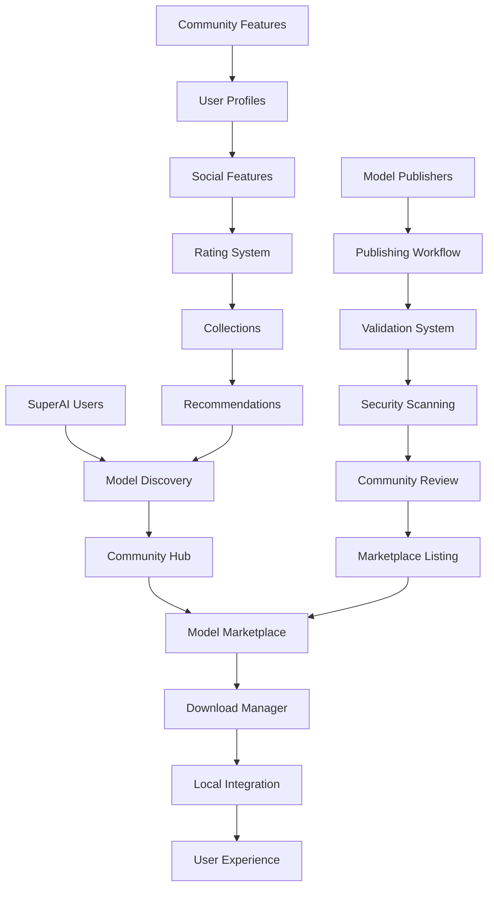

# Model Sharing Integration Plan - tjipenk Community Platform to SuperAI

## 📋 Executive Summary

**Integration Target**: tjipenk model sharing and community features into PocketPal SuperAI  
**Priority**: HIGH - Community ecosystem foundation  
**Complexity**: 🟡 Medium - Well-defined community patterns available  
**Timeline**: 3-4 weeks for complete community platform implementation  
**Impact**: Transforms SuperAI into community-driven AI ecosystem with model marketplace

This plan details the integration of comprehensive model sharing capabilities from tjipenk fork, creating a vibrant community ecosystem where users can discover, share, and collaborate on AI models within SuperAI.

## 🏗️ Community Platform Architecture

### Model Sharing Ecosystem Flow


### Core Community Components
```typescript
interface SuperAICommunityPlatform {
  // Model marketplace
  modelMarketplace: {
    discovery: ModelDiscoveryService;
    publishing: ModelPublishingService;
    validation: ModelValidationService;
    security: ModelSecurityService;
  };
  
  // Community features
  communityFeatures: {
    userProfiles: UserProfileService;
    socialInteractions: SocialInteractionService;
    ratingSystem: ModelRatingService;
    collections: ModelCollectionService;
  };
  
  // Knowledge sharing
  knowledgeSharing: {
    knowledgeBase: CommunityKnowledgeBase;
    tutorials: TutorialSystem;
    documentation: CommunityDocumentation;
    forums: CommunityForums;
  };
  
  // Platform governance
  governance: {
    moderation: ModerationSystem;
    qualityAssurance: QualityAssuranceSystem;
    communityGuidelines: GuidelinesEnforcement;
    disputeResolution: DisputeResolutionSystem;
  };
}
```

## 🛠️ Implementation Strategy

### Phase 1: Core Model Sharing Infrastructure (Week 1-2)

#### 1.1 Model Package System
```typescript
// SuperAI Model Package Manager
class SuperAIModelPackageManager {
  async createModelPackage(localModel: LocalModel, metadata: ModelMetadata): Promise<ModelPackage> {
    // 1. Validate model for sharing
    const validation = await this.validateModelForSharing(localModel);
    if (!validation.isValid) {
      throw new ValidationError('Model validation failed', validation.errors);
    }
    
    // 2. Extract model information
    const modelInfo = await this.extractModelInformation(localModel);
    
    // 3. Create package manifest
    const packageManifest = await this.createPackageManifest(localModel, metadata, modelInfo);
    
    // 4. Generate package checksum
    const checksum = await this.generatePackageChecksum(localModel, packageManifest);
    
    // 5. Create distributable package
    const distributionPackage = await this.createDistributionPackage(
      localModel,
      packageManifest,
      checksum
    );
    
    return {
      id: generateModelPackageId(),
      metadata: packageManifest,
      model: distributionPackage,
      checksum,
      createdAt: Date.now(),
      version: '1.0.0'
    };
  }
  
  private async createPackageManifest(
    model: LocalModel,
    metadata: ModelMetadata,
    modelInfo: ModelInfo
  ): Promise<ModelPackageManifest> {
    return {
      // Basic information
      name: metadata.name,
      description: metadata.description,
      version: metadata.version || '1.0.0',
      author: metadata.author,
      license: metadata.license || 'MIT',
      tags: metadata.tags || [],
      category: metadata.category,
      
      // Technical specifications
      model: {
        format: modelInfo.format,
        size: modelInfo.size,
        parameters: modelInfo.parameters,
        quantization: modelInfo.quantization,
        architecture: modelInfo.architecture,
        contextLength: modelInfo.contextLength,
        vocabulary: modelInfo.vocabulary
      },
      
      // Compatibility information
      compatibility: {
        minAppVersion: '2.0.0',
        platforms: ['ios', 'android'],
        deviceRequirements: {
          minRAM: modelInfo.minRAM,
          minStorage: modelInfo.minStorage,
          recommendedRAM: modelInfo.recommendedRAM,
          recommendedStorage: modelInfo.recommendedStorage
        }
      },
      
      // Configuration
      configuration: {
        defaultSettings: metadata.defaultSettings || this.getDefaultModelSettings(),
        recommendedSettings: metadata.recommendedSettings || [],
        systemPrompt: metadata.systemPrompt,
        chatTemplate: metadata.chatTemplate,
        stopTokens: metadata.stopTokens || []
      },
      
      // Performance information
      performance: {
        benchmarkResults: metadata.benchmarkResults || [],
        memoryUsage: modelInfo.estimatedMemoryUsage,
        inferenceSpeed: modelInfo.estimatedInferenceSpeed,
        powerConsumption: modelInfo.estimatedPowerUsage
      }
    };
  }
}
```

#### 1.2 Model Discovery Service
```typescript
// SuperAI Model Discovery Service
class SuperAIModelDiscoveryService {
  private searchIndex: ModelSearchIndex;
  private categoryIndex: CategoryIndex;
  private userPreferences: UserPreferenceEngine;
  
  async searchModels(query: string, filters: ModelSearchFilters): Promise<ModelSearchResults> {
    // 1. Parse and enhance search query
    const enhancedQuery = await this.enhanceSearchQuery(query, filters);
    
    // 2. Execute multi-faceted search
    const searchResults = await this.executeSearch(enhancedQuery);
    
    // 3. Apply personalization
    const personalizedResults = await this.personalizeResults(searchResults, filters.userId);
    
    // 4. Add metadata and recommendations
    const enrichedResults = await this.enrichResults(personalizedResults);
    
    return {
      query: enhancedQuery,
      results: enrichedResults,
      totalCount: searchResults.totalCount,
      suggestions: await this.generateSearchSuggestions(query),
      filters: await this.getAvailableFilters(searchResults),
      recommendations: await this.getRecommendations(filters.userId)
    };
  }
  
  async getModelDetails(modelId: string, userId?: string): Promise<DetailedModelInfo> {
    // 1. Get base model information
    const baseInfo = await this.getBaseModelInfo(modelId);
    
    // 2. Get community statistics
    const communityStats = await this.getCommunityStatistics(modelId);
    
    // 3. Get user-specific information
    const userInfo = userId ? await this.getUserSpecificInfo(modelId, userId) : null;
    
    // 4. Get related models
    const relatedModels = await this.getRelatedModels(modelId);
    
    // 5. Get recent reviews and ratings
    const reviews = await this.getRecentReviews(modelId, 10);
    
    return {
      ...baseInfo,
      community: {
        downloads: communityStats.downloads,
        rating: communityStats.averageRating,
        reviews: communityStats.reviewCount,
        favorites: communityStats.favorites,
        trending: communityStats.trending
      },
      user: userInfo,
      related: relatedModels,
      recentReviews: reviews,
      alternatives: await this.getAlternativeModels(baseInfo.category, modelId)
    };
  }
  
  private async personalizeResults(
    results: ModelSearchResult[], 
    userId?: string
  ): Promise<ModelSearchResult[]> {
    if (!userId) return results;
    
    const userProfile = await this.userPreferences.getUserProfile(userId);
    
    return results.map(result => ({
      ...result,
      personalizedScore: this.calculatePersonalizedScore(result, userProfile),
      recommendationReason: this.getRecommendationReason(result, userProfile),
      compatibilityScore: this.calculateDeviceCompatibility(result, userProfile.device)
    })).sort((a, b) => b.personalizedScore - a.personalizedScore);
  }
}
```

### Phase 2: Community Features Implementation (Week 2-3)

#### 2.1 User Profile and Social System
```typescript
// SuperAI Community User Service
class SuperAICommunityUserService {
  async createUserProfile(userId: string, profileData: UserProfileData): Promise<CommunityProfile> {
    const profile: CommunityProfile = {
      id: userId,
      username: profileData.username,
      displayName: profileData.displayName,
      bio: profileData.bio,
      avatar: profileData.avatar,
      
      // Community statistics
      stats: {
        modelsShared: 0,
        downloadsReceived: 0,
        averageRating: 0,
        reviews: 0,
        following: 0,
        followers: 0,
        collectionsCreated: 0
      },
      
      // User preferences
      preferences: {
        modelCategories: profileData.interestedCategories || [],
        deviceInfo: profileData.deviceInfo,
        privacySettings: profileData.privacySettings || this.getDefaultPrivacySettings()
      },
      
      // Reputation system
      reputation: {
        level: 'newcomer',
        points: 0,
        badges: [],
        verificationStatus: 'unverified'
      },
      
      createdAt: Date.now(),
      updatedAt: Date.now()
    };
    
    await this.storeUserProfile(profile);
    return profile;
  }
  
  async followUser(followerId: string, targetUserId: string): Promise<FollowResult> {
    // 1. Validate follow request
    if (followerId === targetUserId) {
      throw new Error('Users cannot follow themselves');
    }
    
    const existingFollow = await this.checkExistingFollow(followerId, targetUserId);
    if (existingFollow) {
      throw new Error('Already following this user');
    }
    
    // 2. Create follow relationship
    const followRelationship = {
      followerId,
      targetUserId,
      createdAt: Date.now()
    };
    
    await this.createFollowRelationship(followRelationship);
    
    // 3. Update user statistics
    await this.updateUserStats(followerId, { following: +1 });
    await this.updateUserStats(targetUserId, { followers: +1 });
    
    // 4. Trigger notifications
    await this.notificationService.sendFollowNotification(targetUserId, followerId);
    
    return {
      success: true,
      relationship: followRelationship
    };
  }
  
  async createModelCollection(
    userId: string, 
    collectionData: ModelCollectionData
  ): Promise<ModelCollection> {
    const collection: ModelCollection = {
      id: generateCollectionId(),
      name: collectionData.name,
      description: collectionData.description,
      ownerId: userId,
      models: [],
      isPublic: collectionData.isPublic ?? true,
      tags: collectionData.tags || [],
      
      stats: {
        modelCount: 0,
        views: 0,
        likes: 0,
        shares: 0
      },
      
      createdAt: Date.now(),
      updatedAt: Date.now()
    };
    
    await this.storeModelCollection(collection);
    await this.updateUserStats(userId, { collectionsCreated: +1 });
    
    return collection;
  }
}
```

#### 2.2 Rating and Review System
```typescript
// SuperAI Model Rating Service
class SuperAIModelRatingService {
  async submitModelReview(
    modelId: string, 
    userId: string, 
    reviewData: ModelReviewData
  ): Promise<ModelReview> {
    // 1. Validate review
    const validation = await this.validateReview(reviewData);
    if (!validation.isValid) {
      throw new ValidationError('Invalid review', validation.errors);
    }
    
    // 2. Check for existing review
    const existingReview = await this.getExistingReview(modelId, userId);
    if (existingReview) {
      return await this.updateReview(existingReview.id, reviewData);
    }
    
    // 3. Create new review
    const review: ModelReview = {
      id: generateReviewId(),
      modelId,
      userId,
      rating: reviewData.rating,
      title: reviewData.title,
      content: reviewData.content,
      pros: reviewData.pros,
      cons: reviewData.cons,
      usageContext: reviewData.usageContext,
      
      // Technical feedback
      performance: {
        inferenceSpeed: reviewData.performance?.inferenceSpeed,
        memoryUsage: reviewData.performance?.memoryUsage,
        accuracy: reviewData.performance?.accuracy,
        batteryImpact: reviewData.performance?.batteryImpact
      },
      
      // Community engagement
      engagement: {
        helpful: 0,
        notHelpful: 0,
        replies: 0
      },
      
      // Moderation
      moderation: {
        status: 'pending',
        flagCount: 0,
        verified: false
      },
      
      createdAt: Date.now(),
      updatedAt: Date.now()
    };
    
    // 4. Store review
    await this.storeReview(review);
    
    // 5. Update model statistics
    await this.updateModelRatingStatistics(modelId);
    
    // 6. Update user reputation
    await this.updateUserReputation(userId, 'review_submitted');
    
    return review;
  }
  
  async getModelReviews(
    modelId: string, 
    options: ReviewQueryOptions = {}
  ): Promise<ModelReviewResults> {
    const reviews = await this.queryModelReviews(modelId, {
      sortBy: options.sortBy || 'helpful',
      filterBy: options.filterBy,
      limit: options.limit || 20,
      offset: options.offset || 0
    });
    
    const enrichedReviews = await Promise.all(
      reviews.map(async review => ({
        ...review,
        author: await this.getUserPublicProfile(review.userId),
        helpfulVotes: await this.getHelpfulVotes(review.id),
        replies: await this.getReviewReplies(review.id, 5)
      }))
    );
    
    return {
      reviews: enrichedReviews,
      statistics: await this.getReviewStatistics(modelId),
      totalCount: await this.getTotalReviewCount(modelId)
    };
  }
}
```

### Phase 3: Advanced Community Features (Week 3-4)

#### 3.1 Knowledge Base Integration
```typescript
// SuperAI Community Knowledge Base
class SuperAICommunityKnowledgeBase {
  async shareKnowledgeBase(
    userId: string, 
    ragDatabase: RAGDatabase, 
    metadata: KnowledgeBaseMetadata
  ): Promise<SharedKnowledgeBase> {
    // 1. Package knowledge base for sharing
    const packagedKB = await this.packageKnowledgeBase(ragDatabase, metadata);
    
    // 2. Validate knowledge base
    const validation = await this.validateKnowledgeBase(packagedKB);
    if (!validation.isValid) {
      throw new ValidationError('Knowledge base validation failed', validation.errors);
    }
    
    // 3. Extract metadata and statistics
    const kbStatistics = await this.extractKnowledgeBaseStatistics(packagedKB);
    
    // 4. Create shareable knowledge base
    const sharedKB: SharedKnowledgeBase = {
      id: generateKnowledgeBaseId(),
      name: metadata.name,
      description: metadata.description,
      category: metadata.category,
      tags: metadata.tags,
      author: userId,
      
      // Technical details
      technical: {
        documentCount: kbStatistics.documentCount,
        totalSize: kbStatistics.totalSize,
        embeddingModel: kbStatistics.embeddingModel,
        chunkingStrategy: kbStatistics.chunkingStrategy,
        indexType: kbStatistics.indexType
      },
      
      // Usage statistics
      usage: {
        downloads: 0,
        rating: 0,
        reviews: 0,
        favorites: 0
      },
      
      // Compatibility
      compatibility: {
        appVersions: ['2.0.0+'],
        platforms: ['ios', 'android'],
        requiredFeatures: ['rag', 'vector_storage']
      },
      
      createdAt: Date.now(),
      updatedAt: Date.now()
    };
    
    // 5. Store in community repository
    await this.storeSharedKnowledgeBase(sharedKB, packagedKB);
    
    // 6. Update user reputation
    await this.updateUserReputation(userId, 'knowledge_base_shared');
    
    return sharedKB;
  }
  
  async discoverKnowledgeBases(searchCriteria: KnowledgeBaseSearch): Promise<KnowledgeBaseResults> {
    const results = await this.searchKnowledgeBases({
      query: searchCriteria.query,
      category: searchCriteria.category,
      tags: searchCriteria.tags,
      verified: searchCriteria.verifiedOnly ?? false,
      minRating: searchCriteria.minRating ?? 0,
      sortBy: searchCriteria.sortBy || 'popularity'
    });
    
    return {
      knowledgeBases: results,
      categories: await this.getAvailableCategories(),
      popularTags: await this.getPopularTags(),
      featuredKnowledgeBases: await this.getFeaturedKnowledgeBases()
    };
  }
}
```

#### 3.2 Community Moderation System
```typescript
// SuperAI Community Moderation Service
class SuperAICommunityModerationService {
  async moderateContent(content: CommunityContent): Promise<ModerationResult> {
    // 1. Automated content screening
    const automaticScreening = await this.performAutomaticScreening(content);
    
    // 2. Community reporting handling
    const reportAnalysis = await this.analyzeReports(content.id);
    
    // 3. Quality assessment
    const qualityAssessment = await this.assessContentQuality(content);
    
    // 4. Make moderation decision
    const decision = await this.makeModerationDecision(
      automaticScreening,
      reportAnalysis,
      qualityAssessment
    );
    
    return {
      contentId: content.id,
      decision: decision.action,
      reasons: decision.reasons,
      confidence: decision.confidence,
      requiresHumanReview: decision.requiresHumanReview,
      autoApproved: decision.autoApproved
    };
  }
  
  async handleCommunityReport(
    contentId: string, 
    reporterId: string, 
    report: CommunityReport
  ): Promise<ReportHandlingResult> {
    // 1. Validate report
    const validation = await this.validateReport(report);
    if (!validation.isValid) {
      throw new ValidationError('Invalid report', validation.errors);
    }
    
    // 2. Store report
    const storedReport = await this.storeReport({
      id: generateReportId(),
      contentId,
      reporterId,
      reason: report.reason,
      description: report.description,
      evidence: report.evidence,
      status: 'pending',
      createdAt: Date.now()
    });
    
    // 3. Trigger moderation review
    await this.triggerModerationReview(contentId);
    
    // 4. Notify relevant parties
    await this.notifyModerationTeam(storedReport);
    
    return {
      reportId: storedReport.id,
      status: 'submitted',
      expectedReviewTime: '24-48 hours'
    };
  }
}
```

## 🎯 Community Platform Success Metrics

### Key Performance Indicators
```typescript
interface CommunityPlatformKPIs {
  // User engagement
  userEngagement: {
    monthlyActiveUsers: number;
    averageSessionDuration: number;
    userRetentionRate: number;
    contentCreationRate: number;
  };
  
  // Model marketplace
  modelMarketplace: {
    totalModelsShared: number;
    monthlyDownloads: number;
    averageModelRating: number;
    publisherGrowthRate: number;
  };
  
  // Knowledge sharing
  knowledgeSharing: {
    knowledgeBasesShared: number;
    averageKBUsage: number;
    communityContributions: number;
    collaborationIndex: number;
  };
  
  // Community health
  communityHealth: {
    moderationEfficiency: number;
    contentQualityScore: number;
    userSatisfactionScore: number;
    platformTrustScore: number;
  };
}
```

### Community Growth Strategy
```typescript
class CommunityGrowthStrategy {
  async implementGrowthInitiatives(): Promise<GrowthPlan> {
    return {
      // Onboarding optimization
      onboarding: {
        simplifiedPublishing: 'Reduce model publishing to 3 steps',
        guidedTutorials: 'Interactive tutorials for new users',
        welcomeRewards: 'Initial reputation points for first actions'
      },
      
      // Content quality initiatives
      qualityInitiatives: {
        verificationProgram: 'Verified publisher badges',
        qualityScoring: 'Automated quality assessment',
        featuredContent: 'Curated featured model collections'
      },
      
      // Community incentives
      incentives: {
        reputationSystem: 'Points, badges, and recognition',
        revenueSharing: 'Monetization for popular models',
        collaborationRewards: 'Bonuses for community contributions'
      },
      
      // Platform improvements
      platformImprovements: {
        searchOptimization: 'AI-powered discovery and recommendations',
        socialFeatures: 'Enhanced social interactions',
        mobileOptimization: 'Native mobile community features'
      }
    };
  }
}
```

## 📋 Implementation Checklist

### Week 1-2: Core Infrastructure
- [ ] Implement model package system
- [ ] Create model discovery service
- [ ] Build basic publishing workflow
- [ ] Setup community database schema

### Week 2-3: Community Features
- [ ] Implement user profiles and social features
- [ ] Create rating and review system
- [ ] Build model collections functionality
- [ ] Setup notification system

### Week 3-4: Advanced Features
- [ ] Integrate knowledge base sharing
- [ ] Implement community moderation
- [ ] Create recommendation engine
- [ ] Setup analytics and metrics

### Ongoing: Community Growth
- [ ] Monitor community health metrics
- [ ] Optimize user onboarding
- [ ] Enhance content discovery
- [ ] Expand monetization features

The tjipenk model sharing integration transforms SuperAI from an individual AI assistant into a thriving community ecosystem, enabling users to discover, share, and collaborate on AI models while building a sustainable platform for innovation and knowledge sharing.

---

**Document Version**: 1.0  
**Last Updated**: June 22, 2025  
**Implementation Status**: Ready for Development  
**Next Milestone**: Core infrastructure implementation