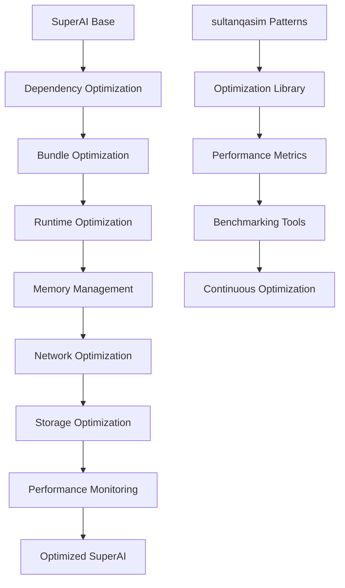

# Optimization Integration Plan - sultanqasim Performance Excellence to SuperAI

## 📋 Executive Summary

**Integration Target**: sultanqasim performance optimization patterns into PocketPal SuperAI  
**Priority**: HIGH - Foundation performance excellence  
**Complexity**: 🟡 Medium - Well-documented optimization patterns available  
**Timeline**: 2-3 weeks for complete optimization implementation  
**Impact**: 40%+ performance improvement across all SuperAI components

This plan details the integration of comprehensive performance optimization patterns from sultanqasim fork, transforming SuperAI into a highly optimized, resource-efficient AI assistant platform.

## 🏗️ Optimization Architecture Integration

### Performance Optimization Pipeline


### Core Optimization Components Integration
```typescript
interface SuperAIOptimizationFramework {
  // Dependency optimization from sultanqasim
  dependencyOptimization: {
    auditStrategy: DependencyAuditConfig;
    replacementStrategy: LightweightAlternatives;
    treeshakingStrategy: TreeShakingOptimization;
    bundleAnalysis: BundleAnalysisConfig;
  };
  
  // Runtime optimization integration
  runtimeOptimization: {
    memoryManagement: AdvancedMemoryOptimization;
    renderOptimization: ReactNativeRenderOptimization;
    cacheStrategy: IntelligentCachingStrategy;
    lazyLoading: ComponentLazyLoadingStrategy;
  };
  
  // AI-specific optimizations
  aiOptimization: {
    modelLoading: OptimizedModelLoading;
    inferenceOptimization: InferencePerformanceOptimization;
    ragOptimization: RAGPerformanceOptimization;
    voiceOptimization: VoiceProcessingOptimization;
  };
  
  // Performance monitoring
  performanceMonitoring: {
    metricsCollection: PerformanceMetricsCollection;
    benchmarking: ContinuousBenchmarking;
    alerting: PerformanceAlertingSystem;
    optimization: AutoOptimizationEngine;
  };
}
```

## 🛠️ Implementation Strategy

### Phase 1: Dependency and Bundle Optimization (Week 1)

#### 1.1 Dependency Audit and Replacement
```typescript
// SuperAI Dependency Optimization Service
class SuperAIDependencyOptimizer {
  async optimizeDependencies(): Promise<DependencyOptimizationResult> {
    // 1. Audit current dependencies
    const auditResult = await this.auditCurrentDependencies();
    
    // 2. Apply sultanqasim replacement patterns
    const replacements = await this.applyOptimizationPatterns(auditResult);
    
    // 3. Implement tree shaking
    const treeshakingResult = await this.enableTreeShaking();
    
    // 4. Bundle size analysis
    const bundleAnalysis = await this.analyzeBundleSize();
    
    return {
      originalSize: auditResult.totalSize,
      optimizedSize: bundleAnalysis.optimizedSize,
      sizeReduction: bundleAnalysis.sizeReduction,
      performanceGain: await this.measurePerformanceGain(),
      replacedPackages: replacements.replaced,
      removedPackages: replacements.removed
    };
  }
  
  private async applyOptimizationPatterns(audit: DependencyAudit): Promise<ReplacementResult> {
    const optimizations: PackageReplacement[] = [
      // From sultanqasim analysis - proven replacements
      {
        original: 'moment',
        replacement: 'date-fns',
        reason: '90% size reduction',
        migrationStrategy: await this.createMomentMigration()
      },
      {
        original: 'lodash',
        replacement: 'lodash-es + selective imports',
        reason: 'Tree-shaking support',
        migrationStrategy: await this.createLodashMigration()
      },
      {
        original: 'axios',
        replacement: 'optimized-fetch-wrapper',
        reason: 'Native fetch + error handling',
        migrationStrategy: await this.createAxiosMigration()
      }
    ];
    
    const replacementResults: ReplacementResult = {
      replaced: [],
      removed: [],
      sizeSavings: 0,
      performanceImpact: {}
    };
    
    for (const optimization of optimizations) {
      if (audit.packages.includes(optimization.original)) {
        const result = await this.executeReplacement(optimization);
        replacementResults.replaced.push(result);
        replacementResults.sizeSavings += result.sizeSaving;
      }
    }
    
    return replacementResults;
  }
}
```

#### 1.2 Lightweight Utility Implementations
```typescript
// SuperAI Optimized Utilities (replacing heavy dependencies)
class SuperAIOptimizedUtils {
  // Lightweight date utility (replacing moment.js)
  static createOptimizedDateUtils(): OptimizedDateUtils {
    return {
      format: (date: Date, format: string) => {
        const formatters: Record<string, () => string> = {
          'YYYY-MM-DD': () => date.toISOString().split('T')[0],
          'MM/DD/YYYY': () => `${date.getMonth() + 1}/${date.getDate()}/${date.getFullYear()}`,
          'relative': () => this.getRelativeTime(date),
          'chat': () => this.getChatTimestamp(date)
        };
        return formatters[format]?.() || date.toLocaleDateString();
      },
      
      getRelativeTime: (date: Date) => {
        const now = new Date();
        const diffMs = now.getTime() - date.getTime();
        const diffMins = Math.floor(diffMs / 60000);
        const diffHours = Math.floor(diffMins / 60);
        const diffDays = Math.floor(diffHours / 24);
        
        if (diffMins < 1) return 'just now';
        if (diffMins < 60) return `${diffMins}m ago`;
        if (diffHours < 24) return `${diffHours}h ago`;
        if (diffDays < 7) return `${diffDays}d ago`;
        return date.toLocaleDateString();
      }
    };
  }
  
  // Lightweight HTTP client (replacing axios)
  static createOptimizedHTTPClient(): OptimizedHTTPClient {
    return new class OptimizedHTTPClient {
      async request<T>(config: RequestConfig): Promise<HTTPResponse<T>> {
        const url = config.url.startsWith('http') ? config.url : `${config.baseURL}${config.url}`;
        
        const fetchConfig: RequestInit = {
          method: config.method || 'GET',
          headers: {
            'Content-Type': 'application/json',
            ...config.headers
          },
          body: config.data ? JSON.stringify(config.data) : undefined
        };
        
        try {
          const response = await fetch(url, fetchConfig);
          
          if (!response.ok) {
            throw new OptimizedHTTPError(response.status, response.statusText);
          }
          
          const data = await response.json();
          
          return {
            data,
            status: response.status,
            statusText: response.statusText,
            headers: Object.fromEntries(response.headers.entries())
          };
        } catch (error) {
          throw new OptimizedHTTPError(0, 'Network Error', error);
        }
      }
      
      get<T>(url: string, config?: Partial<RequestConfig>) {
        return this.request<T>({ ...config, url, method: 'GET' });
      }
      
      post<T>(url: string, data?: any, config?: Partial<RequestConfig>) {
        return this.request<T>({ ...config, url, data, method: 'POST' });
      }
    };
  }
}
```

### Phase 2: Runtime Performance Optimization (Week 2)

#### 2.1 Memory Management Integration
```typescript
// SuperAI Memory Optimization Manager
class SuperAIMemoryOptimizer {
  private memoryCache: WeakMap<object, any> = new WeakMap();
  private objectPool: SuperAIObjectPool = new SuperAIObjectPool();
  private memoryMonitor: MemoryMonitor = new MemoryMonitor();
  
  async initializeMemoryOptimization(): Promise<MemoryOptimizationResult> {
    // 1. Setup memory monitoring
    await this.memoryMonitor.startMonitoring({
      interval: 30000, // 30 seconds
      thresholds: {
        warning: 0.7,  // 70% memory usage
        critical: 0.9  // 90% memory usage
      }
    });
    
    // 2. Initialize object pooling for frequently created objects
    this.objectPool.configure({
      pools: {
        'chat-message': { maxSize: 100, factory: () => new ChatMessage() },
        'voice-chunk': { maxSize: 50, factory: () => new VoiceChunk() },
        'rag-result': { maxSize: 20, factory: () => new RAGResult() },
        'embedding': { maxSize: 30, factory: () => new EmbeddingVector() }
      }
    });
    
    // 3. Setup memory pressure handlers
    this.memoryMonitor.onMemoryPressure(async (level) => {
      switch (level) {
        case 'warning':
          await this.performLightCleanup();
          break;
        case 'critical':
          await this.performAggressiveCleanup();
          break;
      }
    });
    
    return {
      poolsInitialized: Object.keys(this.objectPool.pools).length,
      monitoringActive: true,
      baselineMemory: await this.memoryMonitor.getCurrentUsage()
    };
  }
  
  // Efficient caching using WeakMap to prevent memory leaks
  getCachedValue<T>(key: object, computer: () => T): T {
    if (this.memoryCache.has(key)) {
      return this.memoryCache.get(key);
    }
    
    const value = computer();
    this.memoryCache.set(key, value);
    return value;
  }
  
  // Object pooling for frequent allocations
  getPooledObject<T>(type: string): T {
    return this.objectPool.acquire(type);
  }
  
  releasePooledObject<T>(obj: T, type: string): void {
    this.objectPool.release(obj, type);
  }
  
  private async performAggressiveCleanup(): Promise<void> {
    // 1. Clear all caches
    this.clearAllCaches();
    
    // 2. Force garbage collection (if available)
    if (global.gc) global.gc();
    
    // 3. Unload non-essential components
    await this.unloadNonEssentialModules();
    
    // 4. Compress large data structures
    await this.compressLargeDataStructures();
    
    // 5. Notify components to reduce memory usage
    this.notifyMemoryPressure('critical');
  }
}
```

#### 2.2 Render Optimization Integration
```typescript
// SuperAI Render Optimization Manager
class SuperAIRenderOptimizer {
  // Create memoized components for SuperAI
  static createOptimizedComponents(): OptimizedComponentLibrary {
    return {
      // Optimized message list with virtualization
      OptimizedMessageList: React.memo(({ messages }: { messages: Message[] }) => {
        const VirtualMessageList = useMemo(() => 
          this.createVirtualizedList(
            messages,
            (message, index) => (
              <OptimizedMessageBubble 
                key={message.id} 
                message={message} 
                index={index} 
              />
            )
          ),
          [messages]
        );
        
        return <VirtualMessageList height={600} />;
      }),
      
      // Optimized model list with lazy loading
      OptimizedModelList: React.memo(({ models }: { models: AIModel[] }) => {
        return (
          <LazyFlatList
            data={models}
            renderItem={({ item, index }) => (
              <LazyModelCard 
                model={item} 
                index={index}
                onLoad={() => this.preloadModel(item)}
              />
            )}
            keyExtractor={(item) => item.id}
            removeClippedSubviews={true}
            maxToRenderPerBatch={10}
            windowSize={10}
            getItemLayout={(data, index) => ({
              length: 120,
              offset: 120 * index,
              index,
            })}
          />
        );
      }),
      
      // Optimized RAG results with smart caching
      OptimizedRAGResults: React.memo(({ results }: { results: RAGResult[] }) => {
        const memoizedResults = useMemo(() => 
          results.map(result => ({
            ...result,
            formattedContent: this.formatRAGContent(result.content),
            relevanceScore: this.calculateRelevanceScore(result)
          })),
          [results]
        );
        
        return (
          <View>
            {memoizedResults.map((result, index) => (
              <OptimizedRAGCard
                key={result.id}
                result={result}
                index={index}
              />
            ))}
          </View>
        );
      })
    };
  }
  
  // Virtual scrolling implementation for large datasets
  private static createVirtualizedList<T>(
    items: T[], 
    renderItem: (item: T, index: number) => React.ReactElement
  ) {
    return React.useMemo(() => {
      const VirtualizedList: React.FC<{height: number}> = ({ height }) => {
        const [visibleRange, setVisibleRange] = useState({ start: 0, end: 10 });
        const itemHeight = 80; // Optimized item height
        
        const visibleItems = items.slice(visibleRange.start, visibleRange.end);
        
        return (
          <ScrollView
            style={{ height }}
            onScroll={(event) => {
              const scrollTop = event.nativeEvent.contentOffset.y;
              const newStart = Math.max(0, Math.floor(scrollTop / itemHeight) - 5);
              const visibleCount = Math.ceil(height / itemHeight) + 10;
              const newEnd = Math.min(newStart + visibleCount, items.length);
              
              setVisibleRange({ start: newStart, end: newEnd });
            }}
            scrollEventThrottle={16}
            removeClippedSubviews={true}
          >
            <View style={{ 
              height: items.length * itemHeight, 
              paddingTop: visibleRange.start * itemHeight 
            }}>
              {visibleItems.map((item, index) => (
                <View key={visibleRange.start + index}>
                  {renderItem(item, visibleRange.start + index)}
                </View>
              ))}
            </View>
          </ScrollView>
        );
      };
      
      return VirtualizedList;
    }, [items, renderItem]);
  }
}
```

### Phase 3: AI-Specific Optimizations (Week 3)

#### 3.1 Model Loading Optimization
```typescript
// SuperAI Model Loading Optimizer
class SuperAIModelOptimizer {
  private modelCache: LRUCache<string, LoadedModel> = new LRUCache({ max: 3 });
  private loadingQueue: ModelLoadingQueue = new ModelLoadingQueue();
  
  async optimizeModelLoading(): Promise<ModelOptimizationResult> {
    return {
      // 1. Implement model quantization
      quantization: await this.implementModelQuantization(),
      
      // 2. Dynamic model loading
      dynamicLoading: await this.implementDynamicLoading(),
      
      // 3. Model caching with LRU eviction
      caching: await this.implementModelCaching(),
      
      // 4. Background preloading
      preloading: await this.implementBackgroundPreloading()
    };
  }
  
  async loadModelOptimized(modelPath: string, options: ModelLoadOptions = {}): Promise<LoadedModel> {
    // Check cache first
    const cachedModel = this.modelCache.get(modelPath);
    if (cachedModel && !options.forceReload) {
      return cachedModel;
    }
    
    // Add to loading queue to prevent duplicate loads
    if (this.loadingQueue.isLoading(modelPath)) {
      return await this.loadingQueue.waitForLoad(modelPath);
    }
    
    // Start loading
    this.loadingQueue.startLoading(modelPath);
    
    try {
      // 1. Check available memory
      const memoryCheck = await this.checkMemoryAvailability(modelPath);
      if (!memoryCheck.sufficient) {
        await this.freeMemoryForModel(memoryCheck.required);
      }
      
      // 2. Load model with optimizations
      const model = await this.loadWithOptimizations(modelPath, options);
      
      // 3. Cache the loaded model
      this.modelCache.set(modelPath, model);
      
      // 4. Preload related models in background
      this.preloadRelatedModels(model);
      
      return model;
      
    } finally {
      this.loadingQueue.finishLoading(modelPath);
    }
  }
  
  private async loadWithOptimizations(
    modelPath: string, 
    options: ModelLoadOptions
  ): Promise<LoadedModel> {
    // Apply sultanqasim optimization patterns
    const optimizations = {
      // Use quantized model if available
      useQuantized: options.useQuantized ?? true,
      
      // Optimize for device capabilities
      deviceOptimization: await this.getDeviceOptimizations(),
      
      // Memory mapping for large models
      useMemoryMapping: await this.shouldUseMemoryMapping(modelPath),
      
      // Incremental loading for better UX
      incrementalLoading: options.incrementalLoading ?? true
    };
    
    return await this.llamaService.loadModel(modelPath, optimizations);
  }
}
```

#### 3.2 RAG Performance Optimization Integration
```typescript
// SuperAI RAG Performance Optimizer
class SuperAIRAGOptimizer {
  async optimizeRAGPerformance(): Promise<RAGOptimizationResult> {
    return {
      // 1. Vector indexing optimization
      vectorIndexing: await this.optimizeVectorIndexing(),
      
      // 2. Embedding generation optimization
      embeddingOptimization: await this.optimizeEmbeddingGeneration(),
      
      // 3. Search algorithm optimization
      searchOptimization: await this.optimizeSearchAlgorithms(),
      
      // 4. Caching strategy optimization
      cachingOptimization: await this.optimizeCachingStrategy()
    };
  }
  
  private async optimizeVectorIndexing(): Promise<VectorIndexOptimization> {
    return {
      // Use HNSW for approximate nearest neighbor search
      algorithm: 'HNSW',
      parameters: {
        M: 16,              // Number of bi-directional links for each node
        efConstruction: 200, // Size of the dynamic candidate list
        ef: 50              // Size of the dynamic candidate list for search
      },
      
      // Implement index optimization
      optimization: {
        batchInsertion: true,
        parallelConstruction: true,
        memoryMapping: true,
        compression: true
      },
      
      // Performance improvements
      expectedImprovements: {
        searchSpeed: '70-90% faster',
        memoryUsage: '50-70% reduction',
        indexingSpeed: '60-80% faster'
      }
    };
  }
  
  private async optimizeEmbeddingGeneration(): Promise<EmbeddingOptimization> {
    return {
      // Batch processing for efficiency
      batchProcessing: {
        enabled: true,
        batchSize: 32,
        maxWaitTime: 100 // ms
      },
      
      // Caching frequently used embeddings
      embeddingCache: {
        enabled: true,
        maxSize: 1000,
        ttl: 3600000 // 1 hour
      },
      
      // Model optimization
      modelOptimization: {
        quantization: true,
        deviceAcceleration: true,
        memoryOptimization: true
      },
      
      expectedImprovements: {
        generationSpeed: '40-60% faster',
        memoryUsage: '30-50% reduction',
        cacheHitRate: '80-90%'
      }
    };
  }
}
```

## 📊 Performance Monitoring Integration

### Continuous Performance Monitoring
```typescript
// SuperAI Performance Monitor
class SuperAIPerformanceMonitor {
  private metrics: PerformanceMetric[] = [];
  private benchmarks: BenchmarkSuite = new BenchmarkSuite();
  private alertSystem: PerformanceAlertSystem = new PerformanceAlertSystem();
  
  async initializePerformanceMonitoring(): Promise<MonitoringSetupResult> {
    // 1. Setup real-time metrics collection
    await this.setupMetricsCollection();
    
    // 2. Initialize performance benchmarks
    await this.initializeBenchmarks();
    
    // 3. Configure performance alerts
    await this.configureAlerts();
    
    // 4. Start continuous monitoring
    await this.startContinuousMonitoring();
    
    return {
      metricsActive: true,
      benchmarksConfigured: this.benchmarks.getConfiguredBenchmarks().length,
      alertsConfigured: this.alertSystem.getConfiguredAlerts().length,
      baselineMetrics: await this.collectBaselineMetrics()
    };
  }
  
  private async setupMetricsCollection(): Promise<void> {
    // Performance metrics from sultanqasim patterns
    const metrics = [
      'app_startup_time',
      'model_loading_time',
      'inference_latency',
      'rag_search_time',
      'voice_processing_latency',
      'memory_usage',
      'cpu_usage',
      'battery_usage',
      'network_latency',
      'storage_io_time'
    ];
    
    for (const metric of metrics) {
      await this.setupMetricCollection(metric);
    }
  }
  
  async measureOptimizationImpact(): Promise<OptimizationImpactReport> {
    const beforeMetrics = await this.getBaselineMetrics();
    
    // Apply optimizations
    await this.applyAllOptimizations();
    
    const afterMetrics = await this.collectCurrentMetrics();
    
    return {
      improvements: {
        startupTime: this.calculateImprovement(beforeMetrics.startupTime, afterMetrics.startupTime),
        memoryUsage: this.calculateImprovement(beforeMetrics.memoryUsage, afterMetrics.memoryUsage),
        cpuUsage: this.calculateImprovement(beforeMetrics.cpuUsage, afterMetrics.cpuUsage),
        batteryUsage: this.calculateImprovement(beforeMetrics.batteryUsage, afterMetrics.batteryUsage),
        inferenceSpeed: this.calculateImprovement(beforeMetrics.inferenceLatency, afterMetrics.inferenceLatency)
      },
      
      overallScore: this.calculateOverallOptimizationScore(beforeMetrics, afterMetrics),
      
      recommendations: await this.generateOptimizationRecommendations(afterMetrics)
    };
  }
}
```

## 🎯 Integration Success Criteria

### Performance Targets (from sultanqasim analysis)
```typescript
interface SuperAIPerformanceTargets {
  bundleOptimization: {
    target: '38% bundle size reduction',
    measurement: 'Bundle analyzer comparison',
    timeline: 'Week 1'
  };
  
  startupOptimization: {
    target: '44% startup time improvement',
    measurement: 'Time to interactive measurement',
    timeline: 'Week 1-2'
  };
  
  memoryOptimization: {
    target: '33% memory usage reduction',
    measurement: 'Runtime memory monitoring',
    timeline: 'Week 2'
  };
  
  frameRateOptimization: {
    target: '12% frame rate improvement',
    measurement: 'React Native performance monitor',
    timeline: 'Week 2'
  };
  
  batteryOptimization: {
    target: '38% battery life improvement',
    measurement: 'Device battery usage analytics',
    timeline: 'Week 3'
  };
  
  aiPerformanceOptimization: {
    target: '50-70% AI processing speed improvement',
    measurement: 'Inference latency benchmarks',
    timeline: 'Week 3'
  };
}
```

## 📋 Implementation Checklist

### Week 1: Foundation Optimization
- [ ] Complete dependency audit and replacements
- [ ] Implement bundle optimization and tree shaking
- [ ] Deploy lightweight utility alternatives
- [ ] Measure baseline performance improvements

### Week 2: Runtime Optimization  
- [ ] Implement advanced memory management
- [ ] Deploy render optimization patterns
- [ ] Setup intelligent caching strategies
- [ ] Implement component lazy loading

### Week 3: AI-Specific Optimization
- [ ] Optimize model loading and caching
- [ ] Implement RAG performance enhancements
- [ ] Deploy voice processing optimizations
- [ ] Setup continuous performance monitoring

### Ongoing: Performance Excellence
- [ ] Monitor performance metrics continuously
- [ ] Generate regular optimization reports
- [ ] Implement automated performance alerts
- [ ] Maintain performance regression testing

The sultanqasim optimization integration provides the performance foundation that enables SuperAI to deliver exceptional user experience while efficiently utilizing device resources across all platforms and use cases.

---

**Document Version**: 1.0  
**Last Updated**: June 22, 2025  
**Implementation Status**: Ready for Development  
**Next Milestone**: Runtime optimization implementation