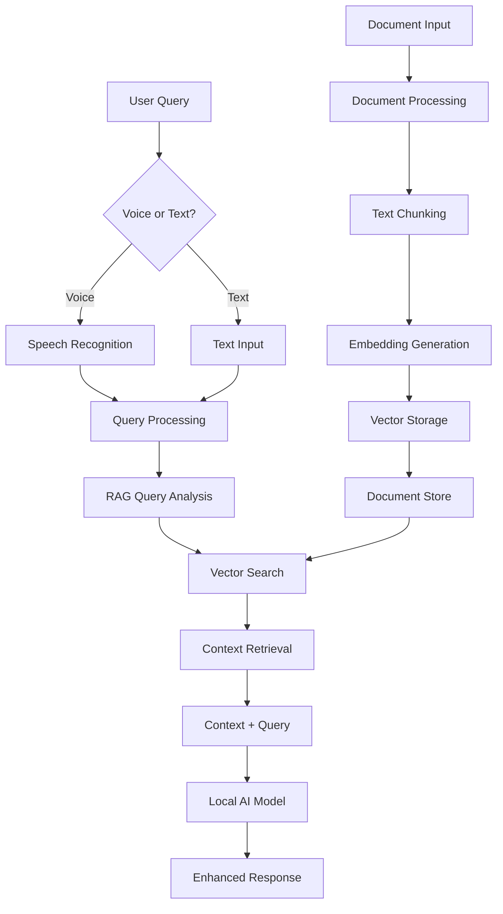

# RAG Integration Plan - TIC-13 Complete System to SuperAI

## 📋 Executive Summary

**Reference Source**: TIC-13 Complete RAG Ecosystem (3 repositories)  
**Priority**: HIGHEST - Complete reference system available for implementation guidance  
**Complexity**: 🟡 MEDIUM - All reference patterns exist and can be adapted  
**Timeline**: 4-6 weeks for implementation based on reference patterns  
**Impact**: 🎯 **RESEARCH BREAKTHROUGH** - Complete RAG reference system discovered

🎯 **MAJOR DISCOVERY**: Complete, functional RAG reference implementation found across TIC-13's three repositories. Provides comprehensive implementation guidance and proven patterns!

## 🏗️ RAG Architecture Design

### High-Level Integration Flow


### Core RAG Components

#### 1. Document Processing Pipeline
```typescript
interface DocumentProcessor {
  // Document ingestion
  ingestDocument(filePath: string, metadata?: object): Promise<DocumentInfo>;
  
  // Text extraction
  extractText(filePath: string, format: DocumentFormat): Promise<string>;
  
  // Chunking strategies
  chunkText(text: string, strategy: ChunkingStrategy): Promise<TextChunk[]>;
  
  // Preprocessing
  preprocessText(text: string): Promise<string>;
}

interface TextChunk {
  id: string;
  content: string;
  metadata: ChunkMetadata;
  documentId: string;
  position: number;
  tokens: number;
}
```

#### 2. Vector Storage System
```typescript
interface VectorStore {
  // Embedding operations
  generateEmbedding(text: string): Promise<number[]>;
  
  // Storage operations
  storeVector(vector: number[], metadata: VectorMetadata): Promise<string>;
  batchStore(vectors: VectorData[]): Promise<string[]>;
  
  // Search operations
  search(queryVector: number[], k: number, filters?: object): Promise<SearchResult[]>;
  
  // Management operations
  deleteVector(id: string): Promise<boolean>;
  updateVector(id: string, vector: number[], metadata?: object): Promise<boolean>;
  getStats(): Promise<VectorStoreStats>;
}

interface SearchResult {
  id: string;
  content: string;
  score: number;
  metadata: VectorMetadata;
  chunk: TextChunk;
}
```

#### 3. RAG Query Engine
```typescript
interface RAGEngine {
  // Query processing
  processQuery(query: string, options?: RAGOptions): Promise<RAGResponse>;
  
  // Context building
  buildContext(searchResults: SearchResult[], maxTokens: number): Promise<string>;
  
  // Response enhancement
  enhanceResponse(originalResponse: string, context: string): Promise<string>;
  
  // Knowledge management
  addKnowledge(content: string, metadata?: object): Promise<void>;
  removeKnowledge(documentId: string): Promise<void>;
  updateKnowledge(documentId: string, content: string): Promise<void>;
}
```

## 🛠️ Implementation Strategy - USING EXISTING COMPONENTS

### 📋 Available Reference Implementation

#### Repository Reference Analysis
| Component | Repository | Reference Status | Implementation Guidance |
|-----------|------------|------------------|-------------------------|
| **Data Pipeline** | `TIC-13/RAG` | Complete patterns | Python chunking + MediaPipe embedding approach |
| **React Native Bridge** | `TIC-13/rag-pocketpal-ai` | Complete interface design | `src/native/Rag.ts` interface pattern |
| **Android Native** | `TIC-13/mlc-llm_rag` | Complete implementation | HNSW + TextEmbedder reference |
| **iOS Native** | Development needed | Android patterns available | Port Android patterns to iOS |

### Phase 1: Study Reference Implementation (Week 1-2)

#### 1.1 Vector Storage Implementation Analysis
**Reference Technology**: HNSW (Hierarchical Navigable Small World) algorithm  
**Reference Library**: `hnswlib-core:1.1.2` and `hnswlib-utils:1.1.2`  
**Status**: 📋 **Reference implementation pattern available for study**

```kotlin
// From TIC-13/mlc-llm_rag - Reference implementation pattern to study
val embedResult = textEmbedder.embed(prompt)
val embedding = embedResult?.embedding?.floatEmbedding()
val retrieved = hnswIndex.findNearest(embedding, 2)
```

```sql
-- Vector storage schema
CREATE TABLE documents (
    id TEXT PRIMARY KEY,
    title TEXT,
    content TEXT,
    metadata JSON,
    created_at TIMESTAMP,
    updated_at TIMESTAMP
);

CREATE TABLE chunks (
    id TEXT PRIMARY KEY,
    document_id TEXT,
    content TEXT,
    position INTEGER,
    tokens INTEGER,
    metadata JSON,
    FOREIGN KEY(document_id) REFERENCES documents(id)
);

CREATE TABLE vectors (
    id TEXT PRIMARY KEY,
    chunk_id TEXT,
    embedding BLOB,
    dimension INTEGER,
    FOREIGN KEY(chunk_id) REFERENCES chunks(id)
);

-- Vector similarity search using SQLite extensions
-- (Implementation depends on chosen vector extension)
```

#### 1.2 React Native Bridge Setup
```typescript
// Native module interface
interface RAGNativeModule {
  // Document processing
  processDocument(filePath: string): Promise<DocumentProcessingResult>;
  
  // Vector operations
  generateEmbedding(text: string): Promise<number[]>;
  storeVector(embedding: number[], metadata: string): Promise<string>;
  searchVectors(queryEmbedding: number[], k: number): Promise<SearchResult[]>;
  
  // Database operations
  initializeDatabase(): Promise<boolean>;
  getDatabaseStats(): Promise<DatabaseStats>;
  cleanupDatabase(): Promise<void>;
}

// JavaScript interface
class RAGService {
  private nativeModule: RAGNativeModule;
  
  async ingestDocument(filePath: string, metadata?: object): Promise<string> {
    // Implementation
  }
  
  async searchKnowledge(query: string, maxResults: number = 5): Promise<SearchResult[]> {
    // Implementation
  }
  
  async enhanceResponse(query: string, originalResponse: string): Promise<string> {
    // Implementation
  }
}
```

#### 1.3 Basic UI Integration
```typescript
// Enhanced chat input with RAG indicator
interface ChatInputProps {
  onSendMessage: (message: Message) => void;
  ragEnabled: boolean;
  knowledgeBaseStatus: 'empty' | 'loading' | 'ready';
}

// RAG status indicator
const RAGStatusIndicator: React.FC<{status: RAGStatus}> = ({status}) => {
  const getStatusColor = () => {
    switch(status) {
      case 'ready': return '#4CAF50';
      case 'searching': return '#FF9800';
      case 'disabled': return '#9E9E9E';
      default: return '#F44336';
    }
  };
  
  return (
    <View style={styles.ragIndicator}>
      <Icon name="database" color={getStatusColor()} size={16} />
      <Text style={[styles.ragText, {color: getStatusColor()}]}>
        {status}
      </Text>
    </View>
  );
};
```

### Phase 2: Core RAG Implementation (Week 3-4)

#### 2.1 Document Processing Pipeline
```typescript
class DocumentProcessor {
  async ingestDocument(filePath: string): Promise<DocumentInfo> {
    // 1. Extract text based on file type
    const text = await this.extractText(filePath);
    
    // 2. Preprocess text (clean, normalize)
    const cleanedText = await this.preprocessText(text);
    
    // 3. Chunk text using optimal strategy
    const chunks = await this.chunkText(cleanedText, {
      strategy: 'semantic',
      maxTokens: 512,
      overlap: 50
    });
    
    // 4. Generate embeddings for each chunk
    const embeddedChunks = await Promise.all(
      chunks.map(chunk => this.embedChunk(chunk))
    );
    
    // 5. Store in vector database
    const documentId = await this.storeDocument(embeddedChunks);
    
    return {
      id: documentId,
      title: path.basename(filePath),
      chunkCount: chunks.length,
      tokensProcessed: chunks.reduce((sum, chunk) => sum + chunk.tokens, 0)
    };
  }
  
  private async chunkText(text: string, options: ChunkingOptions): Promise<TextChunk[]> {
    // Implement intelligent chunking
    // - Sentence boundary awareness
    // - Semantic coherence
    // - Token limit compliance
    // - Overlap management
  }
}
```

#### 2.2 Embedding Model Integration
```typescript
class EmbeddingService {
  private model: LocalEmbeddingModel;
  
  async generateEmbedding(text: string): Promise<number[]> {
    // Use local embedding model for privacy
    // Options: sentence-transformers, universal-sentence-encoder
    const preprocessed = this.preprocessForEmbedding(text);
    const embedding = await this.model.encode(preprocessed);
    return Array.from(embedding);
  }
  
  private preprocessForEmbedding(text: string): string {
    // Normalize text for consistent embeddings
    return text
      .toLowerCase()
      .replace(/\s+/g, ' ')
      .trim();
  }
}
```

#### 2.3 Search and Retrieval System
```typescript
class RAGSearchEngine {
  async search(query: string, options: SearchOptions): Promise<SearchResult[]> {
    // 1. Generate query embedding
    const queryEmbedding = await this.embeddingService.generateEmbedding(query);
    
    // 2. Perform vector similarity search
    const candidates = await this.vectorStore.search(queryEmbedding, options.maxResults * 2);
    
    // 3. Re-rank results based on additional factors
    const rankedResults = await this.rerank(candidates, query, options);
    
    // 4. Filter and limit results
    return rankedResults.slice(0, options.maxResults);
  }
  
  private async rerank(candidates: SearchResult[], query: string, options: SearchOptions): Promise<SearchResult[]> {
    // Implement sophisticated re-ranking
    // - Semantic similarity scores
    // - Recency weighting
    // - Document source credibility
    // - Query-context matching
  }
}
```

### Phase 3: Advanced Features (Week 5-6)

#### 3.1 Context-Aware Response Generation
```typescript
class RAGResponseGenerator {
  async generateEnhancedResponse(
    userQuery: string, 
    retrievedContext: SearchResult[], 
    baseResponse: string
  ): Promise<EnhancedResponse> {
    
    // 1. Build context prompt
    const contextPrompt = this.buildContextPrompt(retrievedContext, userQuery);
    
    // 2. Inject context into AI model prompt
    const enhancedPrompt = this.constructEnhancedPrompt(
      userQuery, 
      contextPrompt, 
      baseResponse
    );
    
    // 3. Generate context-aware response
    const enhancedResponse = await this.aiModel.generate(enhancedPrompt);
    
    // 4. Validate and clean response
    const validatedResponse = this.validateResponse(enhancedResponse);
    
    return {
      response: validatedResponse,
      sourcesUsed: retrievedContext,
      confidence: this.calculateConfidence(retrievedContext),
      contextRelevance: this.assessRelevance(userQuery, retrievedContext)
    };
  }
  
  private buildContextPrompt(context: SearchResult[], query: string): string {
    const contextItems = context.map((item, index) => 
      `[${index + 1}] ${item.content}`
    ).join('\n\n');
    
    return `
Context Information:
${contextItems}

User Query: ${query}

Please provide a response based on the context above. If the context doesn't contain relevant information, indicate that clearly.
    `.trim();
  }
}
```

#### 3.2 Voice + RAG Integration
```typescript
class VoiceRAGIntegration {
  async processVoiceQuery(audioPath: string): Promise<RAGResponse> {
    // 1. Transcribe voice to text (using rich-piana implementation)
    const transcribedQuery = await this.voiceService.transcribe(audioPath);
    
    // 2. Process with RAG
    const ragResponse = await this.ragEngine.processQuery(transcribedQuery);
    
    // 3. Generate voice response (if enabled)
    const audioResponse = await this.voiceService.generateSpeech(ragResponse.response);
    
    return {
      ...ragResponse,
      originalAudio: audioPath,
      transcribedQuery,
      audioResponse: audioResponse
    };
  }
}
```

## 📱 Platform Implementation Details

### iOS Implementation
```swift
// iOS RAG Native Module
@objc(RAGModule)
class RAGModule: NSObject, RCTBridgeModule {
  
  static func moduleName() -> String! {
    return "RAGModule"
  }
  
  @objc func generateEmbedding(_ text: String, resolver: @escaping RCTPromiseResolveBlock, rejecter: @escaping RCTPromiseRejectBlock) {
    // Implement using iOS ML frameworks
    // - Core ML for embedding models
    // - Metal Performance Shaders for vector operations
    // - SQLite with custom vector functions
  }
  
  @objc func searchVectors(_ queryEmbedding: [NSNumber], k: NSNumber, resolver: @escaping RCTPromiseResolveBlock, rejecter: @escaping RCTPromiseRejectBlock) {
    // Implement vector search using iOS-optimized algorithms
  }
}
```

### Android Implementation
```kotlin
// Android RAG Native Module
class RAGModule(reactContext: ReactApplicationContext) : ReactContextBaseJavaModule(reactContext) {
    
    override fun getName(): String {
        return "RAGModule"
    }
    
    @ReactMethod
    fun generateEmbedding(text: String, promise: Promise) {
        try {
            // Implement using Android ML frameworks
            // - TensorFlow Lite for embedding models
            // - Android NN API for acceleration
            // - SQLite with custom vector extensions
            val embedding = embeddingModel.encode(text)
            promise.resolve(embedding.toList())
        } catch (e: Exception) {
            promise.reject("EMBEDDING_ERROR", e.message)
        }
    }
    
    @ReactMethod
    fun searchVectors(queryEmbedding: ReadableArray, k: Int, promise: Promise) {
        // Implement vector search with Android optimizations
    }
}
```

## 🔧 Performance Optimization

### Mobile-Specific Optimizations
1. **Memory Management**
   ```typescript
   class MemoryOptimizedVectorStore {
     private cache: LRUCache<string, number[]>;
     private batchSize: number = 100;
     
     async batchProcess(items: any[]): Promise<void> {
       for (let i = 0; i < items.length; i += this.batchSize) {
         const batch = items.slice(i, i + this.batchSize);
         await this.processBatch(batch);
         
         // Memory cleanup between batches
         if (global.gc) global.gc();
       }
     }
   }
   ```

2. **Storage Optimization**
   ```sql
   -- Compressed vector storage
   CREATE TABLE vectors_compressed (
       id TEXT PRIMARY KEY,
       chunk_id TEXT,
       embedding_compressed BLOB,  -- Using quantization
       dimension INTEGER,
       compression_type TEXT
   );
   ```

3. **Search Optimization**
   ```typescript
   class OptimizedSearch {
     async search(query: string, options: SearchOptions): Promise<SearchResult[]> {
       // 1. Use approximate search for speed
       const candidates = await this.approximateSearch(query, options.maxResults * 3);
       
       // 2. Refine with exact search on top candidates
       const refined = await this.exactSearch(candidates.slice(0, options.maxResults * 2));
       
       return refined.slice(0, options.maxResults);
     }
   }
   ```

## 📊 Integration Testing Strategy

### Unit Tests
```typescript
describe('RAG System', () => {
  describe('Document Processing', () => {
    it('should extract text from PDF documents', async () => {
      const processor = new DocumentProcessor();
      const result = await processor.extractText('test.pdf', 'pdf');
      expect(result).toBeDefined();
      expect(result.length).toBeGreaterThan(0);
    });
    
    it('should chunk text optimally', async () => {
      const processor = new DocumentProcessor();
      const chunks = await processor.chunkText(longText, {
        strategy: 'semantic',
        maxTokens: 512,
        overlap: 50
      });
      expect(chunks).toBeDefined();
      expect(chunks.every(chunk => chunk.tokens <= 512)).toBe(true);
    });
  });
  
  describe('Vector Operations', () => {
    it('should generate consistent embeddings', async () => {
      const service = new EmbeddingService();
      const embedding1 = await service.generateEmbedding('test text');
      const embedding2 = await service.generateEmbedding('test text');
      expect(embedding1).toEqual(embedding2);
    });
  });
});
```

### Integration Tests
```typescript
describe('RAG Integration', () => {
  it('should perform end-to-end document ingestion and search', async () => {
    const ragEngine = new RAGEngine();
    
    // Ingest document
    const docId = await ragEngine.ingestDocument('test-document.txt');
    expect(docId).toBeDefined();
    
    // Search for content
    const results = await ragEngine.search('test query');
    expect(results.length).toBeGreaterThan(0);
    expect(results[0].score).toBeGreaterThan(0.5);
  });
});
```

### Performance Tests
```typescript
describe('RAG Performance', () => {
  it('should search within acceptable time limits', async () => {
    const ragEngine = new RAGEngine();
    const startTime = Date.now();
    
    const results = await ragEngine.search('performance test query');
    const duration = Date.now() - startTime;
    
    expect(duration).toBeLessThan(100); // 100ms target
    expect(results.length).toBeGreaterThan(0);
  });
});
```

## 🎯 Success Criteria

### Functional Requirements
- [ ] Document ingestion supports PDF, TXT, MD formats
- [ ] Vector search returns results in <100ms
- [ ] Context-aware responses show measurable improvement
- [ ] Voice + RAG integration works seamlessly
- [ ] Memory usage stays under 500MB additional overhead

### Quality Requirements
- [ ] Search relevance score >0.8 for related content
- [ ] No regression in existing chat functionality
- [ ] Cross-platform compatibility maintained
- [ ] Comprehensive test coverage >80%

### Performance Requirements
- [ ] Document processing: <30 seconds for 10MB PDF
- [ ] Embedding generation: <200ms per chunk
- [ ] Vector search: <100ms response time
- [ ] Context injection: <50ms additional latency

## 🚨 Risk Mitigation

### Technical Risks
1. **Performance Degradation**: Implement progressive loading and caching
2. **Memory Issues**: Use streaming processing and cleanup
3. **Storage Limitations**: Implement compression and pagination
4. **Platform Differences**: Extensive cross-platform testing

### Implementation Risks
1. **Complexity Overload**: Start with MVP and iterate
2. **Integration Conflicts**: Careful dependency management
3. **User Experience**: Maintain responsive UI during processing
4. **Data Quality**: Implement validation and error handling

## 📋 Implementation Checklist

### Week 1-2: Foundation
- [ ] Set up SQLite vector storage
- [ ] Create React Native bridge interfaces
- [ ] Implement basic document processing
- [ ] Add simple UI indicators

### Week 3-4: Core Features
- [ ] Complete embedding integration
- [ ] Implement vector search
- [ ] Add context-aware response generation
- [ ] Integrate with existing chat system

### Week 5-6: Advanced Features
- [ ] Voice + RAG integration
- [ ] Performance optimizations
- [ ] Comprehensive testing
- [ ] Documentation and error handling

### Ongoing: Quality Assurance
- [ ] Performance monitoring
- [ ] User experience testing
- [ ] Cross-platform validation
- [ ] Security and privacy review

---

**Document Version**: 1.0  
**Last Updated**: June 22, 2025  
**Implementation Status**: Planning Complete - Ready for Development  
**Next Milestone**: Foundation Implementation (Week 1-2)