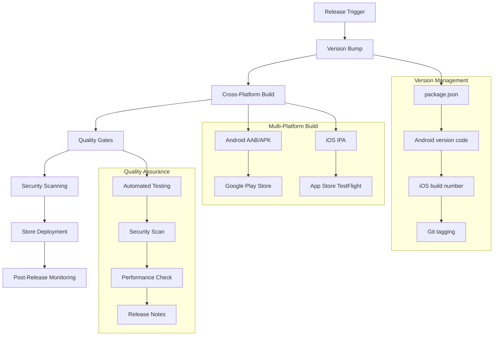

# Release Management Integration Plan - luojiaping Advanced Automation

## 📋 Executive Summary

**Reference Source**: luojiaping/pocketpal-ai - Advanced release automation and deployment system  
**Priority**: HIGH - Critical for production-ready SuperAI deployment  
**Complexity**: 🔴 HIGH - Comprehensive release pipeline with multi-platform deployment  
**Timeline**: 4-6 weeks for complete automation system  
**Impact**: Professional-grade release management with automated deployment to app stores

This plan integrates luojiaping's sophisticated release management system to establish enterprise-grade deployment automation for SuperAI, including automated version bumping, multi-platform builds, app store deployment, and comprehensive release workflows.

## 🏗️ Release Management Architecture

### Comprehensive Release Pipeline


### Release Workflow Overview
**Based on luojiaping implementation:**
```typescript
interface ReleaseManagementSystem {
  // Version control
  versionManagement: {
    semanticVersioning: boolean;
    crossPlatformSync: boolean;
    gitTagging: boolean;
    changelogGeneration: boolean;
  };
  
  // Build automation
  buildSystem: {
    parallelBuilds: boolean;
    multiPlatform: boolean;
    artifactManagement: boolean;
    distributionChannels: string[];
  };
  
  // Deployment automation
  deployment: {
    googlePlayAlpha: boolean;
    appStoreTestFlight: boolean;
    githubReleases: boolean;
    automaticRollout: boolean;
  };
  
  // Quality assurance
  qualityGates: {
    automatedTesting: boolean;
    securityScanning: boolean;
    performanceValidation: boolean;
    approvalWorkflows: boolean;
  };
}
```

## 🔧 Core Implementation Components

### Phase 1: Version Management System (Week 1-2)

#### Unified Version Bumping
**Based on luojiaping's Fastlane implementation:**
```ruby
# fastlane/Fastfile - SuperAI Release Management
desc "Bump version across all platforms"
lane :bump_version do |options|
  version_type = options[:version_type] || "patch"
  root_dir = File.expand_path('..', Dir.pwd)
  
  # Paths configuration
  package_json_path = File.join(root_dir, 'package.json')
  version_file_path = File.join(root_dir, '.version')
  changelog_path = File.join(root_dir, 'CHANGELOG.md')
  
  # 1. Bump semantic version in package.json
  Dir.chdir(root_dir) do
    sh("yarn version --#{version_type} --no-git-tag-version")
  end
  
  new_version = JSON.parse(File.read(package_json_path))['version']
  sh("echo #{new_version} > #{version_file_path}")
  
  # 2. Update Android version (version code auto-increment)
  gradle_file = File.join(root_dir, "android/app/build.gradle")
  current_version_code = android_get_version_code(gradle_file: gradle_file).to_i
  new_version_code = current_version_code + 1
  
  android_set_version_code(
    gradle_file: gradle_file,
    version_code: new_version_code
  )
  android_set_version_name(
    gradle_file: gradle_file,
    version_name: new_version
  )
  
  # 3. Update iOS version and build number
  ios_dir = File.join(root_dir, 'ios')
  Dir.chdir(ios_dir) do
    increment_version_number_in_xcodeproj(
      version_number: new_version,
      xcodeproj: File.join(ios_dir, "SuperAI.xcodeproj")
    )
    increment_build_number_in_xcodeproj(
      xcodeproj: File.join(ios_dir, "SuperAI.xcodeproj")
    )
  end
  
  # 4. Generate changelog entry
  generate_changelog_entry(new_version, version_type)
  
  # Output version information
  UI.message("🚀 SuperAI Version Bumped:")
  UI.message("  📱 Version: #{new_version}")
  UI.message("  🤖 Android Code: #{new_version_code}")
  UI.message("  🍎 iOS Build: #{get_build_number_from_xcodeproj(xcodeproj: File.join(ios_dir, 'SuperAI.xcodeproj'))}")
end
```

#### Automated Changelog Generation
```ruby
def generate_changelog_entry(version, version_type)
  # Generate changelog from git commits
  commits = sh("git log --pretty=format:'%s' $(git describe --tags --abbrev=0)..HEAD").split("\n")
  
  changelog_entry = "\n## [#{version}] - #{Date.today}\n\n"
  
  # Categorize commits
  features = commits.select { |c| c.match(/^feat(\(.+\))?:/) }
  fixes = commits.select { |c| c.match(/^fix(\(.+\))?:/) }
  breaking = commits.select { |c| c.include?('BREAKING CHANGE') }
  
  unless breaking.empty?
    changelog_entry += "### 🚨 Breaking Changes\n"
    breaking.each { |commit| changelog_entry += "- #{commit.gsub(/^[^:]+:\s*/, '')}\n" }
    changelog_entry += "\n"
  end
  
  unless features.empty?
    changelog_entry += "### ✨ New Features\n"
    features.each { |commit| changelog_entry += "- #{commit.gsub(/^feat(\(.+\))?:\s*/, '')}\n" }
    changelog_entry += "\n"
  end
  
  unless fixes.empty?
    changelog_entry += "### 🐛 Bug Fixes\n"
    fixes.each { |commit| changelog_entry += "- #{commit.gsub(/^fix(\(.+\))?:\s*/, '')}\n" }
    changelog_entry += "\n"
  end
  
  # Prepend to CHANGELOG.md
  existing_changelog = File.read("CHANGELOG.md") rescue "# Changelog\n\n"
  File.write("CHANGELOG.md", existing_changelog.sub("# Changelog\n\n", "# Changelog\n#{changelog_entry}"))
end
```

### Phase 2: CI/CD Pipeline Integration (Week 2-3)

#### GitHub Actions Release Workflow
**Enhanced from luojiaping's implementation:**
```yaml
# .github/workflows/release-superai.yml
name: SuperAI Release Pipeline

on:
  workflow_dispatch:
    inputs:
      version_type:
        description: "Version bump type"
        required: true
        default: "patch"
        type: choice
        options:
          - major      # Breaking changes
          - minor      # New features
          - patch      # Bug fixes
          - premajor   # Pre-release major
          - preminor   # Pre-release minor
          - prepatch   # Pre-release patch
          - prerelease # Pre-release increment
      
      release_channel:
        description: "Release channel"
        required: true
        default: "alpha"
        type: choice
        options:
          - alpha      # Internal testing
          - beta       # Beta testing
          - production # Production release

env:
  NODE_VERSION: '20.x'
  JAVA_VERSION: '17'
  RUBY_VERSION: '3.2.3'

jobs:
  # Pre-flight checks and validation
  preflight:
    runs-on: ubuntu-latest
    outputs:
      should_continue: ${{ steps.validation.outputs.should_continue }}
      version: ${{ steps.version.outputs.version }}
    
    steps:
      - name: Checkout code
        uses: actions/checkout@v4
        with:
          fetch-depth: 0
          ssh-key: ${{ secrets.DEPLOY_KEY }}
      
      - name: Validate release conditions
        id: validation
        run: |
          # Check if main branch is clean
          if [ "$(git rev-parse --abbrev-ref HEAD)" != "main" ]; then
            echo "❌ Releases must be from main branch"
            exit 1
          fi
          
          # Check for uncommitted changes
          if [ -n "$(git status --porcelain)" ]; then
            echo "❌ Working directory not clean"
            exit 1
          fi
          
          # Validate that all tests pass
          echo "✅ Pre-flight checks passed"
          echo "should_continue=true" >> $GITHUB_OUTPUT
  
  # Android build and deployment
  build_android:
    needs: preflight
    if: needs.preflight.outputs.should_continue == 'true'
    runs-on: ubuntu-latest
    permissions:
      contents: write
      id-token: write
    
    steps:
      - name: Checkout code
        uses: actions/checkout@v4
        with:
          fetch-depth: 0
          ssh-key: ${{ secrets.DEPLOY_KEY }}
      
      - name: Setup build environment
        uses: ./.github/actions/setup-build-env
        with:
          node-version: ${{ env.NODE_VERSION }}
          java-version: ${{ env.JAVA_VERSION }}
          ruby-version: ${{ env.RUBY_VERSION }}
      
      - name: Configure release environment
        run: |
          # Create environment configuration
          echo "ANTHROPIC_API_KEY=${{ secrets.ANTHROPIC_API_KEY }}" >> .env
          echo "GOOGLE_API_KEY=${{ secrets.GOOGLE_API_KEY }}" >> .env
          echo "FIREBASE_FUNCTIONS_URL=${{ vars.FIREBASE_FUNCTIONS_URL }}" >> .env
          echo "RELEASE_CHANNEL=${{ github.event.inputs.release_channel }}" >> .env
      
      - name: Bump versions and create release
        run: |
          bundle exec fastlane bump_version version_type:${{ github.event.inputs.version_type }}
          echo "VERSION=$(cat .version)" >> $GITHUB_ENV
      
      - name: Run quality gates
        run: |
          # Type checking
          yarn typecheck
          
          # Linting
          yarn lint
          
          # Unit tests
          yarn test --coverage --watchAll=false
          
          # Integration tests
          yarn test:integration
      
      - name: Security scanning
        run: |
          # Dependency vulnerability scan
          yarn audit --audit-level moderate
          
          # Code security scan
          yarn run security-scan
      
      - name: Setup Android signing
        run: |
          echo "${{ secrets.ANDROID_KEYSTORE_BASE64 }}" | base64 --decode > android/app/superai-release-key.keystore
      
      - name: Build and deploy Android
        working-directory: android
        env:
          KEYSTORE_PASSWORD: ${{ secrets.ANDROID_KEYSTORE_PASSWORD }}
          KEY_ALIAS: ${{ secrets.ANDROID_KEY_ALIAS }}
          KEY_PASSWORD: ${{ secrets.ANDROID_KEY_PASSWORD }}
          PLAY_STORE_JSON_KEY: ${{ secrets.PLAY_STORE_SERVICE_ACCOUNT_JSON }}
        run: |
          echo "$PLAY_STORE_JSON_KEY" > play-store-key.json
          
          case "${{ github.event.inputs.release_channel }}" in
            "alpha")
              bundle exec fastlane release_android_alpha
              ;;
            "beta")
              bundle exec fastlane release_android_beta
              ;;
            "production")
              bundle exec fastlane release_android_production
              ;;
          esac
      
      - name: Upload build artifacts
        uses: actions/upload-artifact@v3
        with:
          name: android-artifacts
          path: |
            android/app/build/outputs/apk/release/
            android/app/build/outputs/bundle/release/
      
      - name: Commit version changes
        run: |
          git config user.name "SuperAI Release Bot"
          git config user.email "release@superai.dev"
          git add .version package.json android/app/build.gradle ios/SuperAI.xcodeproj/project.pbxproj CHANGELOG.md
          git commit -m "🚀 Release v${{ env.VERSION }} - ${{ github.event.inputs.release_channel }} channel"
          git push
          git tag "v${{ env.VERSION }}"
          git push origin "v${{ env.VERSION }}"
  
  # iOS build and deployment
  build_ios:
    needs: [preflight, build_android]
    runs-on: macos-latest
    
    steps:
      - name: Checkout code
        uses: actions/checkout@v4
        with:
          ref: ${{ github.ref }}
      
      - name: Setup build environment
        uses: ./.github/actions/setup-build-env
        with:
          node-version: ${{ env.NODE_VERSION }}
          ruby-version: ${{ env.RUBY_VERSION }}
      
      - name: Install iOS dependencies
        working-directory: ios
        run: |
          pod install --repo-update
      
      - name: Configure iOS environment
        run: |
          echo "ANTHROPIC_API_KEY=${{ secrets.ANTHROPIC_API_KEY }}" >> .env
          echo "RELEASE_CHANNEL=${{ github.event.inputs.release_channel }}" >> .env
      
      - name: Build and deploy iOS
        working-directory: ios
        env:
          MATCH_PASSWORD: ${{ secrets.MATCH_PASSWORD }}
          MATCH_GIT_URL: ${{ secrets.MATCH_GIT_URL }}
          APP_STORE_CONNECT_API_KEY_ID: ${{ secrets.APP_STORE_CONNECT_API_KEY_ID }}
          APP_STORE_CONNECT_API_ISSUER_ID: ${{ secrets.APP_STORE_CONNECT_API_ISSUER_ID }}
          APP_STORE_CONNECT_API_KEY_CONTENT: ${{ secrets.APP_STORE_CONNECT_API_KEY_CONTENT }}
        run: |
          case "${{ github.event.inputs.release_channel }}" in
            "alpha"|"beta")
              bundle exec fastlane release_ios_testflight
              ;;
            "production")
              bundle exec fastlane release_ios_appstore
              ;;
          esac
  
  # Create GitHub release
  github_release:
    needs: [build_android, build_ios]
    runs-on: ubuntu-latest
    
    steps:
      - name: Checkout code
        uses: actions/checkout@v4
        with:
          ref: ${{ github.ref }}
      
      - name: Download Android artifacts
        uses: actions/download-artifact@v3
        with:
          name: android-artifacts
          path: ./artifacts/android/
      
      - name: Generate release notes
        id: release_notes
        run: |
          # Extract changelog for this version
          VERSION=$(cat .version)
          CHANGELOG_SECTION=$(awk "/## \[${VERSION}\]/,/## \[.*\]/{if(/## \[.*\]/ && !/## \[${VERSION}\]/) exit; print}" CHANGELOG.md | head -n -1)
          
          echo "RELEASE_NOTES<<EOF" >> $GITHUB_OUTPUT
          echo "$CHANGELOG_SECTION" >> $GITHUB_OUTPUT
          echo "EOF" >> $GITHUB_OUTPUT
      
      - name: Create GitHub Release
        uses: softprops/action-gh-release@v1
        with:
          files: |
            artifacts/android/**/*.apk
            artifacts/android/**/*.aab
          tag_name: "v$(cat .version)"
          name: "SuperAI v$(cat .version) - ${{ github.event.inputs.release_channel }}"
          body: ${{ steps.release_notes.outputs.RELEASE_NOTES }}
          draft: false
          prerelease: ${{ github.event.inputs.release_channel != 'production' }}
        env:
          GITHUB_TOKEN: ${{ secrets.GITHUB_TOKEN }}
```

### Phase 3: Advanced Fastlane Configuration (Week 3-4)

#### Multi-Platform Release Lanes
```ruby
# fastlane/Fastfile - Advanced release management
platform :android do
  desc "Deploy Android app to Alpha track"
  lane :release_android_alpha do
    gradle(
      task: "clean bundleRelease",
      project_dir: "app/"
    )
    
    upload_to_play_store(
      track: 'alpha',
      release_status: 'draft',
      aab: 'app/build/outputs/bundle/release/app-release.aab',
      skip_upload_metadata: false,
      skip_upload_images: false,
      skip_upload_screenshots: false
    )
    
    UI.success("🤖 SuperAI Android Alpha release completed!")
  end
  
  desc "Deploy Android app to Beta track"
  lane :release_android_beta do
    gradle(
      task: "clean bundleRelease",
      project_dir: "app/"
    )
    
    # Run additional validation for beta
    run_android_tests
    
    upload_to_play_store(
      track: 'beta',
      release_status: 'completed',
      aab: 'app/build/outputs/bundle/release/app-release.aab',
      rollout: '25%'  # Gradual rollout
    )
    
    UI.success("🤖 SuperAI Android Beta release completed!")
  end
  
  desc "Deploy Android app to Production"
  lane :release_android_production do
    # Additional security checks for production
    run_security_tests
    
    gradle(
      task: "clean bundleRelease",
      project_dir: "app/"
    )
    
    upload_to_play_store(
      track: 'production',
      release_status: 'completed',
      aab: 'app/build/outputs/bundle/release/app-release.aab',
      rollout: '10%'  # Conservative rollout
    )
    
    # Post-release monitoring setup
    setup_production_monitoring
    
    UI.success("🤖 SuperAI Android Production release completed!")
  end
  
  private_lane :run_android_tests do
    gradle(task: "test", project_dir: "app/")
    gradle(task: "connectedAndroidTest", project_dir: "app/")
  end
  
  private_lane :run_security_tests do
    # Security vulnerability scanning
    gradle(task: "dependencyCheckAnalyze", project_dir: "app/")
    
    # Static code analysis
    gradle(task: "sonarqube", project_dir: "app/")
  end
end

platform :ios do
  desc "Deploy iOS app to TestFlight"
  lane :release_ios_testflight do
    # Sync certificates and provisioning profiles
    match(
      type: "appstore",
      readonly: true,
      keychain_name: "fastlane_tmp_keychain"
    )
    
    # Build the app
    build_app(
      workspace: "SuperAI.xcworkspace",
      scheme: "SuperAI",
      configuration: "Release",
      export_method: "app-store",
      export_options: {
        provisioningProfiles: {
          "com.superai.app" => "match AppStore com.superai.app"
        }
      }
    )
    
    # Upload to TestFlight
    upload_to_testflight(
      skip_waiting_for_build_processing: false,
      distribute_external: true,
      groups: ["SuperAI Beta Testers"],
      changelog: get_changelog_for_version
    )
    
    UI.success("🍎 SuperAI iOS TestFlight release completed!")
  end
  
  desc "Deploy iOS app to App Store"
  lane :release_ios_appstore do
    # Additional validation for App Store
    run_ios_tests
    
    match(
      type: "appstore",
      readonly: true,
      keychain_name: "fastlane_tmp_keychain"
    )
    
    build_app(
      workspace: "SuperAI.xcworkspace",
      scheme: "SuperAI",
      configuration: "Release",
      export_method: "app-store"
    )
    
    upload_to_app_store(
      force: false,
      submit_for_review: true,
      automatic_release: false,
      submission_information: {
        add_id_info_uses_idfa: false,
        add_id_info_serves_ads: false,
        add_id_info_tracks_install: false,
        add_id_info_tracks_action: false,
        add_id_info_limits_tracking: true
      }
    )
    
    UI.success("🍎 SuperAI iOS App Store release completed!")
  end
  
  private_lane :run_ios_tests do
    run_tests(
      workspace: "SuperAI.xcworkspace",
      scheme: "SuperAITests",
      destination: "platform=iOS Simulator,name=iPhone 15 Pro"
    )
  end
  
  private_lane :get_changelog_for_version do
    version = get_version_number(xcodeproj: "SuperAI.xcodeproj")
    changelog_content = File.read("../CHANGELOG.md")
    
    # Extract changelog section for current version
    version_section = changelog_content.match(/## \[#{Regexp.escape(version)}\].*?(?=## \[|\z)/m)
    return version_section ? version_section[0] : "Bug fixes and improvements"
  end
end
```

### Phase 4: Quality Gates and Monitoring (Week 4-5)

#### Automated Quality Assurance
```typescript
// scripts/release/quality-gates.ts
export class ReleaseQualityGates {
  async runAllGates(): Promise<QualityGateResult> {
    const results = await Promise.all([
      this.runCodeQualityGates(),
      this.runSecurityGates(),
      this.runPerformanceGates(),
      this.runCompatibilityGates()
    ]);
    
    return {
      passed: results.every(r => r.passed),
      results,
      summary: this.generateSummary(results)
    };
  }
  
  private async runCodeQualityGates(): Promise<GateResult> {
    const checks = [
      this.checkTypeScript(),
      this.checkLinting(),
      this.checkTestCoverage(),
      this.checkCodeComplexity()
    ];
    
    const results = await Promise.all(checks);
    
    return {
      name: "Code Quality",
      passed: results.every(r => r.passed),
      checks: results,
      score: this.calculateScore(results)
    };
  }
  
  private async runSecurityGates(): Promise<GateResult> {
    const checks = [
      this.scanDependencyVulnerabilities(),
      this.scanCodeSecurityIssues(),
      this.validateAPIKeyHandling(),
      this.checkDataPrivacyCompliance()
    ];
    
    const results = await Promise.all(checks);
    
    return {
      name: "Security",
      passed: results.every(r => r.severity !== 'critical'),
      checks: results,
      criticalIssues: results.filter(r => r.severity === 'critical').length
    };
  }
  
  private async runPerformanceGates(): Promise<GateResult> {
    const checks = [
      this.measureAppStartupTime(),
      this.measureMemoryUsage(),
      this.measureBatteryImpact(),
      this.validateResponseTimes()
    ];
    
    const results = await Promise.all(checks);
    
    return {
      name: "Performance",
      passed: results.every(r => r.meetsTargets),
      checks: results,
      benchmarks: this.extractBenchmarks(results)
    };
  }
}
```

#### Post-Release Monitoring
```typescript
// scripts/release/post-release-monitoring.ts
export class PostReleaseMonitoring {
  async setupMonitoring(version: string, channel: ReleaseChannel): Promise<void> {
    await Promise.all([
      this.setupCrashReporting(version),
      this.setupPerformanceMonitoring(version),
      this.setupUserFeedbackCollection(version),
      this.setupRolloutMonitoring(version, channel)
    ]);
  }
  
  private async setupCrashReporting(version: string): Promise<void> {
    // Configure Crashlytics with version-specific monitoring
    const crashlyticsConfig = {
      version,
      enableRealTimeAlerts: true,
      alertThresholds: {
        crashRate: 0.01,  // 1% crash rate
        responseTime: 5000 // 5 second response time
      }
    };
    
    await this.updateCrashlyticsConfig(crashlyticsConfig);
  }
  
  private async setupRolloutMonitoring(version: string, channel: ReleaseChannel): Promise<void> {
    if (channel === 'production') {
      // Monitor gradual rollout metrics
      await this.createRolloutDashboard(version);
      await this.setupAutomaticRollbackTriggers(version);
    }
  }
}
```

## 📊 Testing & Validation

### Release Pipeline Testing
```typescript
// tests/release/release-pipeline.test.ts
describe('Release Pipeline Integration', () => {
  test('should bump version correctly across platforms', async () => {
    const versionManager = new VersionManager();
    const result = await versionManager.bumpVersion('minor');
    
    expect(result.packageJson.version).toMatch(/^\d+\.\d+\.\d+$/);
    expect(result.android.versionCode).toBeGreaterThan(0);
    expect(result.ios.buildNumber).toBeGreaterThan(0);
  });
  
  test('should generate accurate changelog', async () => {
    const changelogGenerator = new ChangelogGenerator();
    const changelog = await changelogGenerator.generateForVersion('1.2.0');
    
    expect(changelog).toContain('## [1.2.0]');
    expect(changelog).toContain('### ✨ New Features');
    expect(changelog).toContain('### 🐛 Bug Fixes');
  });
  
  test('should validate release conditions', async () => {
    const validator = new ReleaseValidator();
    const result = await validator.validateReleaseReadiness();
    
    expect(result.branchClean).toBe(true);
    expect(result.testsPass).toBe(true);
    expect(result.noSecurityIssues).toBe(true);
  });
});
```

### Quality Gate Validation
```typescript
// tests/release/quality-gates.test.ts
describe('Quality Gates', () => {
  test('should pass all quality checks for release', async () => {
    const qualityGates = new ReleaseQualityGates();
    const result = await qualityGates.runAllGates();
    
    expect(result.passed).toBe(true);
    expect(result.results.every(r => r.passed)).toBe(true);
  });
  
  test('should block release on critical security issues', async () => {
    const securityGate = new SecurityGate();
    const result = await securityGate.scanForCriticalIssues();
    
    if (result.criticalIssues.length > 0) {
      expect(result.passed).toBe(false);
    }
  });
});
```

## ✅ Success Criteria

### Technical Implementation
- [ ] Automated version bumping across all platforms
- [ ] Multi-platform build and deployment pipeline
- [ ] Quality gates integration with automated blocking
- [ ] App store deployment automation (Google Play, App Store)
- [ ] Comprehensive changelog generation
- [ ] Post-release monitoring and alerting

### Operational Excellence
- [ ] Release process documentation and runbooks
- [ ] Team training on release procedures
- [ ] Emergency rollback procedures
- [ ] Release approval workflows
- [ ] Compliance with app store guidelines

### Business Value
- [ ] Reduced release cycle time (target: 50% improvement)
- [ ] Improved release quality (zero critical post-release issues)
- [ ] Automated app store submissions
- [ ] Real-time release monitoring and alerting
- [ ] Professional release notes and communication

---

**Document Version**: 1.0  
**Last Updated**: June 23, 2025  
**Next Review**: July 2025  
**Owner**: PocketPal SuperAI Release Engineering Team  
**Reference Implementation**: luojiaping/pocketpal-ai advanced release automation