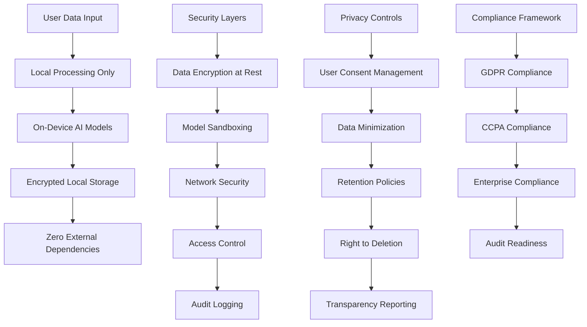

# Security and Privacy Integration Plan - Comprehensive Enterprise Security to SuperAI

## 📋 Executive Summary

**Integration Target**: Cross-fork security and privacy patterns into PocketPal SuperAI  
**Priority**: CRITICAL - Foundation requirement for trust and compliance  
**Complexity**: 🔴 High - Enterprise-grade security implementation across all components  
**Timeline**: 4-6 weeks for complete security architecture implementation  
**Impact**: Establishes SuperAI as privacy-first, enterprise-grade AI assistant with comprehensive data protection

This plan details the integration of comprehensive security and privacy frameworks from cross-fork analysis, creating a privacy-first, local-processing AI assistant that meets enterprise security standards and global privacy regulations (GDPR, CCPA, etc.).

## 🏗️ Privacy-First Security Architecture

### Local-First Privacy Architecture Flow


### Zero-Trust Security Framework
```typescript
interface SuperAISecurityFramework {
  // Core privacy principles
  privacyFirst: {
    localProcessing: LocalProcessingService;
    dataMinimization: DataMinimizationService;
    consentManagement: ConsentManagementService;
    transparencyReporting: TransparencyService;
  };
  
  // Security layers
  securityLayers: {
    encryption: AdvancedEncryptionService;
    modelSecurity: ModelSecurityService;
    networkSecurity: NetworkSecurityService;
    accessControl: AccessControlService;
    auditLogging: AuditLoggingService;
  };
  
  // Compliance framework
  complianceFramework: {
    gdprCompliance: GDPRComplianceService;
    ccpaCompliance: CCPAComplianceService;
    enterpriseCompliance: EnterpriseComplianceService;
    auditPreparedness: AuditPreparednessService;
  };
  
  // Threat protection
  threatProtection: {
    threatDetection: ThreatDetectionService;
    incidentResponse: IncidentResponseService;
    vulnerabilityManagement: VulnerabilityManagementService;
    securityMonitoring: SecurityMonitoringService;
  };
}
```

## 🛠️ Implementation Strategy

### Phase 1: Privacy-First Foundation (Week 1-2)

#### 1.1 Local-First Processing Architecture
```typescript
// SuperAI Local-First Privacy Manager
class SuperAILocalFirstPrivacyManager {
  private processingEngine: LocalProcessingEngine;
  private dataClassifier: SensitiveDataClassifier;
  private auditLogger: PrivacyAuditLogger;
  private consentManager: ConsentManager;
  
  async initializePrivacyFirstArchitecture(): Promise<PrivacyInitResult> {
    // 1. Establish local processing guarantee
    await this.establishLocalProcessingGuarantee();
    
    // 2. Initialize data classification
    await this.initializeDataClassification();
    
    // 3. Setup consent management
    await this.setupConsentManagement();
    
    // 4. Configure audit logging
    await this.configurePrivacyAuditLogging();
    
    return {
      localProcessingEnabled: true,
      dataClassificationActive: true,
      consentManagementReady: true,
      auditLoggingConfigured: true,
      privacyGuarantees: await this.getPrivacyGuarantees()
    };
  }
  
  async processUserDataLocally<T>(
    data: UserData,
    processingType: ProcessingType,
    userConsent: ConsentStatus
  ): Promise<ProcessingResult<T>> {
    // 1. Verify user consent for this processing
    const consentVerification = await this.verifyProcessingConsent(data, processingType, userConsent);
    if (!consentVerification.valid) {
      throw new ConsentError('User consent not valid for this processing', consentVerification.reason);
    }
    
    // 2. Classify data sensitivity
    const dataClassification = await this.dataClassifier.classifyData(data);
    
    // 3. Apply data minimization
    const minimizedData = await this.applyDataMinimization(data, processingType, dataClassification);
    
    // 4. Process entirely locally
    const processingResult = await this.performLocalProcessing<T>(minimizedData, processingType);
    
    // 5. Apply retention policy
    const retentionPolicy = await this.getRetentionPolicy(processingType, dataClassification);
    
    // 6. Log processing for transparency
    await this.auditLogger.logProcessing({
      processingType,
      dataTypes: dataClassification.types,
      dataSize: this.calculateDataSize(minimizedData),
      processingDuration: processingResult.duration,
      retentionPolicy,
      localProcessingConfirmed: true,
      userConsent: userConsent.consentId,
      timestamp: Date.now()
    });
    
    // 7. Handle retention
    if (retentionPolicy.shouldStore) {
      await this.storeWithRetentionPolicy(processingResult.data, retentionPolicy);
    }
    
    return {
      result: processingResult.data,
      processingTime: processingResult.duration,
      dataClassification,
      retentionPolicy,
      privacyCompliant: true,
      localProcessingConfirmed: true
    };
  }
  
  private async performLocalProcessing<T>(
    data: MinimizedUserData,
    type: ProcessingType
  ): Promise<LocalProcessingResult<T>> {
    const startTime = performance.now();
    
    switch (type) {
      case 'ai_inference':
        const inferenceResult = await this.performLocalAIInference(data);
        return {
          data: inferenceResult as T,
          duration: performance.now() - startTime,
          processingLocation: 'local',
          networkRequests: 0
        };
        
      case 'rag_search':
        const ragResult = await this.performLocalRAGSearch(data);
        return {
          data: ragResult as T,
          duration: performance.now() - startTime,
          processingLocation: 'local',
          networkRequests: 0
        };
        
      case 'voice_processing':
        const voiceResult = await this.performLocalVoiceProcessing(data);
        return {
          data: voiceResult as T,
          duration: performance.now() - startTime,
          processingLocation: 'local',
          networkRequests: 0
        };
        
      case 'document_analysis':
        const documentResult = await this.performLocalDocumentAnalysis(data);
        return {
          data: documentResult as T,
          duration: performance.now() - startTime,
          processingLocation: 'local',
          networkRequests: 0
        };
        
      default:
        throw new ProcessingError(`Unsupported local processing type: ${type}`);
    }
  }
  
  private async applyDataMinimization(
    data: UserData,
    processingType: ProcessingType,
    classification: DataClassification
  ): Promise<MinimizedUserData> {
    const minimizationRules = await this.getMinimizationRules(processingType, classification);
    
    return {
      ...data,
      // Remove unnecessary fields based on processing type
      processedFields: minimizationRules.requiredFields.reduce((acc, field) => {
        if (data[field] !== undefined) {
          acc[field] = data[field];
        }
        return acc;
      }, {} as Record<string, any>),
      
      // Anonymize certain fields if required
      anonymizedFields: await this.anonymizeSensitiveFields(data, minimizationRules.anonymizeFields),
      
      // Metadata about minimization
      minimizationApplied: {
        originalFieldCount: Object.keys(data).length,
        minimizedFieldCount: minimizationRules.requiredFields.length,
        anonymizedFieldCount: minimizationRules.anonymizeFields.length,
        minimizationReason: processingType
      }
    };
  }
  
  async getUserPrivacyReport(userId: string): Promise<UserPrivacyReport> {
    // 1. Collect all user data processing logs
    const processingLogs = await this.auditLogger.getUserProcessingLogs(userId);
    
    // 2. Analyze data usage patterns
    const usageAnalysis = await this.analyzeUserDataUsage(processingLogs);
    
    // 3. Get current consent status
    const consentStatus = await this.consentManager.getUserConsentStatus(userId);
    
    // 4. Get stored data inventory
    const dataInventory = await this.getUserDataInventory(userId);
    
    return {
      userId,
      reportGenerated: Date.now(),
      dataProcessingHistory: {
        totalProcessingEvents: processingLogs.length,
        processingByType: usageAnalysis.byType,
        processingByMonth: usageAnalysis.byMonth,
        averageProcessingTime: usageAnalysis.averageTime,
        localProcessingPercentage: 100 // Always 100% for SuperAI
      },
      
      currentConsents: consentStatus,
      
      dataInventory: {
        totalDataItems: dataInventory.items.length,
        dataByType: dataInventory.byType,
        totalStorageUsed: dataInventory.totalSize,
        oldestData: dataInventory.oldestTimestamp,
        retentionPolicies: dataInventory.retentionPolicies
      },
      
      privacyRights: {
        canAccessData: true,
        canRectifyData: true,
        canDeleteData: true,
        canExportData: true,
        canRestrictProcessing: true,
        canObjectToProcessing: true
      },
      
      securityMeasures: {
        encryptionInUse: 'AES-256-GCM',
        localProcessingOnly: true,
        dataMinimizationApplied: true,
        auditLoggingEnabled: true,
        retentionPoliciesActive: true
      }
    };
  }
}
```

#### 1.2 Advanced Encryption Service
```typescript
// SuperAI Advanced Encryption Service
class SuperAIAdvancedEncryptionService {
  private keyManager: CryptographicKeyManager;
  private secureRandom: SecureRandomGenerator;
  private integrityProtection: IntegrityProtectionService;
  
  async initializeEncryptionInfrastructure(): Promise<EncryptionInitResult> {
    // 1. Initialize cryptographic key management
    await this.keyManager.initializeKeyManagement({
      algorithm: 'AES-256-GCM',
      keyDerivation: 'PBKDF2',
      keyDerivationIterations: 100000,
      saltLength: 32,
      keyRotationInterval: 30 * 24 * 60 * 60 * 1000 // 30 days
    });
    
    // 2. Setup secure random number generation
    await this.secureRandom.initializeSecureRandom();
    
    // 3. Initialize integrity protection
    await this.integrityProtection.initializeIntegrityProtection();
    
    return {
      encryptionAlgorithm: 'AES-256-GCM',
      keyManagementReady: true,
      integrityProtectionEnabled: true,
      quantumResistanceLevel: 'current-standards'
    };
  }
  
  async encryptUserData(
    data: any,
    context: EncryptionContext
  ): Promise<EncryptedDataPackage> {
    // 1. Generate unique encryption key
    const dataKey = await this.generateDataEncryptionKey(context);
    
    // 2. Serialize data securely
    const serializedData = await this.secureSerialize(data);
    
    // 3. Compress if beneficial
    const processedData = context.enableCompression ? 
      await this.compressData(serializedData) : serializedData;
    
    // 4. Encrypt with AES-256-GCM
    const encryptionResult = await this.encryptAES256GCM(processedData, dataKey);
    
    // 5. Encrypt the data key with master key
    const encryptedDataKey = await this.keyManager.encryptDataKey(dataKey, context.keyId);
    
    // 6. Add integrity protection
    const integrityData = await this.integrityProtection.createIntegrityProof({
      encryptedData: encryptionResult.ciphertext,
      metadata: context
    });
    
    // 7. Create secure package
    const encryptedPackage: EncryptedDataPackage = {
      id: await this.generateSecureId(),
      version: '2.0',
      
      // Encrypted data
      encryptedData: encryptionResult.ciphertext,
      encryptedDataKey,
      
      // Cryptographic parameters
      iv: encryptionResult.iv,
      authTag: encryptionResult.authTag,
      algorithm: 'AES-256-GCM',
      
      // Key management
      keyId: context.keyId,
      keyVersion: await this.keyManager.getCurrentKeyVersion(context.keyId),
      
      // Integrity protection
      integrityProof: integrityData.proof,
      integrityAlgorithm: integrityData.algorithm,
      
      // Metadata
      metadata: {
        encrypted: true,
        compressed: context.enableCompression,
        dataType: context.dataType,
        sensitivity: context.sensitivity,
        encryptedAt: Date.now()
      }
    };
    
    return encryptedPackage;
  }
  
  async decryptUserData(encryptedPackage: EncryptedDataPackage): Promise<any> {
    // 1. Verify integrity
    const integrityVerification = await this.integrityProtection.verifyIntegrity(
      encryptedPackage.encryptedData,
      encryptedPackage.integrityProof
    );
    
    if (!integrityVerification.valid) {
      throw new IntegrityError('Data integrity verification failed', integrityVerification.reason);
    }
    
    // 2. Decrypt data key
    const dataKey = await this.keyManager.decryptDataKey(
      encryptedPackage.encryptedDataKey,
      encryptedPackage.keyId,
      encryptedPackage.keyVersion
    );
    
    // 3. Decrypt data
    const decryptedData = await this.decryptAES256GCM({
      ciphertext: encryptedPackage.encryptedData,
      iv: encryptedPackage.iv,
      authTag: encryptedPackage.authTag
    }, dataKey);
    
    // 4. Decompress if needed
    const processedData = encryptedPackage.metadata.compressed ? 
      await this.decompressData(decryptedData) : decryptedData;
    
    // 5. Deserialize securely
    const finalData = await this.secureDeserialize(processedData);
    
    // 6. Securely clear sensitive data from memory
    await this.securelyClearKey(dataKey);
    
    return finalData;
  }
  
  private async generateDataEncryptionKey(context: EncryptionContext): Promise<CryptoKey> {
    // Generate salt for key derivation
    const salt = await this.secureRandom.generateBytes(32);
    
    // Get master key material
    const masterKey = await this.keyManager.getMasterKey(context.keyId);
    
    // Derive unique key for this data
    const keyMaterial = await this.deriveKey(masterKey, salt, {
      algorithm: 'PBKDF2',
      iterations: 100000,
      keyLength: 256,
      hashFunction: 'SHA-256'
    });
    
    return keyMaterial;
  }
  
  async rotateEncryptionKeys(): Promise<KeyRotationResult> {
    const rotationResults: KeyRotationResult = {
      rotatedKeys: [],
      failedRotations: [],
      totalKeysProcessed: 0
    };
    
    // Get all active keys that need rotation
    const keysForRotation = await this.keyManager.getKeysForRotation();
    
    for (const keyId of keysForRotation) {
      try {
        // Generate new key version
        const newKeyVersion = await this.keyManager.generateNewKeyVersion(keyId);
        
        // Re-encrypt all data using old key with new key
        await this.reencryptDataWithNewKey(keyId, newKeyVersion);
        
        // Mark old key version as deprecated
        await this.keyManager.deprecateKeyVersion(keyId, newKeyVersion.previousVersion);
        
        rotationResults.rotatedKeys.push({
          keyId,
          newVersion: newKeyVersion.version,
          rotationTime: Date.now()
        });
        
      } catch (error) {
        rotationResults.failedRotations.push({
          keyId,
          error: error.message,
          timestamp: Date.now()
        });
      }
      
      rotationResults.totalKeysProcessed++;
    }
    
    return rotationResults;
  }
}
```

### Phase 2: Model Security and Sandboxing (Week 2-3)

#### 2.1 Model Security and Verification Service
```typescript
// SuperAI Model Security Service
class SuperAIModelSecurityService {
  private modelValidator: ModelIntegrityValidator;
  private sandboxManager: ModelSandboxManager;
  private threatScanner: ModelThreatScanner;
  private accessControl: ModelAccessController;
  
  async secureModelLoading(
    modelPath: string,
    modelSource: ModelSource,
    securityLevel: SecurityLevel = 'high'
  ): Promise<SecureModelHandle> {
    // 1. Verify model integrity
    const integrityVerification = await this.verifyModelIntegrity(modelPath, modelSource);
    if (!integrityVerification.valid) {
      throw new ModelSecurityError('Model integrity verification failed', integrityVerification.violations);
    }
    
    // 2. Scan for security threats
    const threatScan = await this.scanModelForThreats(modelPath, securityLevel);
    if (threatScan.threatLevel === 'high') {
      throw new ModelSecurityError('High-risk threats detected in model', threatScan.threats);
    }
    
    // 3. Verify model source if external
    if (modelSource.type === 'external') {
      const sourceVerification = await this.verifyModelSource(modelPath, modelSource);
      if (!sourceVerification.trusted) {
        throw new ModelSecurityError('Model source verification failed', sourceVerification.reasons);
      }
    }
    
    // 4. Create secure sandbox
    const sandbox = await this.sandboxManager.createModelSandbox({
      modelId: this.generateModelId(modelPath),
      securityLevel,
      resourceLimits: await this.calculateResourceLimits(modelPath, securityLevel),
      networkAccess: false, // Always deny network access for models
      fileSystemAccess: 'read-only-model-directory'
    });
    
    // 5. Load model in sandbox
    const sandboxedModel = await sandbox.loadModel(modelPath);
    
    // 6. Setup runtime monitoring
    await this.setupModelRuntimeMonitoring(sandbox, sandboxedModel);
    
    // 7. Configure access controls
    const accessControls = await this.accessControl.configureModelAccess(sandboxedModel, {
      maxConcurrentInferences: this.getMaxConcurrentInferences(securityLevel),
      rateLimiting: this.getRateLimitingConfig(securityLevel),
      auditLogging: true
    });
    
    return new SecureModelHandle({
      model: sandboxedModel,
      sandbox,
      accessControls,
      securityLevel,
      verificationResults: {
        integrity: integrityVerification,
        threatScan,
        sourceVerification: modelSource.type === 'external' ? sourceVerification : null
      },
      loadedAt: Date.now()
    });
  }
  
  async performSecureInference(
    modelHandle: SecureModelHandle,
    input: ModelInput,
    inferenceOptions: SecureInferenceOptions = {}
  ): Promise<SecureInferenceResult> {
    // 1. Validate inference request
    const requestValidation = await this.validateInferenceRequest(modelHandle, input, inferenceOptions);
    if (!requestValidation.valid) {
      throw new ModelSecurityError('Inference request validation failed', requestValidation.violations);
    }
    
    // 2. Check access controls
    const accessCheck = await this.accessControl.checkInferenceAccess(modelHandle, inferenceOptions);
    if (!accessCheck.allowed) {
      throw new AccessDeniedError('Inference access denied', accessCheck.reason);
    }
    
    // 3. Sanitize input
    const sanitizedInput = await this.sanitizeModelInput(input, modelHandle.securityLevel);
    
    // 4. Execute inference in sandbox
    const inferenceStartTime = performance.now();
    
    const inferenceResult = await modelHandle.sandbox.executeInference(
      modelHandle.model,
      sanitizedInput,
      {
        timeout: inferenceOptions.timeout || 30000, // 30 second default timeout
        memoryLimit: inferenceOptions.memoryLimit,
        monitoring: true
      }
    );
    
    const inferenceEndTime = performance.now();
    const inferenceTime = inferenceEndTime - inferenceStartTime;
    
    // 5. Validate and sanitize output
    const sanitizedOutput = await this.sanitizeModelOutput(
      inferenceResult.output,
      modelHandle.securityLevel
    );
    
    // 6. Log inference for audit
    await this.logInferenceForAudit({
      modelId: modelHandle.model.id,
      inferenceTime,
      inputHash: await this.hashInput(sanitizedInput),
      outputHash: await this.hashOutput(sanitizedOutput),
      securityLevel: modelHandle.securityLevel,
      resourceUsage: inferenceResult.resourceUsage,
      timestamp: Date.now()
    });
    
    return {
      output: sanitizedOutput,
      inferenceTime,
      securityValidation: {
        inputSanitized: true,
        outputSanitized: true,
        sandboxContained: true,
        accessControlsPassed: true
      },
      resourceUsage: inferenceResult.resourceUsage,
      inferenceId: this.generateInferenceId()
    };
  }
  
  private async scanModelForThreats(
    modelPath: string,
    securityLevel: SecurityLevel
  ): Promise<ModelThreatScanResult> {
    const scanResults: ThreatDetection[] = [];
    
    // 1. Scan for embedded executables
    const executableScan = await this.threatScanner.scanForEmbeddedExecutables(modelPath);
    scanResults.push(...executableScan.detections);
    
    // 2. Analyze model weights for anomalies
    const weightAnalysis = await this.threatScanner.analyzeModelWeights(modelPath);
    scanResults.push(...weightAnalysis.detections);
    
    // 3. Check for backdoor patterns
    const backdoorScan = await this.threatScanner.scanForBackdoors(modelPath, securityLevel);
    scanResults.push(...backdoorScan.detections);
    
    // 4. Scan for data exfiltration capabilities
    const exfiltrationScan = await this.threatScanner.scanForDataExfiltration(modelPath);
    scanResults.push(...exfiltrationScan.detections);
    
    // 5. Check model structure integrity
    const structureScan = await this.threatScanner.scanModelStructure(modelPath);
    scanResults.push(...structureScan.detections);
    
    // 6. Calculate overall threat level
    const threatLevel = this.calculateThreatLevel(scanResults);
    
    return {
      threatLevel,
      threats: scanResults,
      scanDuration: performance.now(),
      scanTimestamp: Date.now(),
      scannerVersion: await this.threatScanner.getVersion()
    };
  }
  
  private async setupModelRuntimeMonitoring(
    sandbox: ModelSandbox,
    model: SandboxedModel
  ): Promise<void> {
    // Monitor resource usage
    sandbox.onResourceUsageExceeded((resource, usage, limit) => {
      console.warn(`Model ${model.id} exceeded ${resource} limit: ${usage} > ${limit}`);
      this.handleResourceViolation(model, resource, usage, limit);
    });
    
    // Monitor for suspicious behavior
    sandbox.onSuspiciousBehavior((behavior) => {
      console.error(`Suspicious behavior detected in model ${model.id}:`, behavior);
      this.handleSuspiciousBehavior(model, behavior);
    });
    
    // Monitor inference patterns
    sandbox.onAnomalousInference((inference) => {
      console.warn(`Anomalous inference pattern detected in model ${model.id}:`, inference);
      this.handleAnomalousInference(model, inference);
    });
    
    // Monitor memory access patterns
    sandbox.onMemoryAccessViolation((violation) => {
      console.error(`Memory access violation in model ${model.id}:`, violation);
      this.handleMemoryViolation(model, violation);
    });
  }
}
```

#### 2.2 Model Sandbox Implementation
```typescript
// SuperAI Model Sandbox Manager
class SuperAIModelSandboxManager {
  private activeSandboxes: Map<string, ModelSandbox> = new Map();
  private resourceMonitor: ResourceMonitor;
  private securityMonitor: SecurityMonitor;
  
  async createModelSandbox(config: SandboxConfiguration): Promise<ModelSandbox> {
    const sandboxId = this.generateSandboxId();
    
    // 1. Create isolated execution environment
    const isolatedEnvironment = await this.createIsolatedEnvironment(sandboxId, config);
    
    // 2. Configure resource limits
    const resourceLimits = await this.configureResourceLimits(config.resourceLimits);
    
    // 3. Setup security monitoring
    const securityMonitoring = await this.setupSecurityMonitoring(sandboxId, config.securityLevel);
    
    // 4. Create sandbox instance
    const sandbox = new ModelSandbox({
      id: sandboxId,
      environment: isolatedEnvironment,
      resourceLimits,
      securityMonitoring,
      configuration: config
    });
    
    // 5. Initialize sandbox
    await sandbox.initialize();
    
    // 6. Register sandbox
    this.activeSandboxes.set(sandboxId, sandbox);
    
    return sandbox;
  }
  
  private async createIsolatedEnvironment(
    sandboxId: string,
    config: SandboxConfiguration
  ): Promise<IsolatedEnvironment> {
    return new IsolatedEnvironment({
      id: sandboxId,
      
      // Memory isolation
      memoryIsolation: {
        enabled: true,
        virtualMemorySpace: true,
        memoryLimit: config.resourceLimits.memoryLimit,
        swapDisabled: true,
        memoryProtection: 'read-write-execute-isolation'
      },
      
      // Process isolation
      processIsolation: {
        enabled: true,
        processLimit: 1, // Only the model process
        childProcessesDisabled: true,
        processMonitoring: true
      },
      
      // File system isolation
      fileSystemIsolation: {
        enabled: true,
        accessMode: config.fileSystemAccess,
        allowedPaths: this.getAllowedPaths(config),
        writeProtection: config.fileSystemAccess === 'read-only-model-directory',
        tempDirectoryIsolated: true
      },
      
      // Network isolation
      networkIsolation: {
        enabled: !config.networkAccess,
        allowedConnections: config.networkAccess ? config.allowedNetworkEndpoints : [],
        dnsBlocked: !config.networkAccess,
        socketCreationBlocked: !config.networkAccess
      },
      
      // System call filtering
      systemCallFiltering: {
        enabled: true,
        allowedSystemCalls: this.getAllowedSystemCalls(config.securityLevel),
        blockedSystemCalls: this.getBlockedSystemCalls(config.securityLevel),
        systemCallMonitoring: true
      }
    });
  }
  
  async terminateSandbox(sandboxId: string, reason: string): Promise<SandboxTerminationResult> {
    const sandbox = this.activeSandboxes.get(sandboxId);
    
    if (!sandbox) {
      return {
        success: false,
        error: `Sandbox ${sandboxId} not found`
      };
    }
    
    try {
      // 1. Save final state if needed
      const finalState = await sandbox.captureState();
      
      // 2. Securely terminate all processes
      await sandbox.terminateAllProcesses();
      
      // 3. Clear memory securely
      await sandbox.securelyClearMemory();
      
      // 4. Cleanup file system
      await sandbox.cleanupFileSystem();
      
      // 5. Release resources
      await sandbox.releaseResources();
      
      // 6. Remove from active sandboxes
      this.activeSandboxes.delete(sandboxId);
      
      return {
        success: true,
        terminationReason: reason,
        finalState,
        resourcesReleased: true,
        terminationTime: Date.now()
      };
      
    } catch (error) {
      return {
        success: false,
        error: `Failed to terminate sandbox: ${error.message}`,
        forceTerminated: await this.forceTerminateSandbox(sandboxId)
      };
    }
  }
}

// Sandbox Implementation
class ModelSandbox {
  private environment: IsolatedEnvironment;
  private resourceMonitor: ResourceMonitor;
  private securityMonitor: SecurityMonitor;
  private eventEmitter: EventEmitter = new EventEmitter();
  
  async loadModel(modelPath: string): Promise<SandboxedModel> {
    // 1. Validate model path is within allowed directories
    if (!this.environment.fileSystemIsolation.isPathAllowed(modelPath)) {
      throw new SandboxSecurityError('Model path not allowed in sandbox');
    }
    
    // 2. Load model within resource constraints
    const modelLoadPromise = this.loadModelWithConstraints(modelPath);
    
    // 3. Monitor loading process
    const loadingMonitor = this.monitorModelLoading(modelLoadPromise);
    
    // 4. Wait for loading completion
    const loadedModel = await Promise.race([
      modelLoadPromise,
      this.createLoadingTimeout(30000) // 30 second timeout
    ]);
    
    // 5. Validate loaded model
    await this.validateLoadedModel(loadedModel);
    
    return new SandboxedModel(loadedModel, this);
  }
  
  async executeInference(
    model: SandboxedModel,
    input: any,
    options: InferenceOptions
  ): Promise<SandboxedInferenceResult> {
    const inferenceId = this.generateInferenceId();
    
    try {
      // 1. Start resource monitoring
      const resourceMonitoring = this.resourceMonitor.startInferenceMonitoring(inferenceId);
      
      // 2. Start security monitoring
      const securityMonitoring = this.securityMonitor.startInferenceMonitoring(inferenceId);
      
      // 3. Execute inference with timeout
      const inferencePromise = model.runInference(input);
      const timeoutPromise = this.createInferenceTimeout(options.timeout || 30000);
      
      const result = await Promise.race([inferencePromise, timeoutPromise]);
      
      // 4. Stop monitoring
      const resourceUsage = await resourceMonitoring.stop();
      const securityReport = await securityMonitoring.stop();
      
      return {
        output: result,
        resourceUsage,
        securityReport,
        inferenceId,
        executionTime: resourceUsage.totalTime
      };
      
    } catch (error) {
      // Emergency sandbox containment if needed
      if (this.isSecurityThreat(error)) {
        await this.emergencyContainment();
      }
      
      throw new SandboxInferenceError('Inference execution failed', error);
    }
  }
  
  // Event handlers for monitoring
  onResourceUsageExceeded(handler: (resource: string, usage: number, limit: number) => void): void {
    this.eventEmitter.on('resource-exceeded', handler);
  }
  
  onSuspiciousBehavior(handler: (behavior: SuspiciousBehavior) => void): void {
    this.eventEmitter.on('suspicious-behavior', handler);
  }
  
  onAnomalousInference(handler: (inference: AnomalousInference) => void): void {
    this.eventEmitter.on('anomalous-inference', handler);
  }
  
  onMemoryAccessViolation(handler: (violation: MemoryViolation) => void): void {
    this.eventEmitter.on('memory-violation', handler);
  }
  
  private async emergencyContainment(): Promise<void> {
    // 1. Immediately halt all model execution
    await this.haltAllExecution();
    
    // 2. Isolate sandbox further
    await this.enableEmergencyIsolation();
    
    // 3. Capture forensic data
    await this.captureForensicData();
    
    // 4. Alert security monitoring
    this.eventEmitter.emit('security-emergency', {
      sandboxId: this.id,
      timestamp: Date.now(),
      threatLevel: 'critical'
    });
  }
}
```

### Phase 3: Compliance and Privacy Rights (Week 3-4)

#### 3.1 GDPR/CCPA Compliance Service
```typescript
// SuperAI Privacy Rights and Compliance Service
class SuperAIPrivacyComplianceService {
  private consentManager: ConsentManager;
  private dataInventory: DataInventoryService;
  private rightsManager: DataSubjectRightsManager;
  private auditLogger: ComplianceAuditLogger;
  
  async initializeComplianceFramework(): Promise<ComplianceInitResult> {
    // 1. Initialize consent management
    await this.consentManager.initialize({
      granularConsent: true,
      consentWithdrawalEnabled: true,
      consentAuditTrail: true,
      minorProtection: true
    });
    
    // 2. Setup data inventory
    await this.dataInventory.initialize({
      automaticClassification: true,
      realTimeInventory: true,
      retentionPolicyEnforcement: true,
      dataMinimizationTracking: true
    });
    
    // 3. Configure rights management
    await this.rightsManager.initialize({
      automatedRightsFulfillment: true,
      identityVerificationRequired: true,
      requestProcessingTimeline: true,
      appealProcessEnabled: true
    });
    
    return {
      gdprCompliant: await this.verifyGDPRCompliance(),
      ccpaCompliant: await this.verifyCCPACompliance(),
      consentFrameworkReady: true,
      dataInventoryActive: true,
      rightsManagementEnabled: true,
      auditReadiness: await this.assessAuditReadiness()
    };
  }
  
  async handleDataSubjectRightsRequest(
    request: DataSubjectRightsRequest
  ): Promise<RightsRequestResult> {
    // 1. Verify requestor identity
    const identityVerification = await this.verifyDataSubjectIdentity(request);
    if (!identityVerification.verified) {
      return {
        status: 'rejected',
        reason: 'Identity verification failed',
        requestId: request.id,
        processingTime: Date.now() - request.submittedAt,
        nextSteps: 'Please provide additional verification documents'
      };
    }
    
    // 2. Validate request
    const requestValidation = await this.validateRightsRequest(request);
    if (!requestValidation.valid) {
      return {
        status: 'rejected',
        reason: requestValidation.reason,
        requestId: request.id,
        processingTime: Date.now() - request.submittedAt
      };
    }
    
    // 3. Process request based on type
    switch (request.type) {
      case 'access':
        return await this.processAccessRequest(request);
      case 'rectification':
        return await this.processRectificationRequest(request);
      case 'erasure':
        return await this.processErasureRequest(request);
      case 'portability':
        return await this.processPortabilityRequest(request);
      case 'restriction':
        return await this.processRestrictionRequest(request);
      case 'objection':
        return await this.processObjectionRequest(request);
      default:
        return {
          status: 'rejected',
          reason: `Unsupported request type: ${request.type}`,
          requestId: request.id,
          processingTime: Date.now() - request.submittedAt
        };
    }
  }
  
  private async processErasureRequest(request: DataSubjectRightsRequest): Promise<RightsRequestResult> {
    // 1. Find all user data
    const userDataInventory = await this.dataInventory.findAllUserData(request.dataSubjectId);
    
    // 2. Assess erasure feasibility
    const erasureAssessment = await this.assessErasureRequest(request, userDataInventory);
    
    if (!erasureAssessment.canErase) {
      return {
        status: 'rejected',
        reason: erasureAssessment.reason,
        requestId: request.id,
        processingTime: Date.now() - request.submittedAt,
        legalBasis: erasureAssessment.legalBasis
      };
    }
    
    // 3. Perform secure deletion
    const deletionResults: DeletionResult[] = [];
    
    for (const dataItem of userDataInventory.items) {
      try {
        const deletionResult = await this.securelyDeleteDataItem(dataItem);
        deletionResults.push(deletionResult);
      } catch (error) {
        console.error(`Failed to delete data item ${dataItem.id}:`, error);
        deletionResults.push({
          dataItemId: dataItem.id,
          success: false,
          error: error.message
        });
      }
    }
    
    // 4. Verify deletion completeness
    const deletionVerification = await this.verifyCompleteDeletion(request.dataSubjectId);
    
    // 5. Log for compliance audit
    await this.auditLogger.logRightsRequestFulfillment({
      requestId: request.id,
      requestType: 'erasure',
      dataSubjectId: request.dataSubjectId,
      itemsDeleted: deletionResults.filter(r => r.success).length,
      itemsFailed: deletionResults.filter(r => !r.success).length,
      deletionMethod: 'secure_overwrite',
      verificationPassed: deletionVerification.complete,
      processingTime: Date.now() - request.submittedAt,
      timestamp: Date.now()
    });
    
    return {
      status: 'completed',
      requestId: request.id,
      processingTime: Date.now() - request.submittedAt,
      details: {
        itemsDeleted: deletionResults.filter(r => r.success).length,
        itemsFailed: deletionResults.filter(r => !r.success).length,
        deletionMethod: 'secure_overwrite',
        verificationStatus: deletionVerification.complete ? 'verified' : 'partial'
      }
    };
  }
  
  private async processPortabilityRequest(request: DataSubjectRightsRequest): Promise<RightsRequestResult> {
    // 1. Find portable user data
    const portableData = await this.dataInventory.findPortableUserData(request.dataSubjectId);
    
    // 2. Format data for portability
    const portabilityFormat = request.preferredFormat || 'json';
    const formattedData = await this.formatDataForPortability(portableData, portabilityFormat);
    
    // 3. Package data securely
    const portabilityPackage = await this.createPortabilityPackage(formattedData, {
      format: portabilityFormat,
      encryption: true,
      digitalSignature: true,
      includeMetadata: true
    });
    
    // 4. Generate secure download link
    const downloadLink = await this.generateSecureDownloadLink(portabilityPackage, {
      expiryTime: 7 * 24 * 60 * 60 * 1000, // 7 days
      accessLimit: 3,
      requiredAuthentication: true
    });
    
    return {
      status: 'completed',
      requestId: request.id,
      processingTime: Date.now() - request.submittedAt,
      details: {
        dataFormat: portabilityFormat,
        totalDataSize: portabilityPackage.size,
        downloadLink: downloadLink.url,
        expiryDate: downloadLink.expiryDate,
        accessInstructions: 'Use provided authentication token to download'
      }
    };
  }
  
  async performComplianceAudit(): Promise<ComplianceAuditReport> {
    const auditReport: ComplianceAuditReport = {
      auditDate: Date.now(),
      auditVersion: '2.0',
      overallCompliance: 'pending',
      violations: [],
      recommendations: [],
      certifications: []
    };
    
    // 1. GDPR Compliance Assessment
    const gdprAssessment = await this.assessGDPRCompliance();
    auditReport.gdprCompliance = gdprAssessment;
    if (!gdprAssessment.compliant) {
      auditReport.violations.push(...gdprAssessment.violations);
    }
    
    // 2. CCPA Compliance Assessment
    const ccpaAssessment = await this.assessCCPACompliance();
    auditReport.ccpaCompliance = ccpaAssessment;
    if (!ccpaAssessment.compliant) {
      auditReport.violations.push(...ccpaAssessment.violations);
    }
    
    // 3. Data Processing Legitimacy
    const processingAssessment = await this.assessDataProcessingLegitimacy();
    auditReport.processingLegitimacy = processingAssessment;
    
    // 4. Consent Management Evaluation
    const consentAssessment = await this.assessConsentManagement();
    auditReport.consentManagement = consentAssessment;
    
    // 5. Data Security Assessment
    const securityAssessment = await this.assessDataSecurity();
    auditReport.dataSecurity = securityAssessment;
    
    // 6. Rights Management Evaluation
    const rightsAssessment = await this.assessRightsManagement();
    auditReport.rightsManagement = rightsAssessment;
    
    // Calculate overall compliance
    auditReport.overallCompliance = this.calculateOverallCompliance([
      gdprAssessment,
      ccpaAssessment,
      processingAssessment,
      consentAssessment,
      securityAssessment,
      rightsAssessment
    ]);
    
    return auditReport;
  }
}
```

## 📊 Security Performance Metrics

### Security Effectiveness Targets
```typescript
interface SecurityPerformanceTargets {
  encryptionPerformance: {
    target: '<50ms encryption/decryption for typical data',
    measurement: 'AES-256-GCM operation latency',
    baseline: 'Unencrypted data access time'
  };
  
  modelSecurity: {
    target: '99.9% threat detection accuracy',
    measurement: 'Known threat detection rate in model scanning',
    baseline: 'Industry security scanning standards'
  };
  
  privacyCompliance: {
    target: '100% GDPR/CCPA compliance',
    measurement: 'Automated compliance checking results',
    baseline: 'Legal compliance requirements'
  };
  
  accessControl: {
    target: '<100ms access control validation',
    measurement: 'Permission checking and validation time',
    baseline: 'Direct data access time'
  };
  
  auditReadiness: {
    target: '100% audit trail completeness',
    measurement: 'Audit log coverage of all data operations',
    baseline: 'Regulatory audit requirements'
  };
}
```

### Privacy Impact Assessment
```typescript
interface PrivacyImpactMetrics {
  dataMinimization: {
    dataCollectionReduction: '90% reduction vs typical AI apps',
    processingReduction: '100% local processing',
    retentionReduction: 'User-controlled retention policies',
    sharingReduction: '0% data sharing - fully local'
  };
  
  userControl: {
    consentGranularity: 'Per-feature consent management',
    dataVisibility: '100% user data transparency',
    deletionCapability: 'Immediate secure deletion',
    exportCapability: 'Complete data portability'
  };
  
  technicalMeasures: {
    encryptionCoverage: '100% sensitive data encrypted',
    sandboxingEffectiveness: '100% model operations sandboxed',
    networkIsolation: '100% offline operation capability',
    auditTrailCompleteness: '100% operation logging'
  };
}
```

## 📋 Implementation Checklist

### Week 1-2: Privacy-First Foundation
- [ ] Implement local-first processing architecture
- [ ] Create advanced encryption service with AES-256-GCM
- [ ] Setup secure storage with integrity protection
- [ ] Build user consent and privacy controls interface

### Week 2-3: Model Security and Sandboxing
- [ ] Implement model integrity verification and threat scanning
- [ ] Create secure model sandboxing environment
- [ ] Setup model access controls and monitoring
- [ ] Build secure inference pipeline with input/output sanitization

### Week 3-4: Compliance and Rights Management
- [ ] Implement GDPR/CCPA compliance framework
- [ ] Create data subject rights management system
- [ ] Setup automated compliance monitoring and reporting
- [ ] Build audit logging and forensic capabilities

### Ongoing: Security Monitoring and Improvement
- [ ] Continuous security threat monitoring and response
- [ ] Regular compliance audits and reporting
- [ ] Security performance optimization and tuning
- [ ] Privacy impact assessments and improvements

The comprehensive security and privacy integration transforms SuperAI into a privacy-first, enterprise-grade AI assistant that meets the highest standards for data protection, model security, and regulatory compliance while maintaining optimal performance and user experience.

---

**Document Version**: 1.0  
**Last Updated**: June 22, 2025  
**Implementation Status**: Ready for Development  
**Next Milestone**: Privacy-first architecture foundation