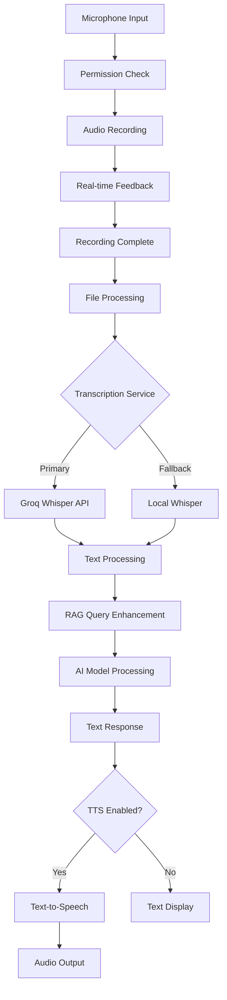
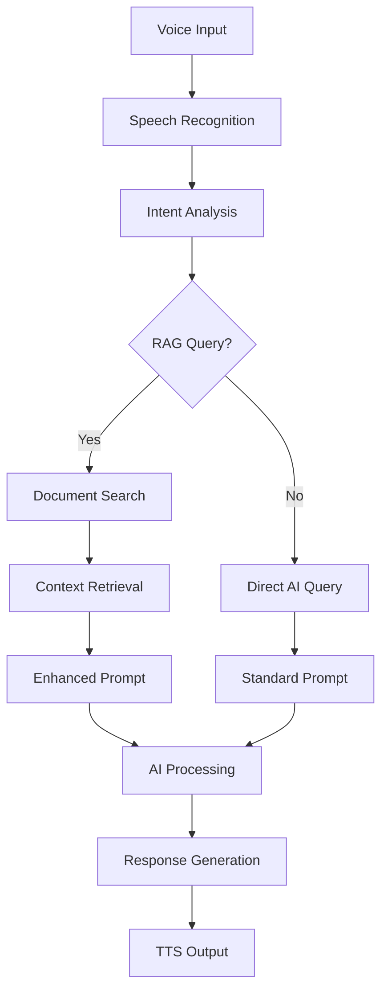

# Voice Integration Plan - rich-piana to SuperAI

## 📋 Executive Summary

**Integration Target**: rich-piana voice processing capabilities into PocketPal SuperAI  
**Priority**: HIGHEST - Revolutionary multimodal enhancement  
**Complexity**: 🟡 Medium - Well-defined implementation available  
**Timeline**: 2-3 weeks for full implementation  
**Impact**: Transforms SuperAI into voice-enabled AI assistant

This plan details the complete integration of voice input/output capabilities, transforming PocketPal SuperAI from text-only to a multimodal AI assistant with speech recognition, voice commands, and audio processing.

## 🏗️ Voice Architecture Design

### Voice Processing Pipeline


### Voice + RAG Integration Flow


## 🛠️ Core Implementation Strategy

### Phase 1: Foundation Voice System (Week 1)

#### 1.1 Audio Recording Infrastructure
```typescript
// Enhanced audio recording with mobile optimization
interface AudioRecordingService {
  // Core recording
  startRecording(options?: RecordingOptions): Promise<boolean>;
  stopRecording(): Promise<string>; // Returns file path
  cancelRecording(): Promise<void>;
  
  // Status management
  isRecording(): boolean;
  getRecordingDuration(): number;
  getPermissionStatus(): Promise<PermissionStatus>;
  
  // Configuration
  setRecordingQuality(quality: AudioQuality): void;
  setAudioFormat(format: AudioFormat): void;
}

interface RecordingOptions {
  maxDuration?: number;        // Maximum recording duration (ms)
  quality?: AudioQuality;      // High, medium, low
  format?: AudioFormat;        // MP3, M4A, WAV
  noiseReduction?: boolean;    // Enable noise reduction
  autoStop?: boolean;          // Auto-stop on silence
}

// Implementation based on rich-piana
class AudioRecorderService implements AudioRecordingService {
  private audioRecorderPlayer: AudioRecorderPlayer;
  private recordingPath: string;
  private isCurrentlyRecording: boolean = false;
  
  async startRecording(options: RecordingOptions = {}): Promise<boolean> {
    try {
      // Check permissions
      const hasPermission = await this.checkPermissions();
      if (!hasPermission) return false;
      
      // Setup recording path
      this.recordingPath = await this.generateRecordingPath(options.format);
      
      // Configure recording settings
      const recordingConfig = this.buildRecordingConfig(options);
      
      // Start recording
      await this.audioRecorderPlayer.startRecorder(this.recordingPath, recordingConfig);
      this.isCurrentlyRecording = true;
      
      // Setup listeners
      this.setupRecordingListeners();
      
      return true;
    } catch (error) {
      console.error('Recording start failed:', error);
      return false;
    }
  }
  
  private async generateRecordingPath(format: AudioFormat = 'mp3'): Promise<string> {
    const timestamp = Date.now();
    const dirPath = `${RNFS.DocumentDirectoryPath}/recordings`;
    
    // Ensure directory exists
    await RNFS.mkdir(dirPath).catch(err => {
      if (err.code !== 'EEXIST') throw err;
    });
    
    const extension = Platform.select({
      android: format === 'm4a' ? 'mp3' : format,
      ios: format === 'mp3' ? 'm4a' : format,
    });
    
    return `${dirPath}/recording_${timestamp}.${extension}`;
  }
}
```

#### 1.2 Permission Management Enhancement
```typescript
// Cross-platform permission handling
class AudioPermissionManager {
  async requestPermissions(): Promise<PermissionResult> {
    if (Platform.OS === 'ios') {
      return this.requestIOSPermissions();
    } else {
      return this.requestAndroidPermissions();
    }
  }
  
  private async requestIOSPermissions(): Promise<PermissionResult> {
    // Enhanced iOS permission handling
    const permission = await request(PERMISSIONS.IOS.MICROPHONE);
    
    return {
      granted: permission === RESULTS.GRANTED,
      denied: permission === RESULTS.DENIED,
      blocked: permission === RESULTS.BLOCKED,
      rationale: this.getPermissionRationale('ios')
    };
  }
  
  private async requestAndroidPermissions(): Promise<PermissionResult> {
    try {
      const granted = await PermissionsAndroid.request(
        PermissionsAndroid.PERMISSIONS.RECORD_AUDIO,
        {
          title: 'Microphone Permission',
          message: 'SuperAI needs microphone access for voice commands and queries',
          buttonNeutral: 'Ask Me Later',
          buttonNegative: 'Cancel',
          buttonPositive: 'OK',
        },
      );
      
      return {
        granted: granted === PermissionsAndroid.RESULTS.GRANTED,
        denied: granted === PermissionsAndroid.RESULTS.DENIED,
        blocked: granted === PermissionsAndroid.RESULTS.NEVER_ASK_AGAIN,
        rationale: this.getPermissionRationale('android')
      };
    } catch (err) {
      console.warn('Permission request error:', err);
      return { granted: false, denied: true, blocked: false };
    }
  }
}
```

#### 1.3 Transcription Service with Fallbacks
```typescript
// Multi-service transcription with local fallback
interface TranscriptionService {
  transcribe(audioPath: string, options?: TranscriptionOptions): Promise<TranscriptionResult>;
  setPreferredService(service: TranscriptionProvider): void;
  getAvailableServices(): TranscriptionProvider[];
}

type TranscriptionProvider = 'groq' | 'openai' | 'local';

interface TranscriptionOptions {
  language?: string;
  prompt?: string;
  temperature?: number;
  provider?: TranscriptionProvider;
  fallbackToLocal?: boolean;
}

interface TranscriptionResult {
  text: string;
  confidence: number;
  language: string;
  provider: TranscriptionProvider;
  duration: number;
  wordCount: number;
}

class TranscriptionService implements TranscriptionService {
  private preferredProvider: TranscriptionProvider = 'groq';
  private providers: Map<TranscriptionProvider, TranscriptionProvider>;
  
  constructor() {
    this.initializeProviders();
  }
  
  async transcribe(audioPath: string, options: TranscriptionOptions = {}): Promise<TranscriptionResult> {
    const provider = options.provider || this.preferredProvider;
    
    try {
      // Try primary provider
      return await this.transcribeWithProvider(audioPath, provider, options);
    } catch (error) {
      console.warn(`Transcription failed with ${provider}:`, error);
      
      // Try fallback providers
      if (options.fallbackToLocal !== false) {
        try {
          return await this.transcribeWithProvider(audioPath, 'local', options);
        } catch (fallbackError) {
          console.error('All transcription services failed:', fallbackError);
          throw new Error('Transcription failed on all services');
        }
      }
      
      throw error;
    }
  }
  
  private async transcribeWithProvider(
    audioPath: string, 
    provider: TranscriptionProvider, 
    options: TranscriptionOptions
  ): Promise<TranscriptionResult> {
    const startTime = Date.now();
    
    switch (provider) {
      case 'groq':
        return this.transcribeWithGroq(audioPath, options);
      case 'openai':
        return this.transcribeWithOpenAI(audioPath, options);
      case 'local':
        return this.transcribeWithLocal(audioPath, options);
      default:
        throw new Error(`Unknown transcription provider: ${provider}`);
    }
  }
  
  private async transcribeWithGroq(audioPath: string, options: TranscriptionOptions): Promise<TranscriptionResult> {
    // Enhanced Groq implementation based on rich-piana
    const formData = new FormData();
    
    formData.append('file', {
      uri: `file://${audioPath}`,
      type: 'audio/mp3',
      name: 'audio.mp3',
    });
    
    formData.append('model', 'whisper-large-v3-turbo');
    formData.append('response_format', 'verbose_json'); // Get detailed response
    
    if (options.prompt) formData.append('prompt', options.prompt);
    if (options.language) formData.append('language', options.language);
    if (options.temperature !== undefined) {
      formData.append('temperature', options.temperature.toString());
    }
    
    const response = await fetch('https://api.groq.com/openai/v1/audio/transcriptions', {
      method: 'POST',
      headers: {
        Authorization: `Bearer ${process.env.GROQ_API_KEY}`,
        Accept: 'application/json',
      },
      body: formData,
    });
    
    if (!response.ok) {
      const errorData = await response.json();
      throw new Error(`Groq API Error: ${JSON.stringify(errorData)}`);
    }
    
    const data = await response.json();
    
    return {
      text: data.text,
      confidence: data.confidence || 0.95, // Groq doesn't provide confidence
      language: data.language || options.language || 'en',
      provider: 'groq',
      duration: data.duration || 0,
      wordCount: data.text.split(' ').length
    };
  }
  
  private async transcribeWithLocal(audioPath: string, options: TranscriptionOptions): Promise<TranscriptionResult> {
    // Local Whisper implementation (to be implemented)
    // This would use a local Whisper model for privacy
    throw new Error('Local transcription not yet implemented');
  }
}
```

### Phase 2: Advanced Voice Features (Week 2)

#### 2.1 Voice Command System
```typescript
// Voice command recognition and routing
interface VoiceCommandSystem {
  registerCommand(pattern: string, handler: CommandHandler): void;
  unregisterCommand(pattern: string): void;
  processCommand(text: string): Promise<CommandResult>;
  enableVoiceCommands(enabled: boolean): void;
}

interface CommandHandler {
  pattern: string;
  description: string;
  handler: (matches: string[], context: CommandContext) => Promise<CommandResult>;
}

interface CommandContext {
  userQuery: string;
  ragEnabled: boolean;
  currentModel: string;
  chatSession: string;
}

class VoiceCommandSystem implements VoiceCommandSystem {
  private commands: Map<string, CommandHandler> = new Map();
  private enabled: boolean = true;
  
  constructor() {
    this.registerDefaultCommands();
  }
  
  registerCommand(pattern: string, handler: CommandHandler): void {
    this.commands.set(pattern, handler);
  }
  
  async processCommand(text: string): Promise<CommandResult> {
    if (!this.enabled) {
      return { isCommand: false, shouldProcessAsQuery: true };
    }
    
    // Check for command patterns
    for (const [pattern, handler] of this.commands) {
      const regex = new RegExp(pattern, 'i');
      const matches = text.match(regex);
      
      if (matches) {
        try {
          const result = await handler.handler(matches, this.getContext());
          return { isCommand: true, result, shouldProcessAsQuery: false };
        } catch (error) {
          console.error(`Command execution failed for pattern ${pattern}:`, error);
          return { 
            isCommand: true, 
            error: error.message, 
            shouldProcessAsQuery: false 
          };
        }
      }
    }
    
    return { isCommand: false, shouldProcessAsQuery: true };
  }
  
  private registerDefaultCommands(): void {
    // Model management commands
    this.registerCommand('(load|switch to|use) model (.+)', {
      pattern: '(load|switch to|use) model (.+)',
      description: 'Load or switch AI model',
      handler: async (matches, context) => {
        const modelName = matches[2];
        // Implementation to load model
        return { success: true, message: `Switching to model: ${modelName}` };
      }
    });
    
    // RAG commands
    this.registerCommand('(search|find|look for) (.+) in (documents|knowledge|files)', {
      pattern: '(search|find|look for) (.+) in (documents|knowledge|files)',
      description: 'Search documents with RAG',
      handler: async (matches, context) => {
        const query = matches[2];
        // Implementation to search RAG
        return { success: true, message: `Searching documents for: ${query}` };
      }
    });
    
    // App navigation commands
    this.registerCommand('(go to|open|show) (models|settings|chat|benchmark)', {
      pattern: '(go to|open|show) (models|settings|chat|benchmark)',
      description: 'Navigate to app sections',
      handler: async (matches, context) => {
        const destination = matches[2];
        // Implementation to navigate
        return { success: true, message: `Navigating to: ${destination}` };
      }
    });
  }
}
```

#### 2.2 Text-to-Speech Integration
```typescript
// Text-to-speech for voice responses
interface TextToSpeechService {
  speak(text: string, options?: TTSOptions): Promise<boolean>;
  stop(): Promise<void>;
  pause(): Promise<void>;
  resume(): Promise<void>;
  getVoices(): Promise<Voice[]>;
  setVoice(voiceId: string): Promise<void>;
}

interface TTSOptions {
  voice?: string;
  rate?: number;      // Speech rate (0.1 - 2.0)
  pitch?: number;     // Voice pitch (0.5 - 2.0)
  volume?: number;    // Volume (0.0 - 1.0)
  language?: string;  // Language code
}

interface Voice {
  id: string;
  name: string;
  language: string;
  quality: 'low' | 'normal' | 'high';
  isDefault: boolean;
}

class TextToSpeechService implements TextToSpeechService {
  private tts: any; // react-native-tts
  private currentVoice: string;
  private isInitialized: boolean = false;
  
  constructor() {
    this.initializeTTS();
  }
  
  private async initializeTTS(): Promise<void> {
    // Initialize react-native-tts
    this.tts = require('react-native-tts').default;
    
    // Set default configuration
    await this.tts.setDefaultRate(0.52);
    await this.tts.setDefaultPitch(1.0);
    
    // Get available voices
    const voices = await this.tts.voices();
    this.currentVoice = voices.find(v => v.language.startsWith('en'))?.id || voices[0]?.id;
    
    this.isInitialized = true;
  }
  
  async speak(text: string, options: TTSOptions = {}): Promise<boolean> {
    if (!this.isInitialized) {
      await this.initializeTTS();
    }
    
    try {
      // Apply options
      if (options.voice) await this.tts.setDefaultVoice(options.voice);
      if (options.rate) await this.tts.setDefaultRate(options.rate);
      if (options.pitch) await this.tts.setDefaultPitch(options.pitch);
      
      // Speak text
      await this.tts.speak(text);
      return true;
    } catch (error) {
      console.error('TTS failed:', error);
      return false;
    }
  }
  
  async getVoices(): Promise<Voice[]> {
    if (!this.isInitialized) {
      await this.initializeTTS();
    }
    
    const voices = await this.tts.voices();
    return voices.map(voice => ({
      id: voice.id,
      name: voice.name,
      language: voice.language,
      quality: voice.quality || 'normal',
      isDefault: voice.id === this.currentVoice
    }));
  }
}
```

### Phase 3: Voice + RAG Integration (Week 3)

#### 3.1 Intelligent Voice Processing
```typescript
// Voice input with RAG enhancement
class VoiceRAGProcessor {
  private transcriptionService: TranscriptionService;
  private ragEngine: RAGEngine;
  private commandSystem: VoiceCommandSystem;
  private ttsService: TextToSpeechService;
  
  async processVoiceInput(audioPath: string): Promise<VoiceProcessingResult> {
    // 1. Transcribe audio to text
    const transcription = await this.transcriptionService.transcribe(audioPath, {
      fallbackToLocal: true,
      temperature: 0.0 // More deterministic for commands
    });
    
    // 2. Check for voice commands
    const commandResult = await this.commandSystem.processCommand(transcription.text);
    
    if (commandResult.isCommand) {
      return {
        type: 'command',
        originalAudio: audioPath,
        transcription: transcription.text,
        commandResult: commandResult.result,
        confidence: transcription.confidence
      };
    }
    
    // 3. Process as RAG query
    const ragResponse = await this.processAsRAGQuery(transcription.text);
    
    // 4. Generate voice response (if enabled)
    const hasVoiceOutput = await this.shouldGenerateVoiceResponse();
    let audioResponse: string | undefined;
    
    if (hasVoiceOutput) {
      await this.ttsService.speak(ragResponse.response);
    }
    
    return {
      type: 'query',
      originalAudio: audioPath,
      transcription: transcription.text,
      ragResponse,
      confidence: transcription.confidence,
      audioResponse
    };
  }
  
  private async processAsRAGQuery(query: string): Promise<RAGResponse> {
    // Enhanced RAG processing with voice context
    const ragResult = await this.ragEngine.processQuery(query, {
      maxResults: 5,
      contextMode: 'conversational', // Optimize for voice interaction
      includeMetadata: true
    });
    
    // Post-process for voice output
    const voiceOptimizedResponse = this.optimizeForVoice(ragResult.response);
    
    return {
      ...ragResult,
      response: voiceOptimizedResponse,
      voiceOptimized: true
    };
  }
  
  private optimizeForVoice(text: string): string {
    // Optimize text for voice output
    return text
      .replace(/\*\*(.*?)\*\*/g, '$1') // Remove markdown bold
      .replace(/\*(.*?)\*/g, '$1')     // Remove markdown italic
      .replace(/\[([^\]]+)\]\([^)]+\)/g, '$1') // Remove markdown links
      .replace(/```[^`]*```/g, 'code block') // Replace code blocks
      .replace(/`([^`]+)`/g, '$1')     // Remove inline code formatting
      .replace(/\n+/g, '. ')           // Replace newlines with periods
      .replace(/\s+/g, ' ')            // Normalize whitespace
      .trim();
  }
}
```

#### 3.2 Smart Voice Activation
```typescript
// Voice activation detection and processing
class VoiceActivationManager {
  private isListening: boolean = false;
  private wakeWordEnabled: boolean = true;
  private wakeWords: string[] = ['hey superai', 'ok superai'];
  
  async startListening(): Promise<void> {
    if (this.isListening) return;
    
    this.isListening = true;
    
    // Continuous listening for wake words
    while (this.isListening) {
      try {
        const audioPath = await this.recordShortAudio(3000); // 3 second chunks
        const transcription = await this.quickTranscribe(audioPath);
        
        if (this.detectWakeWord(transcription.text)) {
          await this.handleWakeWordDetected();
        }
        
        // Cleanup temp audio
        await RNFS.unlink(audioPath);
        
      } catch (error) {
        console.error('Voice activation error:', error);
        await this.delay(1000); // Wait before retry
      }
    }
  }
  
  private detectWakeWord(text: string): boolean {
    const normalizedText = text.toLowerCase();
    return this.wakeWords.some(wakeWord => 
      normalizedText.includes(wakeWord.toLowerCase())
    );
  }
  
  private async handleWakeWordDetected(): Promise<void> {
    // Provide audio feedback
    await this.playActivationSound();
    
    // Start full voice input session
    await this.startVoiceInputSession();
  }
  
  private async startVoiceInputSession(): Promise<void> {
    // Implementation for full voice input after wake word
    const audioPath = await this.recordUserCommand();
    await this.voiceRAGProcessor.processVoiceInput(audioPath);
  }
}
```

## 📱 UI Integration Strategy

### Enhanced Voice Input Component
```typescript
// Advanced voice input with RAG integration
interface VoiceInputProps {
  onVoiceResult: (result: VoiceProcessingResult) => void;
  ragEnabled: boolean;
  voiceCommandsEnabled: boolean;
  ttsEnabled: boolean;
  wakeWordEnabled: boolean;
}

const VoiceInputComponent: React.FC<VoiceInputProps> = ({
  onVoiceResult,
  ragEnabled,
  voiceCommandsEnabled,
  ttsEnabled,
  wakeWordEnabled
}) => {
  const [isRecording, setIsRecording] = useState(false);
  const [isProcessing, setIsProcessing] = useState(false);
  const [recordingDuration, setRecordingDuration] = useState(0);
  const [voiceLevel, setVoiceLevel] = useState(0);
  
  // Animation values
  const scaleAnim = useRef(new Animated.Value(1)).current;
  const pulseAnim = useRef(new Animated.Value(1)).current;
  
  const startRecording = async () => {
    const hasPermission = await AudioPermissionManager.requestPermissions();
    if (!hasPermission.granted) return;
    
    setIsRecording(true);
    await AudioRecorderService.startRecording({
      maxDuration: 60000, // 1 minute max
      quality: 'high',
      noiseReduction: true
    });
    
    startRecordingAnimation();
    startDurationTimer();
  };
  
  const stopRecording = async () => {
    setIsRecording(false);
    setIsProcessing(true);
    
    const audioPath = await AudioRecorderService.stopRecording();
    
    try {
      const result = await VoiceRAGProcessor.processVoiceInput(audioPath);
      onVoiceResult(result);
    } catch (error) {
      console.error('Voice processing failed:', error);
    } finally {
      setIsProcessing(false);
      setRecordingDuration(0);
    }
  };
  
  return (
    <View style={styles.voiceContainer}>
      {/* Voice level indicator */}
      {isRecording && (
        <VoiceLevelIndicator level={voiceLevel} />
      )}
      
      {/* Main voice button */}
      <TouchableOpacity
        onPressIn={startRecording}
        onPressOut={stopRecording}
        style={[styles.voiceButton, isRecording && styles.recording]}
        disabled={isProcessing}
      >
        <Animated.View
          style={{
            transform: [{ scale: scaleAnim }],
          }}
        >
          {isProcessing ? (
            <ActivityIndicator color="#FFFFFF" size="large" />
          ) : (
            <Icon 
              name={isRecording ? "mic" : "mic-outline"} 
              size={32} 
              color={isRecording ? "#FF4444" : "#FFFFFF"} 
            />
          )}
        </Animated.View>
      </TouchableOpacity>
      
      {/* Recording duration */}
      {isRecording && (
        <Text style={styles.duration}>
          {formatDuration(recordingDuration)}
        </Text>
      )}
      
      {/* Status indicators */}
      <VoiceStatusIndicators
        ragEnabled={ragEnabled}
        voiceCommandsEnabled={voiceCommandsEnabled}
        ttsEnabled={ttsEnabled}
        wakeWordEnabled={wakeWordEnabled}
      />
    </View>
  );
};
```

### Voice Settings Screen
```typescript
// Voice configuration interface
const VoiceSettingsScreen: React.FC = () => {
  const [settings, setSettings] = useState<VoiceSettings>({
    transcriptionProvider: 'groq',
    fallbackToLocal: true,
    voiceCommandsEnabled: true,
    ttsEnabled: false,
    wakeWordEnabled: false,
    selectedVoice: 'default',
    speechRate: 0.52,
    speechPitch: 1.0
  });
  
  return (
    <ScrollView style={styles.container}>
      <Text style={styles.sectionTitle}>Voice Input</Text>
      
      <SettingItem
        title="Transcription Service"
        subtitle="Primary speech recognition service"
        onPress={() => showTranscriptionProviderSelector()}
      />
      
      <SwitchItem
        title="Fallback to Local"
        subtitle="Use local transcription if primary fails"
        value={settings.fallbackToLocal}
        onValueChange={(value) => updateSetting('fallbackToLocal', value)}
      />
      
      <SwitchItem
        title="Voice Commands"
        subtitle="Enable voice commands for app control"
        value={settings.voiceCommandsEnabled}
        onValueChange={(value) => updateSetting('voiceCommandsEnabled', value)}
      />
      
      <Text style={styles.sectionTitle}>Voice Output</Text>
      
      <SwitchItem
        title="Text-to-Speech"
        subtitle="Read AI responses aloud"
        value={settings.ttsEnabled}
        onValueChange={(value) => updateSetting('ttsEnabled', value)}
      />
      
      {settings.ttsEnabled && (
        <>
          <SettingItem
            title="Voice Selection"
            subtitle={`Current: ${settings.selectedVoice}`}
            onPress={() => showVoiceSelector()}
          />
          
          <SliderItem
            title="Speech Rate"
            value={settings.speechRate}
            minimumValue={0.1}
            maximumValue={2.0}
            onValueChange={(value) => updateSetting('speechRate', value)}
          />
          
          <SliderItem
            title="Speech Pitch"
            value={settings.speechPitch}
            minimumValue={0.5}
            maximumValue={2.0}
            onValueChange={(value) => updateSetting('speechPitch', value)}
          />
        </>
      )}
      
      <Text style={styles.sectionTitle}>Advanced</Text>
      
      <SwitchItem
        title="Wake Word Detection"
        subtitle="Always listen for 'Hey SuperAI'"
        value={settings.wakeWordEnabled}
        onValueChange={(value) => updateSetting('wakeWordEnabled', value)}
      />
      
      <TestVoiceButton
        settings={settings}
        onTest={() => testVoiceSettings()}
      />
    </ScrollView>
  );
};
```

## 🔧 Performance Optimization

### Audio Processing Optimization
```typescript
class AudioOptimizer {
  static async optimizeForTranscription(audioPath: string): Promise<string> {
    // Audio preprocessing for better transcription
    const optimizedPath = audioPath.replace('.mp3', '_optimized.mp3');
    
    // Apply audio optimizations
    // - Noise reduction
    // - Volume normalization
    // - Format optimization for Whisper
    
    return optimizedPath;
  }
  
  static async compressForStorage(audioPath: string): Promise<string> {
    // Compress audio for temporary storage
    // Balance between quality and file size
    return audioPath;
  }
}
```

### Memory Management
```typescript
class VoiceMemoryManager {
  private audioCache: Map<string, string> = new Map();
  private maxCacheSize: number = 10; // Max cached audio files
  
  async cacheAudio(audioPath: string): Promise<void> {
    if (this.audioCache.size >= this.maxCacheSize) {
      await this.cleanupOldestAudio();
    }
    
    this.audioCache.set(audioPath, Date.now().toString());
  }
  
  private async cleanupOldestAudio(): Promise<void> {
    const sortedEntries = Array.from(this.audioCache.entries())
      .sort(([,a], [,b]) => parseInt(a) - parseInt(b));
    
    const [oldestPath] = sortedEntries[0];
    await RNFS.unlink(oldestPath).catch(() => {}); // Ignore errors
    this.audioCache.delete(oldestPath);
  }
}
```

## 📊 Testing Strategy

### Voice Integration Tests
```typescript
describe('Voice Integration', () => {
  describe('Audio Recording', () => {
    it('should record audio with proper format', async () => {
      const service = new AudioRecorderService();
      const success = await service.startRecording({ format: 'mp3' });
      expect(success).toBe(true);
      
      await new Promise(resolve => setTimeout(resolve, 1000));
      
      const audioPath = await service.stopRecording();
      expect(audioPath).toBeDefined();
      expect(await RNFS.exists(audioPath)).toBe(true);
    });
  });
  
  describe('Voice + RAG Integration', () => {
    it('should process voice query with RAG enhancement', async () => {
      const processor = new VoiceRAGProcessor();
      const mockAudioPath = 'test-audio.mp3';
      
      const result = await processor.processVoiceInput(mockAudioPath);
      
      expect(result.type).toBe('query');
      expect(result.ragResponse).toBeDefined();
      expect(result.confidence).toBeGreaterThan(0.8);
    });
  });
});
```

## 🎯 Success Criteria

### Functional Requirements
- [ ] Voice recording works on iOS and Android
- [ ] Transcription accuracy >95% for clear audio
- [ ] Voice commands processed correctly
- [ ] RAG + Voice integration seamless
- [ ] TTS provides natural voice output

### Performance Requirements
- [ ] Recording starts within 100ms
- [ ] Transcription completes within 3 seconds
- [ ] Voice commands respond within 500ms
- [ ] Memory usage <100MB additional
- [ ] Audio files automatically cleaned up

### Quality Requirements
- [ ] No regression in existing functionality
- [ ] Comprehensive error handling
- [ ] Smooth user experience
- [ ] Cross-platform consistency

## 📋 Implementation Timeline

### Week 1: Foundation
- [ ] Audio recording infrastructure
- [ ] Permission management
- [ ] Basic transcription service
- [ ] UI integration

### Week 2: Advanced Features
- [ ] Voice command system
- [ ] Text-to-speech integration
- [ ] Error handling and fallbacks
- [ ] Performance optimization

### Week 3: RAG Integration
- [ ] Voice + RAG processor
- [ ] Smart voice activation
- [ ] Settings and configuration
- [ ] Testing and refinement

---

**Document Version**: 1.0  
**Last Updated**: June 22, 2025  
**Implementation Status**: Planning Complete - Ready for Development  
**Next Milestone**: Audio Recording Infrastructure (Week 1)