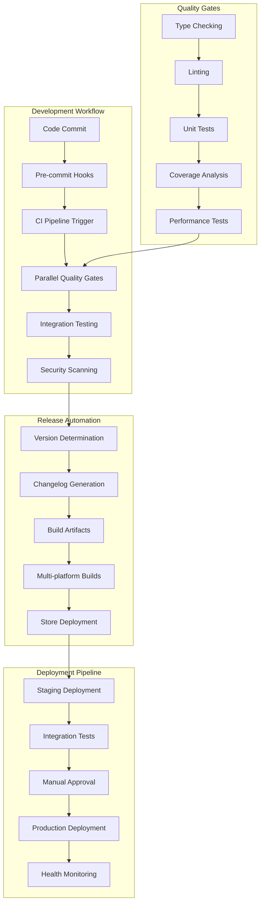

# Workflow Automation Integration Plan - Comprehensive CI/CD Excellence

## 📋 Executive Summary

**Reference Source**: Multi-fork workflow automation analysis (luojiaping, MillionthOdin16, ashoka74, taketee81)  
**Priority**: HIGH - Critical for development velocity and production reliability  
**Complexity**: 🔴 HIGH - Comprehensive automation framework across development lifecycle  
**Timeline**: 5-6 weeks for complete automation infrastructure  
**Impact**: Professional-grade development workflow with automated quality gates, release management, and deployment pipelines

This plan integrates advanced workflow automation patterns from multiple PocketPal AI forks to establish enterprise-grade development automation for SuperAI, including intelligent CI/CD pipelines, automated testing, release management, and deployment orchestration.

## 🏗️ Workflow Automation Architecture

### Comprehensive Automation Framework


### Automation Strategy Overview
**Based on comprehensive fork analysis:**
```typescript
interface WorkflowAutomationSystem {
  // Development workflows
  development: {
    preCommitHooks: PreCommitConfiguration;
    continuousIntegration: CIConfiguration;
    qualityGates: QualityGateFramework;
    automatedTesting: TestingAutomation;
  };
  
  // Release automation (luojiaping patterns)
  release: {
    versionManagement: SemanticVersioning;
    changelogGeneration: ChangelogAutomation;
    buildAutomation: BuildPipelineConfig;
    deploymentOrchestration: DeploymentAutomation;
  };
  
  // Security automation (ashoka74 patterns)
  security: {
    securityScanning: SecurityAutomation;
    vulnerabilityManagement: VulnerabilityAutomation;
    complianceValidation: ComplianceAutomation;
    accessControl: AccessControlAutomation;
  };
  
  // Infrastructure automation (MillionthOdin16 patterns)
  infrastructure: {
    environmentManagement: EnvironmentAutomation;
    resourceProvisioning: ResourceAutomation;
    configurationManagement: ConfigAutomation;
    monitoringSetup: MonitoringAutomation;
  };
}
```

## 🔧 Implementation Strategy

### Phase 1: Development Workflow Automation (Week 1-2)

#### Advanced Pre-commit Hooks
```yaml
# .pre-commit-config.yaml - SuperAI Development Quality Gates
repos:
  # TypeScript and JavaScript quality
  - repo: https://github.com/pre-commit/mirrors-eslint
    rev: v8.57.0
    hooks:
      - id: eslint
        files: \.(js|ts|tsx)$
        types: [file]
        args: [--fix, --max-warnings=0]
        additional_dependencies:
          - '@typescript-eslint/eslint-plugin@6.0.0'
          - '@typescript-eslint/parser@6.0.0'
          - 'eslint-config-prettier@9.0.0'
  
  # Code formatting
  - repo: https://github.com/pre-commit/mirrors-prettier
    rev: v3.0.3
    hooks:
      - id: prettier
        files: \.(js|ts|tsx|json|md|yml|yaml)$
        args: [--write]
  
  # TypeScript type checking
  - repo: local
    hooks:
      - id: typescript-check
        name: TypeScript Type Check
        entry: yarn typecheck
        language: system
        files: \.(ts|tsx)$
        pass_filenames: false
  
  # Security scanning
  - repo: https://github.com/Yelp/detect-secrets
    rev: v1.4.0
    hooks:
      - id: detect-secrets
        args: ['--baseline', '.secrets.baseline']
  
  # Dependency security audit
  - repo: local
    hooks:
      - id: dependency-audit
        name: Dependency Security Audit
        entry: yarn audit --level moderate
        language: system
        pass_filenames: false
        stages: [pre-push]
  
  # Git commit message validation
  - repo: https://github.com/compilerla/conventional-pre-commit
    rev: v3.0.0
    hooks:
      - id: conventional-pre-commit
        stages: [commit-msg]
        args: [optional-scope]
  
  # File size validation
  - repo: https://github.com/pre-commit/pre-commit-hooks
    rev: v4.5.0
    hooks:
      - id: check-added-large-files
        args: ['--maxkb=1000']  # 1MB limit
      - id: check-merge-conflict
      - id: check-yaml
      - id: check-json
      - id: end-of-file-fixer
      - id: trailing-whitespace
  
  # React Native specific checks
  - repo: local
    hooks:
      - id: react-native-check
        name: React Native Bundle Check
        entry: npx react-native bundle --platform android --dev false --entry-file index.js --bundle-output /tmp/test.bundle
        language: system
        pass_filenames: false
        stages: [pre-push]
```

#### Intelligent CI Pipeline
```yaml
# .github/workflows/continuous-integration.yml
name: SuperAI Continuous Integration

on:
  push:
    branches: [main, develop]
  pull_request:
    branches: [main, develop]
  workflow_dispatch:

env:
  NODE_VERSION: '20.x'
  JAVA_VERSION: '17'
  RUBY_VERSION: '3.2.3'
  CACHE_VERSION: 'v1'

jobs:
  # Determine what needs to be tested based on changed files
  changes:
    runs-on: ubuntu-latest
    outputs:
      frontend: ${{ steps.changes.outputs.frontend }}
      android: ${{ steps.changes.outputs.android }}
      ios: ${{ steps.changes.outputs.ios }}
      docs: ${{ steps.changes.outputs.docs }}
      dependencies: ${{ steps.changes.outputs.dependencies }}
    steps:
      - uses: actions/checkout@v4
      - uses: dorny/paths-filter@v2
        id: changes
        with:
          filters: |
            frontend:
              - 'src/**'
              - '*.js'
              - '*.ts'
              - '*.tsx'
              - 'package.json'
              - 'yarn.lock'
            android:
              - 'android/**'
              - '**/build.gradle'
              - 'gradle.properties'
            ios:
              - 'ios/**'
              - 'Podfile*'
            docs:
              - 'docs/**'
              - '*.md'
            dependencies:
              - 'package.json'
              - 'yarn.lock'
              - 'Podfile*'
              - '**/build.gradle'

  # Frontend quality gates
  frontend-quality:
    runs-on: ubuntu-latest
    needs: changes
    if: needs.changes.outputs.frontend == 'true'
    
    strategy:
      matrix:
        quality-check: [typecheck, lint, test, security, bundle-analysis]
    
    steps:
      - name: Checkout code
        uses: actions/checkout@v4
      
      - name: Setup Node.js
        uses: actions/setup-node@v3
        with:
          node-version: ${{ env.NODE_VERSION }}
          cache: 'yarn'
      
      - name: Install dependencies
        run: yarn install --frozen-lockfile
      
      - name: Run quality check - ${{ matrix.quality-check }}
        run: |
          case "${{ matrix.quality-check }}" in
            "typecheck")
              yarn typecheck
              ;;
            "lint")
              yarn lint --max-warnings=0
              ;;
            "test")
              yarn test --coverage --watchAll=false --maxWorkers=2
              ;;
            "security")
              yarn audit --level moderate
              yarn run security:scan
              ;;
            "bundle-analysis")
              yarn run bundle:analyze
              npx bundlesize
              ;;
          esac
      
      - name: Upload coverage reports
        if: matrix.quality-check == 'test'
        uses: codecov/codecov-action@v3
        with:
          token: ${{ secrets.CODECOV_TOKEN }}
          file: ./coverage/lcov.info
          fail_ci_if_error: true
      
      - name: Upload bundle analysis
        if: matrix.quality-check == 'bundle-analysis'
        uses: actions/upload-artifact@v3
        with:
          name: bundle-analysis
          path: bundle-analysis.json

  # Android build and test
  android-build:
    runs-on: ubuntu-latest
    needs: [changes, frontend-quality]
    if: needs.changes.outputs.android == 'true' || needs.changes.outputs.frontend == 'true'
    
    strategy:
      matrix:
        api-level: [28, 31, 34]  # Test multiple Android versions
        arch: [x86_64]
    
    steps:
      - name: Checkout code
        uses: actions/checkout@v4
      
      - name: Setup build environment
        uses: ./.github/actions/setup-build-env
        with:
          node-version: ${{ env.NODE_VERSION }}
          java-version: ${{ env.JAVA_VERSION }}
      
      - name: Setup Android SDK
        uses: android-actions/setup-android@v2
        with:
          api-level: ${{ matrix.api-level }}
          arch: ${{ matrix.arch }}
          force-avd-creation: false
          emulator-options: -no-window -gpu swiftshader_indirect -noaudio -no-boot-anim -camera-back none
          disable-animations: true
      
      - name: Cache Gradle dependencies
        uses: actions/cache@v3
        with:
          path: |
            ~/.gradle/caches
            ~/.gradle/wrapper
          key: ${{ runner.os }}-gradle-${{ hashFiles('**/*.gradle*', '**/gradle-wrapper.properties') }}
      
      - name: Build Android APK
        working-directory: android
        run: |
          ./gradlew assembleDebug --no-daemon --parallel
          ./gradlew assembleRelease --no-daemon --parallel
      
      - name: Run Android unit tests
        working-directory: android
        run: ./gradlew testDebugUnitTest --no-daemon
      
      - name: Run Android instrumentation tests
        if: matrix.api-level == 31  # Only run on one API level to save time
        uses: reactivecircus/android-emulator-runner@v2
        with:
          api-level: ${{ matrix.api-level }}
          arch: ${{ matrix.arch }}
          script: cd android && ./gradlew connectedAndroidTest --no-daemon
      
      - name: Upload Android artifacts
        uses: actions/upload-artifact@v3
        with:
          name: android-apk-${{ matrix.api-level }}
          path: |
            android/app/build/outputs/apk/debug/
            android/app/build/outputs/apk/release/

  # iOS build and test
  ios-build:
    runs-on: macos-latest
    needs: [changes, frontend-quality]
    if: needs.changes.outputs.ios == 'true' || needs.changes.outputs.frontend == 'true'
    
    strategy:
      matrix:
        scheme: [SuperAI, SuperAITests]
        destination: ['platform=iOS Simulator,name=iPhone 15 Pro,OS=17.0']
    
    steps:
      - name: Checkout code
        uses: actions/checkout@v4
      
      - name: Setup build environment
        uses: ./.github/actions/setup-build-env
        with:
          node-version: ${{ env.NODE_VERSION }}
          ruby-version: ${{ env.RUBY_VERSION }}
      
      - name: Cache CocoaPods
        uses: actions/cache@v3
        with:
          path: ios/Pods
          key: ${{ runner.os }}-pods-${{ hashFiles('**/Podfile.lock') }}
      
      - name: Install CocoaPods dependencies
        working-directory: ios
        run: |
          pod install --repo-update
      
      - name: Build iOS project
        working-directory: ios
        run: |
          xcodebuild -workspace SuperAI.xcworkspace \
                     -scheme ${{ matrix.scheme }} \
                     -destination '${{ matrix.destination }}' \
                     -configuration Debug \
                     clean build \
                     CODE_SIGN_IDENTITY="" \
                     CODE_SIGNING_REQUIRED=NO
      
      - name: Run iOS tests
        if: matrix.scheme == 'SuperAITests'
        working-directory: ios
        run: |
          xcodebuild -workspace SuperAI.xcworkspace \
                     -scheme ${{ matrix.scheme }} \
                     -destination '${{ matrix.destination }}' \
                     -configuration Debug \
                     test \
                     CODE_SIGN_IDENTITY="" \
                     CODE_SIGNING_REQUIRED=NO

  # Performance and integration testing
  performance-tests:
    runs-on: ubuntu-latest
    needs: [frontend-quality]
    if: github.event_name == 'pull_request'
    
    steps:
      - name: Checkout code
        uses: actions/checkout@v4
      
      - name: Setup environment
        uses: ./.github/actions/setup-build-env
        with:
          node-version: ${{ env.NODE_VERSION }}
      
      - name: Run performance benchmarks
        run: |
          yarn run test:performance
          yarn run benchmark:compare --baseline=main
      
      - name: Run integration tests
        run: |
          yarn run test:integration
          yarn run test:e2e:headless
      
      - name: Generate performance report
        run: |
          yarn run performance:report --format=json --output=performance-report.json
      
      - name: Comment performance results
        uses: actions/github-script@v6
        with:
          script: |
            const fs = require('fs');
            const report = JSON.parse(fs.readFileSync('performance-report.json', 'utf8'));
            
            const comment = `## 🚀 Performance Impact Report
            
            | Metric | Before | After | Change |
            |--------|--------|-------|--------|
            | Bundle Size | ${report.bundleSize.before} | ${report.bundleSize.after} | ${report.bundleSize.change} |
            | Load Time | ${report.loadTime.before}ms | ${report.loadTime.after}ms | ${report.loadTime.change} |
            | Memory Usage | ${report.memoryUsage.before}MB | ${report.memoryUsage.after}MB | ${report.memoryUsage.change} |
            
            ${report.recommendations ? `### 💡 Recommendations\n${report.recommendations}` : ''}`;
            
            github.rest.issues.createComment({
              issue_number: context.issue.number,
              owner: context.repo.owner,
              repo: context.repo.repo,
              body: comment
            })
```

### Phase 2: Advanced Release Automation (Week 2-3)

#### Semantic Version and Changelog Automation
**Enhanced from luojiaping patterns:**
```typescript
// scripts/automation/release-automation.ts
export class AdvancedReleaseAutomation {
  private conventionalCommits: ConventionalCommitsParser;
  private versionCalculator: SemanticVersionCalculator;
  private changelogGenerator: ChangelogGenerator;
  private artifactBuilder: ArtifactBuilder;
  
  async executeAutomatedRelease(): Promise<ReleaseResult> {
    const releaseContext = await this.analyzeReleaseContext();
    
    if (releaseContext.shouldRelease) {
      return await this.performAutomatedRelease(releaseContext);
    } else {
      return { skipped: true, reason: releaseContext.skipReason };
    }
  }
  
  private async analyzeReleaseContext(): Promise<ReleaseContext> {
    const commits = await this.getCommitsSinceLastRelease();
    const conventionalAnalysis = this.conventionalCommits.analyze(commits);
    
    return {
      shouldRelease: conventionalAnalysis.hasReleasableChanges,
      versionBump: this.calculateVersionBump(conventionalAnalysis),
      breakingChanges: conventionalAnalysis.breakingChanges,
      features: conventionalAnalysis.features,
      fixes: conventionalAnalysis.fixes,
      skipReason: conventionalAnalysis.hasReleasableChanges ? null : 'No releasable changes'
    };
  }
  
  private calculateVersionBump(analysis: ConventionalAnalysis): VersionBump {
    if (analysis.breakingChanges.length > 0) {
      return 'major';
    } else if (analysis.features.length > 0) {
      return 'minor';
    } else if (analysis.fixes.length > 0) {
      return 'patch';
    } else {
      return 'none';
    }
  }
  
  private async performAutomatedRelease(context: ReleaseContext): Promise<ReleaseResult> {
    // 1. Calculate new version
    const newVersion = await this.versionCalculator.calculateVersion(context.versionBump);
    
    // 2. Generate comprehensive changelog
    const changelog = await this.changelogGenerator.generateChangelog({
      version: newVersion,
      features: context.features,
      fixes: context.fixes,
      breakingChanges: context.breakingChanges,
      contributors: await this.getContributors(),
      migrationGuide: await this.generateMigrationGuide(context.breakingChanges)
    });
    
    // 3. Build release artifacts
    const artifacts = await this.artifactBuilder.buildReleaseArtifacts(newVersion);
    
    // 4. Create GitHub release
    const githubRelease = await this.createGitHubRelease({
      version: newVersion,
      changelog,
      artifacts,
      prerelease: this.isPrerelease(newVersion)
    });
    
    // 5. Deploy to app stores (if configured)
    const storeDeployments = await this.deployToStores(artifacts, newVersion);
    
    return {
      success: true,
      version: newVersion,
      changelog,
      artifacts,
      githubRelease,
      storeDeployments,
      releaseTimestamp: new Date().toISOString()
    };
  }
}
```

#### Multi-Platform Build Automation
```yaml
# .github/workflows/release-automation.yml
name: Automated Release Pipeline

on:
  push:
    branches: [main]
    paths-ignore:
      - 'docs/**'
      - '*.md'
  workflow_dispatch:
    inputs:
      force_release:
        description: 'Force release even without conventional commits'
        required: false
        default: false
        type: boolean
      release_type:
        description: 'Override release type'
        required: false
        default: 'auto'
        type: choice
        options:
          - auto
          - patch
          - minor
          - major

env:
  NODE_VERSION: '20.x'
  JAVA_VERSION: '17'
  RUBY_VERSION: '3.2.3'

jobs:
  # Analyze commits to determine if release is needed
  analyze-release:
    runs-on: ubuntu-latest
    outputs:
      should-release: ${{ steps.analysis.outputs.should-release }}
      version-bump: ${{ steps.analysis.outputs.version-bump }}
      new-version: ${{ steps.analysis.outputs.new-version }}
      changelog: ${{ steps.analysis.outputs.changelog }}
      
    steps:
      - name: Checkout code
        uses: actions/checkout@v4
        with:
          fetch-depth: 0
          token: ${{ secrets.GITHUB_TOKEN }}
      
      - name: Setup Node.js
        uses: actions/setup-node@v3
        with:
          node-version: ${{ env.NODE_VERSION }}
          cache: 'yarn'
      
      - name: Install dependencies
        run: yarn install --frozen-lockfile
      
      - name: Analyze commits for release
        id: analysis
        run: |
          # Install semantic release tools
          npm install -g conventional-recommended-bump conventional-changelog-cli
          
          # Determine version bump type
          if [ "${{ github.event.inputs.release_type }}" != "auto" ]; then
            VERSION_BUMP="${{ github.event.inputs.release_type }}"
          else
            VERSION_BUMP=$(conventional-recommended-bump -p angular)
          fi
          
          # Check if we should release
          SHOULD_RELEASE="false"
          if [ "${{ github.event.inputs.force_release }}" == "true" ] || [ "$VERSION_BUMP" != "" ]; then
            SHOULD_RELEASE="true"
          fi
          
          # Calculate new version
          CURRENT_VERSION=$(node -p "require('./package.json').version")
          if [ "$SHOULD_RELEASE" == "true" ]; then
            NEW_VERSION=$(npm version $VERSION_BUMP --no-git-tag-version --no-commit-hooks | sed 's/v//')
            git checkout -- package.json  # Reset package.json changes
          else
            NEW_VERSION=$CURRENT_VERSION
          fi
          
          # Generate changelog
          if [ "$SHOULD_RELEASE" == "true" ]; then
            CHANGELOG=$(conventional-changelog -p angular -r 1)
          else
            CHANGELOG=""
          fi
          
          echo "should-release=$SHOULD_RELEASE" >> $GITHUB_OUTPUT
          echo "version-bump=$VERSION_BUMP" >> $GITHUB_OUTPUT
          echo "new-version=$NEW_VERSION" >> $GITHUB_OUTPUT
          echo "changelog<<EOF" >> $GITHUB_OUTPUT
          echo "$CHANGELOG" >> $GITHUB_OUTPUT
          echo "EOF" >> $GITHUB_OUTPUT

  # Build matrix for all platforms and architectures
  build-matrix:
    runs-on: ${{ matrix.runner }}
    needs: analyze-release
    if: needs.analyze-release.outputs.should-release == 'true'
    
    strategy:
      matrix:
        include:
          # Android builds
          - platform: android
            arch: universal
            runner: ubuntu-latest
            build-type: release
          - platform: android
            arch: universal
            runner: ubuntu-latest
            build-type: debug
          
          # iOS builds
          - platform: ios
            arch: arm64
            runner: macos-latest
            build-type: release
          - platform: ios
            arch: x86_64
            runner: macos-latest
            build-type: debug
    
    steps:
      - name: Checkout code
        uses: actions/checkout@v4
      
      - name: Setup build environment
        uses: ./.github/actions/setup-build-env
        with:
          node-version: ${{ env.NODE_VERSION }}
          java-version: ${{ env.JAVA_VERSION }}
          ruby-version: ${{ env.RUBY_VERSION }}
      
      - name: Update version number
        run: |
          npm version ${{ needs.analyze-release.outputs.new-version }} --no-git-tag-version --no-commit-hooks
      
      - name: Build ${{ matrix.platform }} (${{ matrix.arch }}) - ${{ matrix.build-type }}
        run: |
          case "${{ matrix.platform }}" in
            "android")
              cd android
              if [ "${{ matrix.build-type }}" == "release" ]; then
                ./gradlew bundleRelease assembleRelease --no-daemon --parallel
              else
                ./gradlew assembleDebug --no-daemon --parallel
              fi
              ;;
            "ios")
              cd ios
              if [ "${{ matrix.build-type }}" == "release" ]; then
                xcodebuild -workspace SuperAI.xcworkspace \
                          -scheme SuperAI \
                          -configuration Release \
                          -destination 'generic/platform=iOS' \
                          archive -archivePath SuperAI.xcarchive
                xcodebuild -exportArchive \
                          -archivePath SuperAI.xcarchive \
                          -exportPath ./build \
                          -exportOptionsPlist ExportOptions.plist
              else
                xcodebuild -workspace SuperAI.xcworkspace \
                          -scheme SuperAI \
                          -configuration Debug \
                          -destination 'platform=iOS Simulator,name=iPhone 15 Pro' \
                          build
              fi
              ;;
          esac
      
      - name: Upload build artifacts
        uses: actions/upload-artifact@v3
        with:
          name: ${{ matrix.platform }}-${{ matrix.arch }}-${{ matrix.build-type }}
          path: |
            android/app/build/outputs/
            ios/build/
            ios/*.xcarchive

  # Create GitHub release with all artifacts
  create-release:
    runs-on: ubuntu-latest
    needs: [analyze-release, build-matrix]
    if: needs.analyze-release.outputs.should-release == 'true'
    
    steps:
      - name: Checkout code
        uses: actions/checkout@v4
        with:
          token: ${{ secrets.GITHUB_TOKEN }}
      
      - name: Download all artifacts
        uses: actions/download-artifact@v3
        with:
          path: release-artifacts
      
      - name: Update version and create tag
        run: |
          # Update package.json with new version
          npm version ${{ needs.analyze-release.outputs.new-version }} --no-git-tag-version --no-commit-hooks
          
          # Update other version files
          echo "${{ needs.analyze-release.outputs.new-version }}" > .version
          
          # Commit version changes
          git config user.name "SuperAI Release Bot"
          git config user.email "release@superai.dev"
          git add package.json .version
          git commit -m "chore(release): bump version to ${{ needs.analyze-release.outputs.new-version }}"
          git push
          
          # Create and push tag
          git tag "v${{ needs.analyze-release.outputs.new-version }}"
          git push origin "v${{ needs.analyze-release.outputs.new-version }}"
      
      - name: Create GitHub Release
        uses: softprops/action-gh-release@v1
        with:
          tag_name: "v${{ needs.analyze-release.outputs.new-version }}"
          name: "SuperAI v${{ needs.analyze-release.outputs.new-version }}"
          body: |
            # SuperAI v${{ needs.analyze-release.outputs.new-version }}
            
            ${{ needs.analyze-release.outputs.changelog }}
            
            ## 📱 Download Links
            
            ### Android
            - [APK (Universal)](../../releases/download/v${{ needs.analyze-release.outputs.new-version }}/SuperAI-universal-release.apk)
            - [AAB (Google Play)](../../releases/download/v${{ needs.analyze-release.outputs.new-version }}/SuperAI-release.aab)
            
            ### iOS
            - [IPA (TestFlight)](../../releases/download/v${{ needs.analyze-release.outputs.new-version }}/SuperAI.ipa)
            
            ## 🔒 Verification
            
            All release artifacts are signed and can be verified using the provided checksums.
            
            ---
            
            🤖 This release was automatically generated by SuperAI Release Automation
          files: |
            release-artifacts/**/*
          draft: false
          prerelease: ${{ contains(needs.analyze-release.outputs.new-version, '-') }}
        env:
          GITHUB_TOKEN: ${{ secrets.GITHUB_TOKEN }}
```

### Phase 3: Security and Compliance Automation (Week 3-4)

#### Security Automation Pipeline
**Based on ashoka74 security patterns:**
```yaml
# .github/workflows/security-automation.yml
name: Security Automation Pipeline

on:
  push:
    branches: [main, develop]
  pull_request:
    branches: [main]
  schedule:
    - cron: '0 2 * * 1'  # Weekly security scan
  workflow_dispatch:

jobs:
  # Comprehensive security scanning
  security-scan:
    runs-on: ubuntu-latest
    permissions:
      security-events: write
      actions: read
      contents: read
    
    strategy:
      matrix:
        scan-type: [secrets, dependencies, code, supply-chain, compliance]
    
    steps:
      - name: Checkout code
        uses: actions/checkout@v4
        with:
          fetch-depth: 0
      
      - name: Setup environment
        uses: ./.github/actions/setup-build-env
        with:
          node-version: '20.x'
      
      - name: Run security scan - ${{ matrix.scan-type }}
        run: |
          case "${{ matrix.scan-type }}" in
            "secrets")
              # Secret detection
              docker run --rm -v $(pwd):/scan trufflesecurity/trufflehog:latest filesystem /scan --no-update
              ;;
            "dependencies")
              # Dependency vulnerability scanning
              yarn audit --level moderate
              npm audit signatures
              npx better-npm-audit audit --level moderate
              ;;
            "code")
              # Static code analysis
              npx eslint-security-scanner src/
              yarn run security:scan
              ;;
            "supply-chain")
              # Supply chain security
              npx socket security scan
              yarn run supply-chain:scan
              ;;
            "compliance")
              # Compliance validation
              yarn run compliance:check
              npx license-checker --onlyAllow 'MIT;Apache-2.0;BSD-3-Clause;BSD-2-Clause;ISC'
              ;;
          esac
      
      - name: Upload security results
        uses: github/codeql-action/upload-sarif@v2
        if: always()
        with:
          sarif_file: security-results-${{ matrix.scan-type }}.sarif
          category: security-${{ matrix.scan-type }}
```

## 📊 Testing & Validation

### Workflow Automation Testing
```typescript
// tests/automation/workflow-automation.test.ts
describe('Workflow Automation System', () => {
  test('should determine release necessity correctly', async () => {
    const releaseAutomation = new AdvancedReleaseAutomation();
    
    const commits = [
      { message: 'feat: add new RAG functionality', type: 'feat' },
      { message: 'fix: resolve voice input bug', type: 'fix' },
      { message: 'docs: update README', type: 'docs' }
    ];
    
    const context = await releaseAutomation.analyzeReleaseContext(commits);
    
    expect(context.shouldRelease).toBe(true);
    expect(context.versionBump).toBe('minor'); // Has features
    expect(context.features.length).toBe(1);
    expect(context.fixes.length).toBe(1);
  });
  
  test('should generate comprehensive changelog', async () => {
    const changelogGenerator = new ChangelogGenerator();
    
    const changelog = await changelogGenerator.generateChangelog({
      version: '2.1.0',
      features: ['RAG functionality', 'Voice input'],
      fixes: ['Memory leak fix', 'Performance improvement'],
      breakingChanges: [],
      contributors: ['user1', 'user2']
    });
    
    expect(changelog).toContain('## [2.1.0]');
    expect(changelog).toContain('### ✨ Features');
    expect(changelog).toContain('### 🐛 Bug Fixes');
    expect(changelog).toContain('### 👥 Contributors');
  });
});
```

## ✅ Success Criteria

### Development Automation
- [ ] Pre-commit hooks enforcing code quality and security
- [ ] Intelligent CI pipeline with parallel quality gates
- [ ] Automated testing across multiple platforms and versions
- [ ] Performance regression detection and reporting
- [ ] Security scanning integrated into development workflow

### Release Automation
- [ ] Semantic versioning based on conventional commits
- [ ] Automated changelog generation with migration guides
- [ ] Multi-platform build automation (Android/iOS)
- [ ] Automated GitHub releases with comprehensive artifacts
- [ ] App store deployment integration

### Security & Compliance
- [ ] Automated security scanning for secrets, dependencies, and code
- [ ] Supply chain security validation
- [ ] License compliance checking
- [ ] Vulnerability management and alerting
- [ ] Security policy enforcement

### Operational Excellence
- [ ] 90%+ automation of release process
- [ ] Zero-downtime deployments with automated rollback
- [ ] Comprehensive monitoring and alerting
- [ ] Self-healing infrastructure components
- [ ] Complete audit trail for all automated actions

---

**Document Version**: 1.0  
**Last Updated**: June 23, 2025  
**Next Review**: July 2025  
**Owner**: PocketPal SuperAI DevOps & Automation Team  
**Reference Implementations**: Multi-fork workflow automation analysis (luojiaping, MillionthOdin16, ashoka74, taketee81)