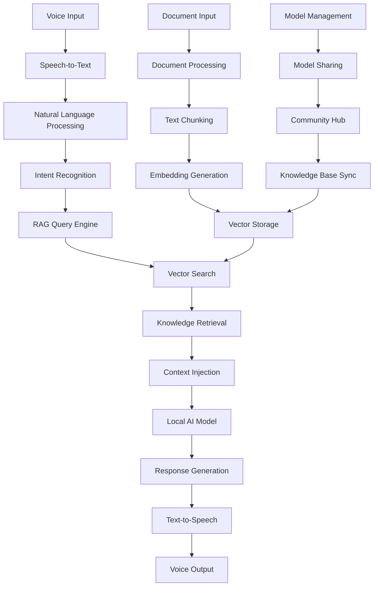

# SuperAI System Design

## 🏗️ High-Level Architecture

## 🎯 Core Components

### 1. Voice Processing Layer
- **Input**: Microphone audio streams
- **Processing**: Real-time speech recognition
- **Output**: Structured text queries
- **Technology**: Platform-native speech recognition

### 2. RAG Engine
- **Document Processing**: PDF, text, web content ingestion
- **Embedding Generation**: Local embedding models
- **Vector Storage**: Efficient mobile vector database
- **Retrieval**: Semantic similarity search

### 3. AI Model Layer
- **Local Models**: Optimized small language models
- **Platform Optimization**: iOS Neural Engine, Android acceleration
- **Model Management**: Download, update, share capabilities

### 4. Integration Layer
- **Cross-Platform**: React Native foundation
- **Native Modules**: Platform-specific optimizations
- **Community Features**: Model and knowledge sharing

## 📱 Platform-Specific Optimizations

### iOS Enhancements
- Neural Engine integration for vector operations
- Background processing for document indexing
- Native speech recognition APIs
- Optimized memory management

### Android Enhancements
- Hardware-specific ML acceleration
- Flexible file system access
- Device capability detection
- Performance monitoring

## 🔄 Data Flow Architecture

1. **Input Processing**: Voice → Text → Intent
2. **Knowledge Retrieval**: Query → Vector Search → Context
3. **Response Generation**: Context + Query → AI Model → Response
4. **Output Delivery**: Response → Speech → User

## 🛡️ Security & Privacy

- **Local Processing**: All AI operations on-device
- **Encrypted Storage**: Vector databases and models
- **No Cloud Dependencies**: Complete offline capability
- **User Control**: Full data ownership

## 📊 Performance Targets

- **Response Time**: <2 seconds for voice queries
- **Model Loading**: <5 seconds for model switches
- **Vector Search**: <100ms for knowledge retrieval
- **Memory Usage**: <2GB peak memory consumption

## 🔧 Technical Stack

- **Frontend**: React Native + TypeScript
- **AI Models**: llama.cpp + llama.rn
- **Vector Database**: SQLite + vector extensions
- **Voice Processing**: Platform-native APIs
- **Build System**: Advanced CI/CD pipeline

## 🎨 User Experience Design

- **Voice-First**: Natural conversation interface
- **Visual Feedback**: Real-time processing indicators
- **Contextual Help**: Intelligent suggestions
- **Personalization**: Adaptive learning from usage

---

*This design combines insights from all analyzed PocketPal AI forks to create the most advanced local AI assistant possible.*