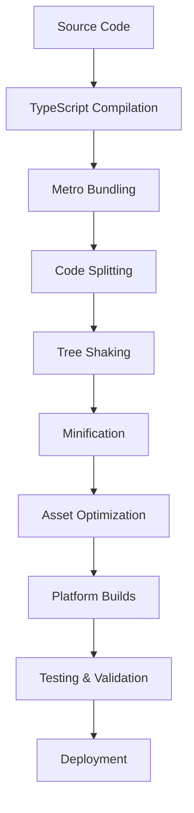

# Build Optimization Guide

## 📋 Overview

This comprehensive guide covers build optimization, deployment strategies, and performance tuning for PocketPal SuperAI. Based on sultanqasim's optimization patterns and mobile-first development practices, this guide ensures fast builds, optimized bundles, and efficient deployment processes.

**Build Performance Goals**: <30s development builds, <2 minutes production builds  
**Bundle Optimization**: <50MB total app size, code splitting, tree shaking  
**Deployment Strategy**: Automated CI/CD with multi-environment support  

## 🏗️ Build Architecture

### Build Pipeline Overview


### Build Layers
1. **Source Processing**: TypeScript compilation and linting
2. **Bundle Generation**: Metro bundling with optimization
3. **Asset Processing**: Image optimization and resource bundling
4. **Platform Building**: iOS and Android native builds
5. **Testing Integration**: Automated testing in build pipeline
6. **Deployment**: Multi-environment deployment strategy

## ⚡ Development Build Optimization

### 1. Metro Configuration Optimization
Update `metro.config.js`:
```javascript
const {getDefaultConfig, mergeConfig} = require('@react-native/metro-config');
const path = require('path');

const defaultConfig = getDefaultConfig(__dirname);

const config = {
  resolver: {
    alias: {
      '@': path.resolve(__dirname, 'src'),
      '@rag': path.resolve(__dirname, 'src/rag'),
      '@voice': path.resolve(__dirname, 'src/voice'),
      '@models': path.resolve(__dirname, 'src/models'),
      '@vectors': path.resolve(__dirname, 'src/vectors'),
      '@utils': path.resolve(__dirname, 'src/utils'),
      '@types': path.resolve(__dirname, 'src/types'),
      '@components': path.resolve(__dirname, 'src/components'),
    },
    assetExts: [
      ...defaultConfig.resolver.assetExts,
      'bin', 'txt', 'gguf', 'onnx', 'tflite'
    ],
    sourceExts: [
      ...defaultConfig.resolver.sourceExts,
      'mjs', 'cjs'
    ],
  },
  transformer: {
    getTransformOptions: async () => ({
      transform: {
        experimentalImportSupport: false,
        inlineRequires: true, // Enable for faster startup
      },
    }),
    // Enable Hermes for better performance
    hermesCommand: require.resolve('hermes-engine/osx-bin/hermesc'),
    minifierPath: require.resolve('metro-minify-esbuild'),
    minifierConfig: {
      target: 'es2017',
      format: 'cjs',
      minify: true,
      keepNames: false,
    },
  },
  serializer: {
    createModuleIdFactory: () => {
      // Use numeric module IDs for smaller bundles
      return (path) => {
        const hash = require('crypto').createHash('md5').update(path).digest('hex');
        return parseInt(hash.substr(0, 8), 16);
      };
    },
  },
  watchFolders: [
    // Include native module directories
    path.resolve(__dirname, 'native/rag'),
    path.resolve(__dirname, 'native/voice'),
    path.resolve(__dirname, 'native/vectors'),
    path.resolve(__dirname, 'native/models'),
  ],
  resetCache: true, // Clear cache for optimization testing
};

module.exports = mergeConfig(defaultConfig, config);
```

### 2. TypeScript Build Optimization
Update `tsconfig.json`:
```json
{
  "extends": "@react-native/typescript-config/tsconfig.json",
  "compilerOptions": {
    "baseUrl": ".",
    "paths": {
      "@/*": ["./src/*"],
      "@rag/*": ["./src/rag/*"],
      "@voice/*": ["./src/voice/*"],
      "@models/*": ["./src/models/*"],
      "@vectors/*": ["./src/vectors/*"],
      "@utils/*": ["./src/utils/*"],
      "@types/*": ["./src/types/*"],
      "@components/*": ["./src/components/*"]
    },
    "strict": true,
    "noImplicitReturns": true,
    "noFallthroughCasesInSwitch": true,
    "noUncheckedIndexedAccess": true,
    "incremental": true,
    "tsBuildInfoFile": ".tsbuildinfo",
    "skipLibCheck": true, // Speed up compilation
    "importsNotUsedAsValues": "remove"
  },
  "include": [
    "src/**/*",
    "native/**/*",
    "index.js"
  ],
  "exclude": [
    "node_modules",
    "ios/build",
    "android/build",
    "dist",
    "**/*.test.ts",
    "**/*.test.tsx",
    "**/__tests__/**"
  ]
}
```

### 3. Fast Refresh Configuration
Update `babel.config.js`:
```javascript
module.exports = {
  presets: [
    [
      'module:metro-react-native-babel-preset',
      {
        unstable_transformProfile: 'hermes-stable',
      },
    ],
  ],
  plugins: [
    [
      'module-resolver',
      {
        root: ['./src'],
        alias: {
          '@': './src',
          '@rag': './src/rag',
          '@voice': './src/voice',
          '@models': './src/models',
          '@vectors': './src/vectors',
          '@utils': './src/utils',
          '@types': './src/types',
          '@components': './src/components',
        },
      },
    ],
    'react-native-reanimated/plugin', // Must be last
  ],
  env: {
    development: {
      plugins: [
        ['@babel/plugin-transform-react-jsx', { runtime: 'automatic' }],
      ],
    },
    production: {
      plugins: [
        'transform-remove-console', // Remove console.log in production
        'react-native-paper/babel',
      ],
    },
  },
};
```

### 4. Development Scripts Optimization
Update `package.json`:
```json
{
  "scripts": {
    "start": "react-native start --reset-cache",
    "start:clean": "react-native start --reset-cache --verbose",
    "ios": "react-native run-ios --simulator=\"iPhone 15 Pro\"",
    "ios:device": "react-native run-ios --device",
    "android": "react-native run-android",
    "android:release": "react-native run-android --variant=release",
    "build:ios": "cd ios && xcodebuild -workspace PocketPalSuperAI.xcworkspace -scheme PocketPalSuperAI -configuration Release -sdk iphoneos -archivePath build/PocketPalSuperAI.xcarchive archive",
    "build:android": "cd android && ./gradlew assembleRelease",
    "bundle:ios": "react-native bundle --platform ios --dev false --entry-file index.js --bundle-output ios-bundle.js --sourcemap-output ios-bundle.map",
    "bundle:android": "react-native bundle --platform android --dev false --entry-file index.js --bundle-output android-bundle.js --sourcemap-output android-bundle.map",
    "analyze:bundle": "npx react-native-bundle-visualizer",
    "clean": "yarn clean:metro && yarn clean:ios && yarn clean:android",
    "clean:metro": "npx react-native start --reset-cache",
    "clean:ios": "cd ios && xcodebuild clean && rm -rf build",
    "clean:android": "cd android && ./gradlew clean",
    "clean:node": "rm -rf node_modules && yarn install",
    "postinstall": "cd ios && pod install"
  }
}
```

## 🍎 iOS Build Optimization

### 1. Xcode Project Optimization
Update `ios/PocketPalSuperAI.xcworkspace/contents.xcworkspacedata`:
```xml
<?xml version="1.0" encoding="UTF-8"?>
<Workspace version="1.0">
   <FileRef location="group:PocketPalSuperAI.xcodeproj" />
   <FileRef location="group:Pods/Pods.xcodeproj" />
</Workspace>
```

Create `ios/optimize.xcconfig`:
```bash
// Build optimization settings
SWIFT_COMPILATION_MODE = wholemodule
SWIFT_OPTIMIZATION_LEVEL = -O
GCC_OPTIMIZATION_LEVEL = s
ENABLE_BITCODE = NO

// Parallel building
CLANG_ENABLE_MODULES = YES
CLANG_MODULES_AUTOLINK = YES
CLANG_ENABLE_MODULE_DEBUGGING = NO

// Dead code stripping
DEAD_CODE_STRIPPING = YES
STRIP_INSTALLED_PRODUCT = YES

// Debug information
DEBUG_INFORMATION_FORMAT = dwarf-with-dsym
GENERATE_INFOPLIST_FILE = YES

// Architectures
VALID_ARCHS = arm64
EXCLUDED_ARCHS[sdk=iphonesimulator*] = arm64

// Other optimizations
ENABLE_NS_ASSERTIONS = NO
ENABLE_TESTABILITY = NO
```

### 2. CocoaPods Optimization
Update `ios/Podfile`:
```ruby
# Optimize CocoaPods installation
require_relative '../node_modules/react-native/scripts/react_native_pods'
require_relative '../node_modules/@react-native-community/cli-platform-ios/native_modules'

platform :ios, '12.4'
install! 'cocoapods', :deterministic_uuids => false

target 'PocketPalSuperAI' do
  config = use_native_modules!

  # Flags change depending on the env values.
  flags = get_default_flags()

  use_react_native!(
    :path => config[:reactNativePath],
    :hermes_enabled => true, # Enable Hermes for better performance
    :fabric_enabled => flags[:fabric_enabled],
    :flipper_configuration => flags[:flipper_configuration],
    :app_path => "#{Pod::Config.instance.installation_root}/.."
  )

  # Optimization pods
  pod 'RNFS', :path => '../node_modules/react-native-fs'
  pod 'react-native-vector-icons', :path => '../node_modules/react-native-vector-icons'

  target 'PocketPalSuperAITests' do
    inherit! :complete
  end

  post_install do |installer|
    react_native_post_install(
      installer,
      :mac_catalyst_enabled => false
    )
    
    # Build optimizations
    installer.pods_project.targets.each do |target|
      target.build_configurations.each do |config|
        # Optimization level
        config.build_settings['GCC_OPTIMIZATION_LEVEL'] = 's'
        config.build_settings['SWIFT_OPTIMIZATION_LEVEL'] = '-O'
        
        # Disable bitcode
        config.build_settings['ENABLE_BITCODE'] = 'NO'
        
        # Enable whole module optimization
        config.build_settings['SWIFT_COMPILATION_MODE'] = 'wholemodule'
        
        # Deployment target
        config.build_settings['IPHONEOS_DEPLOYMENT_TARGET'] = '12.4'
      end
    end
  end
end
```

### 3. Build Schemes Optimization
Create `ios/fastlane/Fastfile`:
```ruby
default_platform(:ios)

platform :ios do
  desc "Build development version"
  lane :dev do
    build_app(
      workspace: "PocketPalSuperAI.xcworkspace",
      scheme: "PocketPalSuperAI",
      configuration: "Debug",
      export_method: "development",
      output_directory: "build/development",
      clean: true,
      include_bitcode: false
    )
  end

  desc "Build release version"
  lane :release do
    increment_build_number(xcodeproj: "PocketPalSuperAI.xcodeproj")
    
    build_app(
      workspace: "PocketPalSuperAI.xcworkspace",
      scheme: "PocketPalSuperAI",
      configuration: "Release",
      export_method: "app-store",
      output_directory: "build/release",
      clean: true,
      include_bitcode: false,
      compile_bitcode: false
    )
  end

  desc "Run tests"
  lane :test do
    run_tests(
      workspace: "PocketPalSuperAI.xcworkspace",
      scheme: "PocketPalSuperAI",
      device: "iPhone 15 Pro"
    )
  end
end
```

## 🤖 Android Build Optimization

### 1. Gradle Optimization
Update `android/gradle.properties`:
```properties
# Build optimizations
org.gradle.jvmargs=-Xmx4G -XX:MaxMetaspaceSize=512m -XX:+HeapDumpOnOutOfMemoryError -Dfile.encoding=UTF-8 -XX:+UseParallelGC
org.gradle.parallel=true
org.gradle.caching=true
org.gradle.daemon=true
org.gradle.configureondemand=true

# Android optimizations
android.useAndroidX=true
android.enableJetifier=true
android.enableR8=true
android.enableR8.fullMode=true

# React Native optimizations
newArchEnabled=false
hermesEnabled=true
reactNativeArchitectures=arm64-v8a

# Flipper (disable in production)
FLIPPER_VERSION=0.182.0

# NDK version
android.ndkVersion=23.1.7779620

# Gradle version
android.gradlePluginVersion=7.4.2
```

Update `android/app/build.gradle`:
```gradle
apply plugin: "com.android.application"
apply plugin: "com.facebook.react"

react {
    entryFile = "index.js"
    reactNativeDir = rootProject.file("../node_modules/react-native")
    codegenDir = rootProject.file("../node_modules/@react-native/codegen")
    cliFile = rootProject.file("../node_modules/@react-native-community/cli/index.js")
    
    // Enable Hermes
    enableHermes = true
    
    // Bundle optimizations
    bundleCommand = "bundle"
    bundleConfig = rootProject.file("../metro.config.js")
    bundleAssetName = "index.android.bundle"
    entryFile = "index.js"
    
    // Enable code splitting
    enableCodePush = false
    enableProguardInReleaseBuilds = true
    
    // Architecture filters
    architectures = ["arm64-v8a"]
}

android {
    ndkVersion rootProject.ext.ndkVersion
    compileSdkVersion rootProject.ext.compileSdkVersion

    namespace "com.pocketpalsuperai"
    defaultConfig {
        applicationId "com.pocketpalsuperai"
        minSdkVersion rootProject.ext.minSdkVersion
        targetSdkVersion rootProject.ext.targetSdkVersion
        versionCode 1
        versionName "1.0.0"
        
        ndk {
            abiFilters "arm64-v8a"
        }
        
        // Multidex support
        multiDexEnabled true
    }
    
    buildTypes {
        debug {
            signingConfig signingConfigs.debug
            applicationIdSuffix ".debug"
            debuggable true
            minifyEnabled false
            crunchPngs false // Disable PNG crunching for faster builds
        }
        release {
            signingConfig signingConfigs.debug
            minifyEnabled true
            proguardFiles getDefaultProguardFile("proguard-android.txt"), "proguard-rules.pro"
            
            // Bundle optimizations
            shrinkResources true
            zipAlignEnabled true
            crunchPngs true
        }
    }
    
    // Build optimizations
    dexOptions {
        javaMaxHeapSize "4g"
        preDexLibraries true
        maxProcessCount 8
    }
    
    compileOptions {
        sourceCompatibility JavaVersion.VERSION_11
        targetCompatibility JavaVersion.VERSION_11
    }
    
    packagingOptions {
        pickFirst "**/libc++_shared.so"
        pickFirst "**/libjsc.so"
        excludes = [
            "META-INF/DEPENDENCIES",
            "META-INF/LICENSE",
            "META-INF/LICENSE.txt",
            "META-INF/NOTICE",
            "META-INF/NOTICE.txt"
        ]
    }
}

dependencies {
    implementation fileTree(dir: "libs", include: ["*.jar"])
    implementation "com.facebook.react:react-android"
    implementation "androidx.swiperefreshlayout:swiperefreshlayout:1.0.0"
    implementation "androidx.multidex:multidex:2.0.1"
    
    // Hermes
    if (hermesEnabled.toBoolean()) {
        implementation("com.facebook.react:hermes-android")
    } else {
        implementation jscFlavor
    }
    
    debugImplementation("com.facebook.flipper:flipper:${FLIPPER_VERSION}")
    debugImplementation("com.facebook.flipper:flipper-network-plugin:${FLIPPER_VERSION}")
    debugImplementation("com.facebook.flipper:flipper-fresco-plugin:${FLIPPER_VERSION}")
}

// Apply from bottom
apply from: file("../../node_modules/@react-native-community/cli-platform-android/native_modules.gradle"); applyNativeModulesAppBuildGradle(project)
```

### 2. ProGuard Optimization
Create `android/app/proguard-rules.pro`:
```proguard
# React Native optimizations
-keep class com.facebook.react.** { *; }
-keep class com.facebook.hermes.reactexecutor.** { *; }
-keep class com.swmansion.** { *; }

# PocketPal specific
-keep class com.pocketpalsuperai.** { *; }

# RAG native modules
-keep class com.pocketpalsuperai.rag.** { *; }
-keep class com.pocketpalsuperai.voice.** { *; }
-keep class com.pocketpalsuperai.models.** { *; }
-keep class com.pocketpalsuperai.vectors.** { *; }

# Keep native methods
-keepclassmembers class * {
    native <methods>;
}

# Remove debug logs
-assumenosideeffects class android.util.Log {
    public static boolean isLoggable(java.lang.String, int);
    public static int v(...);
    public static int i(...);
    public static int w(...);
    public static int d(...);
    public static int e(...);
}

# Optimization
-optimizations !code/simplification/arithmetic,!code/simplification/cast,!field/*,!class/merging/*
-optimizationpasses 5
-allowaccessmodification

# Remove unused code
-dontwarn javax.annotation.**
-dontwarn org.apache.lang.**
-dontwarn org.apache.commons.**
```

## 📦 Bundle Optimization

### 1. Code Splitting Strategy
Create `src/utils/lazyLoad.ts`:
```typescript
import {lazy, ComponentType} from 'react';

// Lazy load large components
export const LazyRAGSettings = lazy(() => 
  import('../rag/components/RAGSettings').then(module => ({
    default: module.RAGSettings
  }))
);

export const LazyVoiceSettings = lazy(() =>
  import('../voice/components/VoiceSettings').then(module => ({
    default: module.VoiceSettings
  }))
);

export const LazyModelManager = lazy(() =>
  import('../models/components/ModelManager').then(module => ({
    default: module.ModelManager
  }))
);

// Bundle splitting for routes
export const createLazyScreen = <P extends object>(
  importFn: () => Promise<{default: ComponentType<P>}>
) => lazy(importFn);

// Preload critical components
export const preloadCriticalComponents = async (): Promise<void> => {
  const promises = [
    import('../rag/components/RAGSettings'),
    import('../voice/components/VoiceSettings'),
    import('../chat/components/ChatScreen'),
  ];
  
  await Promise.all(promises);
};
```

### 2. Asset Optimization
Create `scripts/optimize-assets.js`:
```javascript
const sharp = require('sharp');
const fs = require('fs');
const path = require('path');

const optimizeImages = async () => {
  const assetsDir = path.join(__dirname, '../assets/images');
  const outputDir = path.join(__dirname, '../assets/optimized');
  
  if (!fs.existsSync(outputDir)) {
    fs.mkdirSync(outputDir, { recursive: true });
  }
  
  const files = fs.readdirSync(assetsDir);
  
  for (const file of files) {
    if (file.match(/\.(jpg|jpeg|png)$/i)) {
      const inputPath = path.join(assetsDir, file);
      const outputPath = path.join(outputDir, file);
      
      await sharp(inputPath)
        .resize(800, 600, { 
          fit: 'inside',
          withoutEnlargement: true 
        })
        .jpeg({ quality: 80 })
        .toFile(outputPath);
      
      console.log(`Optimized ${file}`);
    }
  }
};

const optimizeIcons = async () => {
  const iconsDir = path.join(__dirname, '../assets/icons');
  const sizes = [20, 24, 28, 32, 48, 64, 96, 128];
  
  for (const size of sizes) {
    const outputDir = path.join(__dirname, `../assets/icons/${size}x${size}`);
    if (!fs.existsSync(outputDir)) {
      fs.mkdirSync(outputDir, { recursive: true });
    }
  }
};

module.exports = { optimizeImages, optimizeIcons };
```

### 3. Tree Shaking Configuration
Update `package.json`:
```json
{
  "sideEffects": [
    "*.css",
    "*.scss",
    "src/polyfills.ts",
    "src/native/**/*"
  ],
  "optimizedDeps": {
    "include": [
      "react",
      "react-native",
      "@react-navigation/native",
      "@react-navigation/stack"
    ],
    "exclude": [
      "react-native-vector-icons/lib/*",
      "react-native-gesture-handler/lib/*"
    ]
  }
}
```

## 🚀 Production Build Pipeline

### 1. CI/CD Configuration
Create `.github/workflows/build.yml`:
```yaml
name: Build and Deploy

on:
  push:
    branches: [main, develop]
  pull_request:
    branches: [main]

env:
  NODE_VERSION: '18'
  JAVA_VERSION: '11'
  XCODE_VERSION: '15.0'

jobs:
  prepare:
    runs-on: ubuntu-latest
    outputs:
      should-build-ios: ${{ steps.changes.outputs.ios }}
      should-build-android: ${{ steps.changes.outputs.android }}
    steps:
      - uses: actions/checkout@v4
      - uses: dorny/paths-filter@v2
        id: changes
        with:
          filters: |
            ios:
              - 'ios/**'
              - 'src/**'
              - 'package.json'
            android:
              - 'android/**'
              - 'src/**'
              - 'package.json'

  build-android:
    needs: prepare
    if: needs.prepare.outputs.should-build-android == 'true'
    runs-on: ubuntu-latest
    steps:
      - uses: actions/checkout@v4
      
      - name: Setup Node.js
        uses: actions/setup-node@v4
        with:
          node-version: ${{ env.NODE_VERSION }}
          cache: 'yarn'
      
      - name: Setup Java
        uses: actions/setup-java@v3
        with:
          distribution: 'temurin'
          java-version: ${{ env.JAVA_VERSION }}
      
      - name: Install dependencies
        run: yarn install --frozen-lockfile
      
      - name: Cache Gradle
        uses: actions/cache@v3
        with:
          path: |
            ~/.gradle/caches
            ~/.gradle/wrapper
          key: gradle-${{ runner.os }}-${{ hashFiles('**/*.gradle*', '**/gradle-wrapper.properties') }}
      
      - name: Build Android APK
        run: |
          cd android
          ./gradlew assembleRelease --no-daemon --parallel
      
      - name: Upload APK artifact
        uses: actions/upload-artifact@v3
        with:
          name: android-apk
          path: android/app/build/outputs/apk/release/app-release.apk

  build-ios:
    needs: prepare
    if: needs.prepare.outputs.should-build-ios == 'true'
    runs-on: macos-latest
    steps:
      - uses: actions/checkout@v4
      
      - name: Setup Node.js
        uses: actions/setup-node@v4
        with:
          node-version: ${{ env.NODE_VERSION }}
          cache: 'yarn'
      
      - name: Setup Xcode
        uses: maxim-lobanov/setup-xcode@v1
        with:
          xcode-version: ${{ env.XCODE_VERSION }}
      
      - name: Install dependencies
        run: yarn install --frozen-lockfile
      
      - name: Install iOS dependencies
        run: cd ios && pod install --repo-update
      
      - name: Cache DerivedData
        uses: actions/cache@v3
        with:
          path: ios/build
          key: ios-build-${{ runner.os }}-${{ hashFiles('ios/**') }}
      
      - name: Build iOS Archive
        run: |
          cd ios
          xcodebuild -workspace PocketPalSuperAI.xcworkspace \
                     -scheme PocketPalSuperAI \
                     -configuration Release \
                     -sdk iphoneos \
                     -archivePath build/PocketPalSuperAI.xcarchive \
                     archive
      
      - name: Upload iOS artifact
        uses: actions/upload-artifact@v3
        with:
          name: ios-archive
          path: ios/build/PocketPalSuperAI.xcarchive

  analyze-bundle:
    runs-on: ubuntu-latest
    steps:
      - uses: actions/checkout@v4
      - uses: actions/setup-node@v4
        with:
          node-version: ${{ env.NODE_VERSION }}
          cache: 'yarn'
      
      - name: Install dependencies
        run: yarn install --frozen-lockfile
      
      - name: Analyze bundle size
        run: |
          yarn bundle:android
          yarn analyze:bundle
          
      - name: Comment bundle analysis
        uses: actions/github-script@v6
        with:
          script: |
            const fs = require('fs');
            const bundleStats = fs.readFileSync('bundle-analysis.txt', 'utf8');
            
            github.rest.issues.createComment({
              issue_number: context.issue.number,
              owner: context.repo.owner,
              repo: context.repo.repo,
              body: `## Bundle Analysis\n\`\`\`\n${bundleStats}\n\`\`\``
            });
```

### 2. Release Automation
Create `scripts/release.js`:
```javascript
const { execSync } = require('child_process');
const fs = require('fs');
const path = require('path');

const PLATFORMS = ['ios', 'android'];
const BUILD_TYPES = ['debug', 'release'];

class ReleaseBuilder {
  constructor(platform, buildType = 'release') {
    this.platform = platform;
    this.buildType = buildType;
    this.timestamp = new Date().toISOString().replace(/[:.]/g, '-');
  }

  async clean() {
    console.log(`🧹 Cleaning ${this.platform} build...`);
    
    if (this.platform === 'ios') {
      execSync('cd ios && xcodebuild clean', { stdio: 'inherit' });
      execSync('rm -rf ios/build', { stdio: 'inherit' });
    } else {
      execSync('cd android && ./gradlew clean', { stdio: 'inherit' });
      execSync('rm -rf android/app/build', { stdio: 'inherit' });
    }
  }

  async installDependencies() {
    console.log('📦 Installing dependencies...');
    execSync('yarn install --frozen-lockfile', { stdio: 'inherit' });
    
    if (this.platform === 'ios') {
      execSync('cd ios && pod install', { stdio: 'inherit' });
    }
  }

  async build() {
    console.log(`🔨 Building ${this.platform} ${this.buildType}...`);
    
    const startTime = Date.now();
    
    if (this.platform === 'ios') {
      await this.buildIOS();
    } else {
      await this.buildAndroid();
    }
    
    const buildTime = (Date.now() - startTime) / 1000;
    console.log(`✅ Build completed in ${buildTime}s`);
  }

  async buildIOS() {
    const scheme = 'PocketPalSuperAI';
    const configuration = this.buildType === 'release' ? 'Release' : 'Debug';
    
    if (this.buildType === 'release') {
      execSync(`cd ios && xcodebuild -workspace ${scheme}.xcworkspace -scheme ${scheme} -configuration ${configuration} -sdk iphoneos -archivePath build/${scheme}.xcarchive archive`, { stdio: 'inherit' });
    } else {
      execSync(`yarn ios`, { stdio: 'inherit' });
    }
  }

  async buildAndroid() {
    const variant = this.buildType === 'release' ? 'assembleRelease' : 'assembleDebug';
    execSync(`cd android && ./gradlew ${variant} --parallel`, { stdio: 'inherit' });
  }

  async generateBuildInfo() {
    const packageJson = JSON.parse(fs.readFileSync('package.json', 'utf8'));
    
    const buildInfo = {
      version: packageJson.version,
      buildNumber: process.env.BUILD_NUMBER || '1',
      platform: this.platform,
      buildType: this.buildType,
      timestamp: this.timestamp,
      gitCommit: execSync('git rev-parse HEAD').toString().trim(),
      gitBranch: execSync('git rev-parse --abbrev-ref HEAD').toString().trim(),
    };
    
    const buildInfoPath = path.join('build', `build-info-${this.platform}.json`);
    fs.mkdirSync('build', { recursive: true });
    fs.writeFileSync(buildInfoPath, JSON.stringify(buildInfo, null, 2));
    
    console.log(`📝 Build info saved to ${buildInfoPath}`);
  }
}

async function main() {
  const platform = process.argv[2] || 'android';
  const buildType = process.argv[3] || 'release';
  
  if (!PLATFORMS.includes(platform)) {
    console.error(`❌ Invalid platform: ${platform}. Use: ${PLATFORMS.join(', ')}`);
    process.exit(1);
  }
  
  if (!BUILD_TYPES.includes(buildType)) {
    console.error(`❌ Invalid build type: ${buildType}. Use: ${BUILD_TYPES.join(', ')}`);
    process.exit(1);
  }
  
  const builder = new ReleaseBuilder(platform, buildType);
  
  try {
    await builder.clean();
    await builder.installDependencies();
    await builder.build();
    await builder.generateBuildInfo();
    
    console.log(`🎉 ${platform} ${buildType} build completed successfully!`);
  } catch (error) {
    console.error(`❌ Build failed:`, error.message);
    process.exit(1);
  }
}

if (require.main === module) {
  main();
}

module.exports = { ReleaseBuilder };
```

## 📊 Performance Monitoring

### 1. Build Performance Tracking
Create `scripts/build-performance.js`:
```javascript
const fs = require('fs');
const path = require('path');

class BuildPerformanceTracker {
  constructor() {
    this.metrics = {
      startTime: Date.now(),
      phases: {},
      bundleSize: {},
      memoryUsage: {},
    };
  }

  startPhase(name) {
    this.metrics.phases[name] = { start: Date.now() };
    console.log(`📊 Starting phase: ${name}`);
  }

  endPhase(name) {
    if (this.metrics.phases[name]) {
      this.metrics.phases[name].end = Date.now();
      this.metrics.phases[name].duration = 
        this.metrics.phases[name].end - this.metrics.phases[name].start;
      
      console.log(`✅ Phase ${name} completed in ${this.metrics.phases[name].duration}ms`);
    }
  }

  trackBundleSize(platform) {
    const bundlePath = platform === 'ios' 
      ? 'ios-bundle.js' 
      : 'android-bundle.js';
    
    if (fs.existsSync(bundlePath)) {
      const stats = fs.statSync(bundlePath);
      this.metrics.bundleSize[platform] = {
        size: stats.size,
        sizeMB: (stats.size / 1024 / 1024).toFixed(2),
      };
      
      console.log(`📦 ${platform} bundle size: ${this.metrics.bundleSize[platform].sizeMB}MB`);
    }
  }

  trackMemoryUsage() {
    if (process.memoryUsage) {
      const usage = process.memoryUsage();
      this.metrics.memoryUsage = {
        rss: Math.round(usage.rss / 1024 / 1024),
        heapTotal: Math.round(usage.heapTotal / 1024 / 1024),
        heapUsed: Math.round(usage.heapUsed / 1024 / 1024),
        external: Math.round(usage.external / 1024 / 1024),
      };
      
      console.log(`🧠 Memory usage: ${this.metrics.memoryUsage.heapUsed}MB heap, ${this.metrics.memoryUsage.rss}MB total`);
    }
  }

  generateReport() {
    this.metrics.endTime = Date.now();
    this.metrics.totalDuration = this.metrics.endTime - this.metrics.startTime;
    
    const reportPath = path.join('build', 'performance-report.json');
    fs.mkdirSync('build', { recursive: true });
    fs.writeFileSync(reportPath, JSON.stringify(this.metrics, null, 2));
    
    console.log('\n📊 Build Performance Report:');
    console.log(`⏱️  Total time: ${(this.metrics.totalDuration / 1000).toFixed(2)}s`);
    
    Object.entries(this.metrics.phases).forEach(([name, data]) => {
      console.log(`   ${name}: ${(data.duration / 1000).toFixed(2)}s`);
    });
    
    if (Object.keys(this.metrics.bundleSize).length > 0) {
      console.log('\n📦 Bundle Sizes:');
      Object.entries(this.metrics.bundleSize).forEach(([platform, data]) => {
        console.log(`   ${platform}: ${data.sizeMB}MB`);
      });
    }
    
    console.log(`\n📝 Full report saved to: ${reportPath}`);
    
    // Check performance thresholds
    this.checkThresholds();
  }

  checkThresholds() {
    const thresholds = {
      totalTime: 180000, // 3 minutes
      bundleSizeAndroid: 50, // 50MB
      bundleSizeIOS: 50, // 50MB
      memoryUsage: 4000, // 4GB
    };
    
    let warnings = [];
    
    if (this.metrics.totalDuration > thresholds.totalTime) {
      warnings.push(`⚠️  Build time exceeded threshold: ${(this.metrics.totalDuration / 1000).toFixed(2)}s > ${thresholds.totalTime / 1000}s`);
    }
    
    Object.entries(this.metrics.bundleSize).forEach(([platform, data]) => {
      const threshold = thresholds[`bundleSize${platform.charAt(0).toUpperCase() + platform.slice(1)}`];
      if (data.sizeMB > threshold) {
        warnings.push(`⚠️  ${platform} bundle size exceeded threshold: ${data.sizeMB}MB > ${threshold}MB`);
      }
    });
    
    if (this.metrics.memoryUsage.rss > thresholds.memoryUsage) {
      warnings.push(`⚠️  Memory usage exceeded threshold: ${this.metrics.memoryUsage.rss}MB > ${thresholds.memoryUsage}MB`);
    }
    
    if (warnings.length > 0) {
      console.log('\n⚠️  Performance Warnings:');
      warnings.forEach(warning => console.log(warning));
    } else {
      console.log('\n✅ All performance thresholds met!');
    }
  }
}

module.exports = BuildPerformanceTracker;
```

### 2. Bundle Analysis
Create `scripts/bundle-analyzer.js`:
```javascript
const fs = require('fs');
const path = require('path');

const analyzeBundleComposition = (bundlePath) => {
  if (!fs.existsSync(bundlePath)) {
    console.error(`Bundle not found: ${bundlePath}`);
    return;
  }

  const bundleContent = fs.readFileSync(bundlePath, 'utf8');
  const lines = bundleContent.split('\n');
  
  const analysis = {
    totalLines: lines.length,
    totalSize: bundleContent.length,
    modulePattern: /(__d\(function|__r\()/g,
    imports: [],
    dependencies: new Set(),
    largestModules: [],
  };

  // Extract module information
  const moduleMatches = bundleContent.match(analysis.modulePattern) || [];
  analysis.moduleCount = moduleMatches.length;

  // Extract imports
  const importPattern = /require\(['"]([^'"]+)['"]\)/g;
  let match;
  while ((match = importPattern.exec(bundleContent)) !== null) {
    analysis.dependencies.add(match[1]);
  }

  // Find large code sections
  const sections = bundleContent.split('__d(function');
  sections.forEach((section, index) => {
    if (section.length > 10000) { // Modules larger than 10KB
      analysis.largestModules.push({
        index,
        size: section.length,
        sizeKB: (section.length / 1024).toFixed(2),
      });
    }
  });

  // Sort by size
  analysis.largestModules.sort((a, b) => b.size - a.size);

  return analysis;
};

const generateBundleReport = () => {
  const platforms = ['android', 'ios'];
  const report = {
    timestamp: new Date().toISOString(),
    platforms: {},
  };

  platforms.forEach(platform => {
    const bundlePath = `${platform}-bundle.js`;
    const mapPath = `${platform}-bundle.map`;
    
    if (fs.existsSync(bundlePath)) {
      const analysis = analyzeBundleComposition(bundlePath);
      const stats = fs.statSync(bundlePath);
      
      report.platforms[platform] = {
        ...analysis,
        fileSizeBytes: stats.size,
        fileSizeMB: (stats.size / 1024 / 1024).toFixed(2),
        hasSourceMap: fs.existsSync(mapPath),
        dependencyCount: analysis.dependencies.size,
      };
      
      console.log(`\n📊 ${platform.toUpperCase()} Bundle Analysis:`);
      console.log(`   Size: ${report.platforms[platform].fileSizeMB}MB`);
      console.log(`   Modules: ${analysis.moduleCount}`);
      console.log(`   Dependencies: ${analysis.dependencies.size}`);
      console.log(`   Large modules (>10KB): ${analysis.largestModules.length}`);
      
      if (analysis.largestModules.length > 0) {
        console.log(`   Largest module: ${analysis.largestModules[0].sizeKB}KB`);
      }
    }
  });

  // Save report
  const reportPath = path.join('build', 'bundle-analysis.json');
  fs.mkdirSync('build', { recursive: true });
  fs.writeFileSync(reportPath, JSON.stringify(report, null, 2));
  
  console.log(`\n📝 Bundle analysis saved to: ${reportPath}`);
  
  return report;
};

module.exports = { analyzeBundleComposition, generateBundleReport };

if (require.main === module) {
  generateBundleReport();
}
```

## ✅ Build Optimization Checklist

### Development Builds
- [ ] Metro cache cleared and optimized
- [ ] TypeScript incremental compilation enabled
- [ ] Fast Refresh working correctly
- [ ] Source maps generated for debugging
- [ ] Hot reloading functioning
- [ ] Build time under 30 seconds

### Production Builds
- [ ] Code minification enabled
- [ ] Dead code elimination working
- [ ] Bundle size under target limits
- [ ] Tree shaking removing unused code
- [ ] Asset optimization completed
- [ ] Source maps generated for crash reporting

### Platform-Specific
- [ ] iOS build optimizations applied
- [ ] Android ProGuard rules configured
- [ ] Native module linking verified
- [ ] Platform-specific assets optimized
- [ ] App signing configured correctly

### Performance
- [ ] Bundle analysis completed
- [ ] Memory usage profiled
- [ ] Build performance tracked
- [ ] Optimization targets met
- [ ] CI/CD pipeline optimized

## 🚨 Common Optimization Issues

### Slow Build Times
```bash
# Clear all caches
yarn clean:metro
yarn clean:node
cd ios && pod install
cd android && ./gradlew clean

# Check for large dependencies
npx bundle-phobia [package-name]

# Use build profiling
cd android && ./gradlew build --profile
```

### Large Bundle Sizes
```javascript
// Remove unnecessary imports
import { specificFunction } from 'library'; // Good
import * as library from 'library'; // Avoid

// Use dynamic imports for large features
const LazyComponent = lazy(() => import('./LargeComponent'));

// Configure Metro for tree shaking
module.exports = {
  transformer: {
    minifierConfig: {
      keep_classnames: false,
      keep_fnames: false,
      mangle: true,
    },
  },
};
```

### Memory Issues During Build
```bash
# Increase Node.js memory limit
export NODE_OPTIONS="--max-old-space-size=8192"

# Use parallel processing carefully
yarn build --max-workers=4

# Monitor memory usage
node --inspect scripts/build.js
```

## 📚 Optimization Resources

### Tools
- **Bundle Analyzer**: react-native-bundle-visualizer
- **Performance Monitor**: @react-native-community/cli-doctor
- **Memory Profiler**: Node.js --inspect
- **Build Cache**: Metro cache, Gradle cache, Xcode DerivedData

### Best Practices
- Enable Hermes for better performance
- Use code splitting for large features
- Optimize images and assets
- Configure ProGuard/R8 properly
- Monitor bundle size continuously
- Use proper caching strategies

---

**Guide Version**: 1.0  
**Last Updated**: June 23, 2025  
**Build Performance Target**: <30s dev builds, <2min production builds  
**Bundle Size Target**: <50MB total app size