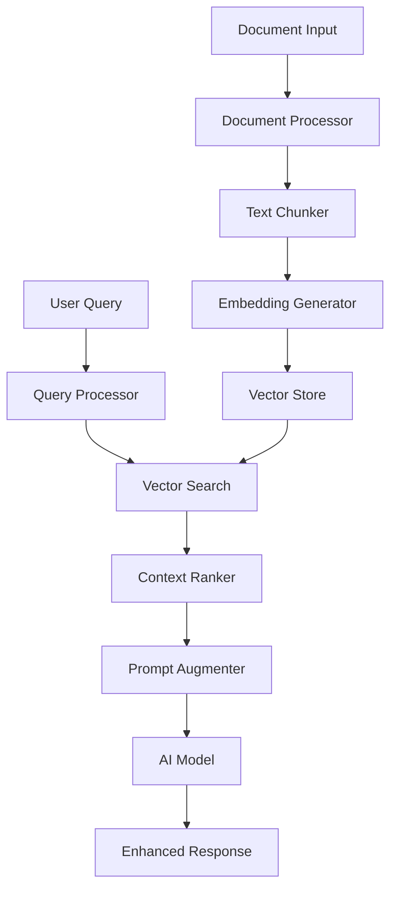

# RAG Development Guide

## 📋 Overview

This guide provides comprehensive instructions for developing RAG (Retrieval-Augmented Generation) features in PocketPal SuperAI, based on TIC-13's complete implementation analysis and mobile-optimized patterns.

**Based on Research**: TIC-13 comprehensive RAG ecosystem analysis  
**Target Performance**: <100ms search, <500MB memory, >90% relevance  
**Implementation Status**: Reference patterns available from TIC-13 repositories  

## 🏗️ RAG Architecture Deep Dive

### System Components Overview


### Implementation Layers
1. **Document Processing Layer**: PDF, text, web content ingestion
2. **Embedding Layer**: Local TFLite models for vector generation
3. **Storage Layer**: HNSW-optimized vector database
4. **Retrieval Layer**: Semantic similarity search engine
5. **Integration Layer**: Context injection for AI models

## 🚀 Getting Started

### 1. Project Structure Setup
```bash
# RAG module structure
src/rag/
├── components/           # React components
├── services/            # Core RAG services
├── native/             # Native module bridges
├── utils/              # Utility functions
├── types/              # TypeScript definitions
├── hooks/              # React hooks
└── __tests__/          # Test files
```

### 2. Dependencies Installation
```bash
# Core RAG dependencies
yarn add @tensorflow/tfjs-react-native
yarn add @tensorflow/tfjs-platform-react-native
yarn add react-native-fs
yarn add react-native-document-picker

# Vector processing
yarn add ml-matrix
yarn add similarity-search

# Native modules (platform-specific)
yarn add react-native-sqlite-storage  # For vector storage
yarn add react-native-pytorch-core    # For ML models (if using PyTorch)
```

### 3. Native Module Setup

#### Android Configuration
Create `android/app/src/main/java/com/pocketpalsuperai/rag/RagModule.java`:
```java
package com.pocketpalsuperai.rag;

import com.facebook.react.bridge.ReactApplicationContext;
import com.facebook.react.bridge.ReactContextBaseJavaModule;
import com.facebook.react.bridge.ReactMethod;
import com.facebook.react.bridge.Promise;
import com.facebook.react.bridge.ReadableMap;
import com.facebook.react.bridge.WritableMap;
import com.facebook.react.bridge.Arguments;

// Import TIC-13 patterns
import com.github.jelmerk.hnswlib.core.HnswIndex;
import com.github.jelmerk.hnswlib.core.Item;

public class RagModule extends ReactContextBaseJavaModule {
    private HnswIndex<String, float[], Item<String, float[], String>, Float> hnswIndex;
    
    public RagModule(ReactApplicationContext reactContext) {
        super(reactContext);
        initializeHnswIndex();
    }
    
    @Override
    public String getName() {
        return "RagNative";
    }
    
    @ReactMethod
    public void ingestDocument(String documentPath, ReadableMap options, Promise promise) {
        try {
            // Implementation based on TIC-13 patterns
            DocumentProcessor processor = new DocumentProcessor();
            List<Chunk> chunks = processor.processDocument(documentPath);
            
            for (Chunk chunk : chunks) {
                float[] embedding = generateEmbedding(chunk.getText());
                storeVector(chunk.getId(), embedding, chunk.getMetadata());
            }
            
            WritableMap result = Arguments.createMap();
            result.putInt("chunksCreated", chunks.size());
            result.putString("status", "success");
            promise.resolve(result);
            
        } catch (Exception e) {
            promise.reject("RAG_ERROR", e.getMessage());
        }
    }
    
    @ReactMethod
    public void searchVectors(String query, ReadableMap options, Promise promise) {
        try {
            float[] queryEmbedding = generateEmbedding(query);
            int k = options.hasKey("limit") ? options.getInt("limit") : 5;
            
            List<SearchResult> results = hnswIndex.findNearest(queryEmbedding, k);
            
            WritableMap response = Arguments.createMap();
            // Convert results to React Native format
            promise.resolve(response);
            
        } catch (Exception e) {
            promise.reject("SEARCH_ERROR", e.getMessage());
        }
    }
}
```

#### iOS Configuration
Create `ios/RagNative.swift`:
```swift
import Foundation
import React

@objc(RagNative)
class RagNative: NSObject {
    private var vectorIndex: HNSWIndex<String, [Float]>?
    
    override init() {
        super.init()
        initializeVectorIndex()
    }
    
    @objc
    func ingestDocument(_ documentPath: String, 
                       options: NSDictionary,
                       resolve: @escaping RCTPromiseResolveBlock,
                       reject: @escaping RCTPromiseRejectBlock) {
        
        DispatchQueue.global(qos: .background).async {
            do {
                let processor = DocumentProcessor()
                let chunks = try processor.processDocument(at: documentPath)
                
                for chunk in chunks {
                    let embedding = try self.generateEmbedding(from: chunk.text)
                    try self.storeVector(id: chunk.id, embedding: embedding, metadata: chunk.metadata)
                }
                
                DispatchQueue.main.async {
                    resolve([
                        "chunksCreated": chunks.count,
                        "status": "success"
                    ])
                }
                
            } catch {
                DispatchQueue.main.async {
                    reject("RAG_ERROR", error.localizedDescription, error)
                }
            }
        }
    }
    
    @objc
    func searchVectors(_ query: String,
                      options: NSDictionary,
                      resolve: @escaping RCTPromiseResolveBlock,
                      reject: @escaping RCTPromiseRejectBlock) {
        
        DispatchQueue.global(qos: .userInitiated).async {
            do {
                let queryEmbedding = try self.generateEmbedding(from: query)
                let k = options["limit"] as? Int ?? 5
                
                let results = try self.vectorIndex?.findNearest(queryEmbedding, k: k) ?? []
                
                DispatchQueue.main.async {
                    resolve(self.formatSearchResults(results))
                }
                
            } catch {
                DispatchQueue.main.async {
                    reject("SEARCH_ERROR", error.localizedDescription, error)
                }
            }
        }
    }
}

// React Native bridge
@objc(RagNativeBridge)
class RagNativeBridge: NSObject {
    
    @objc
    static func requiresMainQueueSetup() -> Bool {
        return false
    }
    
    @objc
    func constantsToExport() -> [String: Any]! {
        return [
            "SUPPORTED_FORMATS": ["pdf", "txt", "md", "docx"],
            "MAX_CHUNK_SIZE": 1000,
            "DEFAULT_OVERLAP": 100
        ]
    }
}
```

## 📚 Core RAG Services Implementation

### 1. Document Processing Service
Create `src/rag/services/DocumentProcessor.ts`:
```typescript
import RNFS from 'react-native-fs';
import { NativeModules } from 'react-native';

interface ProcessDocumentOptions {
  chunkSize?: number;
  chunkOverlap?: number;
  preserveFormatting?: boolean;
  extractMetadata?: boolean;
}

interface DocumentChunk {
  id: string;
  content: string;
  metadata: {
    documentId: string;
    position: number;
    length: number;
    type: string;
    [key: string]: any;
  };
}

export class DocumentProcessor {
  private readonly defaultChunkSize = 500;
  private readonly defaultOverlap = 50;

  async processDocument(
    documentPath: string,
    options: ProcessDocumentOptions = {}
  ): Promise<DocumentChunk[]> {
    try {
      // Read document content
      const content = await this.readDocument(documentPath);
      
      // Extract metadata
      const metadata = options.extractMetadata 
        ? await this.extractMetadata(documentPath)
        : {};

      // Chunk the document
      const chunks = this.chunkDocument(content, {
        chunkSize: options.chunkSize || this.defaultChunkSize,
        chunkOverlap: options.chunkOverlap || this.defaultOverlap,
        preserveFormatting: options.preserveFormatting || false
      });

      // Create document chunks with metadata
      return chunks.map((chunk, index) => ({
        id: `${this.generateDocumentId(documentPath)}_chunk_${index}`,
        content: chunk,
        metadata: {
          documentId: this.generateDocumentId(documentPath),
          position: index,
          length: chunk.length,
          type: this.getDocumentType(documentPath),
          ...metadata
        }
      }));

    } catch (error) {
      throw new Error(`Document processing failed: ${error.message}`);
    }
  }

  private async readDocument(path: string): Promise<string> {
    const extension = path.split('.').pop()?.toLowerCase();
    
    switch (extension) {
      case 'txt':
      case 'md':
        return await RNFS.readFile(path, 'utf8');
      
      case 'pdf':
        // Use native PDF processing
        return await NativeModules.RagNative.processPDF(path);
      
      case 'docx':
        // Use native DOCX processing
        return await NativeModules.RagNative.processDocx(path);
      
      default:
        throw new Error(`Unsupported document type: ${extension}`);
    }
  }

  private chunkDocument(
    content: string, 
    options: { chunkSize: number; chunkOverlap: number; preserveFormatting: boolean }
  ): string[] {
    const chunks: string[] = [];
    const { chunkSize, chunkOverlap, preserveFormatting } = options;

    // Clean content if not preserving formatting
    const cleanContent = preserveFormatting 
      ? content 
      : this.cleanContent(content);

    // Split into sentences for better chunking
    const sentences = this.splitIntoSentences(cleanContent);
    
    let currentChunk = '';
    let currentLength = 0;

    for (const sentence of sentences) {
      const sentenceLength = sentence.length;
      
      // If adding this sentence would exceed chunk size
      if (currentLength + sentenceLength > chunkSize && currentChunk) {
        chunks.push(currentChunk.trim());
        
        // Start new chunk with overlap
        const overlapText = this.getOverlapText(currentChunk, chunkOverlap);
        currentChunk = overlapText + sentence;
        currentLength = overlapText.length + sentenceLength;
      } else {
        currentChunk += sentence;
        currentLength += sentenceLength;
      }
    }

    // Add final chunk
    if (currentChunk.trim()) {
      chunks.push(currentChunk.trim());
    }

    return chunks;
  }

  private cleanContent(content: string): string {
    return content
      .replace(/\s+/g, ' ')           // Normalize whitespace
      .replace(/\n{3,}/g, '\n\n')     // Limit line breaks
      .trim();
  }

  private splitIntoSentences(content: string): string[] {
    // Simple sentence splitting - can be enhanced with NLP libraries
    return content
      .split(/(?<=[.!?])\s+/)
      .filter(sentence => sentence.trim().length > 0);
  }

  private getOverlapText(chunk: string, overlapSize: number): string {
    if (chunk.length <= overlapSize) return chunk;
    
    const overlapStart = chunk.length - overlapSize;
    return chunk.substring(overlapStart);
  }

  private generateDocumentId(path: string): string {
    // Generate consistent ID from path
    return path.split('/').pop()?.replace(/\.[^/.]+$/, '') || 'unknown';
  }

  private getDocumentType(path: string): string {
    return path.split('.').pop()?.toLowerCase() || 'unknown';
  }

  private async extractMetadata(path: string): Promise<object> {
    try {
      const stats = await RNFS.stat(path);
      return {
        fileSize: stats.size,
        createdAt: stats.ctime,
        modifiedAt: stats.mtime,
        fileName: path.split('/').pop() || 'unknown'
      };
    } catch {
      return {};
    }
  }
}
```

### 2. Embedding Generation Service
Create `src/rag/services/EmbeddingService.ts`:
```typescript
import { NativeModules } from 'react-native';

interface EmbeddingOptions {
  model?: string;
  normalize?: boolean;
  batchSize?: number;
}

interface EmbeddingResult {
  embedding: number[];
  dimensions: number;
  model: string;
  processingTime: number;
}

export class EmbeddingService {
  private readonly defaultModel = 'sentence-transformers-mobile';
  private isInitialized = false;

  async initialize(model?: string): Promise<void> {
    if (this.isInitialized) return;

    try {
      await NativeModules.RagNative.initializeEmbeddingModel(
        model || this.defaultModel
      );
      this.isInitialized = true;
    } catch (error) {
      throw new Error(`Failed to initialize embedding model: ${error.message}`);
    }
  }

  async generateEmbedding(
    text: string,
    options: EmbeddingOptions = {}
  ): Promise<EmbeddingResult> {
    await this.initialize(options.model);

    try {
      const startTime = Date.now();
      
      const result = await NativeModules.RagNative.generateEmbedding(
        text,
        {
          model: options.model || this.defaultModel,
          normalize: options.normalize !== false
        }
      );

      return {
        embedding: result.embedding,
        dimensions: result.dimensions,
        model: result.model,
        processingTime: Date.now() - startTime
      };

    } catch (error) {
      throw new Error(`Embedding generation failed: ${error.message}`);
    }
  }

  async generateBatchEmbeddings(
    texts: string[],
    options: EmbeddingOptions = {}
  ): Promise<EmbeddingResult[]> {
    await this.initialize(options.model);

    const batchSize = options.batchSize || 10;
    const results: EmbeddingResult[] = [];

    // Process in batches for memory efficiency
    for (let i = 0; i < texts.length; i += batchSize) {
      const batch = texts.slice(i, i + batchSize);
      
      const batchResults = await Promise.all(
        batch.map(text => this.generateEmbedding(text, options))
      );
      
      results.push(...batchResults);
    }

    return results;
  }

  async getModelInfo(): Promise<{
    name: string;
    dimensions: number;
    maxTokens: number;
    version: string;
  }> {
    if (!this.isInitialized) {
      throw new Error('Embedding service not initialized');
    }

    return await NativeModules.RagNative.getEmbeddingModelInfo();
  }
}
```

### 3. Vector Storage Service
Create `src/rag/services/VectorStorage.ts`:
```typescript
import { NativeModules } from 'react-native';

interface VectorMetadata {
  [key: string]: any;
}

interface StoredVector {
  id: string;
  vector: number[];
  metadata: VectorMetadata;
}

interface SearchOptions {
  k?: number;
  threshold?: number;
  filter?: VectorMetadata;
  includeVectors?: boolean;
  includeMetadata?: boolean;
}

interface SearchResult {
  id: string;
  similarity: number;
  distance: number;
  vector?: number[];
  metadata?: VectorMetadata;
}

export class VectorStorage {
  private isInitialized = false;

  async initialize(config?: {
    algorithm?: 'hnsw' | 'faiss';
    dimensions?: number;
    maxElements?: number;
  }): Promise<void> {
    if (this.isInitialized) return;

    try {
      await NativeModules.RagNative.initializeVectorStorage(config || {
        algorithm: 'hnsw',
        maxElements: 100000
      });
      this.isInitialized = true;
    } catch (error) {
      throw new Error(`Vector storage initialization failed: ${error.message}`);
    }
  }

  async store(
    id: string,
    vector: number[],
    metadata: VectorMetadata = {}
  ): Promise<void> {
    await this.ensureInitialized();

    try {
      await NativeModules.RagNative.storeVector(id, vector, metadata);
    } catch (error) {
      throw new Error(`Vector storage failed: ${error.message}`);
    }
  }

  async storeBatch(vectors: StoredVector[]): Promise<void> {
    await this.ensureInitialized();

    try {
      await NativeModules.RagNative.storeBatchVectors(vectors);
    } catch (error) {
      throw new Error(`Batch vector storage failed: ${error.message}`);
    }
  }

  async search(
    queryVector: number[],
    options: SearchOptions = {}
  ): Promise<SearchResult[]> {
    await this.ensureInitialized();

    try {
      const searchOptions = {
        k: options.k || 5,
        threshold: options.threshold || 0.0,
        filter: options.filter || {},
        includeVectors: options.includeVectors || false,
        includeMetadata: options.includeMetadata !== false
      };

      const results = await NativeModules.RagNative.searchVectors(
        queryVector,
        searchOptions
      );

      return results;
    } catch (error) {
      throw new Error(`Vector search failed: ${error.message}`);
    }
  }

  async searchByText(
    query: string,
    options: SearchOptions = {}
  ): Promise<SearchResult[]> {
    await this.ensureInitialized();

    try {
      // Generate embedding for query text
      const embeddingResult = await NativeModules.RagNative.generateEmbedding(query);
      
      // Search with the generated embedding
      return await this.search(embeddingResult.embedding, options);
    } catch (error) {
      throw new Error(`Text search failed: ${error.message}`);
    }
  }

  async delete(id: string): Promise<boolean> {
    await this.ensureInitialized();

    try {
      return await NativeModules.RagNative.deleteVector(id);
    } catch (error) {
      throw new Error(`Vector deletion failed: ${error.message}`);
    }
  }

  async getStats(): Promise<{
    totalVectors: number;
    dimensions: number;
    indexSize: number;
    memoryUsage: number;
  }> {
    await this.ensureInitialized();

    return await NativeModules.RagNative.getVectorStorageStats();
  }

  async optimize(): Promise<void> {
    await this.ensureInitialized();

    try {
      await NativeModules.RagNative.optimizeVectorStorage();
    } catch (error) {
      throw new Error(`Vector storage optimization failed: ${error.message}`);
    }
  }

  private async ensureInitialized(): Promise<void> {
    if (!this.isInitialized) {
      await this.initialize();
    }
  }
}
```

### 4. RAG Orchestration Service
Create `src/rag/services/RagService.ts`:
```typescript
import { DocumentProcessor } from './DocumentProcessor';
import { EmbeddingService } from './EmbeddingService';
import { VectorStorage } from './VectorStorage';

interface RagConfig {
  chunkSize?: number;
  chunkOverlap?: number;
  maxContextLength?: number;
  similarityThreshold?: number;
  maxResults?: number;
}

interface IngestResult {
  documentId: string;
  chunksCreated: number;
  vectorsStored: number;
  processingTime: number;
}

interface RetrievalResult {
  context: string;
  sources: Array<{
    documentId: string;
    chunkId: string;
    similarity: number;
    content: string;
  }>;
  relevanceScore: number;
  processingTime: number;
}

export class RagService {
  private documentProcessor: DocumentProcessor;
  private embeddingService: EmbeddingService;
  private vectorStorage: VectorStorage;
  private config: Required<RagConfig>;

  constructor(config: RagConfig = {}) {
    this.documentProcessor = new DocumentProcessor();
    this.embeddingService = new EmbeddingService();
    this.vectorStorage = new VectorStorage();
    
    this.config = {
      chunkSize: config.chunkSize || 500,
      chunkOverlap: config.chunkOverlap || 50,
      maxContextLength: config.maxContextLength || 2000,
      similarityThreshold: config.similarityThreshold || 0.7,
      maxResults: config.maxResults || 5
    };
  }

  async initialize(): Promise<void> {
    await Promise.all([
      this.embeddingService.initialize(),
      this.vectorStorage.initialize()
    ]);
  }

  async ingestDocument(
    documentPath: string,
    metadata: Record<string, any> = {}
  ): Promise<IngestResult> {
    const startTime = Date.now();

    try {
      // Process document into chunks
      const chunks = await this.documentProcessor.processDocument(documentPath, {
        chunkSize: this.config.chunkSize,
        chunkOverlap: this.config.chunkOverlap,
        extractMetadata: true
      });

      // Generate embeddings for chunks
      const texts = chunks.map(chunk => chunk.content);
      const embeddings = await this.embeddingService.generateBatchEmbeddings(texts);

      // Store vectors with metadata
      const vectorsToStore = chunks.map((chunk, index) => ({
        id: chunk.id,
        vector: embeddings[index].embedding,
        metadata: {
          ...chunk.metadata,
          ...metadata,
          content: chunk.content,
          documentPath
        }
      }));

      await this.vectorStorage.storeBatch(vectorsToStore);

      const documentId = this.generateDocumentId(documentPath);
      
      return {
        documentId,
        chunksCreated: chunks.length,
        vectorsStored: vectorsToStore.length,
        processingTime: Date.now() - startTime
      };

    } catch (error) {
      throw new Error(`Document ingestion failed: ${error.message}`);
    }
  }

  async retrieveContext(
    query: string,
    options: {
      maxResults?: number;
      similarityThreshold?: number;
      documentFilter?: string[];
    } = {}
  ): Promise<RetrievalResult> {
    const startTime = Date.now();

    try {
      // Search for relevant chunks
      const searchResults = await this.vectorStorage.searchByText(query, {
        k: options.maxResults || this.config.maxResults,
        threshold: options.similarityThreshold || this.config.similarityThreshold,
        filter: options.documentFilter ? {
          documentId: { $in: options.documentFilter }
        } : undefined
      });

      // Filter by similarity threshold
      const relevantResults = searchResults.filter(
        result => result.similarity >= (options.similarityThreshold || this.config.similarityThreshold)
      );

      // Build context from results
      let context = '';
      let currentLength = 0;
      const sources: RetrievalResult['sources'] = [];

      for (const result of relevantResults) {
        const content = result.metadata?.content || '';
        
        // Check if adding this content would exceed max length
        if (currentLength + content.length > this.config.maxContextLength) {
          // Truncate content to fit
          const remainingSpace = this.config.maxContextLength - currentLength;
          if (remainingSpace > 100) { // Only add if meaningful space remains
            const truncatedContent = content.substring(0, remainingSpace - 3) + '...';
            context += truncatedContent + '\n\n';
            currentLength += truncatedContent.length + 2;
          }
          break;
        }

        context += content + '\n\n';
        currentLength += content.length + 2;

        sources.push({
          documentId: result.metadata?.documentId || 'unknown',
          chunkId: result.id,
          similarity: result.similarity,
          content: content
        });
      }

      // Calculate overall relevance score
      const relevanceScore = sources.length > 0
        ? sources.reduce((sum, source) => sum + source.similarity, 0) / sources.length
        : 0;

      return {
        context: context.trim(),
        sources,
        relevanceScore,
        processingTime: Date.now() - startTime
      };

    } catch (error) {
      throw new Error(`Context retrieval failed: ${error.message}`);
    }
  }

  async enhancePrompt(
    userQuery: string,
    systemPrompt: string = '',
    contextOptions?: Parameters<typeof this.retrieveContext>[1]
  ): Promise<{
    enhancedPrompt: string;
    context: string;
    sources: RetrievalResult['sources'];
    relevanceScore: number;
  }> {
    try {
      const retrieval = await this.retrieveContext(userQuery, contextOptions);

      const enhancedPrompt = this.buildEnhancedPrompt(
        systemPrompt,
        retrieval.context,
        userQuery
      );

      return {
        enhancedPrompt,
        context: retrieval.context,
        sources: retrieval.sources,
        relevanceScore: retrieval.relevanceScore
      };

    } catch (error) {
      // Fallback to original prompt if RAG fails
      console.warn('RAG enhancement failed, using original prompt:', error.message);
      return {
        enhancedPrompt: `${systemPrompt}\n\nUser: ${userQuery}`,
        context: '',
        sources: [],
        relevanceScore: 0
      };
    }
  }

  private buildEnhancedPrompt(
    systemPrompt: string,
    context: string,
    userQuery: string
  ): string {
    const contextSection = context 
      ? `Context Information:\n${context}\n\n`
      : '';

    const instructions = context
      ? 'Please use the provided context to answer the user\'s question. If the context doesn\'t contain relevant information, indicate that you don\'t have enough context to provide a complete answer.\n\n'
      : '';

    return `${systemPrompt}\n\n${instructions}${contextSection}User: ${userQuery}`;
  }

  private generateDocumentId(path: string): string {
    return path.split('/').pop()?.replace(/\.[^/.]+$/, '') || 'unknown';
  }

  async getStats(): Promise<{
    documentsIngested: number;
    totalChunks: number;
    vectorStorageStats: any;
    averageRetrievalTime: number;
  }> {
    const vectorStats = await this.vectorStorage.getStats();
    
    return {
      documentsIngested: 0, // Would track this in a metadata store
      totalChunks: vectorStats.totalVectors,
      vectorStorageStats: vectorStats,
      averageRetrievalTime: 0 // Would track this with metrics
    };
  }
}
```

## 🎯 React Integration Components

### 1. RAG Hook
Create `src/rag/hooks/useRag.ts`:
```typescript
import { useState, useEffect, useCallback, useRef } from 'react';
import { RagService } from '../services/RagService';

interface UseRagOptions {
  autoInitialize?: boolean;
  config?: ConstructorParameters<typeof RagService>[0];
}

export const useRag = (options: UseRagOptions = {}) => {
  const [isInitialized, setIsInitialized] = useState(false);
  const [isLoading, setIsLoading] = useState(false);
  const [error, setError] = useState<string | null>(null);
  
  const ragServiceRef = useRef<RagService | null>(null);

  useEffect(() => {
    if (options.autoInitialize !== false) {
      initialize();
    }
  }, []);

  const initialize = useCallback(async () => {
    if (ragServiceRef.current) return;

    try {
      setIsLoading(true);
      setError(null);

      ragServiceRef.current = new RagService(options.config);
      await ragServiceRef.current.initialize();
      
      setIsInitialized(true);
    } catch (err) {
      setError(err instanceof Error ? err.message : 'RAG initialization failed');
    } finally {
      setIsLoading(false);
    }
  }, [options.config]);

  const ingestDocument = useCallback(async (
    documentPath: string,
    metadata?: Record<string, any>
  ) => {
    if (!ragServiceRef.current) {
      throw new Error('RAG service not initialized');
    }

    setIsLoading(true);
    setError(null);

    try {
      const result = await ragServiceRef.current.ingestDocument(documentPath, metadata);
      return result;
    } catch (err) {
      const error = err instanceof Error ? err.message : 'Document ingestion failed';
      setError(error);
      throw new Error(error);
    } finally {
      setIsLoading(false);
    }
  }, []);

  const retrieveContext = useCallback(async (
    query: string,
    options?: Parameters<RagService['retrieveContext']>[1]
  ) => {
    if (!ragServiceRef.current) {
      throw new Error('RAG service not initialized');
    }

    setIsLoading(true);
    setError(null);

    try {
      const result = await ragServiceRef.current.retrieveContext(query, options);
      return result;
    } catch (err) {
      const error = err instanceof Error ? err.message : 'Context retrieval failed';
      setError(error);
      throw new Error(error);
    } finally {
      setIsLoading(false);
    }
  }, []);

  const enhancePrompt = useCallback(async (
    userQuery: string,
    systemPrompt?: string,
    contextOptions?: Parameters<RagService['retrieveContext']>[1]
  ) => {
    if (!ragServiceRef.current) {
      throw new Error('RAG service not initialized');
    }

    setIsLoading(true);
    setError(null);

    try {
      const result = await ragServiceRef.current.enhancePrompt(
        userQuery,
        systemPrompt,
        contextOptions
      );
      return result;
    } catch (err) {
      const error = err instanceof Error ? err.message : 'Prompt enhancement failed';
      setError(error);
      throw new Error(error);
    } finally {
      setIsLoading(false);
    }
  }, []);

  return {
    isInitialized,
    isLoading,
    error,
    initialize,
    ingestDocument,
    retrieveContext,
    enhancePrompt,
    ragService: ragServiceRef.current
  };
};
```

### 2. Document Ingestion Component
Create `src/rag/components/DocumentIngestion.tsx`:
```typescript
import React, { useState } from 'react';
import {
  View,
  Text,
  TouchableOpacity,
  StyleSheet,
  Alert,
  ProgressBar,
} from 'react-native';
import DocumentPicker from 'react-native-document-picker';
import { useRag } from '../hooks/useRag';

export const DocumentIngestion: React.FC = () => {
  const { ingestDocument, isLoading, error } = useRag();
  const [progress, setProgress] = useState(0);

  const handleDocumentPick = async () => {
    try {
      const result = await DocumentPicker.pick({
        type: [
          DocumentPicker.types.pdf,
          DocumentPicker.types.plainText,
          DocumentPicker.types.doc,
          DocumentPicker.types.docx,
        ],
      });

      if (result.length > 0) {
        const document = result[0];
        await processDocument(document.uri, document.name);
      }
    } catch (error) {
      if (DocumentPicker.isCancel(error)) {
        // User cancelled
        return;
      }
      Alert.alert('Error', 'Failed to pick document');
    }
  };

  const processDocument = async (uri: string, name: string) => {
    try {
      setProgress(0);
      
      // Simulate progress updates
      const progressInterval = setInterval(() => {
        setProgress(prev => Math.min(prev + 10, 90));
      }, 200);

      const result = await ingestDocument(uri, {
        fileName: name,
        uploadedAt: new Date().toISOString(),
      });

      clearInterval(progressInterval);
      setProgress(100);

      Alert.alert(
        'Success',
        `Document processed successfully!\n\n` +
        `Chunks created: ${result.chunksCreated}\n` +
        `Processing time: ${result.processingTime}ms`
      );

      // Reset progress after delay
      setTimeout(() => setProgress(0), 2000);

    } catch (error) {
      Alert.alert('Error', `Failed to process document: ${error.message}`);
      setProgress(0);
    }
  };

  return (
    <View style={styles.container}>
      <Text style={styles.title}>Document Ingestion</Text>
      
      {error && (
        <Text style={styles.error}>{error}</Text>
      )}

      <TouchableOpacity
        style={[styles.button, isLoading && styles.buttonDisabled]}
        onPress={handleDocumentPick}
        disabled={isLoading}
      >
        <Text style={styles.buttonText}>
          {isLoading ? 'Processing...' : 'Select Document'}
        </Text>
      </TouchableOpacity>

      {isLoading && (
        <View style={styles.progressContainer}>
          <Text style={styles.progressText}>
            Processing document... {progress}%
          </Text>
          <ProgressBar progress={progress / 100} style={styles.progressBar} />
        </View>
      )}
    </View>
  );
};

const styles = StyleSheet.create({
  container: {
    padding: 20,
  },
  title: {
    fontSize: 18,
    fontWeight: 'bold',
    marginBottom: 20,
  },
  error: {
    color: 'red',
    marginBottom: 10,
    textAlign: 'center',
  },
  button: {
    backgroundColor: '#007AFF',
    padding: 15,
    borderRadius: 8,
    alignItems: 'center',
  },
  buttonDisabled: {
    backgroundColor: '#ccc',
  },
  buttonText: {
    color: 'white',
    fontSize: 16,
    fontWeight: '600',
  },
  progressContainer: {
    marginTop: 20,
  },
  progressText: {
    textAlign: 'center',
    marginBottom: 10,
    fontSize: 14,
  },
  progressBar: {
    height: 8,
    borderRadius: 4,
  },
});
```

## 🧪 Testing Strategy

### 1. Unit Tests
Create `src/rag/__tests__/RagService.test.ts`:
```typescript
import { RagService } from '../services/RagService';
import { DocumentProcessor } from '../services/DocumentProcessor';
import { EmbeddingService } from '../services/EmbeddingService';
import { VectorStorage } from '../services/VectorStorage';

// Mock native modules
jest.mock('react-native', () => ({
  NativeModules: {
    RagNative: {
      initializeEmbeddingModel: jest.fn().mockResolvedValue(true),
      initializeVectorStorage: jest.fn().mockResolvedValue(true),
      generateEmbedding: jest.fn().mockResolvedValue({
        embedding: Array(384).fill(0.1),
        dimensions: 384,
        model: 'test-model'
      }),
      storeVector: jest.fn().mockResolvedValue(true),
      searchVectors: jest.fn().mockResolvedValue([]),
    }
  }
}));

describe('RagService', () => {
  let ragService: RagService;

  beforeEach(() => {
    ragService = new RagService({
      chunkSize: 100,
      maxResults: 3
    });
  });

  describe('initialization', () => {
    it('should initialize successfully', async () => {
      await expect(ragService.initialize()).resolves.not.toThrow();
    });
  });

  describe('document ingestion', () => {
    it('should ingest document and return metrics', async () => {
      await ragService.initialize();
      
      // Mock document processing
      const mockChunks = [
        { id: 'chunk1', content: 'Test content 1', metadata: {} },
        { id: 'chunk2', content: 'Test content 2', metadata: {} }
      ];

      jest.spyOn(DocumentProcessor.prototype, 'processDocument')
        .mockResolvedValue(mockChunks);

      const result = await ragService.ingestDocument('/test/document.txt');

      expect(result.chunksCreated).toBe(2);
      expect(result.vectorsStored).toBe(2);
      expect(result.processingTime).toBeGreaterThan(0);
    });
  });

  describe('context retrieval', () => {
    it('should retrieve relevant context', async () => {
      await ragService.initialize();

      // Mock vector search results
      const mockResults = [
        {
          id: 'chunk1',
          similarity: 0.8,
          metadata: {
            content: 'This is relevant content',
            documentId: 'doc1'
          }
        }
      ];

      jest.spyOn(VectorStorage.prototype, 'searchByText')
        .mockResolvedValue(mockResults);

      const result = await ragService.retrieveContext('test query');

      expect(result.context).toContain('This is relevant content');
      expect(result.sources).toHaveLength(1);
      expect(result.relevanceScore).toBeGreaterThan(0);
    });
  });
});
```

### 2. Integration Tests
Create `src/rag/__tests__/integration.test.ts`:
```typescript
import { RagService } from '../services/RagService';
import RNFS from 'react-native-fs';

describe('RAG Integration Tests', () => {
  let ragService: RagService;

  beforeAll(async () => {
    ragService = new RagService();
    await ragService.initialize();
  });

  it('should perform end-to-end document processing and retrieval', async () => {
    // Create test document
    const testContent = 'This is a test document about artificial intelligence and machine learning.';
    const testPath = `${RNFS.DocumentDirectoryPath}/test-doc.txt`;
    
    await RNFS.writeFile(testPath, testContent, 'utf8');

    try {
      // Ingest document
      const ingestResult = await ragService.ingestDocument(testPath);
      expect(ingestResult.chunksCreated).toBeGreaterThan(0);

      // Retrieve context
      const retrievalResult = await ragService.retrieveContext('artificial intelligence');
      expect(retrievalResult.context).toContain('artificial intelligence');
      expect(retrievalResult.sources.length).toBeGreaterThan(0);

      // Enhance prompt
      const promptResult = await ragService.enhancePrompt(
        'What is artificial intelligence?',
        'You are a helpful AI assistant.'
      );
      expect(promptResult.enhancedPrompt).toContain('artificial intelligence');

    } finally {
      // Cleanup
      await RNFS.unlink(testPath);
    }
  }, 30000); // 30 second timeout for integration test
});
```

## 🔧 Performance Optimization

### 1. Memory Management
```typescript
// src/rag/utils/MemoryManager.ts
export class MemoryManager {
  private static instance: MemoryManager;
  private memoryThreshold = 300; // MB

  static getInstance(): MemoryManager {
    if (!this.instance) {
      this.instance = new MemoryManager();
    }
    return this.instance;
  }

  async checkMemoryUsage(): Promise<number> {
    // Get current memory usage from native side
    const stats = await NativeModules.RagNative.getMemoryStats();
    return stats.memoryUsageMB;
  }

  async optimizeIfNeeded(): Promise<void> {
    const currentUsage = await this.checkMemoryUsage();
    
    if (currentUsage > this.memoryThreshold) {
      await this.performOptimization();
    }
  }

  private async performOptimization(): Promise<void> {
    // Clear caches
    await NativeModules.RagNative.clearCaches();
    
    // Optimize vector index
    await NativeModules.RagNative.optimizeVectorStorage();
    
    // Force garbage collection
    if (global.gc) {
      global.gc();
    }
  }
}
```

### 2. Caching Strategy
```typescript
// src/rag/utils/CacheManager.ts
export class CacheManager {
  private embeddingCache = new Map<string, number[]>();
  private searchCache = new Map<string, any>();
  private maxCacheSize = 1000;

  cacheEmbedding(text: string, embedding: number[]): void {
    if (this.embeddingCache.size >= this.maxCacheSize) {
      // Remove oldest entry
      const firstKey = this.embeddingCache.keys().next().value;
      this.embeddingCache.delete(firstKey);
    }
    this.embeddingCache.set(text, embedding);
  }

  getCachedEmbedding(text: string): number[] | null {
    return this.embeddingCache.get(text) || null;
  }

  cacheSearchResult(query: string, results: any): void {
    const cacheKey = this.generateCacheKey(query);
    this.searchCache.set(cacheKey, {
      results,
      timestamp: Date.now()
    });
  }

  getCachedSearchResult(query: string, maxAge = 300000): any | null {
    const cacheKey = this.generateCacheKey(query);
    const cached = this.searchCache.get(cacheKey);
    
    if (cached && Date.now() - cached.timestamp < maxAge) {
      return cached.results;
    }
    
    return null;
  }

  private generateCacheKey(query: string): string {
    // Simple hash function for cache key
    let hash = 0;
    for (let i = 0; i < query.length; i++) {
      const char = query.charCodeAt(i);
      hash = ((hash << 5) - hash) + char;
      hash = hash & hash; // Convert to 32-bit integer
    }
    return hash.toString();
  }

  clearCache(): void {
    this.embeddingCache.clear();
    this.searchCache.clear();
  }
}
```

## 📊 Monitoring and Analytics

### 1. Performance Metrics
```typescript
// src/rag/utils/Metrics.ts
export class RagMetrics {
  private static metrics: Map<string, number[]> = new Map();

  static recordMetric(name: string, value: number): void {
    if (!this.metrics.has(name)) {
      this.metrics.set(name, []);
    }
    this.metrics.get(name)!.push(value);
    
    // Keep only last 100 measurements
    if (this.metrics.get(name)!.length > 100) {
      this.metrics.get(name)!.shift();
    }
  }

  static getAverageMetric(name: string): number {
    const values = this.metrics.get(name) || [];
    if (values.length === 0) return 0;
    
    return values.reduce((sum, val) => sum + val, 0) / values.length;
  }

  static getMetricSummary(): Record<string, {
    average: number;
    min: number;
    max: number;
    count: number;
  }> {
    const summary: Record<string, any> = {};
    
    for (const [name, values] of this.metrics.entries()) {
      if (values.length > 0) {
        summary[name] = {
          average: values.reduce((sum, val) => sum + val, 0) / values.length,
          min: Math.min(...values),
          max: Math.max(...values),
          count: values.length
        };
      }
    }
    
    return summary;
  }
}

// Usage in services
export const withMetrics = <T>(
  metricName: string,
  operation: () => Promise<T>
): Promise<T> => {
  const startTime = Date.now();
  
  return operation().finally(() => {
    const duration = Date.now() - startTime;
    RagMetrics.recordMetric(metricName, duration);
  });
};
```

## 🚀 Next Steps

1. **Complete Native Implementation**: Implement the native Android/iOS modules
2. **Advanced Features**: Add semantic chunking, multi-document queries
3. **Performance Testing**: Benchmark against target metrics
4. **Integration Testing**: Test with Voice and Model Management APIs
5. **Production Optimization**: Implement advanced caching and optimization

For next development phases, refer to:
- [Voice Development Guide](./voice-development-guide.md) - Voice + RAG integration
- [Testing Strategy Guide](./testing-strategy-guide.md) - Comprehensive testing
- [Build Optimization Guide](./build-optimization-guide.md) - Performance optimization

---

**Guide Version**: 1.0  
**Last Updated**: June 23, 2025  
**Implementation Status**: Reference patterns available from TIC-13 analysis  
**Target Performance**: <100ms search, <500MB memory, >90% relevance