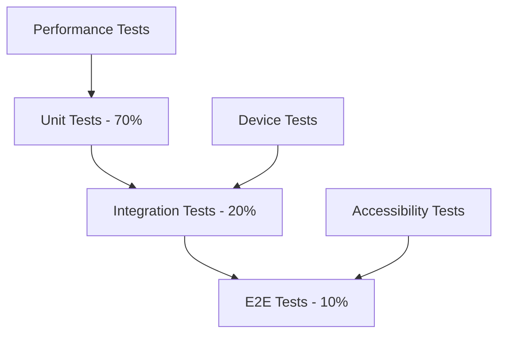

# Testing Strategy Guide

## 📋 Overview

This comprehensive guide covers the complete testing strategy for PocketPal SuperAI, including unit testing, integration testing, end-to-end testing, performance testing, and mobile-specific testing approaches for RAG, voice processing, and AI model components.

**Testing Philosophy**: Test-driven development with comprehensive coverage  
**Target Coverage**: >85% code coverage, 100% critical path coverage  
**Performance Goals**: <50ms test suite execution, automated CI/CD integration  

## 🏗️ Testing Architecture

### Testing Pyramid Structure


### Test Categories
1. **Unit Tests**: Component isolation, service logic, utility functions
2. **Integration Tests**: Component interactions, API integration, native module bridging
3. **End-to-End Tests**: Complete user workflows, cross-platform scenarios
4. **Performance Tests**: Memory usage, response times, resource optimization
5. **Device Tests**: Real device testing, platform-specific behavior
6. **Accessibility Tests**: Screen reader compatibility, navigation testing

## 🧪 Testing Framework Setup

### 1. Core Testing Dependencies
```bash
# Install testing dependencies
yarn add --dev \
  @testing-library/react-native \
  @testing-library/jest-native \
  react-test-renderer \
  jest-environment-node \
  detox \
  @detox/test-runner \
  flipper-plugin-react-native-performance \
  react-native-performance \
  babel-jest
```

### 2. Jest Configuration
Update `jest.config.js`:
```javascript
module.exports = {
  preset: 'react-native',
  setupFilesAfterEnv: [
    '<rootDir>/jest/setup.ts',
    '@testing-library/jest-native/extend-expect'
  ],
  transformIgnorePatterns: [
    'node_modules/(?!(react-native|@react-native|react-native-vector-icons|@react-navigation)/)'
  ],
  moduleNameMapping: {
    '^@/(.*)$': '<rootDir>/src/$1',
    '^@rag/(.*)$': '<rootDir>/src/rag/$1',
    '^@voice/(.*)$': '<rootDir>/src/voice/$1',
    '^@models/(.*)$': '<rootDir>/src/models/$1',
    '^@vectors/(.*)$': '<rootDir>/src/vectors/$1',
    '^@utils/(.*)$': '<rootDir>/src/utils/$1',
    '^@types/(.*)$': '<rootDir>/src/types/$1'
  },
  testEnvironment: 'node',
  coverageDirectory: 'coverage',
  collectCoverageFrom: [
    'src/**/*.{ts,tsx}',
    '!src/**/*.d.ts',
    '!src/**/*.test.{ts,tsx}',
    '!src/**/__tests__/**',
    '!src/native/**',
    '!src/**/*.stories.{ts,tsx}'
  ],
  coverageThreshold: {
    global: {
      branches: 85,
      functions: 85,
      lines: 85,
      statements: 85
    },
    './src/rag/': {
      branches: 90,
      functions: 90,
      lines: 90,
      statements: 90
    },
    './src/voice/': {
      branches: 90,
      functions: 90,
      lines: 90,
      statements: 90
    }
  },
  testMatch: [
    '**/__tests__/**/*.{ts,tsx}',
    '**/*.test.{ts,tsx}'
  ],
  testTimeout: 10000
};
```

### 3. Test Utilities Setup
Create `jest/setup.ts`:
```typescript
import 'react-native-gesture-handler/jestSetup';
import mockRNCNetInfo from '@react-native-community/netinfo/jest/netinfo-mock.js';

// Mock react-native modules
jest.mock('react-native/Libraries/EventEmitter/NativeEventEmitter');
jest.mock('react-native/Libraries/Vibration/Vibration', () => ({
  vibrate: jest.fn(),
  cancel: jest.fn(),
}));

// Mock network info
jest.mock('@react-native-community/netinfo', () => mockRNCNetInfo);

// Mock native modules - RAG
jest.mock('../../src/native/rag', () => ({
  RagModule: {
    ingestDocument: jest.fn().mockResolvedValue({success: true}),
    searchVectors: jest.fn().mockResolvedValue([]),
    getContext: jest.fn().mockResolvedValue(''),
    deleteDocument: jest.fn().mockResolvedValue({success: true}),
    initializeDatabase: jest.fn().mockResolvedValue({success: true})
  }
}));

// Mock native modules - Voice
jest.mock('../../src/native/voice', () => ({
  VoiceModule: {
    startRecording: jest.fn().mockResolvedValue({success: true}),
    stopRecording: jest.fn().mockResolvedValue({audioPath: '/test/path'}),
    transcribeAudio: jest.fn().mockResolvedValue({text: 'test transcription'}),
    isRecording: jest.fn().mockResolvedValue(false),
    hasPermissions: jest.fn().mockResolvedValue(true)
  }
}));

// Mock native modules - Models
jest.mock('../../src/native/models', () => ({
  ModelsModule: {
    loadModel: jest.fn().mockResolvedValue({success: true}),
    unloadModel: jest.fn().mockResolvedValue({success: true}),
    generateResponse: jest.fn().mockResolvedValue({response: 'test response'}),
    getLoadedModels: jest.fn().mockResolvedValue([]),
    getModelInfo: jest.fn().mockResolvedValue({})
  }
}));

// Mock async storage
jest.mock('@react-native-async-storage/async-storage', () =>
  require('@react-native-async-storage/async-storage/jest/async-storage-mock')
);

// Mock permissions
jest.mock('react-native-permissions', () => {
  const PERMISSIONS = {
    ANDROID: {
      RECORD_AUDIO: 'android.permission.RECORD_AUDIO',
      READ_EXTERNAL_STORAGE: 'android.permission.READ_EXTERNAL_STORAGE',
    },
    IOS: {
      MICROPHONE: 'ios.permission.MICROPHONE',
      PHOTO_LIBRARY: 'ios.permission.PHOTO_LIBRARY',
    },
  };

  const RESULTS = {
    DENIED: 'denied',
    GRANTED: 'granted',
    BLOCKED: 'blocked',
    UNAVAILABLE: 'unavailable',
  };

  return {
    PERMISSIONS,
    RESULTS,
    request: jest.fn(() => Promise.resolve(RESULTS.GRANTED)),
    check: jest.fn(() => Promise.resolve(RESULTS.GRANTED)),
    requestMultiple: jest.fn(() => Promise.resolve({})),
  };
});

// Mock navigation
jest.mock('@react-navigation/native', () => ({
  useNavigation: () => ({
    navigate: jest.fn(),
    goBack: jest.fn(),
    dispatch: jest.fn(),
  }),
  useRoute: () => ({
    params: {},
  }),
  useFocusEffect: jest.fn(),
}));

// Performance tracking mock
global.performance = {
  now: jest.fn(() => Date.now()),
  mark: jest.fn(),
  measure: jest.fn(),
  getEntriesByName: jest.fn(() => []),
  clearMarks: jest.fn(),
  clearMeasures: jest.fn(),
};

// Global test utilities
global.console = {
  ...console,
  warn: jest.fn(),
  error: jest.fn(),
  log: jest.fn(),
};

// Custom matchers
expect.extend({
  toBeWithinRange(received: number, floor: number, ceiling: number) {
    const pass = received >= floor && received <= ceiling;
    if (pass) {
      return {
        message: () => `expected ${received} not to be within range ${floor} - ${ceiling}`,
        pass: true,
      };
    } else {
      return {
        message: () => `expected ${received} to be within range ${floor} - ${ceiling}`,
        pass: false,
      };
    }
  },
});
```

## 📱 Component Testing Strategy

### 1. Unit Testing Components
Create `src/components/__tests__/ChatMessage.test.tsx`:
```typescript
import React from 'react';
import {render, fireEvent} from '@testing-library/react-native';
import {ChatMessage} from '../ChatMessage';

describe('ChatMessage Component', () => {
  const mockMessage = {
    id: '1',
    text: 'Test message',
    isUser: false,
    timestamp: new Date(),
  };

  it('renders message correctly', () => {
    const {getByText} = render(<ChatMessage message={mockMessage} />);
    expect(getByText('Test message')).toBeTruthy();
  });

  it('applies correct styling for user messages', () => {
    const userMessage = {...mockMessage, isUser: true};
    const {getByTestId} = render(<ChatMessage message={userMessage} />);
    const messageContainer = getByTestId('chat-message-container');
    expect(messageContainer.props.style).toContainEqual(
      expect.objectContaining({alignSelf: 'flex-end'})
    );
  });

  it('handles long press events', () => {
    const onLongPress = jest.fn();
    const {getByTestId} = render(
      <ChatMessage message={mockMessage} onLongPress={onLongPress} />
    );
    
    fireEvent(getByTestId('chat-message-container'), 'longPress');
    expect(onLongPress).toHaveBeenCalledWith(mockMessage);
  });

  it('formats timestamp correctly', () => {
    const {getByText} = render(<ChatMessage message={mockMessage} showTimestamp />);
    expect(getByText(/\d{2}:\d{2}/)).toBeTruthy();
  });
});
```

### 2. Hook Testing
Create `src/hooks/__tests__/useRAG.test.ts`:
```typescript
import {renderHook, act} from '@testing-library/react-native';
import {useRAG} from '../useRAG';
import {RagModule} from '@/native/rag';

jest.mock('@/native/rag');

describe('useRAG Hook', () => {
  beforeEach(() => {
    jest.clearAllMocks();
  });

  it('initializes with default state', () => {
    const {result} = renderHook(() => useRAG());
    
    expect(result.current.isLoading).toBe(false);
    expect(result.current.documents).toEqual([]);
    expect(result.current.error).toBeNull();
  });

  it('ingests document successfully', async () => {
    const mockIngest = RagModule.ingestDocument as jest.Mock;
    mockIngest.mockResolvedValue({success: true, documentId: 'doc-1'});

    const {result} = renderHook(() => useRAG());

    await act(async () => {
      await result.current.ingestDocument('/path/to/document.pdf');
    });

    expect(mockIngest).toHaveBeenCalledWith('/path/to/document.pdf');
    expect(result.current.documents).toHaveLength(1);
  });

  it('handles ingestion errors', async () => {
    const mockIngest = RagModule.ingestDocument as jest.Mock;
    mockIngest.mockRejectedValue(new Error('Ingestion failed'));

    const {result} = renderHook(() => useRAG());

    await act(async () => {
      await result.current.ingestDocument('/invalid/path');
    });

    expect(result.current.error).toBe('Ingestion failed');
    expect(result.current.documents).toHaveLength(0);
  });

  it('searches vectors with correct query', async () => {
    const mockSearch = RagModule.searchVectors as jest.Mock;
    mockSearch.mockResolvedValue([
      {id: '1', content: 'relevant text', score: 0.95}
    ]);

    const {result} = renderHook(() => useRAG());

    await act(async () => {
      const results = await result.current.searchVectors('test query');
      expect(results).toHaveLength(1);
      expect(results[0].score).toBeGreaterThan(0.9);
    });

    expect(mockSearch).toHaveBeenCalledWith('test query');
  });
});
```

## 🎤 Voice Processing Testing

### 1. Voice Service Testing
Create `src/voice/__tests__/VoiceService.test.ts`:
```typescript
import {VoiceService} from '../services/VoiceService';
import {VoiceModule} from '@/native/voice';

jest.mock('@/native/voice');

describe('VoiceService', () => {
  let voiceService: VoiceService;

  beforeEach(() => {
    voiceService = new VoiceService();
    jest.clearAllMocks();
  });

  describe('Recording', () => {
    it('starts recording with correct configuration', async () => {
      const mockStart = VoiceModule.startRecording as jest.Mock;
      mockStart.mockResolvedValue({success: true});

      await voiceService.startRecording({
        sampleRate: 16000,
        channels: 1,
        format: 'wav'
      });

      expect(mockStart).toHaveBeenCalledWith({
        sampleRate: 16000,
        channels: 1,
        format: 'wav'
      });
    });

    it('stops recording and returns audio path', async () => {
      const mockStop = VoiceModule.stopRecording as jest.Mock;
      mockStop.mockResolvedValue({audioPath: '/tmp/recording.wav'});

      const result = await voiceService.stopRecording();

      expect(result.audioPath).toBe('/tmp/recording.wav');
      expect(mockStop).toHaveBeenCalled();
    });

    it('handles recording permission denied', async () => {
      const mockStart = VoiceModule.startRecording as jest.Mock;
      mockStart.mockRejectedValue(new Error('Permission denied'));

      await expect(voiceService.startRecording()).rejects.toThrow('Permission denied');
    });
  });

  describe('Transcription', () => {
    it('transcribes audio file successfully', async () => {
      const mockTranscribe = VoiceModule.transcribeAudio as jest.Mock;
      mockTranscribe.mockResolvedValue({text: 'Hello world'});

      const result = await voiceService.transcribeAudio('/path/to/audio.wav');

      expect(result.text).toBe('Hello world');
      expect(mockTranscribe).toHaveBeenCalledWith('/path/to/audio.wav');
    });

    it('handles transcription failures gracefully', async () => {
      const mockTranscribe = VoiceModule.transcribeAudio as jest.Mock;
      mockTranscribe.mockRejectedValue(new Error('Transcription failed'));

      await expect(
        voiceService.transcribeAudio('/invalid/path')
      ).rejects.toThrow('Transcription failed');
    });

    it('validates audio file format before transcription', async () => {
      await expect(
        voiceService.transcribeAudio('/path/to/file.txt')
      ).rejects.toThrow('Invalid audio format');
    });
  });

  describe('Performance', () => {
    it('meets transcription speed requirements', async () => {
      const mockTranscribe = VoiceModule.transcribeAudio as jest.Mock;
      mockTranscribe.mockResolvedValue({text: 'Test'});

      const startTime = performance.now();
      await voiceService.transcribeAudio('/path/to/short.wav');
      const endTime = performance.now();

      expect(endTime - startTime).toBeLessThan(2000); // <2s requirement
    });
  });
});
```

## 🔍 Integration Testing

### 1. RAG-Voice Integration Testing
Create `src/__tests__/integration/rag-voice-integration.test.ts`:
```typescript
import {RagService} from '@/rag/services/RagService';
import {VoiceService} from '@/voice/services/VoiceService';
import {ChatService} from '@/chat/services/ChatService';

describe('RAG-Voice Integration', () => {
  let ragService: RagService;
  let voiceService: VoiceService;
  let chatService: ChatService;

  beforeEach(() => {
    ragService = new RagService();
    voiceService = new VoiceService();
    chatService = new ChatService(ragService);
  });

  it('processes voice query with RAG context', async () => {
    // Setup: Ingest test document
    await ragService.ingestDocument('/test/document.pdf');

    // Record and transcribe voice input
    await voiceService.startRecording();
    await new Promise(resolve => setTimeout(resolve, 1000)); // Simulate recording
    const {audioPath} = await voiceService.stopRecording();
    const {text} = await voiceService.transcribeAudio(audioPath);

    // Search RAG context
    const context = await ragService.searchVectors(text);

    // Generate response with context
    const response = await chatService.generateResponse(text, context);

    expect(response).toBeTruthy();
    expect(response.length).toBeGreaterThan(10);
    expect(context.length).toBeGreaterThan(0);
  });

  it('handles voice-to-RAG pipeline errors gracefully', async () => {
    // Test error propagation through the pipeline
    const invalidAudioPath = '/invalid/path.wav';
    
    await expect(async () => {
      const {text} = await voiceService.transcribeAudio(invalidAudioPath);
      await ragService.searchVectors(text);
    }).rejects.toThrow();
  });

  it('maintains performance through complete pipeline', async () => {
    const startTime = performance.now();
    
    // Full pipeline test
    await voiceService.startRecording();
    await new Promise(resolve => setTimeout(resolve, 500));
    const {audioPath} = await voiceService.stopRecording();
    const {text} = await voiceService.transcribeAudio(audioPath);
    const context = await ragService.searchVectors(text);
    
    const endTime = performance.now();
    
    // Total pipeline should be <3 seconds
    expect(endTime - startTime).toBeLessThan(3000);
  });
});
```

## 🚀 End-to-End Testing

### 1. Detox Configuration
Create `.detoxrc.js`:
```javascript
module.exports = {
  testRunner: {
    args: {
      '$0': 'jest',
      config: 'e2e/jest.config.js'
    },
    jest: {
      setupFilesAfterEnv: ['<rootDir>/e2e/init.js']
    }
  },
  apps: {
    'ios.debug': {
      type: 'ios.app',
      binaryPath: 'ios/build/Build/Products/Debug-iphonesimulator/PocketPalSuperAI.app',
      build: 'cd ios && xcodebuild -workspace PocketPalSuperAI.xcworkspace -scheme PocketPalSuperAI -configuration Debug -sdk iphonesimulator -derivedDataPath ./build'
    },
    'android.debug': {
      type: 'android.apk',
      binaryPath: 'android/app/build/outputs/apk/debug/app-debug.apk',
      build: 'cd android && ./gradlew assembleDebug assembleAndroidTest -DtestBuildType=debug'
    }
  },
  devices: {
    simulator: {
      type: 'ios.simulator',
      device: {
        type: 'iPhone 15 Pro'
      }
    },
    emulator: {
      type: 'android.emulator',
      device: {
        avdName: 'Pixel_7_API_34'
      }
    }
  },
  configurations: {
    'ios.sim.debug': {
      device: 'simulator',
      app: 'ios.debug'
    },
    'android.emu.debug': {
      device: 'emulator',
      app: 'android.debug'
    }
  }
};
```

### 2. E2E Test Examples
Create `e2e/chat-flow.test.js`:
```javascript
describe('Chat Flow E2E', () => {
  beforeAll(async () => {
    await device.launchApp();
  });

  beforeEach(async () => {
    await device.reloadReactNative();
  });

  it('should complete full voice-to-text chat flow', async () => {
    // Navigate to chat screen
    await element(by.id('chat-tab')).tap();
    
    // Start voice recording
    await element(by.id('voice-record-button')).tap();
    
    // Wait for recording UI
    await waitFor(element(by.id('recording-indicator')))
      .toBeVisible()
      .withTimeout(2000);
    
    // Stop recording
    await element(by.id('voice-stop-button')).tap();
    
    // Wait for transcription
    await waitFor(element(by.id('transcription-text')))
      .toBeVisible()
      .withTimeout(5000);
    
    // Send message
    await element(by.id('send-button')).tap();
    
    // Wait for AI response
    await waitFor(element(by.id('ai-response')))
      .toBeVisible()
      .withTimeout(10000);
    
    expect(element(by.id('ai-response'))).toBeVisible();
  });

  it('should handle RAG document upload and query', async () => {
    // Navigate to documents tab
    await element(by.id('documents-tab')).tap();
    
    // Upload document
    await element(by.id('upload-button')).tap();
    await element(by.text('Choose File')).tap();
    
    // Wait for upload completion
    await waitFor(element(by.text('Upload Complete')))
      .toBeVisible()
      .withTimeout(30000);
    
    // Navigate back to chat
    await element(by.id('chat-tab')).tap();
    
    // Send query about document
    await element(by.id('message-input')).typeText('What is in the document?');
    await element(by.id('send-button')).tap();
    
    // Verify RAG context is used
    await waitFor(element(by.id('ai-response')))
      .toBeVisible()
      .withTimeout(10000);
    
    expect(element(by.id('context-indicator'))).toBeVisible();
  });
});
```

## ⚡ Performance Testing

### 1. Performance Test Setup
Create `src/__tests__/performance/memory-usage.test.ts`:
```typescript
import {PerformanceMonitor} from '@/utils/performance';

describe('Memory Usage Tests', () => {
  beforeEach(() => {
    // Force garbage collection if available
    if (global.gc) {
      global.gc();
    }
  });

  it('maintains memory usage within limits during RAG operations', async () => {
    const initialMemory = PerformanceMonitor.getMemoryUsage();
    
    // Simulate heavy RAG operations
    const ragService = new RagService();
    for (let i = 0; i < 10; i++) {
      await ragService.ingestDocument(`/test/document-${i}.pdf`);
    }
    
    const finalMemory = PerformanceMonitor.getMemoryUsage();
    const memoryIncrease = finalMemory.used - initialMemory.used;
    
    // Memory increase should be <500MB
    expect(memoryIncrease).toBeLessThan(500 * 1024 * 1024);
  });

  it('voice processing stays within memory limits', async () => {
    const voiceService = new VoiceService();
    const initialMemory = PerformanceMonitor.getMemoryUsage();
    
    // Simulate multiple voice recordings
    for (let i = 0; i < 5; i++) {
      await voiceService.startRecording();
      await new Promise(resolve => setTimeout(resolve, 2000));
      const {audioPath} = await voiceService.stopRecording();
      await voiceService.transcribeAudio(audioPath);
    }
    
    const finalMemory = PerformanceMonitor.getMemoryUsage();
    const memoryIncrease = finalMemory.used - initialMemory.used;
    
    // Memory increase should be <200MB
    expect(memoryIncrease).toBeLessThan(200 * 1024 * 1024);
  });
});
```

### 2. Response Time Testing
Create `src/__tests__/performance/response-times.test.ts`:
```typescript
describe('Response Time Tests', () => {
  it('RAG search completes within 100ms', async () => {
    const ragService = new RagService();
    await ragService.ingestDocument('/test/sample.pdf');
    
    const startTime = performance.now();
    await ragService.searchVectors('test query');
    const endTime = performance.now();
    
    expect(endTime - startTime).toBeLessThan(100);
  });

  it('voice transcription completes within 2 seconds', async () => {
    const voiceService = new VoiceService();
    
    const startTime = performance.now();
    await voiceService.transcribeAudio('/test/short-audio.wav');
    const endTime = performance.now();
    
    expect(endTime - startTime).toBeLessThan(2000);
  });

  it('model inference completes within 1 second', async () => {
    const modelService = new ModelService();
    await modelService.loadModel('small-model');
    
    const startTime = performance.now();
    await modelService.generateResponse('Simple question');
    const endTime = performance.now();
    
    expect(endTime - startTime).toBeLessThan(1000);
  });
});
```

## 📱 Device-Specific Testing

### 1. Platform Testing
Create `src/__tests__/platform/ios-specific.test.ts`:
```typescript
import {Platform} from 'react-native';

describe('iOS Specific Tests', () => {
  beforeEach(() => {
    // Skip if not iOS
    if (Platform.OS !== 'ios') {
      return;
    }
  });

  it('uses iOS Neural Engine for model acceleration', async () => {
    if (Platform.OS !== 'ios') return;
    
    const modelService = new ModelService();
    const config = await modelService.getHardwareConfig();
    
    expect(config.neuralEngine).toBe(true);
    expect(config.coreMLSupport).toBe(true);
  });

  it('handles iOS background limitations', async () => {
    if (Platform.OS !== 'ios') return;
    
    const voiceService = new VoiceService();
    
    // Simulate app going to background
    await voiceService.handleAppStateChange('background');
    
    // Voice recording should pause
    const isRecording = await voiceService.isRecording();
    expect(isRecording).toBe(false);
  });
});
```

## ♿ Accessibility Testing

### 1. Screen Reader Testing
Create `src/__tests__/accessibility/screen-reader.test.tsx`:
```typescript
import {render} from '@testing-library/react-native';
import {ChatMessage} from '@/components/ChatMessage';

describe('Screen Reader Accessibility', () => {
  it('provides proper accessibility labels', () => {
    const message = {
      id: '1',
      text: 'Hello world',
      isUser: false,
      timestamp: new Date()
    };
    
    const {getByLabelText} = render(<ChatMessage message={message} />);
    
    expect(getByLabelText('AI response: Hello world')).toBeTruthy();
  });

  it('supports voice control navigation', () => {
    const {getByRole} = render(<VoiceRecordButton />);
    
    const recordButton = getByRole('button');
    expect(recordButton.props.accessibilityLabel).toBe('Start voice recording');
    expect(recordButton.props.accessibilityHint).toBe('Double tap to start recording your voice message');
  });

  it('provides appropriate focus management', () => {
    const {getByTestId} = render(<ChatScreen />);
    
    const messageInput = getByTestId('message-input');
    expect(messageInput.props.accessible).toBe(true);
    expect(messageInput.props.accessibilityRole).toBe('textbox');
  });
});
```

## 🤖 Automated Testing CI/CD

### 1. GitHub Actions Configuration
Create `.github/workflows/test.yml`:
```yaml
name: Test Suite

on:
  push:
    branches: [main, develop]
  pull_request:
    branches: [main]

jobs:
  unit-tests:
    runs-on: ubuntu-latest
    steps:
      - uses: actions/checkout@v4
      - uses: actions/setup-node@v4
        with:
          node-version: '18'
          cache: 'yarn'
      
      - name: Install dependencies
        run: yarn install --frozen-lockfile
      
      - name: Run unit tests
        run: yarn test:unit --coverage
      
      - name: Upload coverage reports
        uses: codecov/codecov-action@v3
        with:
          files: ./coverage/lcov.info

  integration-tests:
    runs-on: ubuntu-latest
    steps:
      - uses: actions/checkout@v4
      - uses: actions/setup-node@v4
        with:
          node-version: '18'
          cache: 'yarn'
      
      - name: Install dependencies
        run: yarn install --frozen-lockfile
      
      - name: Run integration tests
        run: yarn test:integration

  e2e-ios:
    runs-on: macos-latest
    steps:
      - uses: actions/checkout@v4
      - uses: actions/setup-node@v4
        with:
          node-version: '18'
          cache: 'yarn'
      
      - name: Install dependencies
        run: yarn install --frozen-lockfile
      
      - name: Install iOS dependencies
        run: cd ios && pod install
      
      - name: Build iOS app
        run: yarn detox build --configuration ios.sim.debug
      
      - name: Run iOS E2E tests
        run: yarn detox test --configuration ios.sim.debug

  e2e-android:
    runs-on: ubuntu-latest
    steps:
      - uses: actions/checkout@v4
      - uses: actions/setup-node@v4
        with:
          node-version: '18'
          cache: 'yarn'
      
      - name: Setup Android SDK
        uses: android-actions/setup-android@v2
      
      - name: Install dependencies
        run: yarn install --frozen-lockfile
      
      - name: Build Android app
        run: yarn detox build --configuration android.emu.debug
      
      - name: Run Android E2E tests
        run: yarn detox test --configuration android.emu.debug
```

### 2. Package.json Test Scripts
```json
{
  "scripts": {
    "test": "jest",
    "test:unit": "jest --testPathPattern=__tests__ --testPathIgnorePatterns=integration,e2e",
    "test:integration": "jest --testPathPattern=integration",
    "test:e2e": "detox test",
    "test:e2e:ios": "detox test --configuration ios.sim.debug",
    "test:e2e:android": "detox test --configuration android.emu.debug",
    "test:watch": "jest --watch",
    "test:coverage": "jest --coverage",
    "test:performance": "jest --testPathPattern=performance",
    "test:accessibility": "jest --testPathPattern=accessibility",
    "test:all": "yarn test:unit && yarn test:integration && yarn test:e2e"
  }
}
```

## 📊 Test Reporting and Analytics

### 1. Coverage Reporting
Create `scripts/coverage-report.js`:
```javascript
const fs = require('fs');
const path = require('path');

const generateCoverageReport = () => {
  const coverageFile = path.join(__dirname, '../coverage/coverage-summary.json');
  const coverage = JSON.parse(fs.readFileSync(coverageFile, 'utf8'));
  
  const total = coverage.total;
  const report = {
    lines: total.lines.pct,
    statements: total.statements.pct,
    functions: total.functions.pct,
    branches: total.branches.pct,
    timestamp: new Date().toISOString()
  };
  
  console.log('📊 Coverage Report:');
  console.log(`  Lines: ${report.lines}%`);
  console.log(`  Statements: ${report.statements}%`);
  console.log(`  Functions: ${report.functions}%`);
  console.log(`  Branches: ${report.branches}%`);
  
  // Check if coverage meets requirements
  const passing = Object.values(report).every(pct => 
    typeof pct === 'number' ? pct >= 85 : true
  );
  
  if (!passing) {
    console.error('❌ Coverage below 85% threshold');
    process.exit(1);
  } else {
    console.log('✅ Coverage meets requirements');
  }
};

generateCoverageReport();
```

## ✅ Testing Checklist

### Pre-Development Testing
- [ ] Test environment set up correctly
- [ ] All mock services configured
- [ ] Test data prepared and accessible
- [ ] CI/CD pipeline configured

### Development Testing
- [ ] Unit tests written for new components
- [ ] Integration tests cover component interactions
- [ ] Performance tests validate speed requirements
- [ ] Accessibility tests ensure compliance
- [ ] Platform-specific tests cover iOS/Android differences

### Pre-Release Testing
- [ ] Full test suite passes (>85% coverage)
- [ ] E2E tests complete successfully on both platforms
- [ ] Performance benchmarks meet requirements
- [ ] Memory usage stays within limits
- [ ] Accessibility compliance verified

### Post-Release Testing
- [ ] Monitor crash reports and performance metrics
- [ ] User feedback incorporated into test scenarios
- [ ] Regression tests updated for bug fixes
- [ ] Performance monitoring alerts configured

## 🚨 Common Testing Issues

### Memory Leaks in Tests
```typescript
// Problem: Tests leaving event listeners
afterEach(() => {
  // Clean up event listeners
  jest.clearAllMocks();
  cleanup(); // from @testing-library/react-native
});

// Problem: Native modules not being reset
beforeEach(() => {
  jest.resetModules();
  jest.clearAllMocks();
});
```

### Async Testing Issues
```typescript
// Problem: Race conditions in async tests
it('handles async operations correctly', async () => {
  const promise = someAsyncOperation();
  
  // Wait for specific condition, not arbitrary timeout
  await waitFor(() => {
    expect(mockCallback).toHaveBeenCalled();
  });
  
  await promise;
});
```

### Platform-Specific Test Failures
```typescript
// Problem: Tests failing on different platforms
beforeEach(() => {
  if (Platform.OS === 'ios') {
    // iOS-specific setup
  } else {
    // Android-specific setup
  }
});
```

## 📚 Best Practices

1. **Test Isolation**: Each test should be independent and not rely on others
2. **Realistic Mocks**: Mock external dependencies realistically
3. **Performance Awareness**: Include performance assertions in critical paths
4. **Accessibility First**: Test accessibility from the beginning
5. **Platform Coverage**: Test both iOS and Android thoroughly
6. **Continuous Monitoring**: Use automated testing in CI/CD pipeline
7. **User-Centric Testing**: Focus on user workflows and experiences

---

**Guide Version**: 1.0  
**Last Updated**: June 23, 2025  
**Coverage Target**: >85% code coverage with 100% critical path coverage  
**Execution Time**: <2 minutes for full unit test suite