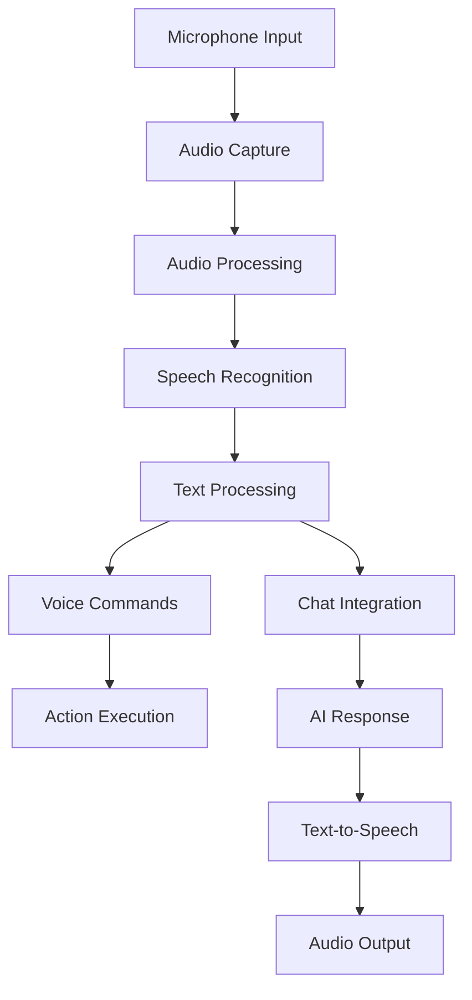

# Voice Development Guide

## 📋 Overview

This comprehensive guide covers developing voice processing features in PocketPal SuperAI, including speech-to-text, voice commands, audio processing, and text-to-speech capabilities based on the-rich-piana's implementation analysis and enhanced with privacy-focused local processing.

**Based on Research**: the-rich-piana voice implementation analysis  
**Target Performance**: <50ms recording start, <2s transcription, >95% accuracy  
**Implementation Focus**: Privacy-first with local + cloud hybrid approach  

## 🏗️ Voice Processing Architecture

### System Components Overview


### Implementation Layers
1. **Audio Capture Layer**: Cross-platform microphone access and recording
2. **Processing Layer**: Audio enhancement, noise reduction, format conversion
3. **Recognition Layer**: Local and cloud-based speech-to-text services
4. **Command Layer**: Voice command recognition and execution
5. **Integration Layer**: Chat and RAG system integration
6. **Output Layer**: Text-to-speech response generation

## 🚀 Getting Started

### 1. Project Structure Setup
```bash
# Voice module structure  
src/voice/
├── components/          # React components
├── services/           # Core voice services
├── native/            # Native module bridges
├── utils/             # Utility functions
├── types/             # TypeScript definitions
├── hooks/             # React hooks
├── commands/          # Voice command definitions
└── __tests__/         # Test files
```

### 2. Dependencies Installation
```bash
# Core voice dependencies
yarn add react-native-audio-recorder-player
yarn add react-native-sound
yarn add react-native-tts
yarn add react-native-voice
yarn add @react-native-community/audio-toolkit

# Audio processing
yarn add react-native-fs
yarn add buffer
yarn add stream

# API integrations
yarn add groq-sdk
yarn add @openai/api

# Platform permissions
yarn add react-native-permissions
```

### 3. Platform Configuration

#### iOS Configuration
Update `ios/PocketPalSuperAI/Info.plist`:
```xml
<key>NSMicrophoneUsageDescription</key>
<string>This app needs microphone access for voice input and commands</string>
<key>NSSpeechRecognitionUsageDescription</key>
<string>This app uses speech recognition to process voice commands</string>
<key>NSFileProviderDomainUsageDescription</key>
<string>This app needs file access to process audio recordings</string>

<!-- Background audio capability -->
<key>UIBackgroundModes</key>
<array>
    <string>audio</string>
</array>

<!-- Audio session configuration -->
<key>AVAudioSessionCategoryPlayAndRecord</key>
<true/>
```

#### Android Configuration
Update `android/app/src/main/AndroidManifest.xml`:
```xml
<uses-permission android:name="android.permission.RECORD_AUDIO" />
<uses-permission android:name="android.permission.WRITE_EXTERNAL_STORAGE" />
<uses-permission android:name="android.permission.READ_EXTERNAL_STORAGE" />
<uses-permission android:name="android.permission.MODIFY_AUDIO_SETTINGS" />
<uses-permission android:name="android.permission.WAKE_LOCK" />

<!-- Optional: for background recording -->
<uses-permission android:name="android.permission.FOREGROUND_SERVICE" />
```

Update `android/app/build.gradle`:
```gradle
android {
    packagingOptions {
        pickFirst "lib/x86/libc++_shared.so"
        pickFirst "lib/arm64-v8a/libc++_shared.so"
    }
}
```

## 🎤 Core Voice Services Implementation

### 1. Audio Recording Service
Create `src/voice/services/AudioRecorder.ts`:
```typescript
import AudioRecorderPlayer from 'react-native-audio-recorder-player';
import RNFS from 'react-native-fs';
import { Platform, PermissionsAndroid } from 'react-native';

interface RecordingOptions {
  quality?: 'low' | 'medium' | 'high';
  format?: 'mp3' | 'm4a' | 'wav';
  maxDuration?: number; // seconds
  sampleRate?: number;
  channels?: number;
  bitRate?: number;
}

interface RecordingSession {
  sessionId: string;
  filePath: string;
  startTime: number;
  options: RecordingOptions;
}

interface AudioLevels {
  currentMetering: number;
  currentPeakPower: number;
  averagePower: number;
}

export class AudioRecorder {
  private audioRecorderPlayer: AudioRecorderPlayer;
  private currentSession: RecordingSession | null = null;
  private recordingUpdateListener?: (levels: AudioLevels) => void;

  constructor() {
    this.audioRecorderPlayer = new AudioRecorderPlayer();
    this.audioRecorderPlayer.setSubscriptionDuration(0.1); // 100ms updates
  }

  async requestPermissions(): Promise<boolean> {
    if (Platform.OS === 'android') {
      try {
        const granted = await PermissionsAndroid.request(
          PermissionsAndroid.PERMISSIONS.RECORD_AUDIO,
          {
            title: 'Microphone Permission',
            message: 'This app needs access to microphone for voice features',
            buttonNeutral: 'Ask Me Later',
            buttonNegative: 'Cancel',
            buttonPositive: 'OK',
          }
        );
        return granted === PermissionsAndroid.RESULTS.GRANTED;
      } catch (err) {
        console.warn('Permission request failed:', err);
        return false;
      }
    }
    return true; // iOS permissions handled in Info.plist
  }

  async startRecording(options: RecordingOptions = {}): Promise<RecordingSession> {
    const hasPermission = await this.requestPermissions();
    if (!hasPermission) {
      throw new Error('Microphone permission denied');
    }

    if (this.currentSession) {
      throw new Error('Recording already in progress');
    }

    try {
      // Create recordings directory
      const recordingsDir = `${RNFS.DocumentDirectoryPath}/recordings`;
      if (!(await RNFS.exists(recordingsDir))) {
        await RNFS.mkdir(recordingsDir);
      }

      // Generate session details
      const sessionId = `recording_${Date.now()}_${Math.random().toString(36).substr(2, 9)}`;
      const timestamp = Date.now();
      const format = options.format || (Platform.OS === 'ios' ? 'm4a' : 'mp3');
      const filePath = `${recordingsDir}/${sessionId}.${format}`;

      // Configure audio settings based on quality
      const audioSet = this.getAudioConfiguration(options);
      
      // Start recording
      const uri = await this.audioRecorderPlayer.startRecorder(filePath, audioSet);
      
      // Setup session
      this.currentSession = {
        sessionId,
        filePath: uri,
        startTime: timestamp,
        options: { ...options, format }
      };

      // Setup audio level monitoring
      this.audioRecorderPlayer.addRecordBackListener((e) => {
        if (this.recordingUpdateListener) {
          this.recordingUpdateListener({
            currentMetering: e.currentMetering || 0,
            currentPeakPower: e.currentPeakPower || 0,
            averagePower: (e.currentMetering || 0) // Simple average for demo
          });
        }
      });

      return this.currentSession;

    } catch (error) {
      throw new Error(`Failed to start recording: ${error.message}`);
    }
  }

  async stopRecording(): Promise<{
    sessionId: string;
    filePath: string;
    duration: number;
    fileSize: number;
  }> {
    if (!this.currentSession) {
      throw new Error('No recording in progress');
    }

    try {
      const result = await this.audioRecorderPlayer.stopRecorder();
      this.audioRecorderPlayer.removeRecordBackListener();

      const duration = (Date.now() - this.currentSession.startTime) / 1000;
      const fileStats = await RNFS.stat(this.currentSession.filePath);

      const sessionInfo = {
        sessionId: this.currentSession.sessionId,
        filePath: this.currentSession.filePath,
        duration,
        fileSize: fileStats.size
      };

      this.currentSession = null;
      return sessionInfo;

    } catch (error) {
      this.currentSession = null;
      throw new Error(`Failed to stop recording: ${error.message}`);
    }
  }

  async pauseRecording(): Promise<void> {
    if (!this.currentSession) {
      throw new Error('No recording in progress');
    }

    try {
      await this.audioRecorderPlayer.pauseRecorder();
    } catch (error) {
      throw new Error(`Failed to pause recording: ${error.message}`);
    }
  }

  async resumeRecording(): Promise<void> {
    if (!this.currentSession) {
      throw new Error('No recording session to resume');
    }

    try {
      await this.audioRecorderPlayer.resumeRecorder();
    } catch (error) {
      throw new Error(`Failed to resume recording: ${error.message}`);
    }
  }

  setRecordingUpdateListener(listener: (levels: AudioLevels) => void): void {
    this.recordingUpdateListener = listener;
  }

  removeRecordingUpdateListener(): void {
    this.recordingUpdateListener = undefined;
  }

  getCurrentSession(): RecordingSession | null {
    return this.currentSession;
  }

  private getAudioConfiguration(options: RecordingOptions) {
    const quality = options.quality || 'medium';
    
    const configurations = {
      low: {
        SampleRate: 16000,
        Channels: 1,
        AudioQuality: 'Low',
        AudioEncoding: 'aac',
        AudioEncodingBitRate: 32000,
      },
      medium: {
        SampleRate: 22050,
        Channels: 1,
        AudioQuality: 'Medium',
        AudioEncoding: 'aac',
        AudioEncodingBitRate: 64000,
      },
      high: {
        SampleRate: 44100,
        Channels: 2,
        AudioQuality: 'High',
        AudioEncoding: 'aac',
        AudioEncodingBitRate: 128000,
      }
    };

    return {
      ...configurations[quality],
      // Override with custom options
      SampleRate: options.sampleRate || configurations[quality].SampleRate,
      Channels: options.channels || configurations[quality].Channels,
      AudioEncodingBitRate: options.bitRate || configurations[quality].AudioEncodingBitRate,
    };
  }

  async cleanup(): Promise<void> {
    if (this.currentSession) {
      await this.stopRecording();
    }
    this.removeRecordingUpdateListener();
  }
}
```

### 2. Speech Recognition Service
Create `src/voice/services/SpeechRecognition.ts`:
```typescript
import { NativeModules } from 'react-native';
import Groq from 'groq-sdk';

interface TranscriptionOptions {
  service?: 'local' | 'groq' | 'openai' | 'auto';
  language?: string;
  prompt?: string; // Context hint for better accuracy
  temperature?: number;
  model?: string;
}

interface TranscriptionResult {
  text: string;
  confidence: number;
  language: string;
  processingTime: number;
  service: string;
  segments?: Array<{
    text: string;
    start: number;
    end: number;
    confidence: number;
  }>;
}

export class SpeechRecognition {
  private groqClient?: Groq;
  private isLocalModelReady = false;

  constructor() {
    this.initializeServices();
  }

  private async initializeServices(): Promise<void> {
    // Initialize Groq client
    const groqApiKey = process.env.GROQ_API_KEY;
    if (groqApiKey) {
      this.groqClient = new Groq({ apiKey: groqApiKey });
    }

    // Initialize local speech recognition
    try {
      await NativeModules.VoiceNative?.initializeLocalModel();
      this.isLocalModelReady = true;
    } catch (error) {
      console.warn('Local speech recognition not available:', error.message);
    }
  }

  async transcribeAudio(
    audioPath: string,
    options: TranscriptionOptions = {}
  ): Promise<TranscriptionResult> {
    const startTime = Date.now();
    const service = await this.selectService(options.service);

    try {
      let result: TranscriptionResult;

      switch (service) {
        case 'local':
          result = await this.transcribeLocal(audioPath, options);
          break;
        case 'groq':
          result = await this.transcribeGroq(audioPath, options);
          break;
        case 'openai':
          result = await this.transcribeOpenAI(audioPath, options);
          break;
        default:
          throw new Error(`Unsupported transcription service: ${service}`);
      }

      result.processingTime = Date.now() - startTime;
      result.service = service;

      return result;

    } catch (error) {
      // Fallback to next available service
      if (service !== 'groq' && this.groqClient) {
        console.warn(`${service} transcription failed, falling back to Groq:`, error.message);
        return await this.transcribeGroq(audioPath, options);
      }
      
      throw new Error(`Transcription failed: ${error.message}`);
    }
  }

  private async transcribeLocal(
    audioPath: string,
    options: TranscriptionOptions
  ): Promise<TranscriptionResult> {
    if (!this.isLocalModelReady) {
      throw new Error('Local speech recognition model not available');
    }

    try {
      const result = await NativeModules.VoiceNative.transcribeAudio(audioPath, {
        language: options.language || 'auto',
        prompt: options.prompt || '',
      });

      return {
        text: result.text,
        confidence: result.confidence || 0.8,
        language: result.language || options.language || 'en',
        processingTime: 0, // Will be set by caller
        service: 'local',
        segments: result.segments || []
      };

    } catch (error) {
      throw new Error(`Local transcription failed: ${error.message}`);
    }
  }

  private async transcribeGroq(
    audioPath: string,
    options: TranscriptionOptions
  ): Promise<TranscriptionResult> {
    if (!this.groqClient) {
      throw new Error('Groq client not initialized');
    }

    try {
      // Read audio file
      const audioBuffer = await this.readAudioFile(audioPath);
      
      // Create form data for Groq API
      const formData = new FormData();
      formData.append('file', {
        uri: `file://${audioPath}`,
        type: 'audio/mp3',
        name: 'audio.mp3',
      } as any);
      
      formData.append('model', options.model || 'whisper-large-v3-turbo');
      formData.append('response_format', 'verbose_json');
      
      if (options.language && options.language !== 'auto') {
        formData.append('language', options.language);
      }
      
      if (options.prompt) {
        formData.append('prompt', options.prompt);
      }

      if (options.temperature !== undefined) {
        formData.append('temperature', options.temperature.toString());
      }

      // Make API request
      const response = await fetch('https://api.groq.com/openai/v1/audio/transcriptions', {
        method: 'POST',
        headers: {
          'Authorization': `Bearer ${this.groqClient.apiKey}`,
        },
        body: formData,
      });

      if (!response.ok) {
        throw new Error(`Groq API error: ${response.status} ${response.statusText}`);
      }

      const data = await response.json();

      return {
        text: data.text,
        confidence: this.calculateConfidence(data.segments || []),
        language: data.language || options.language || 'en',
        processingTime: 0, // Will be set by caller
        service: 'groq',
        segments: data.segments?.map((segment: any) => ({
          text: segment.text,
          start: segment.start,
          end: segment.end,
          confidence: segment.avg_logprob ? Math.exp(segment.avg_logprob) : 0.8
        })) || []
      };

    } catch (error) {
      throw new Error(`Groq transcription failed: ${error.message}`);
    }
  }

  private async transcribeOpenAI(
    audioPath: string,
    options: TranscriptionOptions
  ): Promise<TranscriptionResult> {
    // Implementation for OpenAI Whisper API
    // Similar to Groq implementation but using OpenAI endpoints
    throw new Error('OpenAI transcription not yet implemented');
  }

  private async selectService(requested?: string): Promise<string> {
    if (requested && requested !== 'auto') {
      return requested;
    }

    // Auto-select best available service
    if (this.isLocalModelReady) {
      return 'local';
    } else if (this.groqClient) {
      return 'groq';
    } else {
      throw new Error('No transcription service available');
    }
  }

  private async readAudioFile(path: string): Promise<Buffer> {
    try {
      const RNFS = require('react-native-fs');
      const audioData = await RNFS.readFile(path, 'base64');
      return Buffer.from(audioData, 'base64');
    } catch (error) {
      throw new Error(`Failed to read audio file: ${error.message}`);
    }
  }

  private calculateConfidence(segments: any[]): number {
    if (!segments || segments.length === 0) return 0.8;
    
    const avgLogProb = segments.reduce((sum, segment) => {
      return sum + (segment.avg_logprob || -1);
    }, 0) / segments.length;
    
    return Math.max(0, Math.min(1, Math.exp(avgLogProb)));
  }

  async getAvailableLanguages(): Promise<string[]> {
    // Return supported languages based on available services
    return [
      'en', 'es', 'fr', 'de', 'it', 'pt', 'ru', 'ja', 'ko', 'zh',
      'ar', 'hi', 'tr', 'pl', 'nl', 'sv', 'da', 'no', 'fi'
    ];
  }

  async getServiceStatus(): Promise<{
    local: boolean;
    groq: boolean;
    openai: boolean;
  }> {
    return {
      local: this.isLocalModelReady,
      groq: !!this.groqClient,
      openai: false // TODO: implement OpenAI support
    };
  }
}
```

### 3. Voice Commands Service
Create `src/voice/services/VoiceCommands.ts`:
```typescript
interface VoiceCommand {
  id: string;
  name: string;
  phrases: string[];
  action: {
    type: 'navigation' | 'function' | 'system' | 'rag';
    target: string;
    parameters?: Record<string, any>;
  };
  enabled: boolean;
  confidence: number; // Minimum confidence threshold
  priority: number; // Higher priority commands matched first
}

interface CommandMatch {
  command: VoiceCommand;
  confidence: number;
  matchedPhrase: string;
}

interface CommandExecutionResult {
  success: boolean;
  commandId: string;
  action: string;
  result?: any;
  error?: string;
  executionTime: number;
}

export class VoiceCommandsService {
  private commands: Map<string, VoiceCommand> = new Map();
  private commandHistory: Array<{
    command: string;
    timestamp: number;
    success: boolean;
  }> = [];

  constructor() {
    this.initializeDefaultCommands();
  }

  private initializeDefaultCommands(): void {
    const defaultCommands: VoiceCommand[] = [
      // Navigation commands
      {
        id: 'nav_home',
        name: 'Navigate Home',
        phrases: ['go home', 'navigate home', 'take me home', 'home screen'],
        action: { type: 'navigation', target: 'Home' },
        enabled: true,
        confidence: 0.7,
        priority: 1
      },
      {
        id: 'nav_settings',
        name: 'Open Settings',
        phrases: ['open settings', 'go to settings', 'settings page'],
        action: { type: 'navigation', target: 'Settings' },
        enabled: true,
        confidence: 0.7,
        priority: 1
      },
      
      // RAG commands
      {
        id: 'rag_search',
        name: 'Search Documents',
        phrases: ['search documents', 'find in documents', 'search files'],
        action: { type: 'rag', target: 'search' },
        enabled: true,
        confidence: 0.8,
        priority: 2
      },
      {
        id: 'rag_ingest',
        name: 'Add Document',
        phrases: ['add document', 'upload file', 'ingest document'],
        action: { type: 'rag', target: 'ingest' },
        enabled: true,
        confidence: 0.8,
        priority: 2
      },

      // System commands
      {
        id: 'sys_listen',
        name: 'Start Listening',
        phrases: ['start listening', 'begin recording', 'listen'],
        action: { type: 'system', target: 'startListening' },
        enabled: true,
        confidence: 0.9,
        priority: 3
      },
      {
        id: 'sys_stop',
        name: 'Stop Listening',
        phrases: ['stop listening', 'stop recording', 'stop'],
        action: { type: 'system', target: 'stopListening' },
        enabled: true,
        confidence: 0.9,
        priority: 3
      },

      // Chat commands
      {
        id: 'chat_new',
        name: 'New Chat',
        phrases: ['new chat', 'start new conversation', 'new conversation'],
        action: { type: 'function', target: 'newChat' },
        enabled: true,
        confidence: 0.8,
        priority: 1
      },
      {
        id: 'chat_clear',
        name: 'Clear Chat',
        phrases: ['clear chat', 'clear conversation', 'delete chat'],
        action: { type: 'function', target: 'clearChat' },
        enabled: true,
        confidence: 0.8,
        priority: 1
      }
    ];

    defaultCommands.forEach(cmd => this.commands.set(cmd.id, cmd));
  }

  registerCommand(command: VoiceCommand): void {
    this.commands.set(command.id, command);
  }

  unregisterCommand(commandId: string): boolean {
    return this.commands.delete(commandId);
  }

  updateCommand(commandId: string, updates: Partial<VoiceCommand>): boolean {
    const command = this.commands.get(commandId);
    if (!command) return false;

    this.commands.set(commandId, { ...command, ...updates });
    return true;
  }

  processText(text: string): CommandMatch | null {
    const normalizedText = text.toLowerCase().trim();
    let bestMatch: CommandMatch | null = null;
    let highestScore = 0;

    // Sort commands by priority (higher first)
    const sortedCommands = Array.from(this.commands.values())
      .filter(cmd => cmd.enabled)
      .sort((a, b) => b.priority - a.priority);

    for (const command of sortedCommands) {
      for (const phrase of command.phrases) {
        const confidence = this.calculatePhraseMatch(normalizedText, phrase.toLowerCase());
        
        if (confidence >= command.confidence && confidence > highestScore) {
          highestScore = confidence;
          bestMatch = {
            command,
            confidence,
            matchedPhrase: phrase
          };
        }
      }
    }

    return bestMatch;
  }

  private calculatePhraseMatch(text: string, phrase: string): number {
    // Exact match
    if (text === phrase) return 1.0;
    
    // Contains phrase
    if (text.includes(phrase)) return 0.9;
    
    // Word-based matching
    const textWords = text.split(' ');
    const phraseWords = phrase.split(' ');
    
    // All phrase words present in text
    const allWordsPresent = phraseWords.every(word => 
      textWords.some(textWord => textWord.includes(word) || word.includes(textWord))
    );
    
    if (allWordsPresent) {
      // Calculate based on word order and position
      const matchScore = phraseWords.length / textWords.length;
      return Math.max(0.6, Math.min(0.85, matchScore));
    }

    // Partial word matching
    const wordMatches = phraseWords.filter(word =>
      textWords.some(textWord => 
        this.calculateWordSimilarity(textWord, word) > 0.7
      )
    );

    if (wordMatches.length > 0) {
      return (wordMatches.length / phraseWords.length) * 0.6;
    }

    return 0;
  }

  private calculateWordSimilarity(word1: string, word2: string): number {
    // Simple Levenshtein distance based similarity
    const distance = this.levenshteinDistance(word1, word2);
    const maxLength = Math.max(word1.length, word2.length);
    return 1 - (distance / maxLength);
  }

  private levenshteinDistance(str1: string, str2: string): number {
    const matrix = Array(str2.length + 1).fill(null).map(() => 
      Array(str1.length + 1).fill(null)
    );

    for (let i = 0; i <= str1.length; i++) matrix[0][i] = i;
    for (let j = 0; j <= str2.length; j++) matrix[j][0] = j;

    for (let j = 1; j <= str2.length; j++) {
      for (let i = 1; i <= str1.length; i++) {
        const indicator = str1[i - 1] === str2[j - 1] ? 0 : 1;
        matrix[j][i] = Math.min(
          matrix[j][i - 1] + 1,     // deletion
          matrix[j - 1][i] + 1,     // insertion
          matrix[j - 1][i - 1] + indicator // substitution
        );
      }
    }

    return matrix[str2.length][str1.length];
  }

  async executeCommand(match: CommandMatch): Promise<CommandExecutionResult> {
    const startTime = Date.now();
    const { command } = match;

    try {
      let result: any;

      switch (command.action.type) {
        case 'navigation':
          result = await this.executeNavigationCommand(command.action.target, command.action.parameters);
          break;
        case 'function':
          result = await this.executeFunctionCommand(command.action.target, command.action.parameters);
          break;
        case 'system':
          result = await this.executeSystemCommand(command.action.target, command.action.parameters);
          break;
        case 'rag':
          result = await this.executeRagCommand(command.action.target, command.action.parameters);
          break;
        default:
          throw new Error(`Unknown command type: ${command.action.type}`);
      }

      const executionResult: CommandExecutionResult = {
        success: true,
        commandId: command.id,
        action: `${command.action.type}:${command.action.target}`,
        result,
        executionTime: Date.now() - startTime
      };

      this.recordCommandExecution(command.id, true);
      return executionResult;

    } catch (error) {
      const executionResult: CommandExecutionResult = {
        success: false,
        commandId: command.id,
        action: `${command.action.type}:${command.action.target}`,
        error: error.message,
        executionTime: Date.now() - startTime
      };

      this.recordCommandExecution(command.id, false);
      return executionResult;
    }
  }

  private async executeNavigationCommand(target: string, parameters?: Record<string, any>): Promise<any> {
    // This would integrate with your navigation system
    const { NavigationService } = require('../../../navigation/NavigationService');
    return await NavigationService.navigate(target, parameters);
  }

  private async executeFunctionCommand(target: string, parameters?: Record<string, any>): Promise<any> {
    // Execute application functions
    switch (target) {
      case 'newChat':
        // Integration with chat service
        const { ChatService } = require('../../../chat/ChatService');
        return await ChatService.createNewSession();
      
      case 'clearChat':
        const { ChatService: CS } = require('../../../chat/ChatService');
        return await CS.clearCurrentSession();
      
      default:
        throw new Error(`Unknown function command: ${target}`);
    }
  }

  private async executeSystemCommand(target: string, parameters?: Record<string, any>): Promise<any> {
    // Execute system-level commands
    switch (target) {
      case 'startListening':
        const { VoiceService } = require('./VoiceService');
        return await VoiceService.startListening();
      
      case 'stopListening':
        const { VoiceService: VS } = require('./VoiceService');
        return await VS.stopListening();
      
      default:
        throw new Error(`Unknown system command: ${target}`);
    }
  }

  private async executeRagCommand(target: string, parameters?: Record<string, any>): Promise<any> {
    // Execute RAG-related commands
    switch (target) {
      case 'search':
        // This would open document search interface
        const { NavigationService } = require('../../../navigation/NavigationService');
        return await NavigationService.navigate('DocumentSearch');
      
      case 'ingest':
        // This would open document ingestion interface
        const { NavigationService: NS } = require('../../../navigation/NavigationService');
        return await NS.navigate('DocumentUpload');
      
      default:
        throw new Error(`Unknown RAG command: ${target}`);
    }
  }

  private recordCommandExecution(commandId: string, success: boolean): void {
    this.commandHistory.push({
      command: commandId,
      timestamp: Date.now(),
      success
    });

    // Keep only last 100 executions
    if (this.commandHistory.length > 100) {
      this.commandHistory.shift();
    }
  }

  getCommandList(): VoiceCommand[] {
    return Array.from(this.commands.values());
  }

  getCommandStats(): {
    totalCommands: number;
    enabledCommands: number;
    totalExecutions: number;
    successfulExecutions: number;
    topCommands: Array<{ commandId: string; executions: number; successRate: number; }>;
  } {
    const total = this.commands.size;
    const enabled = Array.from(this.commands.values()).filter(cmd => cmd.enabled).length;
    const totalExecs = this.commandHistory.length;
    const successful = this.commandHistory.filter(h => h.success).length;

    // Calculate top commands
    const commandCounts = new Map<string, { total: number; successful: number }>();
    this.commandHistory.forEach(h => {
      const current = commandCounts.get(h.command) || { total: 0, successful: 0 };
      current.total++;
      if (h.success) current.successful++;
      commandCounts.set(h.command, current);
    });

    const topCommands = Array.from(commandCounts.entries())
      .map(([commandId, stats]) => ({
        commandId,
        executions: stats.total,
        successRate: stats.total > 0 ? stats.successful / stats.total : 0
      }))
      .sort((a, b) => b.executions - a.executions)
      .slice(0, 10);

    return {
      totalCommands: total,
      enabledCommands: enabled,
      totalExecutions: totalExecs,
      successfulExecutions: successful,
      topCommands
    };
  }
}
```

### 4. Text-to-Speech Service
Create `src/voice/services/TextToSpeech.ts`:
```typescript
import Tts from 'react-native-tts';

interface TTSOptions {
  voice?: string;
  language?: string;
  rate?: number;      // 0.0 to 1.0
  pitch?: number;     // 0.5 to 2.0
  quality?: 'low' | 'medium' | 'high';
}

interface Voice {
  id: string;
  name: string;
  language: string;
  quality: string;
  networkConnectionRequired: boolean;
  notInstalled: boolean;
}

export class TextToSpeechService {
  private isInitialized = false;
  private availableVoices: Voice[] = [];
  private currentSettings: TTSOptions = {
    rate: 0.5,
    pitch: 1.0,
    quality: 'medium'
  };

  async initialize(): Promise<void> {
    if (this.isInitialized) return;

    try {
      // Initialize TTS engine
      await Tts.setDefaultLanguage('en-US');
      await Tts.setDefaultRate(this.currentSettings.rate || 0.5);
      await Tts.setDefaultPitch(this.currentSettings.pitch || 1.0);

      // Get available voices
      this.availableVoices = await Tts.voices();

      // Set up event listeners
      Tts.addEventListener('tts-start', this.onSpeechStart);
      Tts.addEventListener('tts-finish', this.onSpeechFinish);
      Tts.addEventListener('tts-cancel', this.onSpeechCancel);

      this.isInitialized = true;

    } catch (error) {
      throw new Error(`TTS initialization failed: ${error.message}`);
    }
  }

  async speak(text: string, options: TTSOptions = {}): Promise<void> {
    await this.initialize();

    try {
      // Apply options
      if (options.rate !== undefined) {
        await Tts.setDefaultRate(options.rate);
      }
      
      if (options.pitch !== undefined) {
        await Tts.setDefaultPitch(options.pitch);
      }

      if (options.language) {
        await Tts.setDefaultLanguage(options.language);
      }

      if (options.voice) {
        await Tts.setDefaultVoice(options.voice);
      }

      // Speak the text
      await Tts.speak(text);

    } catch (error) {
      throw new Error(`TTS failed: ${error.message}`);
    }
  }

  async stop(): Promise<void> {
    try {
      await Tts.stop();
    } catch (error) {
      console.warn('TTS stop failed:', error.message);
    }
  }

  async pause(): Promise<void> {
    try {
      await Tts.pause();
    } catch (error) {
      console.warn('TTS pause failed:', error.message);
    }
  }

  async resume(): Promise<void> {
    try {
      await Tts.resume();
    } catch (error) {
      console.warn('TTS resume failed:', error.message);
    }
  }

  getAvailableVoices(): Voice[] {
    return this.availableVoices;
  }

  async setDefaultVoice(voiceId: string): Promise<void> {
    await this.initialize();
    
    const voice = this.availableVoices.find(v => v.id === voiceId);
    if (!voice) {
      throw new Error(`Voice not found: ${voiceId}`);
    }

    try {
      await Tts.setDefaultVoice(voiceId);
      this.currentSettings.voice = voiceId;
      this.currentSettings.language = voice.language;
    } catch (error) {
      throw new Error(`Failed to set voice: ${error.message}`);
    }
  }

  async updateSettings(settings: Partial<TTSOptions>): Promise<void> {
    await this.initialize();

    this.currentSettings = { ...this.currentSettings, ...settings };

    try {
      if (settings.rate !== undefined) {
        await Tts.setDefaultRate(settings.rate);
      }
      
      if (settings.pitch !== undefined) {
        await Tts.setDefaultPitch(settings.pitch);
      }

      if (settings.language) {
        await Tts.setDefaultLanguage(settings.language);
      }

      if (settings.voice) {
        await Tts.setDefaultVoice(settings.voice);
      }

    } catch (error) {
      throw new Error(`Failed to update TTS settings: ${error.message}`);
    }
  }

  getCurrentSettings(): TTSOptions {
    return { ...this.currentSettings };
  }

  async isSpeaking(): Promise<boolean> {
    try {
      return await Tts.isSpeaking();
    } catch {
      return false;
    }
  }

  private onSpeechStart = (event: any) => {
    console.log('TTS started:', event);
  };

  private onSpeechFinish = (event: any) => {
    console.log('TTS finished:', event);
  };

  private onSpeechCancel = (event: any) => {
    console.log('TTS cancelled:', event);
  };

  async cleanup(): Promise<void> {
    if (!this.isInitialized) return;

    try {
      await this.stop();
      
      Tts.removeEventListener('tts-start', this.onSpeechStart);
      Tts.removeEventListener('tts-finish', this.onSpeechFinish);
      Tts.removeEventListener('tts-cancel', this.onSpeechCancel);

    } catch (error) {
      console.warn('TTS cleanup failed:', error.message);
    }
  }
}
```

### 5. Main Voice Service Orchestrator
Create `src/voice/services/VoiceService.ts`:
```typescript
import { AudioRecorder } from './AudioRecorder';
import { SpeechRecognition } from './SpeechRecognition';
import { VoiceCommandsService } from './VoiceCommands';
import { TextToSpeechService } from './TextToSpeech';

interface VoiceConfig {
  transcriptionService?: 'local' | 'groq' | 'auto';
  enableCommands?: boolean;
  enableTTS?: boolean;
  autoDeleteRecordings?: boolean;
  defaultLanguage?: string;
}

interface VoiceSessionResult {
  transcription: {
    text: string;
    confidence: number;
    language: string;
    processingTime: number;
  };
  command?: {
    matched: boolean;
    commandId: string;
    executed: boolean;
    result?: any;
    error?: string;
  };
  audioInfo: {
    sessionId: string;
    duration: number;
    fileSize: number;
    deleted: boolean;
  };
}

export class VoiceService {
  private audioRecorder: AudioRecorder;
  private speechRecognition: SpeechRecognition;
  private voiceCommands: VoiceCommandsService;
  private textToSpeech: TextToSpeechService;
  private config: Required<VoiceConfig>;
  private isListening = false;

  constructor(config: VoiceConfig = {}) {
    this.audioRecorder = new AudioRecorder();
    this.speechRecognition = new SpeechRecognition();
    this.voiceCommands = new VoiceCommandsService();
    this.textToSpeech = new TextToSpeechService();
    
    this.config = {
      transcriptionService: config.transcriptionService || 'auto',
      enableCommands: config.enableCommands !== false,
      enableTTS: config.enableTTS !== false,
      autoDeleteRecordings: config.autoDeleteRecordings !== false,
      defaultLanguage: config.defaultLanguage || 'en'
    };
  }

  async initialize(): Promise<void> {
    await Promise.all([
      this.textToSpeech.initialize()
      // speechRecognition and audioRecorder initialize on first use
    ]);
  }

  async startListening(options?: {
    recordingOptions?: any;
    transcriptionOptions?: any;
    onAudioLevels?: (levels: any) => void;
  }): Promise<string> {
    if (this.isListening) {
      throw new Error('Already listening');
    }

    try {
      this.isListening = true;

      // Set up audio level monitoring if requested
      if (options?.onAudioLevels) {
        this.audioRecorder.setRecordingUpdateListener(options.onAudioLevels);
      }

      // Start recording
      const session = await this.audioRecorder.startRecording(options?.recordingOptions);
      return session.sessionId;

    } catch (error) {
      this.isListening = false;
      throw new Error(`Failed to start listening: ${error.message}`);
    }
  }

  async stopListening(): Promise<VoiceSessionResult> {
    if (!this.isListening) {
      throw new Error('Not currently listening');
    }

    try {
      this.isListening = false;
      this.audioRecorder.removeRecordingUpdateListener();

      // Stop recording
      const recordingResult = await this.audioRecorder.stopRecording();

      // Transcribe audio
      const transcriptionResult = await this.speechRecognition.transcribeAudio(
        recordingResult.filePath,
        {
          service: this.config.transcriptionService,
          language: this.config.defaultLanguage
        }
      );

      // Process voice commands if enabled
      let commandResult;
      if (this.config.enableCommands) {
        const commandMatch = this.voiceCommands.processText(transcriptionResult.text);
        
        if (commandMatch) {
          const executionResult = await this.voiceCommands.executeCommand(commandMatch);
          commandResult = {
            matched: true,
            commandId: executionResult.commandId,
            executed: executionResult.success,
            result: executionResult.result,
            error: executionResult.error
          };
        } else {
          commandResult = {
            matched: false,
            commandId: '',
            executed: false
          };
        }
      }

      // Clean up recording file if configured
      let recordingDeleted = false;
      if (this.config.autoDeleteRecordings) {
        try {
          const RNFS = require('react-native-fs');
          await RNFS.unlink(recordingResult.filePath);
          recordingDeleted = true;
        } catch (error) {
          console.warn('Failed to delete recording:', error.message);
        }
      }

      return {
        transcription: {
          text: transcriptionResult.text,
          confidence: transcriptionResult.confidence,
          language: transcriptionResult.language,
          processingTime: transcriptionResult.processingTime
        },
        command: commandResult,
        audioInfo: {
          sessionId: recordingResult.sessionId,
          duration: recordingResult.duration,
          fileSize: recordingResult.fileSize,
          deleted: recordingDeleted
        }
      };

    } catch (error) {
      this.isListening = false;
      throw new Error(`Failed to stop listening: ${error.message}`);
    }
  }

  async speakResponse(text: string, options?: any): Promise<void> {
    if (!this.config.enableTTS) {
      return;
    }

    try {
      await this.textToSpeech.speak(text, options);
    } catch (error) {
      console.warn('TTS failed:', error.message);
      // Don't throw - TTS failure shouldn't break the flow
    }
  }

  async processVoiceInput(audioPath: string): Promise<{
    transcription: string;
    commandExecuted?: boolean;
    commandResult?: any;
  }> {
    try {
      // Transcribe audio
      const transcriptionResult = await this.speechRecognition.transcribeAudio(
        audioPath,
        {
          service: this.config.transcriptionService,
          language: this.config.defaultLanguage
        }
      );

      // Process voice commands if enabled
      let commandExecuted = false;
      let commandResult;

      if (this.config.enableCommands) {
        const commandMatch = this.voiceCommands.processText(transcriptionResult.text);
        
        if (commandMatch) {
          const executionResult = await this.voiceCommands.executeCommand(commandMatch);
          commandExecuted = executionResult.success;
          commandResult = executionResult.result;
        }
      }

      return {
        transcription: transcriptionResult.text,
        commandExecuted,
        commandResult
      };

    } catch (error) {
      throw new Error(`Voice input processing failed: ${error.message}`);
    }
  }

  isCurrentlyListening(): boolean {
    return this.isListening;
  }

  async getServiceStatus(): Promise<{
    listening: boolean;
    transcriptionServices: any;
    ttsReady: boolean;
    commandsEnabled: boolean;
  }> {
    const transcriptionServices = await this.speechRecognition.getServiceStatus();
    const ttsReady = await this.textToSpeech.isSpeaking().then(() => true).catch(() => false);

    return {
      listening: this.isListening,
      transcriptionServices,
      ttsReady,
      commandsEnabled: this.config.enableCommands
    };
  }

  // Voice command management
  registerVoiceCommand(command: any): void {
    this.voiceCommands.registerCommand(command);
  }

  getVoiceCommands(): any[] {
    return this.voiceCommands.getCommandList();
  }

  updateVoiceCommand(commandId: string, updates: any): boolean {
    return this.voiceCommands.updateCommand(commandId, updates);
  }

  // TTS management
  async setTTSVoice(voiceId: string): Promise<void> {
    await this.textToSpeech.setDefaultVoice(voiceId);
  }

  getTTSVoices(): any[] {
    return this.textToSpeech.getAvailableVoices();
  }

  async updateTTSSettings(settings: any): Promise<void> {
    await this.textToSpeech.updateSettings(settings);
  }

  async cleanup(): Promise<void> {
    if (this.isListening) {
      await this.stopListening();
    }
    
    await Promise.all([
      this.audioRecorder.cleanup(),
      this.textToSpeech.cleanup()
    ]);
  }
}
```

## 🎯 React Integration Components

### 1. Voice Input Hook
Create `src/voice/hooks/useVoice.ts`:
```typescript
import { useState, useEffect, useCallback, useRef } from 'react';
import { VoiceService } from '../services/VoiceService';

interface UseVoiceOptions {
  autoInitialize?: boolean;
  config?: ConstructorParameters<typeof VoiceService>[0];
  onTranscription?: (text: string) => void;
  onCommand?: (command: any) => void;
  onError?: (error: string) => void;
}

export const useVoice = (options: UseVoiceOptions = {}) => {
  const [isInitialized, setIsInitialized] = useState(false);
  const [isListening, setIsListening] = useState(false);
  const [isProcessing, setIsProcessing] = useState(false);
  const [error, setError] = useState<string | null>(null);
  const [audioLevels, setAudioLevels] = useState<any>(null);
  
  const voiceServiceRef = useRef<VoiceService | null>(null);
  const currentSessionRef = useRef<string | null>(null);

  useEffect(() => {
    if (options.autoInitialize !== false) {
      initialize();
    }
    
    return () => {
      cleanup();
    };
  }, []);

  const initialize = useCallback(async () => {
    if (voiceServiceRef.current) return;

    try {
      setError(null);
      
      voiceServiceRef.current = new VoiceService(options.config);
      await voiceServiceRef.current.initialize();
      
      setIsInitialized(true);
    } catch (err) {
      setError(err instanceof Error ? err.message : 'Voice initialization failed');
    }
  }, [options.config]);

  const startListening = useCallback(async () => {
    if (!voiceServiceRef.current) {
      throw new Error('Voice service not initialized');
    }

    try {
      setError(null);
      setIsListening(true);

      const sessionId = await voiceServiceRef.current.startListening({
        onAudioLevels: setAudioLevels
      });
      
      currentSessionRef.current = sessionId;
      
    } catch (err) {
      setIsListening(false);
      const error = err instanceof Error ? err.message : 'Failed to start listening';
      setError(error);
      options.onError?.(error);
      throw new Error(error);
    }
  }, []);

  const stopListening = useCallback(async () => {
    if (!voiceServiceRef.current || !isListening) {
      return null;
    }

    try {
      setIsProcessing(true);
      setError(null);

      const result = await voiceServiceRef.current.stopListening();
      
      setIsListening(false);
      currentSessionRef.current = null;
      setAudioLevels(null);

      // Trigger callbacks
      if (result.transcription.text) {
        options.onTranscription?.(result.transcription.text);
      }
      
      if (result.command?.matched) {
        options.onCommand?.(result.command);
      }

      return result;
      
    } catch (err) {
      setIsListening(false);
      setIsProcessing(false);
      currentSessionRef.current = null;
      
      const error = err instanceof Error ? err.message : 'Failed to stop listening';
      setError(error);
      options.onError?.(error);
      throw new Error(error);
    } finally {
      setIsProcessing(false);
    }
  }, [isListening]);

  const speak = useCallback(async (text: string, ttsOptions?: any) => {
    if (!voiceServiceRef.current) {
      throw new Error('Voice service not initialized');
    }

    try {
      setError(null);
      await voiceServiceRef.current.speakResponse(text, ttsOptions);
    } catch (err) {
      const error = err instanceof Error ? err.message : 'TTS failed';
      setError(error);
      console.warn('TTS error:', error);
      // Don't throw for TTS errors - they're not critical
    }
  }, []);

  const processAudioFile = useCallback(async (audioPath: string) => {
    if (!voiceServiceRef.current) {
      throw new Error('Voice service not initialized');
    }

    try {
      setError(null);
      setIsProcessing(true);
      
      const result = await voiceServiceRef.current.processVoiceInput(audioPath);
      
      // Trigger callbacks
      if (result.transcription) {
        options.onTranscription?.(result.transcription);
      }
      
      if (result.commandExecuted) {
        options.onCommand?.({ executed: true, result: result.commandResult });
      }

      return result;
      
    } catch (err) {
      const error = err instanceof Error ? err.message : 'Audio processing failed';
      setError(error);
      options.onError?.(error);
      throw new Error(error);
    } finally {
      setIsProcessing(false);
    }
  }, []);

  const getStatus = useCallback(async () => {
    if (!voiceServiceRef.current) return null;
    
    try {
      return await voiceServiceRef.current.getServiceStatus();
    } catch (err) {
      console.warn('Failed to get voice status:', err);
      return null;
    }
  }, []);

  const cleanup = useCallback(async () => {
    if (voiceServiceRef.current) {
      try {
        await voiceServiceRef.current.cleanup();
      } catch (err) {
        console.warn('Voice cleanup error:', err);
      }
      voiceServiceRef.current = null;
    }
  }, []);

  return {
    isInitialized,
    isListening,
    isProcessing,
    error,
    audioLevels,
    initialize,
    startListening,
    stopListening,
    speak,
    processAudioFile,
    getStatus,
    voiceService: voiceServiceRef.current
  };
};
```

### 2. Voice Input Component
Create `src/voice/components/VoiceInput.tsx`:
```typescript
import React, { useState, useEffect } from 'react';
import {
  View,
  TouchableOpacity,
  Text,
  StyleSheet,
  Animated,
  ActivityIndicator,
} from 'react-native';
import { useVoice } from '../hooks/useVoice';

interface VoiceInputProps {
  onTranscription?: (text: string) => void;
  onCommand?: (command: any) => void;
  onError?: (error: string) => void;
  style?: any;
  size?: 'small' | 'medium' | 'large';
  showWaveform?: boolean;
  autoSpeak?: boolean;
}

export const VoiceInput: React.FC<VoiceInputProps> = ({
  onTranscription,
  onCommand,
  onError,
  style,
  size = 'medium',
  showWaveform = true,
  autoSpeak = false
}) => {
  const [scaleAnim] = useState(new Animated.Value(1));
  const [pulseAnim] = useState(new Animated.Value(0));
  
  const {
    isInitialized,
    isListening,
    isProcessing,
    error,
    audioLevels,
    startListening,
    stopListening,
    speak
  } = useVoice({
    onTranscription: (text) => {
      onTranscription?.(text);
      if (autoSpeak && text) {
        speak(`I heard: ${text}`);
      }
    },
    onCommand,
    onError
  });

  useEffect(() => {
    if (isListening) {
      // Start pulse animation
      Animated.loop(
        Animated.sequence([
          Animated.timing(scaleAnim, {
            toValue: 1.2,
            duration: 1000,
            useNativeDriver: true,
          }),
          Animated.timing(scaleAnim, {
            toValue: 1,
            duration: 1000,
            useNativeDriver: true,
          }),
        ])
      ).start();

      // Pulse effect based on audio levels
      if (audioLevels) {
        Animated.timing(pulseAnim, {
          toValue: Math.min(audioLevels.currentMetering / 100, 1),
          duration: 100,
          useNativeDriver: true,
        }).start();
      }
    } else {
      scaleAnim.setValue(1);
      pulseAnim.setValue(0);
    }
  }, [isListening, audioLevels]);

  const handlePress = async () => {
    if (!isInitialized) return;

    try {
      if (isListening) {
        await stopListening();
      } else {
        await startListening();
      }
    } catch (err) {
      console.error('Voice input error:', err);
    }
  };

  const getButtonSize = () => {
    switch (size) {
      case 'small': return 40;
      case 'large': return 80;
      default: return 60;
    }
  };

  const getIconSize = () => {
    switch (size) {
      case 'small': return 20;
      case 'large': return 40;
      default: return 30;
    }
  };

  const buttonSize = getButtonSize();
  const iconSize = getIconSize();

  return (
    <View style={[styles.container, style]}>
      {error && (
        <Text style={styles.errorText}>{error}</Text>
      )}
      
      <TouchableOpacity
        style={[
          styles.button,
          {
            width: buttonSize,
            height: buttonSize,
            borderRadius: buttonSize / 2,
          },
          isListening && styles.listeningButton,
          !isInitialized && styles.disabledButton,
        ]}
        onPress={handlePress}
        disabled={!isInitialized || isProcessing}
        activeOpacity={0.7}
      >
        <Animated.View
          style={[
            styles.buttonContent,
            {
              transform: [{ scale: scaleAnim }],
            },
          ]}
        >
          {isProcessing ? (
            <ActivityIndicator
              size={iconSize > 25 ? 'large' : 'small'}
              color="white"
            />
          ) : (
            <View style={styles.microphoneIcon}>
              {/* Simple microphone icon using Unicode */}
              <Text style={[styles.iconText, { fontSize: iconSize }]}>🎤</Text>
            </View>
          )}
        </Animated.View>

        {/* Pulse effect overlay */}
        {isListening && showWaveform && (
          <Animated.View
            style={[
              styles.pulseOverlay,
              {
                width: buttonSize,
                height: buttonSize,
                borderRadius: buttonSize / 2,
                opacity: pulseAnim,
              },
            ]}
          />
        )}
      </TouchableOpacity>

      {/* Status text */}
      <Text style={styles.statusText}>
        {isProcessing
          ? 'Processing...'
          : isListening
          ? 'Listening...'
          : !isInitialized
          ? 'Initializing...'
          : 'Tap to speak'
        }
      </Text>

      {/* Audio level indicator */}
      {isListening && showWaveform && audioLevels && (
        <View style={styles.audioLevelContainer}>
          <View style={styles.audioLevelBar}>
            <Animated.View
              style={[
                styles.audioLevelFill,
                {
                  width: `${Math.min(Math.abs(audioLevels.currentMetering) / 100 * 100, 100)}%`,
                },
              ]}
            />
          </View>
        </View>
      )}
    </View>
  );
};

const styles = StyleSheet.create({
  container: {
    alignItems: 'center',
    paddingVertical: 10,
  },
  button: {
    backgroundColor: '#007AFF',
    justifyContent: 'center',
    alignItems: 'center',
    elevation: 5,
    shadowColor: '#000',
    shadowOffset: { width: 0, height: 2 },
    shadowOpacity: 0.25,
    shadowRadius: 4,
  },
  listeningButton: {
    backgroundColor: '#FF3B30',
  },
  disabledButton: {
    backgroundColor: '#ccc',
  },
  buttonContent: {
    justifyContent: 'center',
    alignItems: 'center',
  },
  microphoneIcon: {
    justifyContent: 'center',
    alignItems: 'center',
  },
  iconText: {
    color: 'white',
  },
  pulseOverlay: {
    position: 'absolute',
    backgroundColor: 'rgba(255, 255, 255, 0.3)',
  },
  statusText: {
    marginTop: 8,
    fontSize: 12,
    color: '#666',
    textAlign: 'center',
  },
  errorText: {
    color: '#FF3B30',
    fontSize: 12,
    marginBottom: 8,
    textAlign: 'center',
  },
  audioLevelContainer: {
    marginTop: 8,
    width: '80%',
  },
  audioLevelBar: {
    height: 4,
    backgroundColor: '#E5E5EA',
    borderRadius: 2,
    overflow: 'hidden',
  },
  audioLevelFill: {
    height: '100%',
    backgroundColor: '#34C759',
    borderRadius: 2,
  },
});
```

## 🧪 Testing Strategy

### 1. Unit Tests
Create `src/voice/__tests__/VoiceService.test.ts`:
```typescript
import { VoiceService } from '../services/VoiceService';
import { AudioRecorder } from '../services/AudioRecorder';
import { SpeechRecognition } from '../services/SpeechRecognition';

// Mock native modules
jest.mock('react-native', () => ({
  NativeModules: {
    VoiceNative: {
      initializeLocalModel: jest.fn().mockResolvedValue(true),
      transcribeAudio: jest.fn().mockResolvedValue({
        text: 'test transcription',
        confidence: 0.9,
        language: 'en'
      })
    }
  },
  Platform: {
    OS: 'ios'
  },
  PermissionsAndroid: {
    request: jest.fn().mockResolvedValue('granted'),
    PERMISSIONS: { RECORD_AUDIO: 'android.permission.RECORD_AUDIO' },
    RESULTS: { GRANTED: 'granted' }
  }
}));

jest.mock('react-native-audio-recorder-player', () => {
  return jest.fn().mockImplementation(() => ({
    startRecorder: jest.fn().mockResolvedValue('/test/path/recording.m4a'),
    stopRecorder: jest.fn().mockResolvedValue('/test/path/recording.m4a'),
    addRecordBackListener: jest.fn(),
    removeRecordBackListener: jest.fn(),
    setSubscriptionDuration: jest.fn()
  }));
});

describe('VoiceService', () => {
  let voiceService: VoiceService;

  beforeEach(() => {
    voiceService = new VoiceService({
      transcriptionService: 'local',
      enableCommands: true
    });
  });

  describe('initialization', () => {
    it('should initialize successfully', async () => {
      await expect(voiceService.initialize()).resolves.not.toThrow();
    });
  });

  describe('voice recording and transcription', () => {
    it('should start and stop listening successfully', async () => {
      await voiceService.initialize();
      
      // Start listening
      const sessionId = await voiceService.startListening();
      expect(sessionId).toBeTruthy();
      expect(voiceService.isCurrentlyListening()).toBe(true);

      // Stop listening
      const result = await voiceService.stopListening();
      expect(result.transcription.text).toBe('test transcription');
      expect(result.transcription.confidence).toBeGreaterThan(0);
      expect(voiceService.isCurrentlyListening()).toBe(false);
    });

    it('should handle recording errors gracefully', async () => {
      await voiceService.initialize();
      
      // Mock recording failure
      jest.spyOn(AudioRecorder.prototype, 'startRecording')
        .mockRejectedValue(new Error('Permission denied'));

      await expect(voiceService.startListening()).rejects.toThrow();
      expect(voiceService.isCurrentlyListening()).toBe(false);
    });
  });

  describe('voice commands', () => {
    it('should process voice commands correctly', async () => {
      await voiceService.initialize();
      
      // Mock transcription that matches a command
      jest.spyOn(SpeechRecognition.prototype, 'transcribeAudio')
        .mockResolvedValue({
          text: 'go home',
          confidence: 0.9,
          language: 'en',
          processingTime: 1000,
          service: 'local'
        });

      const sessionId = await voiceService.startListening();
      const result = await voiceService.stopListening();

      expect(result.command?.matched).toBe(true);
      expect(result.command?.commandId).toBe('nav_home');
    });
  });

  describe('text-to-speech', () => {
    it('should speak text successfully', async () => {
      await voiceService.initialize();
      
      await expect(voiceService.speakResponse('Hello world')).resolves.not.toThrow();
    });
  });
});
```

### 2. Integration Tests
Create `src/voice/__tests__/integration.test.ts`:
```typescript
import { VoiceService } from '../services/VoiceService';
import RNFS from 'react-native-fs';

describe('Voice Integration Tests', () => {
  let voiceService: VoiceService;

  beforeAll(async () => {
    voiceService = new VoiceService({
      transcriptionService: 'local',
      enableCommands: true,
      enableTTS: true
    });
    await voiceService.initialize();
  });

  afterAll(async () => {
    await voiceService.cleanup();
  });

  it('should perform complete voice interaction flow', async () => {
    // This test would require actual audio files
    // Create a test audio file with known content
    const testAudioContent = 'Test audio for voice navigation command';
    const testAudioPath = `${RNFS.DocumentDirectoryPath}/test-audio.m4a`;
    
    // Note: In real tests, you'd use actual audio files
    // For this example, we'll mock the transcription
    jest.spyOn(voiceService['speechRecognition'], 'transcribeAudio')
      .mockResolvedValue({
        text: 'go home',
        confidence: 0.95,
        language: 'en',
        processingTime: 1500,
        service: 'local'
      });

    try {
      // Process voice input
      const result = await voiceService.processVoiceInput(testAudioPath);

      // Verify transcription
      expect(result.transcription).toBe('go home');
      
      // Verify command execution
      expect(result.commandExecuted).toBe(true);
      expect(result.commandResult).toBeDefined();

      // Test TTS response
      await voiceService.speakResponse('Navigation command executed successfully');

    } catch (error) {
      console.error('Integration test failed:', error);
      throw error;
    }
  }, 30000); // 30 second timeout for integration test
});
```

## 🔧 Performance Optimization

### 1. Audio Processing Optimization
```typescript
// src/voice/utils/AudioOptimizer.ts
export class AudioOptimizer {
  static async optimizeForTranscription(audioPath: string): Promise<string> {
    // Implement audio preprocessing for better transcription
    // - Noise reduction
    // - Normalization
    // - Format conversion
    
    const RNFS = require('react-native-fs');
    const optimizedPath = audioPath.replace('.m4a', '_optimized.wav');
    
    // This would use native audio processing
    await NativeModules.VoiceNative?.optimizeAudio(audioPath, optimizedPath);
    
    return optimizedPath;
  }

  static async compressAudio(audioPath: string, quality: 'low' | 'medium' | 'high'): Promise<string> {
    const compressionSettings = {
      low: { bitrate: 32000, sampleRate: 16000 },
      medium: { bitrate: 64000, sampleRate: 22050 },
      high: { bitrate: 128000, sampleRate: 44100 }
    };

    const settings = compressionSettings[quality];
    const compressedPath = audioPath.replace(/\.[^/.]+$/, '_compressed.mp3');
    
    await NativeModules.VoiceNative?.compressAudio(audioPath, compressedPath, settings);
    
    return compressedPath;
  }
}
```

### 2. Caching and Memory Management
```typescript
// src/voice/utils/VoiceCache.ts
export class VoiceCache {
  private static transcriptionCache = new Map<string, any>();
  private static ttsCache = new Map<string, string>();
  private static maxCacheSize = 100;

  static cacheTranscription(audioHash: string, result: any): void {
    if (this.transcriptionCache.size >= this.maxCacheSize) {
      const firstKey = this.transcriptionCache.keys().next().value;
      this.transcriptionCache.delete(firstKey);
    }
    this.transcriptionCache.set(audioHash, result);
  }

  static getCachedTranscription(audioHash: string): any | null {
    return this.transcriptionCache.get(audioHash) || null;
  }

  static cacheTTSAudio(text: string, audioPath: string): void {
    if (this.ttsCache.size >= this.maxCacheSize) {
      const firstKey = this.ttsCache.keys().next().value;
      const oldPath = this.ttsCache.get(firstKey);
      if (oldPath) {
        // Clean up old audio file
        RNFS.unlink(oldPath).catch(() => {});
      }
      this.ttsCache.delete(firstKey);
    }
    this.ttsCache.set(text, audioPath);
  }

  static getCachedTTSAudio(text: string): string | null {
    return this.ttsCache.get(text) || null;
  }

  static async generateAudioHash(audioPath: string): Promise<string> {
    // Generate hash of audio file for caching
    const stats = await RNFS.stat(audioPath);
    return `${stats.size}_${stats.mtime}`;
  }

  static clearCache(): void {
    // Clean up TTS audio files
    for (const audioPath of this.ttsCache.values()) {
      RNFS.unlink(audioPath).catch(() => {});
    }
    
    this.transcriptionCache.clear();
    this.ttsCache.clear();
  }
}
```

## 📊 Monitoring and Analytics

### 1. Voice Metrics Collection
```typescript
// src/voice/utils/VoiceMetrics.ts
export class VoiceMetrics {
  private static metrics = {
    recordings: 0,
    transcriptions: 0,
    commands: 0,
    errors: 0,
    averageTranscriptionTime: 0,
    averageRecordingDuration: 0,
    totalUsageTime: 0
  };

  static recordRecording(duration: number): void {
    this.metrics.recordings++;
    this.metrics.averageRecordingDuration = 
      (this.metrics.averageRecordingDuration * (this.metrics.recordings - 1) + duration) / 
      this.metrics.recordings;
  }

  static recordTranscription(processingTime: number, success: boolean): void {
    this.metrics.transcriptions++;
    
    if (success) {
      this.metrics.averageTranscriptionTime = 
        (this.metrics.averageTranscriptionTime * (this.metrics.transcriptions - 1) + processingTime) /
        this.metrics.transcriptions;
    } else {
      this.metrics.errors++;
    }
  }

  static recordCommand(success: boolean): void {
    this.metrics.commands++;
    if (!success) {
      this.metrics.errors++;
    }
  }

  static getMetricsSummary(): typeof VoiceMetrics.metrics {
    return { ...this.metrics };
  }

  static resetMetrics(): void {
    this.metrics = {
      recordings: 0,
      transcriptions: 0,
      commands: 0,
      errors: 0,
      averageTranscriptionTime: 0,
      averageRecordingDuration: 0,
      totalUsageTime: 0
    };
  }
}
```

## 🚀 Next Steps

1. **Complete Native Implementation**: Implement native iOS/Android audio processing modules
2. **Advanced Voice Commands**: Add contextual and parametric voice commands
3. **Local Speech Recognition**: Implement on-device speech recognition models
4. **Integration Testing**: Test with RAG and Model Management APIs
5. **Performance Optimization**: Optimize for real-time processing

For next development phases, refer to:
- [RAG Development Guide](./rag-development-guide.md) - Voice + RAG integration
- [Testing Strategy Guide](./testing-strategy-guide.md) - Comprehensive testing
- [Build Optimization Guide](./build-optimization-guide.md) - Performance optimization

---

**Guide Version**: 1.0  
**Last Updated**: June 23, 2025  
**Implementation Status**: Reference patterns available from the-rich-piana analysis  
**Target Performance**: <50ms recording start, <2s transcription, >95% accuracy