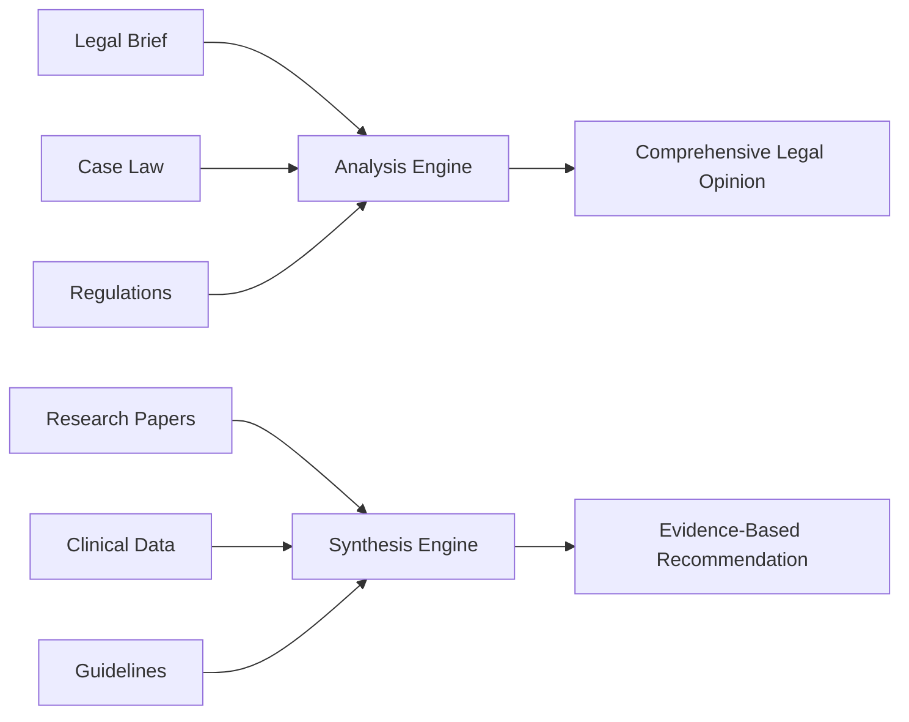
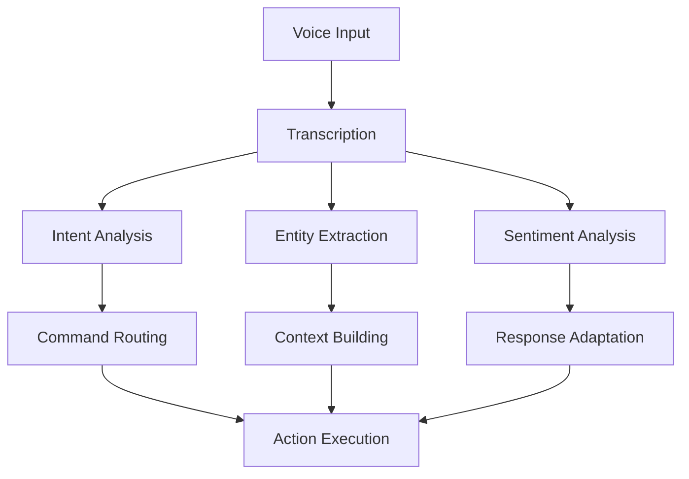
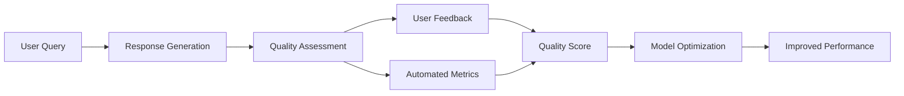
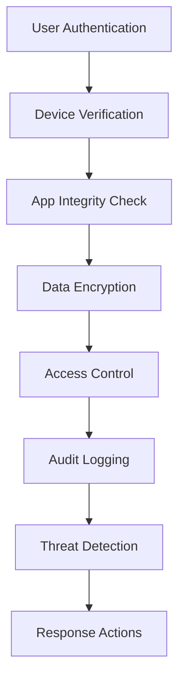
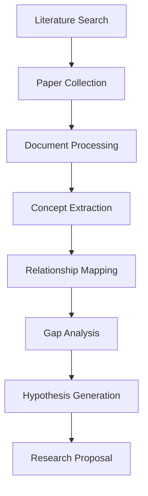
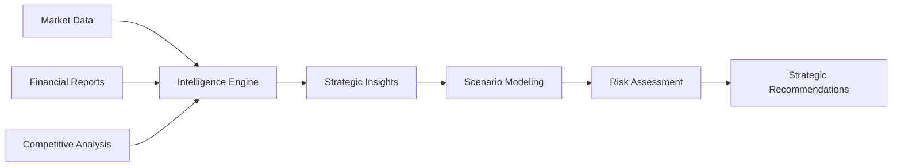
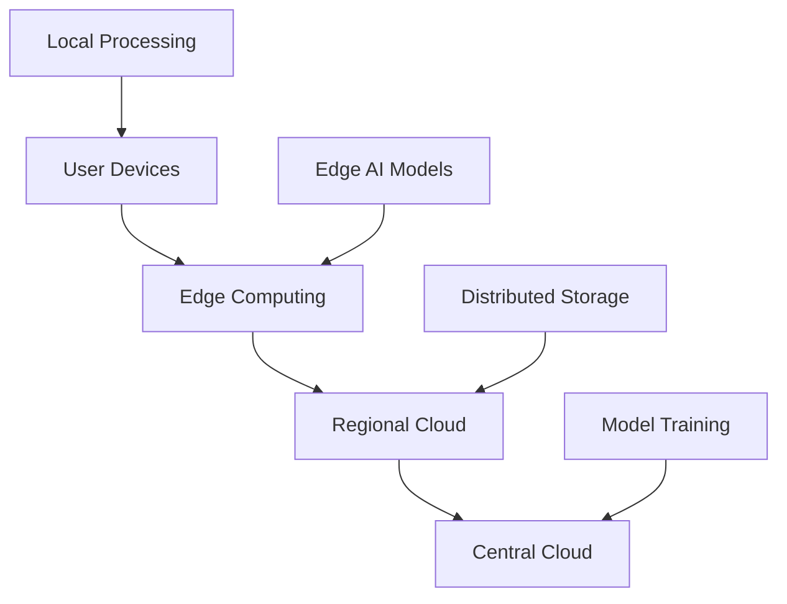

# Advanced Usage Guide

## 📋 Overview

This advanced guide unlocks the full potential of PocketPal SuperAI for power users, professionals, and organizations. Discover sophisticated workflows, automation techniques, optimization strategies, and enterprise-level features that transform PocketPal SuperAI into a productivity powerhouse.

**Target Audience**: Power users, professionals, developers, system administrators  
**Complexity Level**: Intermediate to Advanced  
**Feature Coverage**: 80+ advanced capabilities and workflows  

## 🎯 Advanced RAG Workflows

### Multi-Document Intelligence
#### Cross-Document Analysis
Create comprehensive analyses by combining information from multiple documents:



**Professional Use Cases**:
- **Legal Research**: Combine briefs, precedents, and regulations
- **Medical Analysis**: Synthesize studies, guidelines, and patient data
- **Financial Analysis**: Merge reports, regulations, and market data
- **Academic Research**: Cross-reference papers, data, and methodologies

#### Advanced Query Strategies
**Comparative Analysis Queries**:
```sql
-- Example query patterns for complex analysis
"Compare the methodologies in documents A, B, and C regarding [topic]"
"What are the contradictions between [document 1] and [document 2]?"
"Synthesize the recommendations from all uploaded policy documents"
"Create a timeline of events mentioned across all case studies"
```

**Contextual Reasoning**:
- **Temporal Analysis**: "What changed between the 2020 and 2023 versions?"
- **Causal Relationships**: "What factors led to the outcomes described?"
- **Gap Analysis**: "What information is missing from this analysis?"
- **Trend Identification**: "What patterns emerge across these documents?"

### Document Processing Optimization
#### Batch Processing Workflows
```bash
# Enterprise document processing strategy
1. Organize documents by category/project
2. Process in logical batches (by topic, date, importance)
3. Establish naming conventions for easy retrieval
4. Create folder structures that mirror your workflow
5. Set up automated processing rules
```

#### Custom OCR and Preprocessing
**Advanced OCR Settings**:
```json
{
  "ocr_config": {
    "language_detection": "auto",
    "confidence_threshold": 0.8,
    "preprocessing": {
      "deskew": true,
      "denoise": true,
      "contrast_enhancement": true,
      "resolution_upscaling": "2x"
    },
    "post_processing": {
      "spell_check": true,
      "grammar_correction": false,
      "text_cleanup": true
    }
  }
}
```

**Document Preprocessing Pipeline**:
1. **Quality Assessment**: Automatic quality scoring
2. **Enhancement**: Image processing for better OCR
3. **Segmentation**: Intelligent section detection
4. **Validation**: Content verification and error detection
5. **Enrichment**: Metadata extraction and tagging

### Vector Database Optimization
#### Advanced Indexing Strategies
**HNSW Parameter Tuning**:
```yaml
hnsw_config:
  m: 32                    # Higher for better accuracy
  ef_construction: 400     # Higher for better index quality
  ef_search: 100          # Adjust based on speed vs accuracy needs
  max_m: 32               # Maximum connections per layer
  max_m0: 64              # Maximum connections at layer 0
  
performance_tuning:
  parallel_indexing: true
  memory_prefetch: true
  index_compression: "pq8" # Product quantization
  cache_size: "1GB"
```

#### Custom Embedding Strategies
**Domain-Specific Embeddings**:
- **Legal**: Use legal-BERT or specialized legal embeddings
- **Medical**: BioBERT or clinical embeddings
- **Technical**: Code-specific embeddings for documentation
- **Multilingual**: Language-specific or multilingual models

**Embedding Ensemble Methods**:
```python
# Conceptual approach for multiple embedding models
embedding_strategy = {
    "primary": "bge-large-en-v1.5",     # General purpose
    "domain": "legal-bert-base",        # Domain specific
    "semantic": "all-MiniLM-L12-v2",   # Semantic similarity
    "keyword": "sparse-embedding",      # Keyword matching
    "combination": "weighted_average"   # Fusion strategy
}
```

## 🎤 Advanced Voice Capabilities

### Voice Command Automation
#### Custom Command Creation
**Complex Command Patterns**:
```yaml
custom_commands:
  "analyze document {document_name} for {criteria}":
    action: "rag_analyze"
    parameters:
      - document: "{document_name}"
      - analysis_type: "{criteria}"
    
  "compare {doc1} and {doc2} on {topic}":
    action: "comparative_analysis"
    parameters:
      - documents: ["{doc1}", "{doc2}"]
      - focus: "{topic}"
  
  "create summary of last {number} conversations":
    action: "conversation_summary"
    parameters:
      - count: "{number}"
      - format: "bullet_points"
```

#### Voice Workflow Integration
**Multi-Step Voice Workflows**:
1. **Document Processing**: "Upload and analyze the contract for risk factors"
2. **Research Assistance**: "Find similar cases and create comparison table"
3. **Report Generation**: "Compile findings into executive summary"
4. **Review Cycle**: "Schedule follow-up analysis for next week"

### Advanced Speech Processing
#### Real-Time Transcription Optimization
**Low-Latency Settings**:
```json
{
  "real_time_config": {
    "chunk_size": 1600,           // 100ms chunks at 16kHz
    "overlap": 400,               // 25ms overlap
    "vad_threshold": 0.5,         // Voice activity detection
    "silence_timeout": 2000,      // 2 seconds silence = end
    "partial_results": true,      // Show interim transcription
    "confidence_filtering": 0.7   // Filter low-confidence words
  }
}
```

#### Multi-Speaker Scenarios
**Meeting and Interview Processing**:
- **Speaker Diarization**: Identify different speakers
- **Turn-Taking Detection**: Identify conversation patterns
- **Summary Generation**: Create meeting notes automatically
- **Action Item Extraction**: Pull out tasks and follow-ups
- **Sentiment Analysis**: Track emotional tone throughout

### Voice-Driven Analytics
#### Conversation Intelligence
**Analytics Capabilities**:


**Metrics and Insights**:
- **Usage Patterns**: Most used commands and features
- **Performance Metrics**: Accuracy and response times
- **User Behavior**: Interaction patterns and preferences
- **Optimization Opportunities**: Areas for improvement

## 🤖 Model Management Mastery

### Advanced Model Configuration
#### Multi-Model Orchestration
**Model Routing Strategy**:
```yaml
model_routing:
  chat_simple:
    model: "phi-2-2.7b"
    max_tokens: 1024
    temperature: 0.7
    
  chat_complex:
    model: "llama-2-13b-chat"
    max_tokens: 4096
    temperature: 0.5
    
  code_generation:
    model: "codellama-7b-instruct"
    max_tokens: 2048
    temperature: 0.1
    
  summarization:
    model: "bart-large-cnn"
    max_tokens: 512
    temperature: 0.3
```

#### Dynamic Model Selection
**Intelligent Model Switching**:
```python
# Conceptual model selection logic
def select_model(query, context, user_preferences):
    factors = {
        "complexity": analyze_query_complexity(query),
        "domain": detect_domain(query, context),
        "response_time_requirement": get_urgency(context),
        "accuracy_requirement": get_precision_needs(query),
        "available_resources": check_system_resources()
    }
    
    return optimize_model_selection(factors, user_preferences)
```

### Performance Optimization
#### Model Quantization Strategies
**Precision vs Performance Trade-offs**:

| Quantization | Model Size | Speed | Accuracy | Memory | Use Case |
|-------------|------------|-------|----------|---------|----------|
| **FP16** | 50% | 1.5x | 99.9% | 50% | High-accuracy tasks |
| **INT8** | 25% | 2-3x | 99% | 25% | Balanced performance |
| **INT4** | 12.5% | 4-5x | 95-98% | 12.5% | Fast inference |
| **Dynamic** | Variable | Variable | Variable | Variable | Adaptive quality |

#### Memory Management
**Advanced Memory Strategies**:
```json
{
  "memory_optimization": {
    "model_sharding": true,
    "gradient_checkpointing": true,
    "attention_optimization": "flash_attention",
    "kv_cache_quantization": "int8",
    "layer_offloading": "auto"
  },
  "resource_allocation": {
    "model_memory": "70%",
    "context_memory": "20%",
    "system_memory": "10%"
  }
}
```

### Custom Model Integration
#### GGUF Model Installation
**Adding Custom Models**:
```bash
# Advanced model installation workflow
1. Download GGUF format model
2. Verify model compatibility and safety
3. Configure model metadata and parameters
4. Test model performance and accuracy
5. Integrate into model selection system
```

**Model Metadata Configuration**:
```yaml
custom_model:
  name: "custom-domain-model"
  format: "gguf"
  size: "7B"
  quantization: "Q4_K_M"
  
  capabilities:
    - "chat"
    - "domain_specific"
    - "reasoning"
  
  performance:
    inference_speed: "fast"
    memory_usage: "medium"
    accuracy: "high"
  
  usage_guidelines:
    recommended_for: ["technical_documentation", "code_analysis"]
    temperature_range: [0.1, 0.8]
    max_context: 4096
```

## 🔗 Integration and Automation

### API and Scripting
#### Advanced Integration Patterns
**Workflow Automation**:
```javascript
// Example workflow automation
const workflows = {
  document_processing: {
    trigger: "file_upload",
    steps: [
      "extract_text",
      "generate_embeddings", 
      "index_document",
      "create_summary",
      "notify_completion"
    ]
  },
  
  research_assistant: {
    trigger: "research_query",
    steps: [
      "search_documents",
      "rank_relevance",
      "synthesize_information",
      "generate_report",
      "suggest_follow_ups"
    ]
  }
};
```

#### External System Integration
**Enterprise Integrations**:
```yaml
integrations:
  document_management:
    - "SharePoint Online"
    - "Google Workspace"
    - "Box"
    - "Dropbox Business"
  
  communication:
    - "Microsoft Teams"
    - "Slack"
    - "Discord"
    - "Zoom"
  
  productivity:
    - "Notion"
    - "Obsidian"
    - "Roam Research"
    - "Logseq"
  
  development:
    - "GitHub"
    - "GitLab"
    - "Jira"
    - "Confluence"
```

### Batch Operations and Automation
#### Scheduled Processing
**Automated Workflows**:
```cron
# Example automation schedule
0 2 * * * process_daily_documents
0 6 * * 1 generate_weekly_summary
0 8 1 * * create_monthly_report
*/30 * * * * update_model_cache
```

**Batch Processing Scenarios**:
1. **Daily Document Ingestion**: Process overnight document uploads
2. **Weekly Knowledge Synthesis**: Create summary reports
3. **Monthly Analytics**: Generate usage and performance reports
4. **Automated Backup**: Regular data backup and verification
5. **Model Updates**: Scheduled model updates and optimization

### Enterprise Deployment
#### Multi-User Management
**Organization Structure**:
```yaml
organization:
  departments:
    legal:
      users: ["lawyer1", "paralegal1", "clerk1"]
      models: ["legal-bert", "contract-analyzer"]
      documents: "legal_docs_folder"
      
    research:
      users: ["researcher1", "analyst1", "intern1"]
      models: ["academic-model", "data-analyzer"] 
      documents: "research_papers"
      
    executive:
      users: ["ceo", "cfo", "operations"]
      models: ["summary-model", "insight-generator"]
      documents: "executive_reports"
```

**Access Control and Permissions**:
- **Role-Based Access**: Define user roles and capabilities
- **Document Segmentation**: Separate access to sensitive documents
- **Audit Trails**: Track all user actions and data access
- **Compliance Controls**: Meet regulatory requirements
- **Data Loss Prevention**: Prevent unauthorized data export

## 📊 Analytics and Monitoring

### Performance Analytics
#### Usage Metrics Dashboard
**Key Performance Indicators**:
```json
{
  "usage_metrics": {
    "daily_active_users": 245,
    "documents_processed": 1547,
    "queries_executed": 8934,
    "average_response_time": "1.2s",
    "accuracy_score": "94.3%"
  },
  "resource_utilization": {
    "cpu_usage": "45%",
    "memory_usage": "2.1GB",
    "storage_usage": "45GB",
    "network_bandwidth": "12MB/day"
  },
  "feature_adoption": {
    "voice_usage": "78%",
    "rag_queries": "92%", 
    "model_switching": "34%",
    "automation": "23%"
  }
}
```

#### Quality Monitoring
**Response Quality Tracking**:


**Quality Metrics**:
- **Relevance Score**: How well responses match queries
- **Accuracy Rate**: Factual correctness of information
- **Completeness**: Coverage of query requirements
- **User Satisfaction**: Direct user feedback ratings
- **Response Consistency**: Consistency across similar queries

### Optimization Insights
#### Performance Bottleneck Analysis
**Common Bottlenecks and Solutions**:
```yaml
bottleneck_analysis:
  model_loading:
    symptoms: ["Slow initial response", "High memory usage"]
    solutions: ["Model caching", "Smaller models", "Model sharding"]
    
  vector_search:
    symptoms: ["Slow document search", "High CPU usage"]
    solutions: ["Index optimization", "Better hardware", "Query optimization"]
    
  document_processing:
    symptoms: ["Upload timeouts", "Processing failures"]
    solutions: ["Batch processing", "OCR optimization", "File preprocessing"]
```

#### Capacity Planning
**Resource Planning Guidelines**:
```yaml
capacity_planning:
  users_1_50:
    cpu: "4-8 cores"
    memory: "16-32GB"
    storage: "500GB SSD"
    
  users_51_200:
    cpu: "8-16 cores"  
    memory: "32-64GB"
    storage: "1-2TB SSD"
    
  users_201_1000:
    cpu: "16-32 cores"
    memory: "64-128GB"
    storage: "2-5TB NVMe"
    
  enterprise:
    deployment: "Distributed architecture"
    redundancy: "High availability setup"
    scaling: "Auto-scaling capabilities"
```

## 🛡️ Advanced Security and Privacy

### Enterprise Security
#### Zero-Trust Architecture
**Security Layers**:


**Implementation Components**:
- **Multi-Factor Authentication**: Biometric + PIN/Password
- **Device Attestation**: Verify device integrity
- **Certificate Pinning**: Prevent man-in-the-middle attacks
- **Runtime Protection**: Detect and prevent tampering
- **Network Security**: VPN requirements, secure channels

#### Data Governance
**Advanced Privacy Controls**:
```yaml
data_governance:
  classification:
    public: "No restrictions"
    internal: "Organization only"
    confidential: "Need-to-know basis"
    restricted: "Highest security level"
    
  retention_policies:
    conversations: "90 days"
    documents: "7 years"
    logs: "30 days"
    analytics: "1 year"
    
  encryption:
    at_rest: "AES-256-GCM"
    in_transit: "TLS 1.3"
    in_memory: "Protected memory allocation"
    keys: "Hardware security module"
```

### Compliance and Auditing
#### Regulatory Compliance
**Compliance Frameworks**:
- **GDPR**: European data protection regulations
- **HIPAA**: Healthcare information privacy
- **SOX**: Financial data integrity requirements
- **ISO 27001**: Information security management
- **NIST**: Cybersecurity framework

**Audit Trail Features**:
```json
{
  "audit_events": {
    "user_actions": ["login", "document_access", "query_execution"],
    "system_events": ["model_loading", "data_processing", "backup_creation"],
    "security_events": ["failed_login", "permission_denied", "anomaly_detected"]
  },
  "audit_retention": "7_years",
  "audit_format": "JSON_structured",
  "audit_encryption": "AES_256"
}
```

## 🚀 Productivity Workflows

### Research and Analysis Workflows
#### Academic Research Pipeline
**Research Methodology**:


**Implementation Steps**:
1. **Literature Collection**: Systematic paper gathering
2. **Automated Processing**: Extract key concepts and findings
3. **Cross-Reference Analysis**: Find connections between papers
4. **Knowledge Mapping**: Visualize research landscape
5. **Gap Identification**: Find unexplored areas
6. **Synthesis**: Generate new insights and hypotheses

#### Legal Research Workflow
**Legal Analysis Process**:
```yaml
legal_workflow:
  case_research:
    - "Identify relevant jurisdiction"
    - "Search case law database"
    - "Extract key precedents"
    - "Analyze judicial reasoning"
    - "Identify distinguishing factors"
    
  regulatory_analysis:
    - "Map regulatory framework"
    - "Track regulatory changes"
    - "Assess compliance requirements"
    - "Identify compliance gaps"
    - "Create compliance recommendations"
```

### Business Intelligence Workflows
#### Strategic Planning Support
**Executive Decision Support**:


**Business Analysis Features**:
- **Market Intelligence**: Analyze market trends and opportunities
- **Competitive Analysis**: Compare against competitors
- **Financial Modeling**: Support financial planning and analysis
- **Risk Assessment**: Identify and quantify business risks
- **Performance Analytics**: Track KPIs and business metrics

### Content Creation and Management
#### Automated Content Generation
**Content Pipeline**:
```yaml
content_workflow:
  research_phase:
    - "Topic analysis and scope definition"
    - "Source material gathering"
    - "Key point extraction"
    - "Fact verification and validation"
    
  creation_phase:
    - "Outline generation"
    - "Content drafting"
    - "Style and tone optimization"
    - "Citation and reference management"
    
  review_phase:
    - "Quality assessment"
    - "Accuracy verification"
    - "Consistency checking"
    - "Final editing and polish"
```

## 🔧 Customization and Extensibility

### Custom Prompt Engineering
#### Advanced Prompt Strategies
**Prompt Templates**:
```yaml
prompt_templates:
  analytical_thinking:
    system: "You are an expert analyst. Think step by step."
    structure: |
      1. First, identify the key components of {topic}
      2. Analyze the relationships between these components
      3. Consider alternative perspectives
      4. Draw evidence-based conclusions
      5. Suggest actionable recommendations
  
  creative_writing:
    system: "You are a creative writing assistant."
    structure: |
      Using the following elements: {elements}
      Create a {format} that incorporates:
      - Rich descriptive language
      - Engaging narrative structure
      - Appropriate tone for {audience}
```

#### Dynamic Prompt Adaptation
**Context-Aware Prompting**:
```python
# Conceptual prompt adaptation system
def adapt_prompt(base_prompt, context, user_preferences):
    adaptations = {
        "technical_level": adjust_complexity(context.domain),
        "response_length": optimize_length(user_preferences.verbosity),
        "communication_style": match_style(user_preferences.tone),
        "domain_expertise": inject_domain_knowledge(context.field)
    }
    
    return enhance_prompt(base_prompt, adaptations)
```

### Plugin and Extension System
#### Custom Plugin Development
**Plugin Architecture**:
```yaml
plugin_system:
  types:
    - "Document processors"
    - "Model integrations"
    - "Workflow automations"
    - "UI extensions"
    - "Analytics enhancers"
  
  capabilities:
    - "Custom document formats"
    - "External API integrations"
    - "Specialized AI models"
    - "Custom visualization tools"
    - "Advanced analytics dashboards"
```

#### Integration APIs
**API Endpoints for Customization**:
```javascript
// Example plugin API structure
const PluginAPI = {
  documents: {
    process: (file, options) => {},
    search: (query, filters) => {},
    analyze: (docId, analysisType) => {}
  },
  
  models: {
    load: (modelName, config) => {},
    query: (prompt, parameters) => {},
    manage: (action, modelId) => {}
  },
  
  automation: {
    createWorkflow: (definition) => {},
    executeWorkflow: (workflowId, inputs) => {},
    scheduleTask: (task, schedule) => {}
  }
};
```

## 📈 Scaling and Growth

### Performance Scaling
#### Horizontal Scaling Strategies
**Distributed Architecture**:
```yaml
scaling_architecture:
  load_balancing:
    - "Request distribution across instances"
    - "Model serving load balancing"
    - "Database query distribution"
    
  data_partitioning:
    - "User-based data sharding"
    - "Document collection partitioning"
    - "Model distribution strategies"
    
  caching_layers:
    - "Response caching"
    - "Model output caching"
    - "Document search caching"
```

#### Cloud and Edge Deployment
**Deployment Options**:


### Future-Proofing
#### Technology Evolution Readiness
**Adaptation Strategies**:
- **Model Updates**: Seamless integration of new AI models
- **Feature Evolution**: Gradual feature rollout and testing
- **Platform Support**: Support for emerging platforms
- **API Versioning**: Backward-compatible API evolution
- **Data Migration**: Smooth transitions between system versions

#### Community and Ecosystem
**Ecosystem Development**:
```yaml
community_ecosystem:
  developer_community:
    - "Open-source contributions"
    - "Plugin marketplace"
    - "Developer documentation"
    - "Community forums"
    
  academic_partnerships:
    - "Research collaborations"
    - "Dataset contributions"
    - "Model development"
    - "Benchmarking initiatives"
    
  enterprise_partnerships:
    - "Integration partnerships"
    - "Deployment consulting"
    - "Custom development"
    - "Training and certification"
```

## ✅ Advanced Usage Checklist

### Mastery Milestones
#### Beginner to Intermediate
- [ ] Master basic RAG document processing
- [ ] Configure voice commands effectively
- [ ] Optimize performance settings for device
- [ ] Create custom prompt templates
- [ ] Set up automated workflows

#### Intermediate to Advanced
- [ ] Implement multi-model strategies
- [ ] Design complex analytical workflows
- [ ] Configure enterprise security features
- [ ] Develop custom integrations
- [ ] Optimize vector database performance

#### Advanced to Expert
- [ ] Deploy enterprise-scale solutions
- [ ] Contribute to plugin ecosystem
- [ ] Mentor other users and teams
- [ ] Participate in product development
- [ ] Lead organizational AI adoption

### Continuous Learning
#### Stay Updated
- **Release Notes**: Review new features and improvements
- **Community Forums**: Engage with other advanced users
- **Webinars**: Attend product and feature demonstrations
- **Documentation**: Regularly review updated documentation
- **Beta Programs**: Participate in beta testing programs

#### Knowledge Sharing
- **Case Studies**: Document successful implementations
- **Best Practices**: Share optimization strategies
- **Tutorials**: Create content for other users
- **Mentoring**: Help newcomers learn advanced features
- **Feedback**: Provide product improvement suggestions

---

**Advanced Usage Guide Version**: 1.0  
**Last Updated**: June 23, 2025  
**Advanced Features Covered**: 80+ sophisticated capabilities  
**Mastery Timeline**: 3-6 months for full advanced proficiency