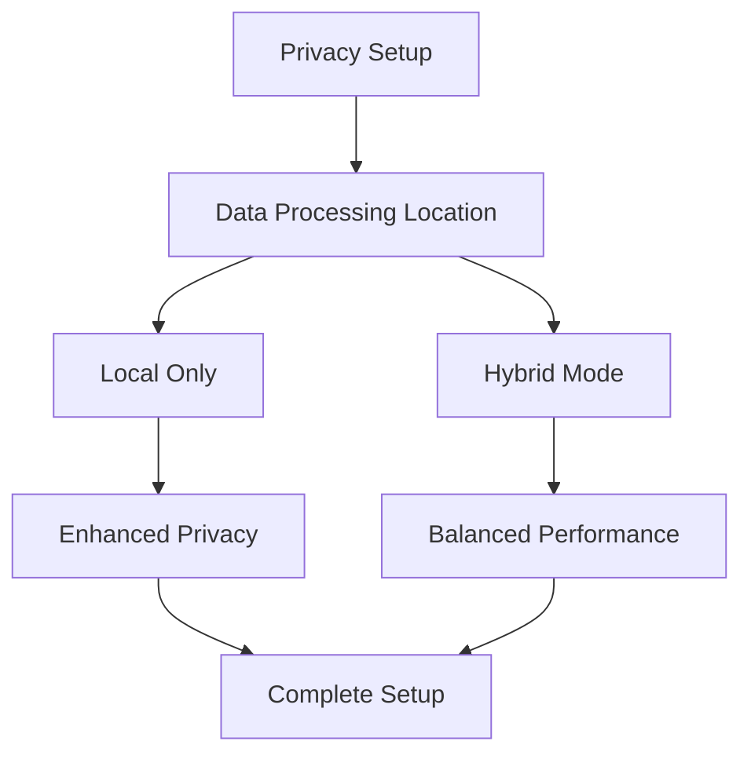

# Configuration Guide

## 📋 Overview

This comprehensive guide covers all configuration options, settings, and customization features in PocketPal SuperAI. Learn how to optimize the app for your specific needs, privacy preferences, and performance requirements.

**Setup Time**: 5-15 minutes for basic configuration  
**Skill Level**: Suitable for all users, advanced options clearly marked  
**Configuration Scope**: Privacy, performance, personalization, accessibility  

## 🎯 Initial Setup

### First Launch Configuration
When you first open PocketPal SuperAI, you'll be guided through essential setup steps:

#### 1. Privacy Configuration


**Privacy Options:**
- **Local Only**: All processing on device (recommended)
- **Hybrid Mode**: Local with optional cloud assistance
- **Custom**: Advanced privacy configuration

#### 2. Performance Profile Selection
Choose your performance profile based on device and usage:

| Profile | Memory Usage | Speed | Battery Impact | Best For |
|---------|-------------|-------|----------------|----------|
| **Battery Saver** | Low | Slower | Minimal | Older devices, long sessions |
| **Balanced** | Medium | Standard | Moderate | Most users |
| **Performance** | High | Fast | Higher | Power users, newer devices |
| **Custom** | Variable | Variable | Variable | Advanced users |

#### 3. Language and Region
- **Interface Language**: App UI language
- **Model Language**: Default AI model language
- **Region Settings**: Date, time, number formats
- **Voice Locale**: Speech recognition locale

### Quick Setup Wizard
For fastest setup, use the Quick Setup option:
1. **Essential Privacy**: Local-only processing
2. **Auto Performance**: Device-optimized settings
3. **Smart Defaults**: Recommended settings for your device
4. **Skip Advanced**: Access advanced settings later

## ⚙️ General Settings

### App Preferences
Access via **Settings > General**

#### Interface Settings
```json
{
  "theme": "auto", // auto | light | dark
  "accentColor": "blue", // blue | green | purple | red | orange
  "fontSize": "medium", // small | medium | large | extra-large
  "animations": true,
  "hapticFeedback": true,
  "soundEffects": false
}
```

**Theme Options:**
- **Auto**: Follow system theme
- **Light**: Always use light theme
- **Dark**: Always use dark theme
- **Custom**: Create custom color schemes

#### Language and Localization
- **Display Language**: App interface language
- **Input Language**: Default text input language
- **Voice Language**: Speech recognition language
- **Model Language**: AI response language
- **Date Format**: Regional date formatting
- **Number Format**: Decimal and thousand separators

#### Accessibility Settings
- **Text Size**: Adjust font size (80% to 200%)
- **High Contrast**: Enhanced visual contrast
- **Reduce Motion**: Minimize animations
- **Voice Control**: Enhanced voice navigation
- **Screen Reader**: VoiceOver/TalkBack optimization
- **Large Touch Targets**: Bigger buttons and controls

### Storage and Data Management
#### Storage Configuration
- **Storage Location**: Internal storage path
- **Maximum Storage**: Total storage limit (1GB - 100GB)
- **Auto Cleanup**: Automatic cleanup settings
- **Compression**: Enable data compression
- **Backup Location**: Local backup directory

#### Data Retention Settings
```yaml
documents:
  retention_days: 365  # Keep documents for 1 year
  auto_delete: false   # Manual deletion only
  
conversations:
  retention_days: 90   # Keep chats for 3 months
  export_before_delete: true
  
models:
  cache_duration: 30   # Cache models for 30 days
  auto_update: true
  
logs:
  retention_days: 7    # Keep logs for 1 week
  level: "info"        # info | debug | error
```

## 🔒 Privacy and Security Settings

### Privacy Configuration
Access via **Settings > Privacy & Security**

#### Data Processing Options
- **Processing Mode**: Local Only | Hybrid | Cloud-Assisted
- **Encryption Level**: Standard | Enhanced | Maximum
- **Anonymization**: Remove personal identifiers
- **Data Isolation**: Separate user profiles
- **Audit Logging**: Track data access (local only)

#### App Security
```json
{
  "appLock": {
    "enabled": true,
    "method": "biometric", // biometric | passcode | pattern
    "timeout": 300,        // seconds of inactivity
    "immediateOnBackground": true
  },
  "documentEncryption": {
    "enabled": true,
    "algorithm": "AES-256",
    "keyDerivation": "PBKDF2"
  },
  "secureMemory": {
    "enabled": true,
    "clearOnSuspend": true
  }
}
```

#### Network Security
- **TLS Version**: Minimum TLS 1.3
- **Certificate Pinning**: Verify server certificates
- **Proxy Settings**: Corporate proxy configuration
- **VPN Detection**: Require VPN for cloud features
- **Offline Mode**: Disable all network access

### Backup and Sync
#### Local Backup
- **Backup Frequency**: Daily | Weekly | Manual
- **Backup Location**: Local directory selection
- **Encryption**: Backup encryption settings
- **Compression**: Reduce backup size
- **Verification**: Backup integrity checking

#### Cloud Backup (Optional)
- **Provider**: iCloud | Google Drive | Custom
- **Encryption**: End-to-end encryption
- **Sync Frequency**: Real-time | Hourly | Daily
- **Selective Sync**: Choose what to sync
- **Conflict Resolution**: Sync conflict handling

## 🤖 AI Model Configuration

### Model Management
Access via **Settings > AI Models**

#### Default Models
Configure default models for different tasks:

```yaml
chat_models:
  primary: "llama-2-7b-chat"
  fallback: "phi-2-2.7b"
  
embedding_models:
  documents: "bge-small-en-v1.5"
  queries: "all-MiniLM-L6-v2"
  
specialized_models:
  code: "codellama-7b-instruct"
  summarization: "bart-large-cnn"
  translation: "marian-mt"
```

#### Model Performance Settings
- **Memory Limit**: Maximum memory per model
- **CPU Threads**: Number of processing threads
- **GPU Acceleration**: Enable hardware acceleration
- **Quantization**: 4-bit | 8-bit | 16-bit precision
- **Context Length**: Maximum input context size

#### Model Download and Updates
- **Auto Download**: Download recommended models
- **Update Frequency**: Check for updates
- **Download Over Cellular**: Allow cellular downloads
- **Storage Location**: Model storage directory
- **Parallel Downloads**: Concurrent download limit

### Response Generation Settings
#### Quality vs Speed Trade-offs
```json
{
  "responseQuality": {
    "temperature": 0.7,     // 0.0 = deterministic, 1.0 = creative
    "topP": 0.9,           // nucleus sampling
    "repetitionPenalty": 1.1,
    "maxTokens": 2048
  },
  "performance": {
    "batchSize": 8,
    "cacheEnabled": true,
    "streamingResponse": true,
    "earlyTermination": true
  }
}
```

#### Context and Memory
- **Context Window**: Maximum conversation context
- **Memory Persistence**: How long to remember context
- **Cross-Chat Memory**: Share context between chats
- **Document Context**: Include document context automatically
- **Context Compression**: Compress long contexts

## 🎤 Voice Configuration

### Voice Input Settings
Access via **Settings > Voice**

#### Speech Recognition
```yaml
recognition:
  provider: "local"        # local | cloud | hybrid
  language: "en-US"
  continuous_mode: true
  noise_cancellation: true
  echo_cancellation: true
  automatic_gain_control: true
  
recording:
  quality: "high"          # low | medium | high
  format: "wav"           # wav | mp3 | flac
  sample_rate: 16000      # Hz
  channels: 1             # mono
  bit_depth: 16
```

#### Voice Commands
- **Activation**: "Hey PocketPal" | Button | Always listening
- **Command Timeout**: How long to wait for commands
- **Confirmation**: Require confirmation for actions
- **Custom Commands**: Create personal voice shortcuts
- **Sensitivity**: Voice activation sensitivity

#### Voice Output (Text-to-Speech)
- **Voice Selection**: Choose voice persona
- **Speaking Rate**: Adjust speech speed (0.5x to 2.0x)
- **Pitch**: Voice pitch adjustment
- **Volume**: TTS volume level
- **Pronunciation**: Custom pronunciation dictionary

### Audio Settings
#### Input Configuration
- **Microphone Source**: Built-in | External | Bluetooth
- **Input Gain**: Microphone sensitivity
- **Background Noise**: Noise suppression level
- **Wind Noise**: Wind noise reduction
- **Echo Cancellation**: Remove echo feedback

#### Output Configuration
- **Audio Output**: Speaker | Headphones | Bluetooth
- **Volume Leveling**: Normalize audio levels
- **Audio Effects**: Equalizer settings
- **Spatial Audio**: 3D audio positioning
- **Audio Ducking**: Lower music during speech

## 📄 RAG (Document Processing) Configuration

### Document Processing
Access via **Settings > Documents**

#### Upload Settings
```json
{
  "autoProcess": true,
  "supportedFormats": [
    "pdf", "txt", "md", "docx", "rtf"
  ],
  "maxFileSize": "100MB",
  "batchUpload": true,
  "ocrEnabled": true,
  "metadataExtraction": true
}
```

#### Processing Options
- **OCR Quality**: Fast | Balanced | Accurate
- **Language Detection**: Auto-detect document language
- **Chunking Strategy**: Fixed | Semantic | Paragraph
- **Chunk Size**: 500-2000 characters
- **Overlap**: Percentage overlap between chunks

#### Search Configuration
- **Search Algorithm**: Vector | Hybrid | Keyword
- **Similarity Threshold**: Minimum relevance score
- **Max Results**: Maximum search results returned
- **Reranking**: Post-process search results
- **Cache Duration**: How long to cache search results

### Vector Database Settings
#### Indexing Configuration
```yaml
vector_db:
  index_type: "HNSW"       # HNSW | LSH | IVF
  dimensions: 384          # Embedding dimensions
  distance_metric: "cosine" # cosine | euclidean | dot_product
  
hnsw_params:
  m: 16                    # Max connections per element
  ef_construction: 200     # Size of dynamic candidate list
  ef_search: 50           # Size of search candidate list
  
performance:
  build_threads: 4
  search_threads: 2
  memory_mapping: true
  compression: "none"      # none | pq | sq
```

#### Storage Optimization
- **Compression**: Reduce storage size
- **Deduplication**: Remove duplicate content
- **Indexing Strategy**: Real-time | Batch
- **Memory Usage**: RAM vs disk trade-off
- **Backup Frequency**: Vector DB backup schedule

## 🚀 Performance Configuration

### System Performance
Access via **Settings > Performance**

#### Memory Management
```json
{
  "memoryLimits": {
    "totalAppMemory": "2GB",
    "modelMemory": "1GB",
    "documentCache": "256MB",
    "vectorCache": "128MB"
  },
  "optimization": {
    "aggressiveCleanup": false,
    "memoryMapping": true,
    "swapToDisk": true,
    "compressionLevel": 3
  }
}
```

#### CPU and Processing
- **Thread Pool Size**: Number of processing threads
- **Priority Mode**: Background | Normal | High
- **CPU Affinity**: Pin threads to specific cores
- **SIMD Instructions**: Enable vectorized operations
- **Batch Processing**: Process multiple items together

#### GPU Acceleration
- **Metal (iOS)**: Enable Metal Performance Shaders
- **OpenCL (Android)**: GPU compute acceleration
- **Vulkan**: Next-gen graphics API
- **Neural Engine**: Use dedicated ML hardware
- **Fallback Mode**: CPU fallback when GPU unavailable

### Network and Connectivity
#### Network Settings
- **Connection Timeout**: Network request timeout
- **Retry Logic**: Automatic retry configuration
- **Bandwidth Limiting**: Limit network usage
- **Offline Mode**: Disable network entirely
- **Proxy Configuration**: Corporate proxy settings

#### Sync and Updates
- **Auto Update**: Automatic app updates
- **Model Updates**: Automatic model updates
- **Sync Frequency**: Data synchronization frequency
- **Background Sync**: Sync when app not active
- **Cellular Usage**: Allow cellular data usage

## 🔧 Advanced Configuration

### Developer Settings
Access via **Settings > Advanced > Developer** (requires enabling)

#### Debug Options
```yaml
debugging:
  logging_level: "info"    # debug | info | warn | error
  performance_metrics: true
  memory_profiling: false
  network_logging: false
  crash_reporting: true
  
diagnostics:
  enable_profiler: false
  trace_execution: false
  benchmark_mode: false
  stress_testing: false
```

#### Experimental Features
- **Beta Models**: Access experimental AI models
- **New Algorithms**: Try cutting-edge algorithms
- **Performance Tweaks**: Experimental optimizations
- **UI Experiments**: New interface elements
- **API Access**: Developer API features

#### Custom Configuration
- **Config Files**: Import/export configuration files
- **Environment Variables**: Set custom environment variables
- **Feature Flags**: Enable/disable specific features
- **Custom Prompts**: Advanced prompt engineering
- **Plugin System**: Third-party plugin support

### Enterprise Settings
#### Organization Management
- **Team Settings**: Multi-user configuration
- **Permissions**: User role and permission management
- **Compliance**: Regulatory compliance settings
- **Audit Trails**: Detailed activity logging
- **Policy Enforcement**: Enforce organizational policies

#### Deployment Configuration
- **Custom Branding**: White-label configuration
- **Feature Restrictions**: Disable specific features
- **Data Governance**: Data handling policies
- **Integration APIs**: Enterprise system integration
- **Support Integration**: Help desk integration

## 📱 Platform-Specific Settings

### iOS Configuration
#### iOS-Specific Features
- **Shortcuts Integration**: Siri Shortcuts configuration
- **Widget Settings**: Home screen widget options
- **Handoff**: Continuity between devices
- **Spotlight Search**: Index app content in Spotlight
- **Focus Modes**: Integrate with Focus modes

#### iOS Privacy Settings
- **App Tracking**: Disable cross-app tracking
- **Location Services**: Fine-grained location control
- **Photo Access**: Limit photo library access
- **Microphone Access**: Control microphone permissions
- **Document Access**: File system access permissions

### Android Configuration
#### Android-Specific Features
- **Adaptive Brightness**: Auto-adjust for reading
- **Digital Wellbeing**: Screen time integration
- **Work Profile**: Separate work and personal data
- **Gesture Navigation**: Custom gesture controls
- **Quick Settings**: Add app tiles to quick settings

#### Android Privacy Settings
- **Permission Manager**: Granular permission control
- **Background App Limits**: Restrict background activity
- **Data Saver**: Reduce data usage
- **Battery Optimization**: Exclude from battery optimization
- **Auto-backup**: Android backup integration

## 🔄 Import/Export Configuration

### Configuration Backup
#### Export Settings
```bash
# Export all settings
Settings > Advanced > Export Configuration
# Choose export format:
# - JSON (human-readable)
# - Binary (compact)
# - Encrypted (password-protected)
```

#### Import Settings
```bash
# Import configuration
Settings > Advanced > Import Configuration
# Options:
# - Merge with existing settings
# - Replace all settings
# - Selective import
```

#### Configuration Profiles
- **Profile Management**: Save multiple configuration profiles
- **Quick Switch**: Switch between profiles
- **Profile Sharing**: Share configurations with team
- **Profile Templates**: Pre-configured profiles for common use cases
- **Version Control**: Track configuration changes

### Migration and Sync
#### Device Migration
- **Full Migration**: Transfer all data and settings
- **Selective Migration**: Choose what to transfer
- **Cross-Platform**: Migrate between iOS and Android
- **Backup Verification**: Verify migration success
- **Rollback Options**: Revert to previous configuration

#### Cloud Sync
- **Settings Sync**: Synchronize settings across devices
- **Conflict Resolution**: Handle sync conflicts
- **Merge Strategies**: How to merge conflicting settings
- **Sync History**: Track synchronization history
- **Selective Sync**: Choose which settings to sync

## ✅ Configuration Checklist

### Initial Setup
- [ ] Complete privacy configuration
- [ ] Select performance profile
- [ ] Configure language and region settings
- [ ] Set up voice preferences
- [ ] Configure document processing
- [ ] Enable security features

### Regular Maintenance
- [ ] Review and update privacy settings
- [ ] Check performance optimization
- [ ] Update model configurations
- [ ] Backup configuration settings
- [ ] Review storage usage
- [ ] Update accessibility settings as needed

### Advanced Configuration
- [ ] Set up custom model parameters
- [ ] Configure enterprise features (if applicable)
- [ ] Enable developer options (if needed)
- [ ] Set up automation rules
- [ ] Configure integration settings
- [ ] Test backup and restore procedures

## 🚨 Configuration Troubleshooting

### Common Issues
#### Performance Problems
```yaml
# Check these settings if app is slow:
performance:
  memory_limit: "increase if available"
  gpu_acceleration: "ensure enabled"
  background_processing: "optimize settings"
  cache_size: "increase if storage available"
```

#### Voice Recognition Issues
```yaml
# Voice not working? Check:
voice:
  microphone_permissions: "granted"
  noise_cancellation: "enabled"
  language_settings: "correct locale"
  background_noise: "minimize environment noise"
```

#### Document Processing Failures
```yaml
# Documents not processing? Verify:
documents:
  file_format: "supported format"
  file_size: "within limits"
  storage_space: "sufficient available"
  ocr_settings: "appropriate for document type"
```

### Reset Options
#### Partial Resets
- **Reset to Defaults**: Restore default settings
- **Clear Cache**: Remove temporary data
- **Reset Models**: Reload AI models
- **Clear Documents**: Remove all documents
- **Reset Conversations**: Clear chat history

#### Complete Reset
- **Factory Reset**: Return to initial state
- **Secure Wipe**: Securely delete all data
- **Backup Before Reset**: Save current configuration
- **Selective Restore**: Restore only specific data
- **Migration Assistance**: Help with post-reset setup

---

**Configuration Guide Version**: 1.0  
**Last Updated**: June 23, 2025  
**Configuration Options**: 200+ customizable settings  
**Setup Complexity**: Basic (5 min) to Advanced (30+ min)