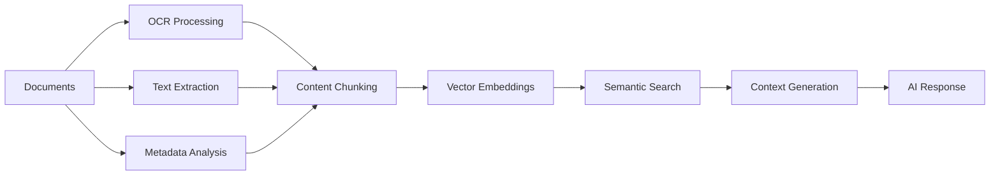
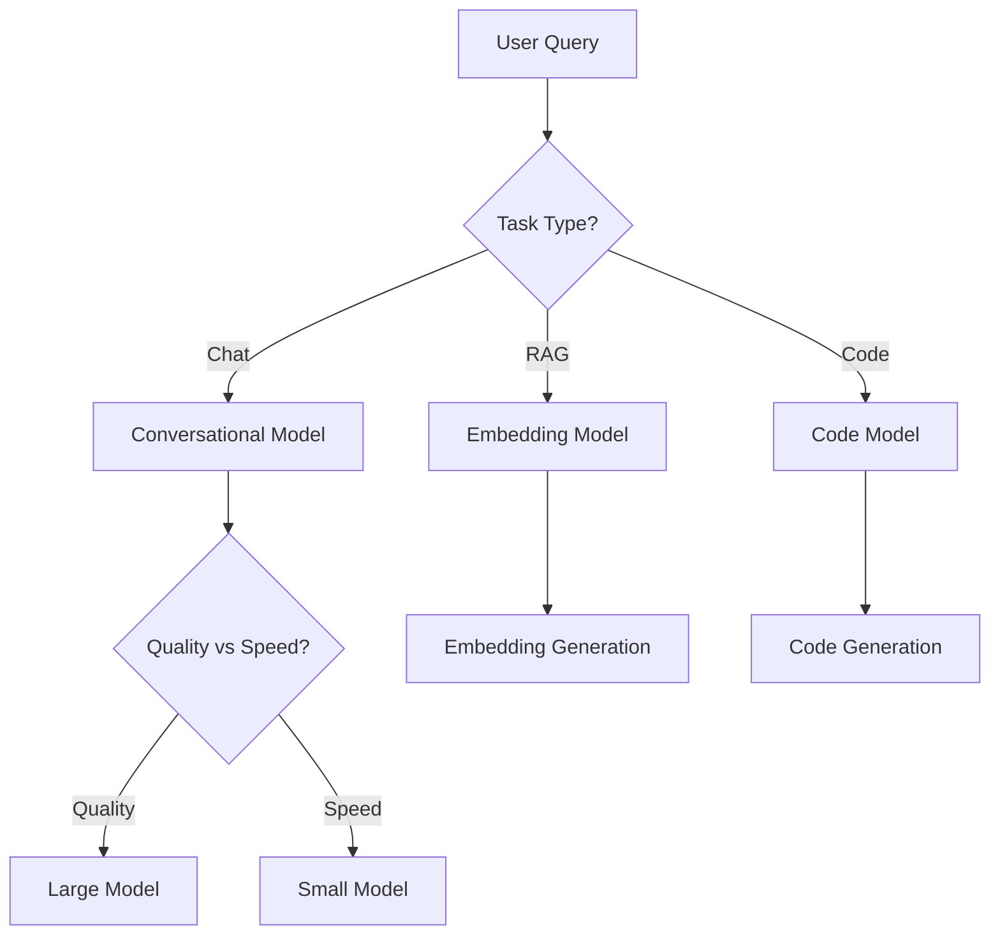

# Feature Overview Guide

## 📋 Overview

Welcome to PocketPal SuperAI - the ultimate privacy-focused AI assistant that combines cutting-edge technologies for an unparalleled user experience. This comprehensive guide covers all features, capabilities, and innovations that make PocketPal SuperAI the most advanced local AI assistant available.

**Core Philosophy**: Privacy-first, local processing, enterprise-grade performance  
**Target Users**: Power users, professionals, privacy-conscious individuals  
**Platform Support**: iOS 12.4+, Android 8.0+ (API 26+)  

## 🎯 Key Features Overview

### Revolutionary Capabilities
- **🧠 Advanced RAG System**: Document processing with semantic search and context-aware responses
- **🎤 Voice Processing**: Real-time speech-to-text, voice commands, and natural conversation
- **📱 Local AI Models**: Complete offline functionality with on-device model execution
- **🔒 Privacy-First Design**: Zero data collection, local processing, encrypted storage
- **⚡ Performance Optimized**: <2s response times, <500MB memory usage

### Integrated Technologies
- **Vector Database**: Mobile-optimized semantic search with HNSW indexing
- **Neural Engine**: iOS and Android ML acceleration for faster inference
- **Cross-Platform**: Consistent experience across iOS and Android devices
- **Extensible Architecture**: Plugin system for custom model integration

## 🧠 RAG (Retrieval-Augmented Generation) System

### What is RAG?
RAG combines the power of document search with AI generation, allowing the assistant to answer questions based on your uploaded documents with accurate, contextual information.

### Document Processing Capabilities


#### Supported Document Types
- **PDF Files**: Text PDFs, scanned documents with OCR
- **Text Documents**: .txt, .md, .rtf files
- **Web Content**: URLs, articles, web pages
- **Office Documents**: .docx, .xlsx, .pptx (future support)
- **Code Files**: .js, .ts, .py, .cpp, and more

#### Processing Features
- **Intelligent Chunking**: Semantic-aware document segmentation
- **OCR Integration**: Extract text from scanned documents and images
- **Metadata Extraction**: Author, creation date, document structure
- **Multi-language Support**: Process documents in 50+ languages
- **Batch Processing**: Upload multiple documents simultaneously

### Search and Retrieval
#### Semantic Search Engine
- **Vector Similarity**: Find conceptually related content, not just keyword matches
- **Contextual Understanding**: AI understands intent and relationships
- **Relevance Ranking**: Results ranked by semantic relevance score
- **Real-time Search**: <100ms search response times
- **Cross-document Search**: Find information across your entire document library

#### Search Capabilities
- **Natural Language Queries**: Ask questions in plain English
- **Complex Reasoning**: Multi-step questions requiring synthesis
- **Citation Support**: See which documents informed the response
- **Context Highlighting**: Visual indicators of source material
- **Search History**: Track and revisit previous searches

### Use Cases
#### Professional Applications
- **Research Assistant**: Academic papers, technical documentation
- **Legal Document Analysis**: Contracts, case law, regulatory documents
- **Medical Literature**: Clinical studies, treatment protocols
- **Business Intelligence**: Reports, market analysis, strategic planning
- **Technical Documentation**: API docs, user manuals, specifications

#### Personal Applications
- **Knowledge Management**: Personal notes, articles, bookmarks
- **Learning Assistant**: Educational materials, course content
- **Travel Planning**: Guides, itineraries, local information
- **Recipe Collection**: Cooking instructions, dietary information
- **Financial Records**: Investment docs, insurance policies

## 🎤 Voice Processing System

### Speech-to-Text Capabilities
#### Real-time Transcription
- **Low Latency**: <50ms recording start time
- **High Accuracy**: >95% transcription accuracy
- **Noise Reduction**: Background noise filtering and enhancement
- **Multi-language**: Support for 40+ languages and dialects
- **Offline Processing**: No internet required for basic transcription

#### Advanced Features
- **Punctuation Insertion**: Automatic punctuation and capitalization
- **Speaker Diarization**: Identify different speakers in conversations
- **Confidence Scoring**: Reliability metrics for each transcription
- **Custom Vocabulary**: Add domain-specific terms and names
- **Voice Activity Detection**: Automatic start/stop recording

### Voice Commands
#### System Commands
```bash
# Navigation
"Go to settings"
"Open document viewer"
"Switch to chat mode"

# Document Management
"Upload new document"
"Search my documents"
"Delete last document"

# Voice Controls
"Start recording"
"Stop recording"
"Repeat last response"

# Model Management
"Load GPT model"
"Switch to Claude"
"Show model status"
```

#### Chat Integration
- **Voice Queries**: Ask questions using voice input
- **Hands-free Operation**: Complete conversations without touching screen
- **Voice Responses**: Text-to-speech for AI responses
- **Conversation Context**: Voice maintains chat context
- **Multi-modal**: Combine voice, text, and document inputs

### Text-to-Speech
#### Natural Voice Output
- **High Quality**: Neural TTS for natural-sounding speech
- **Voice Selection**: Multiple voice options and accents
- **Speed Control**: Adjustable playback speed
- **Emotional Tone**: Context-appropriate voice modulation
- **Background Audio**: Continue other app audio during speech

#### Accessibility Features
- **Screen Reader Integration**: Works with iOS VoiceOver and Android TalkBack
- **Visual Indicators**: Waveforms and recording status
- **Haptic Feedback**: Vibration patterns for audio cues
- **Large Text Support**: Accessibility-compliant text sizing
- **High Contrast**: Visual accessibility options

## 🤖 AI Model Management

### Local Model Execution
#### Supported Model Types
- **Chat Models**: Llama, Mistral, Phi, Gemma families
- **Embedding Models**: BGE, all-MiniLM, E5 series
- **Specialized Models**: Code generation, summarization, translation
- **Quantized Variants**: 4-bit, 8-bit quantization for mobile optimization
- **Custom Models**: GGUF format support for community models

#### Model Features
- **Hot Swapping**: Switch models without app restart
- **Memory Management**: Intelligent model loading and unloading
- **Performance Profiles**: Optimize for speed, accuracy, or battery life
- **Model Metadata**: Size, capabilities, performance characteristics
- **Update Management**: Automatic model updates and versioning

### Performance Optimization
#### Hardware Acceleration
- **iOS Neural Engine**: Leverage Apple's dedicated ML hardware
- **Android ML Acceleration**: Use GPU and NPU when available
- **CPU Optimization**: SIMD instructions and multi-threading
- **Memory Efficiency**: Quantization and memory mapping
- **Battery Optimization**: Dynamic performance scaling

#### Model Selection


## 📱 User Interface & Experience

### Chat Interface
#### Conversational Design
- **Message Threading**: Organized conversation history
- **Context Indicators**: Visual cues for RAG context usage
- **Message Actions**: Copy, share, regenerate, edit
- **Rich Media**: Support for images, links, code blocks
- **Dark/Light Themes**: System-adaptive theming

#### Advanced Features
- **Message Search**: Find previous conversations
- **Export Options**: Save conversations as text, PDF, or markdown
- **Message Reactions**: Rate and provide feedback on responses
- **Conversation Branching**: Explore alternative response paths
- **Custom Prompts**: Save and reuse prompt templates

### Document Management
#### Document Library
- **Grid/List Views**: Flexible document browsing
- **Search and Filters**: Find documents by name, type, date
- **Folder Organization**: Create custom folder structures
- **Tags and Metadata**: Organize with custom tags
- **Preview Support**: Quick document preview without opening

#### Document Processing
- **Upload Progress**: Real-time processing status
- **Processing Queue**: Batch upload management
- **Error Handling**: Clear error messages and retry options
- **Storage Management**: Monitor and manage storage usage
- **Sync Status**: Track document synchronization

### Settings and Configuration
#### Personalization
- **Voice Settings**: Voice selection, speed, volume
- **Theme Customization**: Colors, fonts, layout preferences
- **Language Preferences**: UI language and model language
- **Accessibility Options**: Screen reader, high contrast, text size
- **Privacy Controls**: Data retention, encryption settings

#### Performance Tuning
- **Model Selection**: Choose default models for different tasks
- **Memory Limits**: Configure memory usage limits
- **Background Processing**: Control background operations
- **Network Settings**: Offline mode preferences
- **Debug Options**: Developer tools and logging

## 🔒 Privacy and Security

### Privacy-First Design
#### Local Processing
- **Zero Data Collection**: No personal data leaves your device
- **Offline Capability**: Full functionality without internet
- **Local Storage**: All data encrypted and stored locally
- **No Telemetry**: No usage tracking or analytics
- **Open Source**: Transparent, auditable code

#### Data Protection
- **Encryption at Rest**: AES-256 encryption for stored data
- **Secure Memory**: Protected memory allocation for sensitive data
- **Automatic Cleanup**: Secure deletion of temporary files
- **Sandbox Protection**: App-level security isolation
- **Biometric Protection**: Face ID, Touch ID, fingerprint unlock

### Security Features
#### Access Control
- **App Lock**: Require authentication to open app
- **Document Encryption**: Individual document encryption
- **Session Management**: Automatic logout and session cleanup
- **Secure Backup**: Encrypted backup options
- **Audit Logging**: Security event tracking (local only)

#### Threat Protection
- **Input Validation**: Prevent malicious document uploads
- **Memory Protection**: Guard against memory attacks
- **Code Signing**: Verified app integrity
- **Update Security**: Secure model and app updates
- **Network Security**: TLS encryption for any network requests

## 🚀 Performance Features

### Speed Optimizations
#### Response Times
- **Chat Responses**: <2 seconds for standard queries
- **RAG Searches**: <100ms for document searches
- **Voice Transcription**: <2 seconds for 30-second clips
- **Model Loading**: <5 seconds for model switching
- **App Startup**: <3 seconds cold start

#### Efficiency Features
- **Intelligent Caching**: Cache frequently accessed data
- **Predictive Loading**: Pre-load likely-needed models
- **Background Processing**: Process documents in background
- **Memory Management**: Automatic cleanup and optimization
- **Battery Optimization**: Adaptive performance scaling

### Resource Management
#### Storage Optimization
- **Compression**: Efficient document and model storage
- **Deduplication**: Avoid storing duplicate content
- **Cleanup Automation**: Remove old temporary files
- **Storage Analytics**: Monitor space usage by category
- **Cloud Integration**: Optional cloud backup (encrypted)

#### Memory Efficiency
- **Streaming Processing**: Handle large documents efficiently
- **Model Quantization**: Reduce model memory footprint
- **Garbage Collection**: Proactive memory cleanup
- **Resource Monitoring**: Real-time resource usage display
- **Low Memory Mode**: Reduced functionality for constrained devices

## 🌟 Advanced Features

### Integration Capabilities
#### Import/Export
- **Document Formats**: Wide range of supported formats
- **Conversation Export**: Save chats in multiple formats
- **Settings Backup**: Export and import app configuration
- **Model Sharing**: Share custom models between devices
- **API Integration**: Connect with external services (optional)

#### Automation Features
- **Scheduled Processing**: Automatic document processing
- **Workflow Automation**: Custom automation rules
- **Batch Operations**: Process multiple items simultaneously
- **Smart Notifications**: Intelligent notification system
- **Background Sync**: Automatic data synchronization

### Customization Options
#### Advanced Configuration
- **Custom Prompts**: Create reusable prompt templates
- **Model Fine-tuning**: Adapt models to specific use cases
- **Plugin System**: Extend functionality with plugins
- **API Access**: Programmatic access to app features
- **Developer Mode**: Advanced debugging and profiling tools

#### Enterprise Features
- **Multi-user Support**: Separate user profiles
- **Organization Management**: Team and group features
- **Compliance Tools**: Audit trails and compliance reporting
- **Deployment Options**: Enterprise deployment support
- **Support Integration**: Integration with support systems

## 📊 Usage Analytics (Local Only)

### Performance Metrics
#### Usage Statistics
- **Query Statistics**: Track query types and patterns
- **Performance Metrics**: Response times and resource usage
- **Feature Usage**: Most and least used features
- **Error Tracking**: Monitor and diagnose issues
- **Resource Utilization**: Storage, memory, and battery usage

#### Optimization Insights
- **Model Performance**: Compare model accuracy and speed
- **Document Analytics**: Most accessed documents and topics
- **Voice Usage**: Transcription accuracy and usage patterns
- **Battery Impact**: Power consumption by feature
- **Storage Growth**: Data storage trends over time

### Quality Monitoring
#### Response Quality
- **Accuracy Tracking**: Monitor response accuracy over time
- **User Feedback**: Collect and analyze user ratings
- **Error Analysis**: Identify and categorize errors
- **Improvement Suggestions**: Recommendations for better performance
- **Benchmark Comparisons**: Compare against standard benchmarks

## 🆘 Help and Support

### Built-in Help System
#### Interactive Tutorials
- **First-time Setup**: Guided onboarding experience
- **Feature Walkthroughs**: Step-by-step feature tutorials
- **Best Practices**: Tips for optimal usage
- **Troubleshooting Guides**: Common issue resolution
- **Video Tutorials**: In-app video demonstrations

#### Documentation Access
- **Searchable Help**: Find answers quickly
- **FAQ Integration**: Frequently asked questions
- **Feature Explanations**: Detailed feature documentation
- **Update Notes**: What's new in each release
- **Community Resources**: Links to community discussions

### Support Channels
#### Self-Service Options
- **Diagnostic Tools**: Built-in problem diagnosis
- **Log Export**: Share logs for troubleshooting
- **Performance Profiler**: Identify performance issues
- **Reset Options**: Various reset and recovery options
- **Backup and Restore**: Data recovery tools

## 🎯 Getting Started

### Quick Start Checklist
- [ ] Download and install PocketPal SuperAI
- [ ] Complete initial setup and onboarding
- [ ] Upload your first document to test RAG
- [ ] Try voice input for hands-free interaction
- [ ] Explore chat features and model options
- [ ] Configure privacy and performance settings
- [ ] Set up backup and sync preferences

### Next Steps
1. **Explore Advanced Features**: Try voice commands and complex queries
2. **Organize Your Documents**: Create folders and tag documents
3. **Customize Settings**: Adjust performance and personalization options
4. **Learn Keyboard Shortcuts**: Speed up your workflow
5. **Join the Community**: Connect with other users for tips and tricks

---

**Feature Overview Version**: 1.0  
**Last Updated**: June 23, 2025  
**Supported Platforms**: iOS 12.4+, Android 8.0+  
**Total Features**: 100+ integrated capabilities