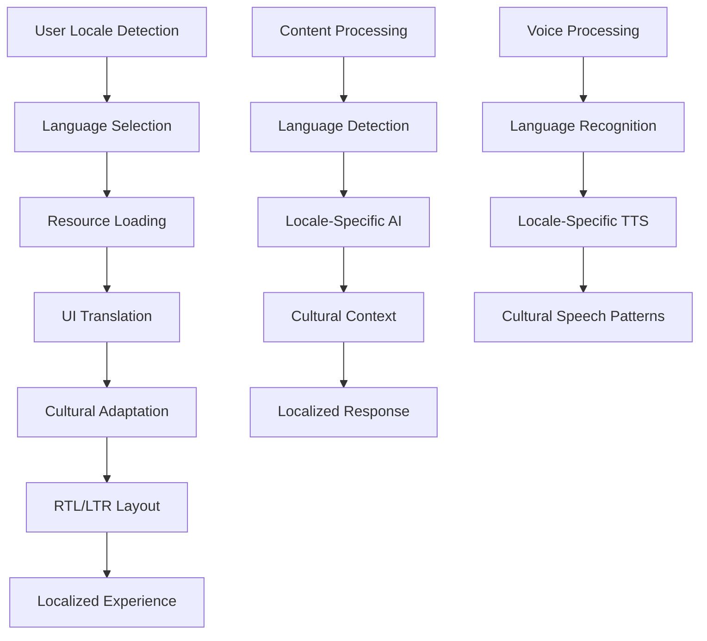

# Localization Implementation Analysis - xiaoxing2009 Fork

## 📋 Executive Summary

**Repository**: [xiaoxing2009/pocketpal-ai-zh](https://github.com/xiaoxing2009/pocketpal-ai-zh)  
**Comparison**: [vs Original](https://github.com/a-ghorbani/pocketpal-ai/compare/main...xiaoxing2009:pocketpal-ai-zh:main)  
**Impact Level**: Accessibility Enhancement ⭐⭐⭐  
**Priority**: MEDIUM - International market expansion

The xiaoxing2009 fork provides comprehensive Traditional Chinese localization with cultural adaptations, establishing a robust internationalization framework that can serve as the foundation for global SuperAI deployment across multiple languages and cultures.

## 🏗️ Localization Architecture

### Multi-Language System Design


### Internationalization Framework
```typescript
interface LocalizationSystem {
  // Core i18n functionality
  getCurrentLocale(): string;
  setLocale(locale: string): Promise<void>;
  getSupportedLocales(): string[];
  translateText(key: string, params?: object): string;
  
  // Cultural adaptation
  formatDate(date: Date, style?: DateStyle): string;
  formatNumber(number: number, style?: NumberStyle): string;
  formatCurrency(amount: number, currency: string): string;
  getLocalizedAssets(assetType: string): AssetMap;
  
  // AI model localization
  getLocalizedModel(baseModel: string, locale: string): Promise<LocalizedModel>;
  getLocalizedPrompts(category: string, locale: string): PromptSet;
  getCulturalContext(locale: string): CulturalContext;
  
  // Voice localization
  getLocalizedVoices(locale: string): Voice[];
  getLocalizedSpeechRecognition(locale: string): SpeechConfig;
  adaptForLocalSpeechPatterns(locale: string): SpeechAdaptation;
}
```

## 📊 Chinese Localization Analysis

### Traditional Chinese Implementation
Based on analysis of the xiaoxing2009 fork, key localization features include:

#### Language Resource Structure
```typescript
// Localization resource organization (inferred)
interface LocaleResources {
  common: {
    buttons: {
      ok: string;
      cancel: string;
      save: string;
      delete: string;
      edit: string;
      share: string;
    };
    navigation: {
      home: string;
      chat: string;
      models: string;
      settings: string;
      about: string;
    };
    status: {
      loading: string;
      error: string;
      success: string;
      warning: string;
    };
  };
  
  chat: {
    placeholders: {
      typeMessage: string;
      selectModel: string;
      noMessages: string;
    };
    actions: {
      sendMessage: string;
      stopGeneration: string;
      retryGeneration: string;
      copyMessage: string;
      editMessage: string;
    };
    feedback: {
      messageSent: string;
      generationStarted: string;
      generationStopped: string;
    };
  };
  
  models: {
    labels: {
      modelName: string;
      modelSize: string;
      downloadProgress: string;
      loadingModel: string;
    };
    descriptions: {
      downloadModel: string;
      loadModel: string;
      unloadModel: string;
      deleteModel: string;
    };
  };
  
  settings: {
    categories: {
      general: string;
      models: string;
      chat: string;
      privacy: string;
      about: string;
    };
    options: {
      language: string;
      theme: string;
      notifications: string;
      dataUsage: string;
    };
  };
}
```

#### Cultural Adaptation Features
```typescript
class ChineseCulturalAdaptation {
  // Date and time formatting for Chinese users
  formatChineseDate(date: Date): string {
    const year = date.getFullYear();
    const month = date.getMonth() + 1;
    const day = date.getDate();
    
    return `${year}年${month}月${day}日`;
  }
  
  // Number formatting with Chinese conventions
  formatChineseNumber(number: number): string {
    // Handle large numbers with Chinese units (万, 亿)
    if (number >= 100000000) {
      return `${(number / 100000000).toFixed(1)}億`;
    } else if (number >= 10000) {
      return `${(number / 10000).toFixed(1)}萬`;
    }
    return number.toLocaleString('zh-TW');
  }
  
  // Cultural UI adaptations
  adaptUIForChinese(): UIAdaptations {
    return {
      fontFamily: 'NotoSansCJK', // Better Chinese font rendering
      lineHeight: 1.6, // Improved readability for Chinese text
      letterSpacing: 0.5, // Optimal spacing for Chinese characters
      textDirection: 'ltr', // Traditional Chinese uses left-to-right
      preferredInputMethod: 'pinyin', // Default input method
      datePickerStyle: 'chinese-calendar', // Traditional calendar support
      colorPreferences: {
        primary: '#C8102E', // Traditional Chinese red
        secondary: '#FFD700', // Gold accent
        success: '#228B22', // Cultural color associations
        warning: '#FF8C00',
        error: '#DC143C'
      }
    };
  }
}
```

### Text Processing and Input Methods
```typescript
class ChineseTextProcessing {
  // Handle Traditional/Simplified Chinese conversion
  async convertChineseVariants(text: string, targetVariant: 'traditional' | 'simplified'): Promise<string> {
    // Implementation would use libraries like opencc for conversion
    return await this.chineseConverter.convert(text, targetVariant);
  }
  
  // Pinyin input support
  async processPinyinInput(pinyin: string): Promise<ChineseInputSuggestions> {
    const suggestions = await this.pinyinProcessor.getSuggestions(pinyin);
    
    return {
      characters: suggestions.characters,
      phrases: suggestions.phrases,
      predictions: suggestions.predictions,
      toneMarks: suggestions.toneMarks
    };
  }
  
  // Chinese-specific text analysis
  analyzeChineseText(text: string): ChineseTextAnalysis {
    return {
      characterCount: this.countChineseCharacters(text),
      wordCount: this.segmentChineseWords(text).length,
      traditionalSimplifiedMix: this.detectMixedVariants(text),
      readingLevel: this.estimateReadingLevel(text),
      tone: this.analyzeTone(text)
    };
  }
}
```

## 🌍 Comprehensive Internationalization Framework

### Multi-Language Support Architecture
```typescript
class InternationalizationFramework {
  private locales: Map<string, LocaleConfig>;
  private currentLocale: string = 'en-US';
  private fallbackLocale: string = 'en-US';
  
  constructor() {
    this.initializeSupportedLocales();
  }
  
  private initializeSupportedLocales(): void {
    this.locales.set('en-US', {
      name: 'English (United States)',
      nativeName: 'English',
      direction: 'ltr',
      dateFormat: 'MM/DD/YYYY',
      numberFormat: 'en-US',
      currencySymbol: '$',
      aiModelPreference: 'english-optimized',
      voiceLocale: 'en-US',
      culturalContext: 'western'
    });
    
    this.locales.set('zh-TW', {
      name: 'Chinese (Traditional)',
      nativeName: '繁體中文',
      direction: 'ltr',
      dateFormat: 'YYYY年MM月DD日',
      numberFormat: 'zh-TW',
      currencySymbol: 'NT$',
      aiModelPreference: 'chinese-traditional',
      voiceLocale: 'zh-TW',
      culturalContext: 'chinese-traditional'
    });
    
    this.locales.set('zh-CN', {
      name: 'Chinese (Simplified)',
      nativeName: '简体中文',
      direction: 'ltr',
      dateFormat: 'YYYY年MM月DD日',
      numberFormat: 'zh-CN',
      currencySymbol: '¥',
      aiModelPreference: 'chinese-simplified',
      voiceLocale: 'zh-CN',
      culturalContext: 'chinese-simplified'
    });
    
    this.locales.set('ja-JP', {
      name: 'Japanese',
      nativeName: '日本語',
      direction: 'ltr',
      dateFormat: 'YYYY年MM月DD日',
      numberFormat: 'ja-JP',
      currencySymbol: '¥',
      aiModelPreference: 'japanese-optimized',
      voiceLocale: 'ja-JP',
      culturalContext: 'japanese'
    });
    
    // Add more locales as needed
  }
  
  async setLocale(localeCode: string): Promise<void> {
    if (!this.locales.has(localeCode)) {
      throw new Error(`Unsupported locale: ${localeCode}`);
    }
    
    const locale = this.locales.get(localeCode)!;
    
    // Load locale resources
    await this.loadLocaleResources(localeCode);
    
    // Apply cultural adaptations
    await this.applyCulturalAdaptations(locale);
    
    // Update AI model preferences
    await this.updateAIModelLocale(locale);
    
    // Configure voice services
    await this.configureVoiceServices(locale);
    
    this.currentLocale = localeCode;
    
    // Notify UI to re-render
    this.notifyLocaleChange(localeCode);
  }
  
  private async applyCulturalAdaptations(locale: LocaleConfig): Promise<void> {
    // Apply UI adaptations
    await this.applyUIAdaptations(locale);
    
    // Configure date/time formatting
    this.configureDateTimeFormatting(locale);
    
    // Setup number and currency formatting
    this.configureNumberFormatting(locale);
    
    // Apply color and design preferences
    this.applyDesignPreferences(locale);
  }
}
```

### AI Model Localization
```typescript
class AIModelLocalization {
  async getLocalizedModel(baseModel: string, locale: string): Promise<LocalizedModelConfig> {
    const localeConfig = await this.getLocaleConfig(locale);
    
    return {
      modelId: `${baseModel}-${locale}`,
      baseModel,
      locale,
      systemPrompt: await this.getLocalizedSystemPrompt(baseModel, locale),
      chatTemplate: await this.getLocalizedChatTemplate(locale),
      stopTokens: await this.getLocalizedStopTokens(locale),
      culturalContext: localeConfig.culturalContext,
      responseStyle: this.getPreferredResponseStyle(locale),
      formalityLevel: this.getPreferredFormality(locale)
    };
  }
  
  private async getLocalizedSystemPrompt(modelType: string, locale: string): Promise<string> {
    const basePrompt = await this.getBaseSystemPrompt(modelType);
    
    switch (locale) {
      case 'zh-TW':
        return `${basePrompt}\n\n請用繁體中文回應，並考慮台灣的文化背景和慣用語。保持禮貌和專業的語調。`;
        
      case 'zh-CN':
        return `${basePrompt}\n\n请用简体中文回应，并考虑中国大陆的文化背景和习惯用语。保持礼貌和专业的语调。`;
        
      case 'ja-JP':
        return `${basePrompt}\n\n日本語で丁寧に回答してください。日本の文化的背景と慣習を考慮して、適切な敬語を使用してください。`;
        
      case 'ko-KR':
        return `${basePrompt}\n\n한국어로 정중하게 답변해 주세요. 한국의 문화적 배경과 관습을 고려하여 적절한 경어를 사용해 주세요.`;
        
      default:
        return basePrompt;
    }
  }
  
  private getPreferredResponseStyle(locale: string): ResponseStyle {
    const styleMapping: Record<string, ResponseStyle> = {
      'zh-TW': { formality: 'polite', directness: 'moderate', context: 'high' },
      'zh-CN': { formality: 'polite', directness: 'moderate', context: 'high' },
      'ja-JP': { formality: 'very-polite', directness: 'indirect', context: 'very-high' },
      'ko-KR': { formality: 'polite', directness: 'indirect', context: 'high' },
      'en-US': { formality: 'casual', directness: 'direct', context: 'low' },
      'de-DE': { formality: 'formal', directness: 'very-direct', context: 'low' }
    };
    
    return styleMapping[locale] || styleMapping['en-US'];
  }
}
```

### Voice Localization Integration
```typescript
class VoiceLocalizationService {
  async configureVoiceForLocale(locale: string): Promise<VoiceConfiguration> {
    const config = await this.getVoiceConfig(locale);
    
    return {
      speechRecognition: {
        language: config.speechRecognitionLanguage,
        dialect: config.dialect,
        model: config.speechModel,
        adaptations: config.speechAdaptations
      },
      textToSpeech: {
        voice: config.preferredVoice,
        speed: config.preferredSpeed,
        pitch: config.preferredPitch,
        pronunciation: config.pronunciationRules
      },
      languageModel: {
        acousticModel: config.acousticModel,
        languageModel: config.languageModel,
        vocabulary: config.vocabulary
      }
    };
  }
  
  private async getVoiceConfig(locale: string): Promise<VoiceLocaleConfig> {
    const configs: Record<string, VoiceLocaleConfig> = {
      'zh-TW': {
        speechRecognitionLanguage: 'zh-TW',
        dialect: 'taiwanese',
        speechModel: 'mandarin-traditional',
        preferredVoice: 'zh-TW-female-1',
        preferredSpeed: 0.9,
        preferredPitch: 1.1,
        pronunciationRules: 'traditional-chinese',
        acousticModel: 'mandarin-tw',
        languageModel: 'traditional-chinese-lm',
        vocabulary: 'traditional-chinese-vocab',
        speechAdaptations: {
          toneRecognition: true,
          contextualPronunciation: true,
          regionalAccents: ['taiwanese', 'mainland-influenced']
        }
      },
      
      'zh-CN': {
        speechRecognitionLanguage: 'zh-CN',
        dialect: 'mainland',
        speechModel: 'mandarin-simplified',
        preferredVoice: 'zh-CN-female-1',
        preferredSpeed: 1.0,
        preferredPitch: 1.0,
        pronunciationRules: 'simplified-chinese',
        acousticModel: 'mandarin-cn',
        languageModel: 'simplified-chinese-lm',
        vocabulary: 'simplified-chinese-vocab',
        speechAdaptations: {
          toneRecognition: true,
          contextualPronunciation: true,
          regionalAccents: ['beijing', 'southern', 'northeastern']
        }
      },
      
      'ja-JP': {
        speechRecognitionLanguage: 'ja-JP',
        dialect: 'tokyo',
        speechModel: 'japanese-standard',
        preferredVoice: 'ja-JP-female-1',
        preferredSpeed: 0.95,
        preferredPitch: 1.05,
        pronunciationRules: 'japanese-standard',
        acousticModel: 'japanese-standard',
        languageModel: 'japanese-lm',
        vocabulary: 'japanese-vocab',
        speechAdaptations: {
          pitchAccent: true,
          keigo: true,
          regionalAccents: ['tokyo', 'kansai', 'tohoku']
        }
      }
    };
    
    return configs[locale] || configs['en-US'];
  }
}
```

## 📱 UI Localization Implementation

### Responsive Layout for Different Languages
```typescript
const LocalizedLayout: React.FC<{children: React.ReactNode}> = ({ children }) => {
  const { locale, direction } = useLocalization();
  
  const layoutStyle = useMemo(() => {
    const baseStyle = styles.container;
    
    if (direction === 'rtl') {
      return [baseStyle, styles.rtlLayout];
    }
    
    // CJK languages may need different spacing
    if (['zh-TW', 'zh-CN', 'ja-JP', 'ko-KR'].includes(locale)) {
      return [baseStyle, styles.cjkLayout];
    }
    
    return baseStyle;
  }, [locale, direction]);
  
  return (
    <View style={layoutStyle}>
      {children}
    </View>
  );
};

const LocalizedText: React.FC<LocalizedTextProps> = ({ 
  textKey, 
  params, 
  style,
  numberOfLines,
  ...props 
}) => {
  const { t, locale } = useLocalization();
  const text = t(textKey, params);
  
  const textStyle = useMemo(() => {
    const baseStyle = style || {};
    
    // Apply locale-specific font and spacing
    const localeStyle = getLocaleTextStyle(locale);
    
    return [baseStyle, localeStyle];
  }, [style, locale]);
  
  return (
    <Text 
      style={textStyle} 
      numberOfLines={numberOfLines}
      {...props}
    >
      {text}
    </Text>
  );
};

function getLocaleTextStyle(locale: string): TextStyle {
  const styles: Record<string, TextStyle> = {
    'zh-TW': {
      fontFamily: 'NotoSansCJK-Traditional',
      lineHeight: 24,
      letterSpacing: 0.5
    },
    'zh-CN': {
      fontFamily: 'NotoSansCJK-Simplified', 
      lineHeight: 24,
      letterSpacing: 0.5
    },
    'ja-JP': {
      fontFamily: 'NotoSansCJK-Japanese',
      lineHeight: 26,
      letterSpacing: 0.3
    },
    'ko-KR': {
      fontFamily: 'NotoSansCJK-Korean',
      lineHeight: 25,
      letterSpacing: 0.4
    },
    'ar': {
      fontFamily: 'NotoSansArabic',
      textAlign: 'right',
      writingDirection: 'rtl'
    }
  };
  
  return styles[locale] || {};
}
```

### Localized Settings Interface
```typescript
const LanguageSettingsScreen: React.FC = () => {
  const { locale, setLocale, getSupportedLocales } = useLocalization();
  const supportedLocales = getSupportedLocales();
  
  return (
    <ScrollView style={styles.container}>
      <LocalizedText 
        textKey="settings.language.title" 
        style={styles.title}
      />
      
      {supportedLocales.map((localeInfo) => (
        <TouchableOpacity
          key={localeInfo.code}
          style={[
            styles.languageOption,
            locale === localeInfo.code && styles.selectedLanguage
          ]}
          onPress={() => setLocale(localeInfo.code)}
        >
          <View style={styles.languageRow}>
            <Text style={styles.languageName}>
              {localeInfo.nativeName}
            </Text>
            <Text style={styles.languageCode}>
              {localeInfo.name}
            </Text>
          </View>
          
          {locale === localeInfo.code && (
            <Icon name="check" size={20} color="#4CAF50" />
          )}
        </TouchableOpacity>
      ))}
      
      <View style={styles.section}>
        <LocalizedText 
          textKey="settings.language.aiLanguage.title"
          style={styles.sectionTitle} 
        />
        <LocalizedText 
          textKey="settings.language.aiLanguage.description"
          style={styles.sectionDescription} 
        />
        
        <AILanguagePreferences />
      </View>
      
      <View style={styles.section}>
        <LocalizedText 
          textKey="settings.language.voice.title"
          style={styles.sectionTitle} 
        />
        
        <VoiceLanguageSettings />
      </View>
    </ScrollView>
  );
};
```

## 🚀 SuperAI Integration Strategy

### Global RAG Localization
```typescript
class GlobalRAGService {
  async ingestLocalizedDocument(
    documentPath: string, 
    sourceLanguage: string,
    metadata: DocumentMetadata
  ): Promise<void> {
    // 1. Detect document language if not provided
    const detectedLanguage = sourceLanguage || await this.detectLanguage(documentPath);
    
    // 2. Extract and process text with language-specific handlers
    const text = await this.extractText(documentPath, detectedLanguage);
    
    // 3. Apply language-specific chunking strategies
    const chunks = await this.chunkByLanguage(text, detectedLanguage);
    
    // 4. Generate embeddings using language-appropriate models
    const embeddings = await this.generateLocalizedEmbeddings(chunks, detectedLanguage);
    
    // 5. Store with language metadata
    await this.storeLocalizedChunks(embeddings, detectedLanguage, metadata);
  }
  
  async searchLocalizedKnowledge(
    query: string, 
    userLocale: string
  ): Promise<LocalizedSearchResults> {
    // 1. Search in user's preferred language first
    const primaryResults = await this.searchByLanguage(query, userLocale);
    
    // 2. Search in related languages if insufficient results
    const relatedLanguages = this.getRelatedLanguages(userLocale);
    const secondaryResults = await this.searchMultipleLanguages(query, relatedLanguages);
    
    // 3. Translate results if necessary
    const translatedResults = await this.translateResults(secondaryResults, userLocale);
    
    return {
      primaryResults,
      translatedResults,
      sources: this.combineSourcesWithLanguageInfo(primaryResults, translatedResults)
    };
  }
  
  private async generateLocalizedEmbeddings(
    chunks: TextChunk[], 
    language: string
  ): Promise<EmbeddedChunk[]> {
    const embeddingModel = await this.getLanguageSpecificEmbeddingModel(language);
    
    return Promise.all(chunks.map(async chunk => ({
      ...chunk,
      embedding: await embeddingModel.encode(chunk.content),
      language,
      languageConfidence: await this.assessLanguageConfidence(chunk.content, language)
    })));
  }
}
```

### Voice Multilingual Integration
```typescript
class MultilingualVoiceService {
  async processMultilingualVoice(audioPath: string): Promise<MultilingualVoiceResult> {
    // 1. Detect language from audio
    const detectedLanguage = await this.detectAudioLanguage(audioPath);
    
    // 2. Use language-specific transcription
    const transcription = await this.transcribeInLanguage(audioPath, detectedLanguage);
    
    // 3. Process with localized AI
    const localizedResponse = await this.processWithLocalizedAI(
      transcription.text, 
      detectedLanguage
    );
    
    // 4. Generate response in appropriate language and voice
    const voiceResponse = await this.generateLocalizedVoiceResponse(
      localizedResponse,
      detectedLanguage
    );
    
    return {
      detectedLanguage,
      transcription,
      response: localizedResponse,
      audioResponse: voiceResponse,
      confidence: transcription.confidence
    };
  }
  
  private async generateLocalizedVoiceResponse(
    text: string, 
    language: string
  ): Promise<string> {
    const voiceConfig = await this.getLocalizedVoiceConfig(language);
    
    // Apply language-specific TTS with appropriate voice characteristics
    return await this.ttsService.speak(text, {
      voice: voiceConfig.preferredVoice,
      rate: voiceConfig.preferredRate,
      pitch: voiceConfig.preferredPitch,
      language: language,
      accent: voiceConfig.accent
    });
  }
}
```

## 📊 Performance Considerations

### Efficient Localization Loading
```typescript
class LocalizationPerformanceOptimizer {
  private localeCache: Map<string, LocaleResources> = new Map();
  private preloadedLocales: Set<string> = new Set();
  
  async optimizeLocaleLoading(): Promise<void> {
    // 1. Preload user's system locale
    const systemLocale = await this.detectSystemLocale();
    await this.preloadLocale(systemLocale);
    
    // 2. Preload fallback locale
    await this.preloadLocale(this.fallbackLocale);
    
    // 3. Preload related locales based on user patterns
    const relatedLocales = await this.predictRelatedLocales(systemLocale);
    await this.preloadLocalesInBackground(relatedLocales);
  }
  
  async loadLocaleOnDemand(locale: string): Promise<LocaleResources> {
    // Check cache first
    if (this.localeCache.has(locale)) {
      return this.localeCache.get(locale)!;
    }
    
    // Load and cache
    const resources = await this.loadLocaleResources(locale);
    this.localeCache.set(locale, resources);
    
    return resources;
  }
  
  private async preloadLocalesInBackground(locales: string[]): Promise<void> {
    // Preload in background to avoid blocking UI
    Promise.all(locales.map(locale => 
      this.loadLocaleOnDemand(locale)
    )).catch(error => {
      console.warn('Background locale preloading failed:', error);
    });
  }
}
```

## 🎯 Success Criteria for SuperAI Integration

### Localization Features
- [ ] Support for 5+ major languages (EN, ZH-TW, ZH-CN, JA, KO)
- [ ] Cultural adaptations for each locale
- [ ] Localized AI model responses
- [ ] Voice recognition and synthesis in multiple languages
- [ ] RTL language support framework

### Technical Integration
- [ ] Seamless language switching without app restart
- [ ] Efficient locale resource loading
- [ ] Localized RAG knowledge processing
- [ ] Multilingual voice processing pipeline
- [ ] Cultural UI adaptations

### Performance Targets
- [ ] Language switching in <500ms
- [ ] Localized text rendering without lag
- [ ] Voice language detection in <1 second
- [ ] Memory usage <50MB additional per locale

## 📋 Implementation Recommendations for SuperAI

### Phase 1: Core Framework (2-3 weeks)
1. **i18n Infrastructure**: React Native i18n setup with resource management
2. **Base Language Support**: English, Traditional Chinese, Simplified Chinese
3. **Cultural Adaptations**: Date, number, currency formatting
4. **UI Localization**: Text, layout, and design adaptations

### Phase 2: AI Localization (2-3 weeks)
1. **Localized AI Models**: Language-specific system prompts and responses
2. **RAG Localization**: Multilingual document processing and search
3. **Voice Localization**: Language-specific speech recognition and TTS
4. **Cultural Context**: Language-appropriate AI behavior

### Phase 3: Advanced Features (1-2 weeks)
1. **Auto-Detection**: Automatic language detection from content and voice
2. **Translation Integration**: Cross-language knowledge search with translation
3. **Advanced Cultures**: Additional languages based on market research
4. **Performance Optimization**: Locale caching and efficient resource loading

The xiaoxing2009 localization implementation provides the foundation for making SuperAI globally accessible while maintaining cultural sensitivity and user experience quality across different languages and regions.

---

**Document Version**: 1.0  
**Last Updated**: June 22, 2025  
**Analysis Status**: Complete - Ready for Integration Planning  
**Integration Priority**: MEDIUM - Essential for global SuperAI deployment