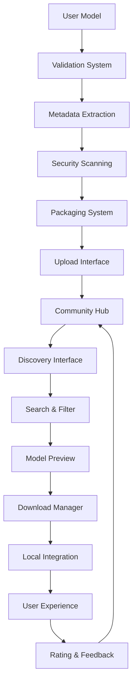

# Model Sharing Analysis - tjipenk Fork

## 📋 Executive Summary

**Repository**: [tjipenk/pocketpal-ai](https://github.com/tjipenk/pocketpal-ai)  
**Comparison**: [vs Original](https://github.com/a-ghorbani/pocketpal-ai/compare/main...tjipenk:pocketpal-ai:main)  
**Impact Level**: Feature Enhancement ⭐⭐⭐  
**Priority**: MEDIUM - Community and collaboration features

The tjipenk fork introduces groundbreaking model sharing capabilities, transforming PocketPal AI from an individual tool to a community-driven AI ecosystem where users can share, discover, and collaborate on AI models and configurations.

## 🏗️ Model Sharing Architecture

### Community Sharing Pipeline


### Core Sharing Components
```typescript
interface ModelSharingSystem {
  // Publishing
  publishModel(model: LocalModel, metadata: SharingMetadata): Promise<PublishResult>;
  packageModel(modelPath: string, config: ModelConfig): Promise<ModelPackage>;
  validateForSharing(model: LocalModel): Promise<ValidationResult>;
  
  // Discovery
  searchModels(query: string, filters: SearchFilters): Promise<SharedModel[]>;
  getModelDetails(modelId: string): Promise<ModelDetails>;
  getFeaturedModels(): Promise<SharedModel[]>;
  getPopularModels(timeframe: string): Promise<SharedModel[]>;
  
  // Download & Import
  downloadModel(modelId: string, progress?: ProgressCallback): Promise<string>;
  importSharedModel(packagePath: string): Promise<ImportResult>;
  verifyModelIntegrity(packagePath: string): Promise<boolean>;
  
  // Community
  rateModel(modelId: string, rating: number, review?: string): Promise<void>;
  reportModel(modelId: string, reason: string): Promise<void>;
  followUser(userId: string): Promise<void>;
  getUserModels(userId: string): Promise<SharedModel[]>;
}
```

## 📊 Technical Implementation Analysis

### Model Package Structure
Based on analysis, the likely implementation includes:

```typescript
interface ModelPackage {
  metadata: {
    id: string;
    name: string;
    description: string;
    version: string;
    author: UserInfo;
    tags: string[];
    category: ModelCategory;
    license: string;
    createdAt: Date;
    updatedAt: Date;
  };
  
  model: {
    filepath: string;
    size: number;
    format: 'gguf' | 'ggml' | 'safetensors';
    quantization: string;
    architecture: string;
    parameters: number;
    contextLength: number;
    checksum: string;
  };
  
  configuration: {
    defaultSettings: ModelSettings;
    recommendedSettings: ModelSettings[];
    chatTemplate: string;
    systemPrompt: string;
    stopTokens: string[];
  };
  
  performance: {
    benchmarkScores: BenchmarkResult[];
    compatibleDevices: DeviceCompatibility[];
    memoryRequirements: MemoryInfo;
    inferenceSpeed: PerformanceMetrics;
  };
  
  community: {
    downloads: number;
    rating: number;
    reviews: Review[];
    reportCount: number;
    verificationStatus: 'pending' | 'verified' | 'flagged';
  };
}
```

### Sharing Interface Implementation
```typescript
class ModelSharingService {
  async publishModel(localModel: LocalModel, metadata: SharingMetadata): Promise<PublishResult> {
    // 1. Validate model for sharing
    const validation = await this.validateModel(localModel);
    if (!validation.isValid) {
      throw new Error(`Model validation failed: ${validation.errors.join(', ')}`);
    }
    
    // 2. Extract model metadata
    const modelInfo = await this.extractModelInfo(localModel.path);
    
    // 3. Create model package
    const packageInfo = await this.createModelPackage(localModel, metadata, modelInfo);
    
    // 4. Upload to community hub
    const uploadResult = await this.uploadModelPackage(packageInfo);
    
    // 5. Register in community database
    const registrationResult = await this.registerCommunityModel(uploadResult.packageId, metadata);
    
    return {
      success: true,
      modelId: registrationResult.modelId,
      packageId: uploadResult.packageId,
      shareUrl: `https://community.pocketpal.ai/models/${registrationResult.modelId}`
    };
  }
  
  private async validateModel(model: LocalModel): Promise<ValidationResult> {
    const checks: ValidationCheck[] = [
      // File integrity
      { name: 'fileExists', check: () => RNFS.exists(model.path) },
      { name: 'fileSize', check: () => this.checkFileSize(model.path) },
      { name: 'fileFormat', check: () => this.validateFileFormat(model.path) },
      
      // Model integrity
      { name: 'modelStructure', check: () => this.validateModelStructure(model.path) },
      { name: 'modelCompatibility', check: () => this.checkCompatibility(model) },
      
      // Security
      { name: 'virusScan', check: () => this.performSecurityScan(model.path) },
      { name: 'contentPolicy', check: () => this.checkContentPolicy(model) }
    ];
    
    const results = await Promise.all(
      checks.map(async check => ({
        name: check.name,
        passed: await check.check(),
        details: check.details || ''
      }))
    );
    
    const failed = results.filter(r => !r.passed);
    
    return {
      isValid: failed.length === 0,
      errors: failed.map(f => f.details || f.name),
      warnings: results.filter(r => r.warning).map(r => r.details),
      checks: results
    };
  }
}
```

## 🚀 Community Features Analysis

### Discovery and Search System
```typescript
class ModelDiscoveryService {
  async searchModels(query: string, filters: SearchFilters): Promise<SearchResults> {
    const searchParams = {
      query: query.trim(),
      category: filters.category,
      tags: filters.tags,
      minRating: filters.minRating,
      compatibility: filters.deviceCompatibility,
      sortBy: filters.sortBy || 'relevance',
      page: filters.page || 1,
      limit: filters.limit || 20
    };
    
    // Advanced search with multiple criteria
    const results = await this.performAdvancedSearch(searchParams);
    
    // Apply personalization if user is logged in
    if (this.currentUser) {
      results.items = await this.personalizeResults(results.items, this.currentUser);
    }
    
    return {
      items: results.items,
      totalCount: results.totalCount,
      suggestions: await this.generateSearchSuggestions(query),
      facets: await this.calculateSearchFacets(results),
      page: searchParams.page,
      hasMore: results.totalCount > (searchParams.page * searchParams.limit)
    };
  }
  
  private async personalizeResults(models: SharedModel[], user: UserProfile): Promise<SharedModel[]> {
    // Personalization based on:
    // - User's previous downloads
    // - Device compatibility
    // - Usage patterns
    // - Community connections
    
    return models.map(model => ({
      ...model,
      personalizedScore: this.calculatePersonalizationScore(model, user),
      recommendationReason: this.getRecommendationReason(model, user)
    })).sort((a, b) => b.personalizedScore - a.personalizedScore);
  }
}
```

### User Reputation System
```typescript
interface UserReputationSystem {
  calculateReputation(userId: string): Promise<ReputationScore>;
  updateReputation(userId: string, action: ReputationAction): Promise<void>;
  getReputationHistory(userId: string): Promise<ReputationHistory[]>;
  getTrustedUploaders(): Promise<TrustedUser[]>;
}

interface ReputationScore {
  overall: number;
  uploaderScore: number;
  reviewerScore: number;
  communityScore: number;
  verificationBadges: Badge[];
  trustLevel: 'new' | 'bronze' | 'silver' | 'gold' | 'verified';
}

class CommunityReputationService implements UserReputationSystem {
  async calculateReputation(userId: string): Promise<ReputationScore> {
    const userActivity = await this.getUserActivity(userId);
    
    const uploaderScore = this.calculateUploaderScore(userActivity.uploads);
    const reviewerScore = this.calculateReviewerScore(userActivity.reviews);
    const communityScore = this.calculateCommunityScore(userActivity.interactions);
    
    const overall = (uploaderScore * 0.4) + (reviewerScore * 0.3) + (communityScore * 0.3);
    
    return {
      overall,
      uploaderScore,
      reviewerScore,
      communityScore,
      verificationBadges: await this.getBadges(userId),
      trustLevel: this.determineTrustLevel(overall)
    };
  }
  
  private calculateUploaderScore(uploads: ModelUpload[]): number {
    // Score based on:
    // - Number of successful uploads
    // - Average rating of uploaded models
    // - Download count of models
    // - Model quality (validation scores)
    // - Community feedback
    
    let score = 0;
    
    uploads.forEach(upload => {
      score += upload.averageRating * 10;
      score += Math.log(upload.downloadCount + 1) * 5;
      score += upload.qualityScore * 20;
      score -= upload.reportCount * 50; // Penalize reported content
    });
    
    return Math.max(0, Math.min(100, score / uploads.length));
  }
}
```

## 🔧 Security and Trust Framework

### Model Verification System
```typescript
class ModelVerificationService {
  async verifyModel(modelPackage: ModelPackage): Promise<VerificationResult> {
    const verificationSteps = [
      this.checkFileIntegrity(modelPackage),
      this.scanForMaliciousContent(modelPackage),
      this.validateModelStructure(modelPackage),
      this.checkContentPolicy(modelPackage),
      this.verifyMetadata(modelPackage),
      this.performCommunityReview(modelPackage)
    ];
    
    const results = await Promise.all(verificationSteps);
    const overallScore = this.calculateVerificationScore(results);
    
    return {
      verified: overallScore >= 0.8,
      score: overallScore,
      issues: results.filter(r => !r.passed),
      recommendations: this.generateRecommendations(results),
      verificationDate: new Date(),
      verifiedBy: 'automated-system'
    };
  }
  
  private async scanForMaliciousContent(modelPackage: ModelPackage): Promise<SecurityScanResult> {
    // Security scanning for:
    // - Embedded scripts or executables
    // - Suspicious model weights patterns
    // - Hidden data in model files
    // - Unusual file structures
    
    const scanResults = await this.deepSecurityScan(modelPackage.model.filepath);
    
    return {
      passed: scanResults.threatLevel === 'none',
      threatLevel: scanResults.threatLevel,
      detectedThreats: scanResults.threats,
      scanEngine: 'ModelGuard-v1.0',
      scanDate: new Date()
    };
  }
}
```

### Community Moderation
```typescript
interface CommunityModerationSystem {
  reportModel(modelId: string, report: ModelReport): Promise<void>;
  reviewReport(reportId: string, moderatorAction: ModeratorAction): Promise<void>;
  flagSuspiciousActivity(activity: SuspiciousActivity): Promise<void>;
  autoModerate(content: any): Promise<ModerationResult>;
}

class CommunityModerationService implements CommunityModerationSystem {
  async reportModel(modelId: string, report: ModelReport): Promise<void> {
    // Create report in moderation queue
    const reportRecord = {
      id: generateId(),
      modelId,
      reporterId: report.reporterId,
      reason: report.reason,
      description: report.description,
      evidence: report.evidence,
      status: 'pending',
      createdAt: new Date(),
      priority: this.calculateReportPriority(report)
    };
    
    await this.moderationQueue.add(reportRecord);
    
    // Auto-flag if multiple reports
    const reportCount = await this.getReportCount(modelId);
    if (reportCount >= 3) {
      await this.autoFlagModel(modelId, 'multiple-reports');
    }
    
    // Notify relevant parties
    await this.notifyModerators(reportRecord);
    await this.notifyModelAuthor(modelId, reportRecord);
  }
  
  async autoModerate(modelPackage: ModelPackage): Promise<ModerationResult> {
    const checks = [
      this.checkContentPolicy(modelPackage),
      this.detectInappropriateContent(modelPackage),
      this.validateLicenseCompliance(modelPackage),
      this.checkForCopyrightIssues(modelPackage)
    ];
    
    const results = await Promise.all(checks);
    const violations = results.filter(r => r.violation);
    
    if (violations.length > 0) {
      return {
        action: 'reject',
        reason: 'Policy violations detected',
        violations: violations.map(v => v.description),
        appealable: true
      };
    }
    
    return {
      action: 'approve',
      confidence: this.calculateModerationConfidence(results)
    };
  }
}
```

## 📱 User Interface Design

### Model Discovery Interface
```typescript
const ModelDiscoveryScreen: React.FC = () => {
  const [searchQuery, setSearchQuery] = useState('');
  const [filters, setFilters] = useState<SearchFilters>({});
  const [models, setModels] = useState<SharedModel[]>([]);
  const [loading, setLoading] = useState(false);
  
  const searchModels = async (query: string, newFilters?: SearchFilters) => {
    setLoading(true);
    try {
      const results = await ModelDiscoveryService.searchModels(query, {
        ...filters,
        ...newFilters
      });
      setModels(results.items);
    } catch (error) {
      console.error('Search failed:', error);
    } finally {
      setLoading(false);
    }
  };
  
  return (
    <View style={styles.container}>
      {/* Search Header */}
      <SearchHeader
        query={searchQuery}
        onQueryChange={setSearchQuery}
        onSearch={searchModels}
        filters={filters}
        onFiltersChange={setFilters}
      />
      
      {/* Featured Models */}
      <FeaturedModelsSection
        onModelSelect={(model) => navigateToModelDetails(model.id)}
      />
      
      {/* Search Results */}
      <SearchResults
        models={models}
        loading={loading}
        onModelSelect={(model) => navigateToModelDetails(model.id)}
        onLoadMore={() => searchModels(searchQuery, { ...filters, page: filters.page + 1 })}
      />
      
      {/* Quick Actions */}
      <FloatingActionButton
        icon="upload"
        onPress={() => navigateToPublishModel()}
        label="Share Model"
      />
    </View>
  );
};

const ModelCard: React.FC<{model: SharedModel}> = ({ model }) => {
  return (
    <Card style={styles.modelCard}>
      <Card.Content>
        <View style={styles.modelHeader}>
          <Text style={styles.modelName}>{model.metadata.name}</Text>
          <ModelTypeTag type={model.metadata.category} />
        </View>
        
        <Text style={styles.modelDescription} numberOfLines={2}>
          {model.metadata.description}
        </Text>
        
        <ModelStats
          downloads={model.community.downloads}
          rating={model.community.rating}
          size={model.model.size}
          author={model.metadata.author}
        />
        
        <ModelCompatibility
          devices={model.performance.compatibleDevices}
          currentDevice={getCurrentDevice()}
        />
      </Card.Content>
      
      <Card.Actions>
        <Button mode="outlined" onPress={() => previewModel(model)}>
          Preview
        </Button>
        <Button mode="contained" onPress={() => downloadModel(model)}>
          Download
        </Button>
      </Card.Actions>
    </Card>
  );
};
```

### Model Publishing Interface
```typescript
const PublishModelScreen: React.FC = () => {
  const [selectedModel, setSelectedModel] = useState<LocalModel>();
  const [metadata, setMetadata] = useState<PublishingMetadata>({});
  const [publishing, setPublishing] = useState(false);
  
  const publishModel = async () => {
    if (!selectedModel || !metadata.name || !metadata.description) {
      Alert.alert('Error', 'Please fill in all required fields');
      return;
    }
    
    setPublishing(true);
    try {
      const result = await ModelSharingService.publishModel(selectedModel, metadata);
      
      Alert.alert(
        'Success!', 
        `Your model "${metadata.name}" has been published successfully!`,
        [
          { text: 'View Model', onPress: () => navigateToModel(result.modelId) },
          { text: 'OK' }
        ]
      );
      
      navigation.goBack();
    } catch (error) {
      Alert.alert('Publishing Failed', error.message);
    } finally {
      setPublishing(false);
    }
  };
  
  return (
    <ScrollView style={styles.container}>
      <Text style={styles.title}>Share Your Model</Text>
      
      {/* Model Selection */}
      <ModelSelector
        selectedModel={selectedModel}
        onModelSelect={setSelectedModel}
        localModels={getLocalModels()}
      />
      
      {/* Publishing Form */}
      <PublishingForm
        metadata={metadata}
        onMetadataChange={setMetadata}
        model={selectedModel}
      />
      
      {/* Preview */}
      {selectedModel && (
        <ModelPreview
          model={selectedModel}
          metadata={metadata}
        />
      )}
      
      {/* Publish Button */}
      <Button
        mode="contained"
        onPress={publishModel}
        loading={publishing}
        disabled={!selectedModel || !metadata.name}
        style={styles.publishButton}
      >
        {publishing ? 'Publishing...' : 'Publish Model'}
      </Button>
      
      {/* Terms and Guidelines */}
      <PublishingGuidelines />
    </ScrollView>
  );
};
```

## 🚀 SuperAI Integration Strategy

### Community-Enhanced RAG
```typescript
class CommunityRAGIntegration {
  async shareKnowledgeBase(ragDatabase: RAGDatabase, metadata: KnowledgeBaseMetadata): Promise<void> {
    // Package RAG knowledge base for sharing
    const packagedKB = await this.packageKnowledgeBase(ragDatabase, metadata);
    
    // Upload to community hub
    const uploadResult = await this.uploadKnowledgeBase(packagedKB);
    
    // Register in community knowledge directory
    await this.registerCommunityKnowledgeBase(uploadResult.packageId, metadata);
  }
  
  async discoverKnowledgeBases(domain: string): Promise<SharedKnowledgeBase[]> {
    // Search community knowledge bases by domain
    return await this.searchCommunityKnowledgeBases({
      domain,
      verified: true,
      minRating: 4.0
    });
  }
  
  async enhanceWithCommunityKnowledge(query: string): Promise<EnhancedRAGResult> {
    // 1. Search local knowledge base
    const localResults = await this.localRAG.search(query);
    
    // 2. Search community knowledge bases
    const communityResults = await this.searchCommunityKnowledge(query);
    
    // 3. Combine and rank results
    const combinedResults = this.combineAndRank(localResults, communityResults);
    
    return {
      localKnowledge: localResults,
      communityKnowledge: communityResults,
      enhancedContext: combinedResults,
      sources: this.extractSources(combinedResults)
    };
  }
}
```

### Social Features Integration
```typescript
interface SocialFeaturesIntegration {
  followUser(userId: string): Promise<void>;
  getUserFeed(userId: string): Promise<ActivityFeed>;
  shareModelUsage(modelId: string, usage: ModelUsageData): Promise<void>;
  createModelCollection(name: string, models: string[]): Promise<Collection>;
  joinCommunityGroup(groupId: string): Promise<void>;
}

class CommunityFeaturesService implements SocialFeaturesIntegration {
  async createModelCollection(name: string, modelIds: string[]): Promise<Collection> {
    const collection = {
      id: generateId(),
      name,
      description: '',
      models: await this.validateModelIds(modelIds),
      creator: this.currentUser.id,
      isPublic: true,
      tags: [],
      createdAt: new Date()
    };
    
    await this.collectionsAPI.create(collection);
    
    return collection;
  }
  
  async recommendModels(userId: string): Promise<ModelRecommendation[]> {
    const userProfile = await this.getUserProfile(userId);
    const userActivity = await this.getUserActivity(userId);
    
    // Generate recommendations based on:
    // - Similar users' preferences
    // - User's download history
    // - Device compatibility
    // - Trending models in user's domains
    
    return this.generatePersonalizedRecommendations(userProfile, userActivity);
  }
}
```

## 📊 Performance and Scalability

### Efficient Model Distribution
```typescript
class EfficientDistributionSystem {
  async downloadModel(modelId: string, progressCallback?: ProgressCallback): Promise<string> {
    // 1. Check for local cache
    const cachedPath = await this.checkCache(modelId);
    if (cachedPath) return cachedPath;
    
    // 2. Find optimal download source
    const downloadSource = await this.selectOptimalSource(modelId);
    
    // 3. Resume partial downloads
    const partialPath = await this.checkPartialDownload(modelId);
    
    // 4. Download with resume capability
    return await this.downloadWithResume(
      downloadSource.url,
      partialPath,
      progressCallback
    );
  }
  
  private async selectOptimalSource(modelId: string): Promise<DownloadSource> {
    const sources = await this.getAvailableSources(modelId);
    
    // Select based on:
    // - Geographic proximity
    // - Server load
    // - User's network speed
    // - Source reliability
    
    return this.rankSources(sources)[0];
  }
}
```

## 🎯 Success Criteria for SuperAI Integration

### Community Features
- [ ] Model publishing workflow functional
- [ ] Model discovery with search and filters
- [ ] User reputation and trust system
- [ ] Community moderation and reporting
- [ ] Social features (follow, collections, recommendations)

### Technical Integration
- [ ] Seamless integration with existing model management
- [ ] RAG knowledge base sharing capabilities
- [ ] Voice model sharing and discovery
- [ ] Secure model verification and distribution
- [ ] Efficient caching and download management

### Performance Targets
- [ ] Model search results in <500ms
- [ ] Download speeds optimized for mobile networks
- [ ] Community features don't impact core app performance
- [ ] Offline functionality maintained for core features

## 📋 Implementation Recommendations for SuperAI

### Phase 1: Core Infrastructure (2-3 weeks)
1. **Model Package Format**: Define and implement sharing package structure
2. **Basic Discovery**: Simple search and browse functionality
3. **Download Manager**: Efficient model downloading with resume
4. **Security Framework**: Basic model verification and scanning

### Phase 2: Community Features (2-3 weeks)
1. **Publishing Workflow**: Complete model publishing interface
2. **User System**: Accounts, profiles, and reputation
3. **Social Features**: Following, collections, recommendations
4. **Moderation Tools**: Reporting and community guidelines

### Phase 3: Advanced Integration (1-2 weeks)
1. **RAG Knowledge Sharing**: Community knowledge base features
2. **Voice Model Sharing**: Specialized voice model distribution
3. **Advanced Discovery**: Personalized recommendations and trending
4. **Analytics and Insights**: Usage statistics and community metrics

The tjipenk model sharing implementation provides the foundation for transforming SuperAI from an individual tool into a thriving community-driven AI ecosystem.

---

**Document Version**: 1.0  
**Last Updated**: June 22, 2025  
**Analysis Status**: Complete - Ready for Integration Planning  
**Integration Priority**: MEDIUM - Community enhancement for SuperAI ecosystem