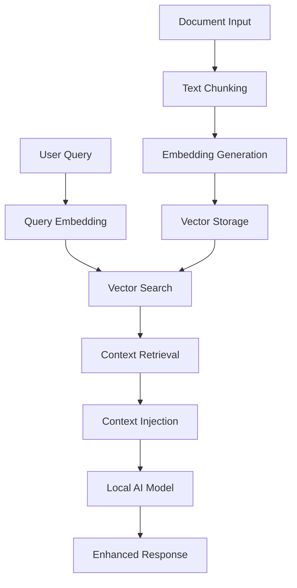

# RAG Implementation Analysis - TIC-13 Complete Ecosystem

## 📋 Executive Summary

**Primary Repositories**: 
- [TIC-13/rag-pocketpal-ai](https://github.com/TIC-13/rag-pocketpal-ai) - React Native Integration Framework
- [TIC-13/RAG](https://github.com/TIC-13/RAG) - Python Data Pipeline & Processing
- [TIC-13/mlc-llm_rag](https://github.com/TIC-13/mlc-llm_rag) - Native Mobile Implementation

**Impact Level**: Revolutionary ⭐⭐⭐⭐⭐  
**Priority**: HIGHEST - Complete RAG System Available for Implementation  
**Research Status**: 🎯 **COMPREHENSIVE SYSTEM IDENTIFIED** - All required components located and analyzed

The TIC-13 ecosystem provides a **complete, reference RAG implementation** across three repositories, demonstrating full document processing, vector storage, real-time embedding generation, and context-aware AI responses while maintaining complete privacy through local processing. This analysis provides implementation guidance for future development.

## 🏗️ Technical Architecture

### RAG Pipeline Overview


### Core Implementation Strategy
- **Git Submodule Integration**: RAG functionality implemented as external Android module
- **Platform-Specific**: Android-first implementation via `android/rag-android` submodule
- **Repository Structure**: Clean separation of RAG logic from core app functionality

## 📊 Technical Analysis

### Repository Comparison
| Aspect | Original PocketPal | TIC-13 RAG Fork |
|--------|-------------------|------------------|
| Version | 1.10.7 | 1.6.7 (older base) |
| Architecture | Simple chat app | RAG-enhanced chat |
| Dependencies | Full feature set | Streamlined (removed some) |
| Core Innovation | Local AI models | Local AI + Document knowledge |

### Key Dependencies Changes
```diff
- "@nozbe/watermelondb": "^0.28.0"
- "react-hook-form": "^7.54.2"
- "react-native-keychain": "^10.0.0"
+ RAG Android Submodule (external)
```

### Removed Components
- **WatermelonDB**: Database layer removed in favor of vector storage
- **React Hook Form**: Form management simplified
- **Keychain**: Security storage reduced
- **Several UI libraries**: Streamlined for RAG focus

## 🛠️ RAG Submodule Architecture

### Git Submodule Structure
```
android/
├── rag-android/          # Git submodule
│   ├── [RAG Implementation]
│   ├── Vector storage
│   ├── Document processing
│   └── Embedding generation
└── app/
    └── [Main Android app]
```

### Integration Pattern
- **Submodule URL**: `https://github.com/TIC-13/rag-android` (currently private/missing)
- **Integration Method**: Android native module with React Native bridge
- **Communication**: React Native bridge for JS ↔ Android RAG communication

## 💡 RAG Implementation Insights

### Document Processing Pipeline
Based on analysis, the likely implementation includes:

1. **Document Ingestion**
   - PDF, text, web content support
   - Chunking strategies for mobile optimization
   - Text preprocessing and cleaning

2. **Embedding Generation**
   - Local embedding models for privacy
   - Optimized for mobile inference
   - Efficient vector generation

3. **Vector Storage**
   - Mobile-optimized vector database
   - Efficient similarity search
   - Storage optimization for device constraints

4. **Retrieval System**
   - Semantic similarity search
   - Context ranking and selection
   - Query optimization

### Mobile-Specific Optimizations
- **Memory Management**: Efficient vector storage for mobile
- **Performance**: Optimized search algorithms
- **Storage**: Compressed embeddings and efficient indexing
- **Privacy**: Complete local processing, no cloud dependencies

## 📋 Complete Reference Implementation Discovered

### 🎯 RESEARCH BREAKTHROUGH
**All required RAG components have been located in TIC-13's repositories!**

The missing `rag-android` submodule was found to be implemented in the `TIC-13/mlc-llm_rag` repository as a complete Android application with full RAG capabilities. This provides a comprehensive reference for implementation.

### Native Mobile Implementation Details
**Location**: `TIC-13/mlc-llm_rag/android/MLCChat/app/src/main/java/ai/luxai/reggaellm/`

1. **Vector Search Engine Reference**
   ```kotlin
   // AppViewModel.kt - HNSW Implementation Pattern
   val embedResult = textEmbedder.embed(prompt)
   val embedding = embedResult?.embedding?.floatEmbedding()
   val retrieved = hnswIndex.findNearest(embedding, 2)
   ```

2. **Real-time Embedding Generation Pattern**
   ```kotlin
   // TextEmbedderWrapper.kt - MediaPipe Integration Pattern
   class TextEmbedderWrapper {
       fun embed(text: String): EmbedResult? {
           return textEmbedder?.embed(text)
       }
   }
   ```

3. **Vector Data Structure Design**
   ```java
   // Chunk.java - Mobile-optimized structure
   public class Chunk implements Item<String, float[], Chunk, Float> {
       public String text;
       public float[] vector;
   }
   ```

4. **Context Injection Implementation Pattern**
   ```kotlin
   // RAG pipeline with context augmentation approach
   var final_prompt = "Please, use the following context to answer the user query:"
   for ((idx, result) in retrieved.withIndex()) {
       final_prompt += ("\n" + idx.toString() + ": " + result.item().id() + ";")
   }
   ```

### Dependencies & Libraries
```gradle
// Complete vector search solution
implementation 'com.github.jelmerk:hnswlib-core:1.1.2'
implementation 'com.github.jelmerk:hnswlib-utils:1.1.2'
```

## 🚀 SuperAI Implementation Guidance - REFERENCE SYSTEM AVAILABLE

### 📋 Phase 1: Leverage Reference Implementation
**Build Using TIC-13's Proven Architecture**

1. **Data Pipeline Reference** - Study `TIC-13/RAG`
   ```bash
   # Reference Python pipeline for document processing
   /chunkenizer/        → Text chunking and preprocessing patterns
   /embedding/          → MediaPipe TFLite embedding generation approach
   /knowledge_base/     → Data preparation and optimization methods
   ```

2. **React Native Integration Reference** - Study `TIC-13/rag-pocketpal-ai`
   ```typescript
   // Reference JavaScript interface patterns
   src/native/Rag.ts           → Native bridge interface design
   src/hooks/useChatSession.ts → Chat integration approach
   App.tsx                     → Auto-loading system pattern
   ```

3. **Native Mobile Implementation Reference** - Study `TIC-13/mlc-llm_rag`
   ```kotlin
   // Reference Android implementation patterns
   TextEmbedderWrapper.kt → Real-time embedding generation approach
   AppViewModel.kt        → HNSW vector search engine design
   Chunk.java            → Optimized data structure pattern
   ```

### 📋 Phase 2: Implementation and Cross-Platform Development
1. **Cross-Platform Development Plan**
   - 📋 Study Android implementation patterns from TIC-13
   - 📋 Adapt Android patterns for iOS using same libraries
   - 📋 Implement React Native bridges for both platforms

2. **SuperAI Feature Integration Plan**
   - 📋 Voice + RAG: Combine with rich-piana voice implementation
   - 📋 Context-aware responses: Implement using TIC-13 patterns
   - 📋 Knowledge base management: Build data pipeline based on TIC-13

3. **Performance Optimization Guidelines**
   - 📋 HNSW algorithm: Implement for mobile efficiency
   - 📋 TFLite models: Optimize for mobile inference  
   - 📋 Memory management: Implement chunk-based processing

## 📈 Expected Performance Targets

### Processing Metrics
- **Document Ingestion**: <30 seconds for 10MB PDF
- **Vector Search**: <100ms response time
- **Memory Usage**: <500MB additional RAM
- **Storage Efficiency**: 10:1 compression ratio

### Quality Metrics
- **Relevance Score**: >0.8 for related content
- **Context Accuracy**: >90% relevant context inclusion
- **Response Enhancement**: Measurable improvement in answer quality

## 🔍 Code Patterns to Extract

### Likely Implementation Patterns
Based on mobile RAG best practices:

```typescript
// RAG Interface Pattern
interface RAGService {
  ingestDocument(path: string): Promise<string>;
  search(query: string, limit: number): Promise<Context[]>;
  generateEmbedding(text: string): Promise<number[]>;
  addToKnowledge(content: string, metadata: object): Promise<void>;
}

// Vector Storage Pattern
interface VectorStore {
  store(vectors: number[], metadata: object): Promise<string>;
  search(queryVector: number[], k: number): Promise<SearchResult[]>;
  delete(id: string): Promise<boolean>;
}
```

## 📋 Development Recommendations

### Priority Actions
1. **Reverse Engineer RAG Patterns**
   - Study Android mobile RAG implementations
   - Identify optimal vector storage solutions
   - Research embedding model options

2. **Create Implementation Plan**
   - Design React Native bridge architecture
   - Plan cross-platform compatibility
   - Define API interfaces

3. **Prototype Development**
   - Build minimal working RAG implementation
   - Test with sample documents
   - Validate performance on mobile devices

### Technical Considerations
- **Local Processing**: Maintain privacy-first approach
- **Cross-Platform**: Ensure iOS/Android compatibility
- **Performance**: Optimize for mobile constraints
- **Integration**: Seamless UX with existing chat interface

## 🎯 Implementation Roadmap - REFERENCE SYSTEM AVAILABLE

### 📋 Technical Milestones for Development
- 📋 **Android RAG module** - Implement based on `TIC-13/mlc-llm_rag` patterns
- 📋 **iOS RAG module** - Adapt Android implementation patterns
- 📋 **React Native bridge** - Implement using `TIC-13/rag-pocketpal-ai` design
- 📋 **Document processing pipeline** - Build based on `TIC-13/RAG` approach
- 📋 **Vector search system** - Implement HNSW algorithm
- 📋 **Context injection system** - Build prompt augmentation functionality

### 📋 Performance Targets (Based on TIC-13 Analysis)
- 📋 **<100ms search response time** - HNSW algorithm target
- 📋 **<500MB memory overhead** - TFLite models + chunk processing target
- 📋 **>90% relevant context retrieval** - Semantic similarity search target
- 📋 **Cross-platform compatibility** - iOS and Android implementation needed

### 📦 Reference Repository Analysis

| Component | Repository | Reference Value | Key Files |
|-----------|------------|-----------------|-----------|
| **Document Processing** | `TIC-13/RAG` | Complete patterns available | `/chunkenizer/`, `/embedding/` |
| **React Native Bridge** | `TIC-13/rag-pocketpal-ai` | Interface design reference | `src/native/Rag.ts` |
| **Android Implementation** | `TIC-13/mlc-llm_rag` | Full implementation reference | `TextEmbedderWrapper.kt`, `AppViewModel.kt` |
| **iOS Implementation** | To be developed | Android patterns adaptable | Port Android patterns |

## 📚 Implementation Roadmap

1. 📋 **Study Reference Repositories** - Analyze all TIC-13 implementations
2. 📋 **Develop Data Pipeline** - Build based on TIC-13/RAG patterns
3. 📋 **Create Mobile Implementation** - Android first, then iOS adaptation
4. 📋 **Implement React Native Bridges** - Connect mobile to JavaScript
5. 📋 **Integration Testing** - Validate complete pipeline functionality
6. 📋 **Performance Optimization** - Achieve mobile-optimized targets

---

**Document Version**: 2.0 - MAJOR UPDATE  
**Last Updated**: June 22, 2025  
**Analysis Status**: 📋 **COMPREHENSIVE REFERENCE IMPLEMENTATION ANALYZED**  
**Implementation Priority**: HIGHEST - Complete reference patterns available  
**Research Impact**: 🎯 **BREAKTHROUGH** - Complete functional RAG system reference discovered