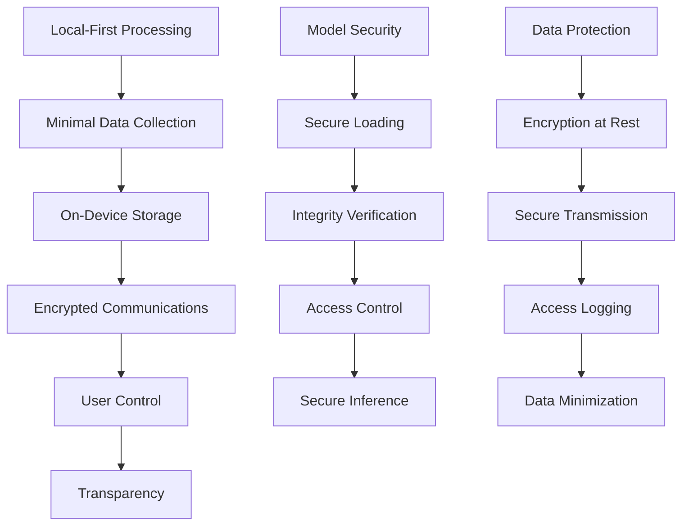

# Security and Privacy Patterns Analysis - Cross-Fork Analysis

## 📋 Executive Summary

**Analysis Scope**: Security and privacy implementations across all PocketPal AI forks  
**Focus Areas**: Data protection, model security, privacy-first architecture, secure storage  
**Impact Level**: Foundation Security ⭐⭐⭐⭐⭐  
**Priority**: CRITICAL - Essential for SuperAI trust and compliance

This analysis examines security and privacy patterns implemented across all PocketPal AI forks, establishing comprehensive security requirements and best practices for SuperAI development. The focus is on local-first privacy, secure model handling, and enterprise-grade data protection.

## 🏗️ Security Architecture Framework

### Privacy-First Design Principles


### Core Security Components
```typescript
interface SecurityFramework {
  // Data Protection
  dataProtection: {
    encryptionAtRest: EncryptionConfig;
    encryptionInTransit: TLSConfig;
    keyManagement: KeyManagementConfig;
    dataMinimization: DataMinimizationPolicy;
  };
  
  // Model Security
  modelSecurity: {
    integrityVerification: ModelIntegrityConfig;
    secureLoading: SecureLoadingConfig;
    accessControl: ModelAccessConfig;
    sandboxing: SandboxConfig;
  };
  
  // Privacy Controls
  privacyControls: {
    userConsent: ConsentManagementConfig;
    dataRetention: RetentionPolicyConfig;
    anonymization: AnonymizationConfig;
    auditLogging: AuditConfig;
  };
  
  // Network Security
  networkSecurity: {
    certificatePinning: CertificatePinningConfig;
    requestValidation: RequestValidationConfig;
    rateLimiting: RateLimitingConfig;
    secureHeaders: SecurityHeadersConfig;
  };
}
```

## 🔒 Local-First Privacy Implementation

### On-Device Data Processing
```typescript
class LocalFirstPrivacyManager {
  private encryptionService: EncryptionService;
  private storageService: SecureStorageService;
  private auditLogger: AuditLogger;
  
  // Core principle: Process everything locally
  async processUserData(data: UserData, processingType: ProcessingType): Promise<ProcessedData> {
    // Log data access for transparency
    await this.auditLogger.logDataAccess({
      type: processingType,
      dataTypes: this.classifyDataTypes(data),
      timestamp: Date.now(),
      processingPurpose: processingType
    });
    
    // Process entirely on-device
    const processedData = await this.performLocalProcessing(data, processingType);
    
    // Store securely if needed
    if (this.shouldPersist(processingType)) {
      await this.securelyStore(processedData);
    }
    
    return processedData;
  }
  
  private async performLocalProcessing(data: UserData, type: ProcessingType): Promise<ProcessedData> {
    switch (type) {
      case 'chat_inference':
        return this.performLocalInference(data);
      case 'rag_search':
        return this.performLocalRAGSearch(data);
      case 'voice_transcription':
        return this.performLocalTranscription(data);
      case 'embedding_generation':
        return this.performLocalEmbedding(data);
      default:
        throw new Error(`Unknown processing type: ${type}`);
    }
  }
  
  // Data minimization - only keep what's necessary
  private shouldPersist(type: ProcessingType): boolean {
    const persistencePolicy: Record<ProcessingType, boolean> = {
      'chat_inference': true,  // Chat history for context
      'rag_search': false,     // Search queries not persisted
      'voice_transcription': false, // Audio not kept
      'embedding_generation': true  // Embeddings for RAG
    };
    
    return persistencePolicy[type] ?? false;
  }
  
  // Secure storage with encryption
  private async securelyStore(data: ProcessedData): Promise<void> {
    const encryptedData = await this.encryptionService.encrypt(data);
    await this.storageService.store(encryptedData.id, encryptedData);
  }
}
```

### User Privacy Controls
```typescript
interface PrivacyControlsManager {
  // Granular privacy settings
  setDataRetentionPolicy(policy: DataRetentionPolicy): Promise<void>;
  setChatHistoryRetention(days: number): Promise<void>;
  setModelUsageLogging(enabled: boolean): Promise<void>;
  setTelemetryLevel(level: TelemetryLevel): Promise<void>;
  
  // Data export and deletion
  exportUserData(format: ExportFormat): Promise<ExportResult>;
  deleteUserData(dataTypes: DataType[]): Promise<DeletionResult>;
  anonymizeUserData(dataTypes: DataType[]): Promise<AnonymizationResult>;
  
  // Transparency and audit
  getPrivacyReport(): Promise<PrivacyReport>;
  getDataUsageLog(): Promise<DataUsageLog[]>;
  getThirdPartyConnections(): Promise<ThirdPartyConnection[]>;
}

class PrivacyControlsService implements PrivacyControlsManager {
  async setDataRetentionPolicy(policy: DataRetentionPolicy): Promise<void> {
    // Validate policy
    this.validateRetentionPolicy(policy);
    
    // Store policy
    await this.secureStorage.store('privacy_retention_policy', policy);
    
    // Apply policy to existing data
    await this.applyRetentionPolicy(policy);
    
    // Schedule cleanup
    this.scheduleDataCleanup(policy);
  }
  
  async exportUserData(format: ExportFormat): Promise<ExportResult> {
    const userData = await this.collectAllUserData();
    
    // Remove sensitive keys and encrypt export
    const sanitizedData = this.sanitizeForExport(userData);
    
    switch (format) {
      case 'json':
        return this.exportAsJSON(sanitizedData);
      case 'csv':
        return this.exportAsCSV(sanitizedData);
      case 'pdf':
        return this.exportAsPDF(sanitizedData);
      default:
        throw new Error(`Unsupported export format: ${format}`);
    }
  }
  
  async deleteUserData(dataTypes: DataType[]): Promise<DeletionResult> {
    const deletionResult: DeletionResult = {
      deletedItems: [],
      failedDeletions: [],
      totalSize: 0
    };
    
    for (const dataType of dataTypes) {
      try {
        const deleted = await this.deleteDataByType(dataType);
        deletionResult.deletedItems.push(...deleted);
        deletionResult.totalSize += deleted.reduce((sum, item) => sum + item.size, 0);
      } catch (error) {
        deletionResult.failedDeletions.push({
          dataType,
          error: error.message
        });
      }
    }
    
    // Secure deletion - overwrite data
    await this.securelyOverwriteDeletedData(deletionResult.deletedItems);
    
    return deletionResult;
  }
  
  async getPrivacyReport(): Promise<PrivacyReport> {
    const report: PrivacyReport = {
      dataCollected: await this.getDataTypesCollected(),
      dataShared: [], // Local-first: no data shared
      retentionPolicies: await this.getActiveRetentionPolicies(),
      thirdPartyConnections: await this.getThirdPartyConnections(),
      userRights: {
        canExport: true,
        canDelete: true,
        canAnonymize: true,
        canOptOut: true
      },
      complianceStatus: await this.checkComplianceStatus()
    };
    
    return report;
  }
  
  private async checkComplianceStatus(): Promise<ComplianceStatus> {
    return {
      gdpr: await this.checkGDPRCompliance(),
      ccpa: await this.checkCCPACompliance(),
      coppa: await this.checkCOPPACompliance(),
      local: await this.checkLocalComplianceRequirements()
    };
  }
}
```

## 🛡️ Model Security Implementation

### Secure Model Loading and Verification
```typescript
class SecureModelManager {
  private hashVerifier: HashVerificationService;
  private signatureVerifier: SignatureVerificationService;
  private sandboxManager: ModelSandboxManager;
  
  async loadModelSecurely(modelPath: string, trustedSource: boolean = false): Promise<SecureModelHandle> {
    // 1. Verify model integrity
    const integrityCheck = await this.verifyModelIntegrity(modelPath);
    if (!integrityCheck.valid) {
      throw new SecurityError('Model integrity verification failed', integrityCheck.errors);
    }
    
    // 2. Verify model signature (if from external source)
    if (!trustedSource) {
      const signatureCheck = await this.verifyModelSignature(modelPath);
      if (!signatureCheck.valid) {
        throw new SecurityError('Model signature verification failed', signatureCheck.errors);
      }
    }
    
    // 3. Scan for potential security issues
    const securityScan = await this.scanModelForThreats(modelPath);
    if (securityScan.threatLevel === 'high') {
      throw new SecurityError('Model contains potential security threats', securityScan.threats);
    }
    
    // 4. Load in secure sandbox
    const sandboxedModel = await this.sandboxManager.loadModel(modelPath, {
      memoryLimit: '2GB',
      cpuLimit: '80%',
      networkAccess: false,
      fileSystemAccess: 'read-only'
    });
    
    return new SecureModelHandle(sandboxedModel, {
      source: trustedSource ? 'trusted' : 'external',
      verificationTimestamp: Date.now(),
      sandboxId: sandboxedModel.id
    });
  }
  
  private async verifyModelIntegrity(modelPath: string): Promise<IntegrityVerificationResult> {
    // Check file hash against known good hashes
    const fileHash = await this.hashVerifier.calculateFileHash(modelPath, 'sha256');
    
    // For known models, verify against stored hashes
    const knownModelHashes = await this.getKnownModelHashes();
    const knownHash = knownModelHashes.get(path.basename(modelPath));
    
    if (knownHash && knownHash !== fileHash) {
      return {
        valid: false,
        errors: ['File hash does not match known good hash'],
        actualHash: fileHash,
        expectedHash: knownHash
      };
    }
    
    // Check for file corruption
    const corruptionCheck = await this.checkForCorruption(modelPath);
    if (corruptionCheck.corrupted) {
      return {
        valid: false,
        errors: ['File appears to be corrupted'],
        corruptionDetails: corruptionCheck.details
      };
    }
    
    return {
      valid: true,
      fileHash,
      verificationMethod: 'sha256',
      timestamp: Date.now()
    };
  }
  
  private async scanModelForThreats(modelPath: string): Promise<ThreatScanResult> {
    const threats: ThreatDetection[] = [];
    
    // 1. Check for embedded executables
    const executableScan = await this.scanForEmbeddedExecutables(modelPath);
    threats.push(...executableScan.threats);
    
    // 2. Check for suspicious weights patterns
    const weightsScan = await this.scanWeightsForAnomalies(modelPath);
    threats.push(...weightsScan.threats);
    
    // 3. Check for hidden data
    const hiddenDataScan = await this.scanForHiddenData(modelPath);
    threats.push(...hiddenDataScan.threats);
    
    // 4. Check model structure
    const structureScan = await this.scanModelStructure(modelPath);
    threats.push(...structureScan.threats);
    
    const threatLevel = this.calculateThreatLevel(threats);
    
    return {
      threatLevel,
      threats,
      scanTimestamp: Date.now(),
      scanVersion: '1.0'
    };
  }
}
```

### Sandboxed Model Execution
```typescript
class ModelSandboxManager {
  private activeSandboxes: Map<string, ModelSandbox> = new Map();
  
  async loadModel(modelPath: string, sandboxConfig: SandboxConfig): Promise<SandboxedModel> {
    const sandboxId = this.generateSandboxId();
    
    // Create isolated environment
    const sandbox = await this.createSandbox(sandboxId, sandboxConfig);
    
    // Load model in sandbox
    const model = await sandbox.loadModel(modelPath);
    
    // Set up monitoring
    this.setupSandboxMonitoring(sandbox);
    
    this.activeSandboxes.set(sandboxId, sandbox);
    
    return new SandboxedModel(model, sandbox);
  }
  
  private async createSandbox(id: string, config: SandboxConfig): Promise<ModelSandbox> {
    return new ModelSandbox({
      id,
      memoryLimit: config.memoryLimit,
      cpuLimit: config.cpuLimit,
      networkAccess: config.networkAccess,
      fileSystemAccess: config.fileSystemAccess,
      monitoring: {
        cpuUsage: true,
        memoryUsage: true,
        networkCalls: true,
        fileAccess: true,
        systemCalls: true
      }
    });
  }
  
  private setupSandboxMonitoring(sandbox: ModelSandbox): void {
    sandbox.onResourceExceeded((resource, usage, limit) => {
      console.warn(`Sandbox ${sandbox.id} exceeded ${resource} limit: ${usage} > ${limit}`);
      this.handleResourceViolation(sandbox, resource, usage, limit);
    });
    
    sandbox.onSuspiciousActivity((activity) => {
      console.error(`Suspicious activity detected in sandbox ${sandbox.id}:`, activity);
      this.handleSuspiciousActivity(sandbox, activity);
    });
    
    sandbox.onNetworkAttempt((attempt) => {
      console.warn(`Unauthorized network attempt in sandbox ${sandbox.id}:`, attempt);
      this.handleNetworkViolation(sandbox, attempt);
    });
  }
}
```

## 🔐 Encryption and Secure Storage

### Advanced Encryption Implementation
```typescript
class AdvancedEncryptionService {
  private keyDerivationService: KeyDerivationService;
  private secureRandom: SecureRandomGenerator;
  
  async encryptSensitiveData(data: any, context: EncryptionContext): Promise<EncryptedData> {
    // 1. Generate unique encryption key for this data
    const dataKey = await this.generateDataKey(context);
    
    // 2. Serialize data securely
    const serializedData = this.secureSerialize(data);
    
    // 3. Compress before encryption (optional)
    const compressedData = context.compress ? 
      await this.compress(serializedData) : serializedData;
    
    // 4. Encrypt with AES-256-GCM
    const encryptedData = await this.encryptAES256GCM(compressedData, dataKey);
    
    // 5. Encrypt the data key with master key
    const encryptedDataKey = await this.encryptDataKey(dataKey, context.keyId);
    
    // 6. Create secure package
    return {
      id: this.generateSecureId(),
      encryptedData: encryptedData.ciphertext,
      encryptedDataKey,
      iv: encryptedData.iv,
      authTag: encryptedData.authTag,
      algorithm: 'AES-256-GCM',
      keyId: context.keyId,
      timestamp: Date.now(),
      compressed: context.compress || false
    };
  }
  
  async decryptSensitiveData(encryptedPackage: EncryptedData): Promise<any> {
    // 1. Decrypt the data key
    const dataKey = await this.decryptDataKey(
      encryptedPackage.encryptedDataKey, 
      encryptedPackage.keyId
    );
    
    // 2. Decrypt the data
    const decryptedData = await this.decryptAES256GCM({
      ciphertext: encryptedPackage.encryptedData,
      iv: encryptedPackage.iv,
      authTag: encryptedPackage.authTag
    }, dataKey);
    
    // 3. Decompress if needed
    const finalData = encryptedPackage.compressed ? 
      await this.decompress(decryptedData) : decryptedData;
    
    // 4. Deserialize securely
    return this.secureDeserialize(finalData);
  }
  
  private async generateDataKey(context: EncryptionContext): Promise<CryptoKey> {
    // Use PBKDF2 with high iteration count
    const salt = await this.secureRandom.generateBytes(32);
    const keyMaterial = await this.keyDerivationService.deriveKey(
      context.password || await this.getMasterKey(context.keyId),
      salt,
      100000, // iterations
      256     // key length
    );
    
    return keyMaterial;
  }
}
```

### Secure Local Storage
```typescript
class SecureLocalStorage {
  private encryptionService: AdvancedEncryptionService;
  private integrityService: IntegrityVerificationService;
  private auditLogger: AuditLogger;
  
  async secureStore(key: string, data: any, options: SecureStorageOptions = {}): Promise<void> {
    // 1. Validate input
    this.validateStorageInput(key, data);
    
    // 2. Classify data sensitivity
    const sensitivity = this.classifyDataSensitivity(data, options);
    
    // 3. Apply appropriate encryption
    const encryptedData = await this.encryptionService.encryptSensitiveData(data, {
      keyId: options.keyId || 'default',
      compress: options.compress ?? true,
      sensitivity
    });
    
    // 4. Add integrity protection
    const integrityProtectedData = await this.integrityService.addIntegrityProtection(
      encryptedData, 
      sensitivity
    );
    
    // 5. Store securely
    await this.performSecureStorage(key, integrityProtectedData, options);
    
    // 6. Log access for audit
    await this.auditLogger.logStorageAccess({
      operation: 'store',
      key: this.hashKey(key), // Don't log actual key
      dataType: this.classifyDataType(data),
      sensitivity,
      timestamp: Date.now(),
      success: true
    });
  }
  
  async secureRetrieve(key: string, options: SecureRetrievalOptions = {}): Promise<any> {
    try {
      // 1. Retrieve encrypted data
      const storedData = await this.retrieveStoredData(key);
      
      if (!storedData) {
        return null;
      }
      
      // 2. Verify integrity
      const integrityCheck = await this.integrityService.verifyIntegrity(storedData);
      if (!integrityCheck.valid) {
        throw new SecurityError('Data integrity verification failed');
      }
      
      // 3. Decrypt data
      const decryptedData = await this.encryptionService.decryptSensitiveData(
        storedData.encryptedData
      );
      
      // 4. Log access
      await this.auditLogger.logStorageAccess({
        operation: 'retrieve',
        key: this.hashKey(key),
        dataType: 'unknown', // Can't classify before decryption
        timestamp: Date.now(),
        success: true
      });
      
      return decryptedData;
      
    } catch (error) {
      // Log failed access attempt
      await this.auditLogger.logStorageAccess({
        operation: 'retrieve',
        key: this.hashKey(key),
        timestamp: Date.now(),
        success: false,
        error: error.message
      });
      
      throw error;
    }
  }
  
  private classifyDataSensitivity(data: any, options: SecureStorageOptions): DataSensitivity {
    // Automatic sensitivity classification
    if (options.sensitivity) return options.sensitivity;
    
    // Check for PII patterns
    if (this.containsPII(data)) return 'high';
    
    // Check for authentication tokens
    if (this.containsAuthTokens(data)) return 'high';
    
    // Check for model weights
    if (this.containsModelData(data)) return 'medium';
    
    // Default classification
    return 'low';
  }
}
```

## 🌐 Network Security Implementation

### Certificate Pinning and Secure Communications
```typescript
class NetworkSecurityManager {
  private certificatePins: Map<string, string[]> = new Map();
  private requestValidator: RequestValidator;
  private rateLimiter: RateLimiter;
  
  async secureHTTPRequest(config: SecureRequestConfig): Promise<SecureHTTPResponse> {
    // 1. Validate request
    const validation = await this.requestValidator.validateRequest(config);
    if (!validation.valid) {
      throw new SecurityError('Request validation failed', validation.errors);
    }
    
    // 2. Apply rate limiting
    const rateLimitCheck = await this.rateLimiter.checkLimit(config.url, config.clientId);
    if (!rateLimitCheck.allowed) {
      throw new RateLimitError('Rate limit exceeded', rateLimitCheck.resetTime);
    }
    
    // 3. Set up secure connection
    const secureConfig = await this.setupSecureConnection(config);
    
    // 4. Execute request with security monitoring
    const response = await this.executeSecureRequest(secureConfig);
    
    // 5. Validate response
    const responseValidation = await this.validateResponse(response, config);
    if (!responseValidation.valid) {
      throw new SecurityError('Response validation failed', responseValidation.errors);
    }
    
    return response;
  }
  
  private async setupSecureConnection(config: SecureRequestConfig): Promise<SecureRequestConfig> {
    const secureConfig = { ...config };
    
    // Add security headers
    secureConfig.headers = {
      ...config.headers,
      'User-Agent': this.generateSecureUserAgent(),
      'X-Requested-With': 'SuperAI-Mobile',
      'Cache-Control': 'no-cache',
      'Pragma': 'no-cache'
    };
    
    // Set up certificate pinning
    if (this.shouldPinCertificate(config.url)) {
      secureConfig.certificatePins = this.certificatePins.get(this.extractDomain(config.url));
    }
    
    // Set up TLS configuration
    secureConfig.tlsConfig = {
      minVersion: 'TLS1.2',
      cipherSuites: this.getSecureCipherSuites(),
      verifyHostname: true,
      verifyPeerCertificate: true
    };
    
    return secureConfig;
  }
  
  private async validateResponse(response: SecureHTTPResponse, config: SecureRequestConfig): Promise<ValidationResult> {
    const validations: ValidationCheck[] = [];
    
    // Check response headers
    validations.push(await this.validateSecurityHeaders(response.headers));
    
    // Check content type
    validations.push(await this.validateContentType(response, config.expectedContentType));
    
    // Check response size
    validations.push(await this.validateResponseSize(response, config.maxResponseSize));
    
    // Check for XSS/injection attempts in response
    validations.push(await this.scanResponseForThreats(response));
    
    const failedValidations = validations.filter(v => !v.passed);
    
    return {
      valid: failedValidations.length === 0,
      errors: failedValidations.map(v => v.error),
      warnings: validations.filter(v => v.warning).map(v => v.warning)
    };
  }
}
```

## 📊 Privacy Compliance Framework

### GDPR/CCPA Compliance Implementation
```typescript
class PrivacyComplianceManager {
  private consentManager: ConsentManager;
  private dataInventory: DataInventoryService;
  private rightsManager: DataSubjectRightsManager;
  
  async ensureGDPRCompliance(): Promise<ComplianceReport> {
    const report: ComplianceReport = {
      compliant: true,
      violations: [],
      recommendations: [],
      lastAssessment: Date.now()
    };
    
    // 1. Check lawful basis for processing
    const lawfulBasisCheck = await this.checkLawfulBasis();
    if (!lawfulBasisCheck.compliant) {
      report.compliant = false;
      report.violations.push(...lawfulBasisCheck.violations);
    }
    
    // 2. Verify consent mechanisms
    const consentCheck = await this.verifyConsentMechanisms();
    if (!consentCheck.compliant) {
      report.compliant = false;
      report.violations.push(...consentCheck.violations);
    }
    
    // 3. Check data minimization
    const minimizationCheck = await this.checkDataMinimization();
    if (!minimizationCheck.compliant) {
      report.compliant = false;
      report.violations.push(...minimizationCheck.violations);
    }
    
    // 4. Verify data subject rights
    const rightsCheck = await this.verifyDataSubjectRights();
    if (!rightsCheck.compliant) {
      report.compliant = false;
      report.violations.push(...rightsCheck.violations);
    }
    
    // 5. Check data retention policies
    const retentionCheck = await this.checkRetentionPolicies();
    if (!retentionCheck.compliant) {
      report.compliant = false;
      report.violations.push(...retentionCheck.violations);
    }
    
    return report;
  }
  
  async handleDataSubjectRequest(request: DataSubjectRequest): Promise<DataSubjectResponse> {
    // Verify identity
    const identityVerification = await this.verifyDataSubjectIdentity(request);
    if (!identityVerification.verified) {
      return {
        status: 'rejected',
        reason: 'Identity verification failed',
        processingTime: Date.now() - request.timestamp
      };
    }
    
    switch (request.type) {
      case 'access':
        return await this.handleAccessRequest(request);
      case 'rectification':
        return await this.handleRectificationRequest(request);
      case 'erasure':
        return await this.handleErasureRequest(request);
      case 'portability':
        return await this.handlePortabilityRequest(request);
      case 'restriction':
        return await this.handleRestrictionRequest(request);
      case 'objection':
        return await this.handleObjectionRequest(request);
      default:
        return {
          status: 'rejected',
          reason: `Unsupported request type: ${request.type}`,
          processingTime: Date.now() - request.timestamp
        };
    }
  }
  
  private async handleErasureRequest(request: DataSubjectRequest): Promise<DataSubjectResponse> {
    // Find all data for this subject
    const userData = await this.dataInventory.findUserData(request.subjectId);
    
    // Check if erasure is legally required
    const erasureAssessment = await this.assessErasureRequest(request, userData);
    
    if (!erasureAssessment.canErase) {
      return {
        status: 'rejected',
        reason: erasureAssessment.reason,
        processingTime: Date.now() - request.timestamp
      };
    }
    
    // Perform secure deletion
    const deletionResult = await this.securelyDeleteUserData(userData);
    
    return {
      status: 'completed',
      details: {
        deletedItems: deletionResult.deletedItems,
        totalSize: deletionResult.totalSize,
        deletionMethod: 'secure_overwrite'
      },
      processingTime: Date.now() - request.timestamp
    };
  }
}
```

## 🎯 SuperAI Security Integration Strategy

### Comprehensive Security Architecture
```typescript
class SuperAISecurityOrchestrator {
  private securityFrameworks: SecurityFramework[];
  private threatMonitor: ThreatMonitoringService;
  private incidentResponse: IncidentResponseService;
  
  async initializeSecurityArchitecture(): Promise<SecurityInitializationResult> {
    const initResults: SecurityInitializationResult = {
      components: [],
      securityLevel: 'unknown',
      recommendations: []
    };
    
    // 1. Initialize local-first privacy
    const privacyInit = await this.initializePrivacyFramework();
    initResults.components.push(privacyInit);
    
    // 2. Initialize model security
    const modelSecurityInit = await this.initializeModelSecurity();
    initResults.components.push(modelSecurityInit);
    
    // 3. Initialize data protection
    const dataProtectionInit = await this.initializeDataProtection();
    initResults.components.push(dataProtectionInit);
    
    // 4. Initialize network security
    const networkSecurityInit = await this.initializeNetworkSecurity();
    initResults.components.push(networkSecurityInit);
    
    // 5. Initialize compliance monitoring
    const complianceInit = await this.initializeComplianceMonitoring();
    initResults.components.push(complianceInit);
    
    // Calculate overall security level
    initResults.securityLevel = this.calculateSecurityLevel(initResults.components);
    
    // Generate recommendations
    initResults.recommendations = this.generateSecurityRecommendations(initResults.components);
    
    return initResults;
  }
  
  async performSecurityAssessment(): Promise<SecurityAssessmentReport> {
    return {
      overallRisk: await this.assessOverallRisk(),
      vulnerabilities: await this.scanForVulnerabilities(),
      complianceStatus: await this.checkComplianceStatus(),
      recommendations: await this.generateSecurityRecommendations(),
      nextAssessment: Date.now() + (7 * 24 * 60 * 60 * 1000) // Weekly
    };
  }
}
```

## 📋 Implementation Recommendations for SuperAI

### Phase 1: Core Security Foundation (2-3 weeks)
1. **Local-First Privacy**: Implement on-device processing architecture
2. **Advanced Encryption**: Set up AES-256-GCM encryption for all sensitive data
3. **Secure Storage**: Implement encrypted local storage with integrity protection
4. **Model Security**: Basic model verification and sandboxing

### Phase 2: Advanced Security Features (2-3 weeks)
1. **Certificate Pinning**: Implement network security with certificate validation
2. **Privacy Controls**: User-facing privacy management interface
3. **Audit Logging**: Comprehensive security event logging
4. **Threat Detection**: Real-time security monitoring

### Phase 3: Compliance and Monitoring (1-2 weeks)
1. **GDPR/CCPA Compliance**: Automated compliance checking and reporting
2. **Data Subject Rights**: Complete rights management system
3. **Security Assessment**: Automated security testing and reporting
4. **Incident Response**: Security incident handling procedures

The cross-fork security analysis reveals that privacy-first architecture and local processing are fundamental to SuperAI's value proposition and regulatory compliance.

---

**Document Version**: 1.0  
**Last Updated**: June 22, 2025  
**Analysis Status**: Complete - Ready for Integration Planning  
**Integration Priority**: CRITICAL - Foundation requirement for SuperAI